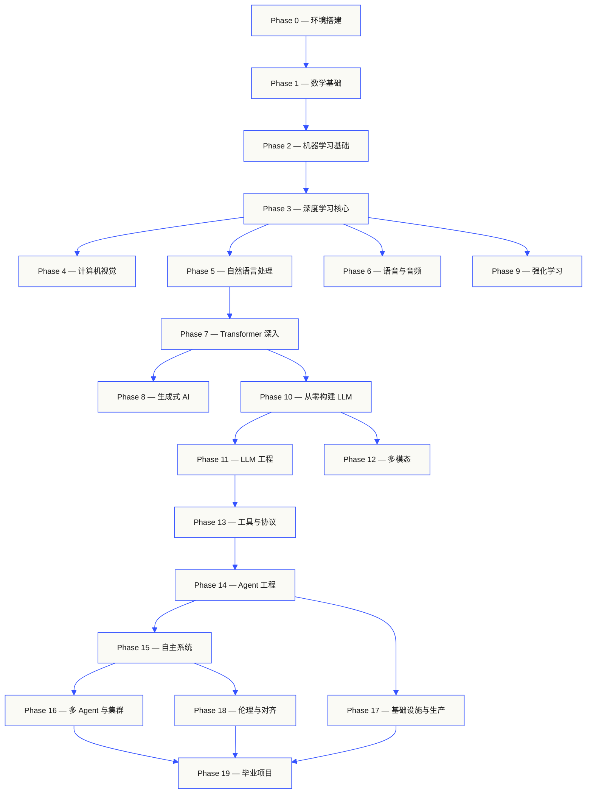
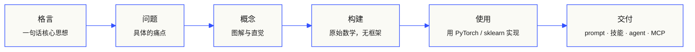

<p align="center">
  
</p>

<p align="center">
  <a href="LICENSE"></a>
  <a href="ROADMAP.md"></a>
  <a href="#contents"></a>
  <a href="https://github.com/rohitg00/ai-engineering-from-scratch/stargazers"></a>
  <a href="https://aiengineeringfromscratch.com"></a>
</p>

```
░░░▒▒▒░░░▒▒▒░░░▒▒▒░░░▒▒▒░░░▒▒▒░░░▒▒▒░░░▒▒▒░░░▒▒▒░░░▒▒▒░░░▒▒▒░░░▒▒▒░░░▒▒▒░░░▒▒▒░░░▒▒▒░░░▒▒▒
```

> **84% 的学生已经在使用 AI 工具，但只有 18% 觉得自己有能力在工作中专业地使用它们。** 这套课程就是来填补这个差距的。
>
> 435 节课。20 个阶段。约 320 小时。Python、TypeScript、Rust、Julia 四种语言。每节课都产出一个可复用的产物：一个 prompt、一项技能、一个 agent、一个 MCP 服务器。免费、开源、MIT 协议。
>
> 你不只是学 AI，你是亲手把它构建出来。端到端，从零开始。

## 这套课程怎么学

市面上大多数 AI 学习资料是碎片化的。这里一篇论文，那里一篇微调教程，某个地方又是一个花哨的 agent 演示。这些碎片很少能串起来。你能部署一个聊天机器人，却解释不了它的损失曲线。你能把一个函数挂到 agent 上，却说不清模型内部的注意力机制在做什么。

这套课程是那根**脊柱**。20 个阶段，435 节课，四种语言：Python、TypeScript、Rust、Julia。一头是线性代数，另一头是自主智能体集群。每个算法都先从原始数学推导开始：反向传播、分词器、注意力机制、Agent 循环。等 PyTorch 登场的时候，你已经知道它底层在做什么了。

每节课遵循相同的循环：读懂问题、推导数学、写代码、跑测试、保留产物。没有五分钟的视频，没有复制粘贴的部署，没有手把手的保姆教学。免费、开源，在你自己的电脑上就能跑。

```
░░░▒▒▒░░░▒▒▒░░░▒▒▒░░░▒▒▒░░░▒▒▒░░░▒▒▒░░░▒▒▒░░░▒▒▒░░░▒▒▒░░░▒▒▒░░░▒▒▒░░░▒▒▒░░░▒▒▒░░░▒▒▒░░░▒▒▒
```

## 课程全貌

20 个阶段层层递进。数学是地基，Agent 和生产部署是屋顶。如果你已经掌握了底层知识可以跳过，但不要跳过之后又纳闷为什么顶层的东西跑不通。



```
░░░▒▒▒░░░▒▒▒░░░▒▒▒░░░▒▒▒░░░▒▒▒░░░▒▒▒░░░▒▒▒░░░▒▒▒░░░▒▒▒░░░▒▒▒░░░▒▒▒░░░▒▒▒░░░▒▒▒░░░▒▒▒░░░▒▒▒
```

## 每节课的结构

每节课在自己的文件夹中，整套课程结构统一：

```
phases/<NN>-<phase-name>/<NN>-<lesson-name>/
├── code/      可运行的实现代码（Python、TypeScript、Rust、Julia）
├── docs/
│   └── en.md  课程正文
└── outputs/   本课产出的 prompt、技能、agent 或 MCP 服务器
```

每节课遵循六个节拍。**构建/使用** 的分界是核心——你先从零实现算法，然后用生产级框架跑同样的东西。你理解框架在做什么，因为你自己写过那个精简版。



## 开始学习

三种方式，任选其一。

**方式 A — 直接阅读。** 在 [aiengineeringfromscratch.com](https://aiengineeringfromscratch.com) 打开任意课程，或展开下方[目录](#contents)。无需配置环境。

**方式 B — 克隆并运行。**

```bash
git clone https://github.com/rohitg00/ai-engineering-from-scratch.git
cd ai-engineering-from-scratch
python phases/01-math-foundations/01-linear-algebra-intuition/code/vectors.py
```

**方式 C — 找到你的起点 *（推荐）*。** 智能跳级。在 Claude、Cursor、Codex、OpenClaw、Hermes 或任何安装了课程技能的 agent 中：

```bash
/find-your-level
```

十道题，根据你的知识水平定位起始阶段，生成带时间估算的个性化学习路径。每完成一个阶段后：

```bash
/check-understanding 3        # 测试你对 Phase 3 的掌握程度
ls phases/03-deep-learning-core/05-loss-functions/outputs/
# ├── prompt-loss-function-selector.md
# └── prompt-loss-debugger.md
```

### 前置要求

- 你会写代码（任何语言都行，会 Python 更好）
- 你想理解 AI **到底是怎么工作的**，而不仅仅是调 API

### 内置 Agent 技能（Claude、Cursor、Codex、OpenClaw、Hermes）

| 技能 | 功能 |
|---|---|
| [`/find-your-level`](.claude/skills/find-your-level/SKILL.md) | 十道定级测试题，根据知识水平定位起始阶段，生成带时间估算的个性化路径 |
| [`/check-understanding <phase>`](.claude/skills/check-understanding/SKILL.md) | 按阶段出题测试，八道题，给出反馈和需要复习的具体课程 |

```
░░░▒▒▒░░░▒▒▒░░░▒▒▒░░░▒▒▒░░░▒▒▒░░░▒▒▒░░░▒▒▒░░░▒▒▒░░░▒▒▒░░░▒▒▒░░░▒▒▒░░░▒▒▒░░░▒▒▒░░░▒▒▒░░░▒▒▒
```

## 每节课都产出实际成果

其他课程的结尾是"恭喜你学会了 X"。这套课程每节课的结尾是一个**可复用的工具**，你可以直接安装或粘贴到日常工作流中。

<table>
<tr>
<th align="left" width="25%"><br/><sub>FIG_001 · A</sub><br/><b>PROMPT 模板</b></th>
<th align="left" width="25%"><br/><sub>FIG_001 · B</sub><br/><b>技能</b></th>
<th align="left" width="25%"><br/><sub>FIG_001 · C</sub><br/><b>AGENT</b></th>
<th align="left" width="25%"><br/><sub>FIG_001 · D</sub><br/><b>MCP 服务器</b></th>
</tr>
<tr>
<td valign="top">粘贴到任何 AI 助手中，获得某个具体任务的专家级帮助。</td>
<td valign="top">放入 Claude、Cursor、Codex、OpenClaw、Hermes 或任何能读取 <code>SKILL.md</code> 的 agent。</td>
<td valign="top">部署为自主工作者——你在 Phase 14 亲手写了循环。</td>
<td valign="top">接入任何 MCP 兼容的客户端。在 Phase 13 端到端构建。</td>
</tr>
</table>

> 用 `python3 scripts/install_skills.py` 一键安装所有技能。这是真正的工具，不是作业。
> 学完整套课程后，你将拥有 435 个你真正理解的产物——因为是你自己构建的。

### FIG_002 · 示例

Phase 14，第 1 课：Agent 循环。约 120 行纯 Python，无依赖。

<table>
<tr>
<td valign="top" width="50%">

**`code/agent_loop.py`** &nbsp; <sub><i>构建</i></sub>

```python
def run(query, tools):
    history = [user(query)]
    for step in range(MAX_STEPS):
        msg = llm(history)
        if msg.tool_calls:
            for call in msg.tool_calls:
                result = tools[call.name](**call.args)
                history.append(tool_result(call.id, result))
            continue
        return msg.content
    raise StepLimitExceeded
```

</td>
<td valign="top" width="50%">

**`outputs/skill-agent-loop.md`** &nbsp; <sub><i>交付</i></sub>

```markdown
---
name: agent-loop
description: ReAct-style loop for any tool list
phase: 14
lesson: 01
---

Implement a minimal agent loop that...
```

**`outputs/prompt-debug-agent.md`**

```markdown
You are an agent debugger. Given the trace
of an agent run, identify the step where
the agent went wrong and explain why...
```

</td>
</tr>
</table>

```
░░░▒▒▒░░░▒▒▒░░░▒▒▒░░░▒▒▒░░░▒▒▒░░░▒▒▒░░░▒▒▒░░░▒▒▒░░░▒▒▒░░░▒▒▒░░░▒▒▒░░░▒▒▒░░░▒▒▒░░░▒▒▒░░░▒▒▒
```

<a id="contents"></a>

## 目录

20 个阶段，点击展开课程列表。

<a id="phase-0"></a>
### Phase 0：环境搭建 `12 节课`
> 为后续所有学习准备好开发环境。

| # | 课程 | 类型 | 语言 |
|:---:|--------|:----:|------|
| 01 | [开发环境](phases/00-setup-and-tooling/01-dev-environment/) | 动手 | Python, TypeScript, Rust |
| 02 | [Git 与协作](phases/00-setup-and-tooling/02-git-and-collaboration/) | 学习 | — |
| 03 | [GPU 设置与云服务](phases/00-setup-and-tooling/03-gpu-setup-and-cloud/) | 动手 | Python |
| 04 | [API 与密钥](phases/00-setup-and-tooling/04-apis-and-keys/) | 动手 | Python, TypeScript |
| 05 | [Jupyter Notebooks](phases/00-setup-and-tooling/05-jupyter-notebooks/) | 动手 | Python |
| 06 | [Python 环境管理](phases/00-setup-and-tooling/06-python-environments/) | 动手 | Python |
| 07 | [Docker for AI](phases/00-setup-and-tooling/07-docker-for-ai/) | 动手 | Python |
| 08 | [编辑器配置](phases/00-setup-and-tooling/08-editor-setup/) | 动手 | — |
| 09 | [数据管理](phases/00-setup-and-tooling/09-data-management/) | 动手 | Python |
| 10 | [终端与 Shell](phases/00-setup-and-tooling/10-terminal-and-shell/) | 学习 | — |
| 11 | [Linux for AI](phases/00-setup-and-tooling/11-linux-for-ai/) | 学习 | — |
| 12 | [调试与性能分析](phases/00-setup-and-tooling/12-debugging-and-profiling/) | 动手 | Python |

<details id="phase-1">
<summary><b>Phase 1 — 数学基础</b> &nbsp;<code>22 节课</code>&nbsp; <em>每个 AI 算法背后的直觉，用代码实现。</em></summary>
<br/>

| # | 课程 | 类型 | 语言 |
|:---:|--------|:----:|------|
| 01 | [线性代数直觉](phases/01-math-foundations/01-linear-algebra-intuition/) | 学习 | Python, Julia |
| 02 | [向量、矩阵与运算](phases/01-math-foundations/02-vectors-matrices-operations/) | 动手 | Python, Julia |
| 03 | [矩阵变换与特征值](phases/01-math-foundations/03-matrix-transformations/) | 动手 | Python, Julia |
| 04 | [ML 微积分：导数与梯度](phases/01-math-foundations/04-calculus-for-ml/) | 学习 | Python |
| 05 | [链式法则与自动微分](phases/01-math-foundations/05-chain-rule-and-autodiff/) | 动手 | Python |
| 06 | [概率与分布](phases/01-math-foundations/06-probability-and-distributions/) | 学习 | Python |
| 07 | [贝叶斯定理与统计思维](phases/01-math-foundations/07-bayes-theorem/) | 动手 | Python |
| 08 | [优化：梯度下降家族](phases/01-math-foundations/08-optimization/) | 动手 | Python |
| 09 | [信息论：熵与 KL 散度](phases/01-math-foundations/09-information-theory/) | 学习 | Python |
| 10 | [降维：PCA、t-SNE、UMAP](phases/01-math-foundations/10-dimensionality-reduction/) | 动手 | Python |
| 11 | [奇异值分解](phases/01-math-foundations/11-singular-value-decomposition/) | 动手 | Python, Julia |
| 12 | [张量运算](phases/01-math-foundations/12-tensor-operations/) | 动手 | Python |
| 13 | [数值稳定性](phases/01-math-foundations/13-numerical-stability/) | 动手 | Python |
| 14 | [范数与距离](phases/01-math-foundations/14-norms-and-distances/) | 动手 | Python |
| 15 | [ML 统计学](phases/01-math-foundations/15-statistics-for-ml/) | 动手 | Python |
| 16 | [采样方法](phases/01-math-foundations/16-sampling-methods/) | 动手 | Python |
| 17 | [线性方程组](phases/01-math-foundations/17-linear-systems/) | 动手 | Python |
| 18 | [凸优化](phases/01-math-foundations/18-convex-optimization/) | 动手 | Python |
| 19 | [AI 中的复数](phases/01-math-foundations/19-complex-numbers/) | 学习 | Python |
| 20 | [傅里叶变换](phases/01-math-foundations/20-fourier-transform/) | 动手 | Python |
| 21 | [ML 图论](phases/01-math-foundations/21-graph-theory/) | 动手 | Python |
| 22 | [随机过程](phases/01-math-foundations/22-stochastic-processes/) | 学习 | Python |

</details>

<details id="phase-2">
<summary><b>Phase 2 — 机器学习基础</b> &nbsp;<code>18 节课</code>&nbsp; <em>经典 ML——至今仍是大多数生产环境 AI 的骨干。</em></summary>
<br/>

| # | 课程 | 类型 | 语言 |
|:---:|--------|:----:|------|
| 01 | [什么是机器学习](phases/02-ml-fundamentals/01-what-is-machine-learning/) | 学习 | Python |
| 02 | [从零实现线性回归](phases/02-ml-fundamentals/02-linear-regression/) | 动手 | Python |
| 03 | [逻辑回归与分类](phases/02-ml-fundamentals/03-logistic-regression/) | 动手 | Python |
| 04 | [决策树与随机森林](phases/02-ml-fundamentals/04-decision-trees/) | 动手 | Python |
| 05 | [支持向量机](phases/02-ml-fundamentals/05-support-vector-machines/) | 动手 | Python |
| 06 | [KNN 与距离度量](phases/02-ml-fundamentals/06-knn-and-distances/) | 动手 | Python |
| 07 | [无监督学习：K-Means、DBSCAN](phases/02-ml-fundamentals/07-unsupervised-learning/) | 动手 | Python |
| 08 | [特征工程与选择](phases/02-ml-fundamentals/08-feature-engineering/) | 动手 | Python |
| 09 | [模型评估：指标与交叉验证](phases/02-ml-fundamentals/09-model-evaluation/) | 动手 | Python |
| 10 | [偏差、方差与学习曲线](phases/02-ml-fundamentals/10-bias-variance/) | 学习 | Python |
| 11 | [集成方法：Boosting、Bagging、Stacking](phases/02-ml-fundamentals/11-ensemble-methods/) | 动手 | Python |
| 12 | [超参数调优](phases/02-ml-fundamentals/12-hyperparameter-tuning/) | 动手 | Python |
| 13 | [ML 流水线与实验追踪](phases/02-ml-fundamentals/13-ml-pipelines/) | 动手 | Python |
| 14 | [朴素贝叶斯](phases/02-ml-fundamentals/14-naive-bayes/) | 动手 | Python |
| 15 | [时间序列基础](phases/02-ml-fundamentals/15-time-series/) | 动手 | Python |
| 16 | [异常检测](phases/02-ml-fundamentals/16-anomaly-detection/) | 动手 | Python |
| 17 | [处理不平衡数据](phases/02-ml-fundamentals/17-imbalanced-data/) | 动手 | Python |
| 18 | [特征选择](phases/02-ml-fundamentals/18-feature-selection/) | 动手 | Python |

</details>

<details id="phase-3">
<summary><b>Phase 3 — 深度学习核心</b> &nbsp;<code>13 节课</code>&nbsp; <em>从第一性原理理解神经网络。先不用框架，自己造一个。</em></summary>
<br/>

| # | 课程 | 类型 | 语言 |
|:---:|--------|:----:|------|
| 01 | [感知机：一切的起点](phases/03-deep-learning-core/01-the-perceptron/) | 动手 | Python |
| 02 | [多层网络与前向传播](phases/03-deep-learning-core/02-multi-layer-networks/) | 动手 | Python |
| 03 | [从零实现反向传播](phases/03-deep-learning-core/03-backpropagation/) | 动手 | Python |
| 04 | [激活函数：ReLU、Sigmoid、GELU 及原因](phases/03-deep-learning-core/04-activation-functions/) | 动手 | Python |
| 05 | [损失函数：MSE、交叉熵、对比损失](phases/03-deep-learning-core/05-loss-functions/) | 动手 | Python |
| 06 | [优化器：SGD、Momentum、Adam、AdamW](phases/03-deep-learning-core/06-optimizers/) | 动手 | Python |
| 07 | [正则化：Dropout、权重衰减、BatchNorm](phases/03-deep-learning-core/07-regularization/) | 动手 | Python |
| 08 | [权重初始化与训练稳定性](phases/03-deep-learning-core/08-weight-initialization/) | 动手 | Python |
| 09 | [学习率调度与预热](phases/03-deep-learning-core/09-learning-rate-schedules/) | 动手 | Python |
| 10 | [构建你自己的迷你框架](phases/03-deep-learning-core/10-mini-framework/) | 动手 | Python |
| 11 | [PyTorch 入门](phases/03-deep-learning-core/11-intro-to-pytorch/) | 动手 | Python |
| 12 | [JAX 入门](phases/03-deep-learning-core/12-intro-to-jax/) | 动手 | Python |
| 13 | [调试神经网络](phases/03-deep-learning-core/13-debugging-neural-networks/) | 动手 | Python |

</details>

<details id="phase-4">
<summary><b>Phase 4 — 计算机视觉</b> &nbsp;<code>28 节课</code>&nbsp; <em>从像素到理解——图像、视频、3D、VLM 与世界模型。</em></summary>
<br/>

| # | 课程 | 类型 | 语言 |
|:---:|--------|:----:|------|
| 01 | 图像基础：像素、通道、色彩空间 | 学习 | Python |
| 02 | 从零实现卷积 | 动手 | Python |
| 03 | CNN：从 LeNet 到 ResNet | 动手 | Python |
| 04-28 | *（视觉分类、检测、分割、生成、3D、VLM 等）* | 动手 | Python |

</details>

<details id="phase-5">
<summary><b>Phase 5 — 自然语言处理</b> &nbsp;<code>29 节课</code>&nbsp; <em>语言是通往智能的接口。</em></summary>
<br/>

| # | 课程 | 类型 | 语言 |
|:---:|--------|:----:|------|
| 01 | 文本处理：分词、词干化、词形还原 | 动手 | Python |
| 02 | 词袋、TF-IDF 与文本表示 | 动手 | Python |
| 03 | 词嵌入：从零实现 Word2Vec | 动手 | Python |
| 04-29 | *（情感分析、NER、Seq2Seq、注意力机制、RAG 等）* | 动手 | Python |

</details>

<details id="phase-6">
<summary><b>Phase 6 — 语音与音频</b> &nbsp;<code>17 节课</code>&nbsp; <em>听、理解、说。</em></summary>
</details>

<details id="phase-7">
<summary><b>Phase 7 — Transformer 深入</b> &nbsp;<code>14 节课</code>&nbsp; <em>改变一切的架构。</em></summary>
</details>

<details id="phase-8">
<summary><b>Phase 8 — 生成式 AI</b> &nbsp;<code>14 节课</code>&nbsp; <em>创造图像、视频、音频、3D 等。</em></summary>
</details>

<details id="phase-9">
<summary><b>Phase 9 — 强化学习</b> &nbsp;<code>12 节课</code>&nbsp; <em>RLHF 和游戏 AI 的基础。</em></summary>
</details>

<details id="phase-10">
<summary><b>Phase 10 — 从零构建 LLM</b> &nbsp;<code>22 节课</code>&nbsp; <em>构建、训练、理解大语言模型。</em></summary>
</details>

<details id="phase-11">
<summary><b>Phase 11 — LLM 工程</b> &nbsp;<code>17 节课</code>&nbsp; <em>在生产环境中使用 LLM。</em></summary>
</details>

<details id="phase-12">
<summary><b>Phase 12 — 多模态 AI</b> &nbsp;<code>25 节课</code>&nbsp; <em>跨模态的看、听、读与推理。</em></summary>
</details>

<details id="phase-13">
<summary><b>Phase 13 — 工具与协议</b> &nbsp;<code>23 节课</code>&nbsp; <em>AI 与现实世界之间的接口。</em></summary>
</details>

<details id="phase-14">
<summary><b>Phase 14 — Agent 工程</b> &nbsp;<code>42 节课</code>&nbsp; <em>从第一性原理构建 Agent——循环、记忆、规划、框架、基准、生产、工作台。</em></summary>
</details>

<details id="phase-15">
<summary><b>Phase 15 — 自主系统</b> &nbsp;<code>22 节课</code>&nbsp; <em>长时间跨度的 Agent、自我改进与 2026 安全技术栈。</em></summary>
</details>

<details id="phase-16">
<summary><b>Phase 16 — 多 Agent 与集群</b> &nbsp;<code>25 节课</code>&nbsp; <em>协调、涌现与集体智能。</em></summary>
</details>

<details id="phase-17">
<summary><b>Phase 17 — 基础设施与生产</b> &nbsp;<code>28 节课</code>&nbsp; <em>把 AI 交付到真实世界。</em></summary>
</details>

<details id="phase-18">
<summary><b>Phase 18 — 伦理、安全与对齐</b> &nbsp;<code>30 节课</code>&nbsp; <em>构建有益于人类的 AI。不是可选项。</em></summary>
</details>

<details id="phase-19">
<summary><b>Phase 19 — 毕业项目</b> &nbsp;<code>17 个项目</code>&nbsp; <em>2026 年端到端可交付的产品，每个 20-40 小时。</em></summary>
</details>

```
░░░▒▒▒░░░▒▒▒░░░▒▒▒░░░▒▒▒░░░▒▒▒░░░▒▒▒░░░▒▒▒░░░▒▒▒░░░▒▒▒░░░▒▒▒░░░▒▒▒░░░▒▒▒░░░▒▒▒░░░▒▒▒░░░▒▒▒
```

## 工具箱

每节课都产出可复用的产物。学完后你将拥有：

```
outputs/
├── prompts/      覆盖各种 AI 任务的 prompt 模板
└── skills/       供 AI 编程 agent 使用的 SKILL.md 文件
```

用 `python3 scripts/install_skills.py` 一键安装。接入 Claude、Cursor、Codex、OpenClaw、Hermes 或任何 MCP 兼容的 agent。这是真正的工具，不是作业。

```
░░░▒▒▒░░░▒▒▒░░░▒▒▒░░░▒▒▒░░░▒▒▒░░░▒▒▒░░░▒▒▒░░░▒▒▒░░░▒▒▒░░░▒▒▒░░░▒▒▒░░░▒▒▒░░░▒▒▒░░░▒▒▒░░░▒▒▒
```

## 从哪里开始

| 背景 | 起始阶段 | 预计时间 |
|---|---|---|
| 编程和 AI 都是新手 | Phase 0 — 环境搭建 | 约 306 小时 |
| 会 Python，不懂 ML | Phase 1 — 数学基础 | 约 270 小时 |
| 懂 ML，不懂深度学习 | Phase 3 — 深度学习核心 | 约 200 小时 |
| 懂深度学习，想学 LLM 和 Agent | Phase 10 — 从零构建 LLM | 约 100 小时 |
| 资深工程师，只想学 Agent 工程 | Phase 14 — Agent 工程 | 约 60 小时 |

```
░░░▒▒▒░░░▒▒▒░░░▒▒▒░░░▒▒▒░░░▒▒▒░░░▒▒▒░░░▒▒▒░░░▒▒▒░░░▒▒▒░░░▒▒▒░░░▒▒▒░░░▒▒▒░░░▒▒▒░░░▒▒▒░░░▒▒▒
```

## 为什么现在很重要

> *"最火的新编程语言是英语。"*
> — **Andrej Karpathy**

> *"软件工程正在我们眼前被重塑。"*
> — **Boris Cherny**，Claude Code 创建者

> *"模型会越来越好。真正能积累的技能是**知道要构建什么**。"*
> — 2026 行业共识

**本课程覆盖的基础论文：**

- *Attention Is All You Need* — Vaswani et al., 2017 → Phase 7
- *Language Models are Few-Shot Learners* (GPT-3) → Phase 10
- *Denoising Diffusion Probabilistic Models* → Phase 8
- *InstructGPT / RLHF* → Phase 10
- *Direct Preference Optimization* → Phase 10
- *Chain-of-Thought Prompting* → Phase 11
- *ReAct: Reasoning + Acting in LLMs* → Phase 14
- *Model Context Protocol* — Anthropic → Phase 13

```
░░░▒▒▒░░░▒▒▒░░░▒▒▒░░░▒▒▒░░░▒▒▒░░░▒▒▒░░░▒▒▒░░░▒▒▒░░░▒▒▒░░░▒▒▒░░░▒▒▒░░░▒▒▒░░░▒▒▒░░░▒▒▒░░░▒▒▒
```

## 贡献

| 目的 | 阅读 |
|---|---|
| 贡献课程或修复问题 | [CONTRIBUTING.md](CONTRIBUTING.md) |
| Fork 给你的团队或学校 | [FORKING.md](FORKING.md) |
| 课程模板 | [LESSON_TEMPLATE.md](LESSON_TEMPLATE.md) |
| 进度追踪 | [ROADMAP.md](ROADMAP.md) |
| 术语表 | [glossary/terms.md](glossary/terms.md) |
| 行为准则 | [CODE_OF_CONDUCT.md](CODE_OF_CONDUCT.md) |

## 许可证

MIT。随便用——fork、教学、商用、发布都行。感谢署名，但不强制。

由 [Rohit Ghumare](https://github.com/rohitg00) 和社区维护。
