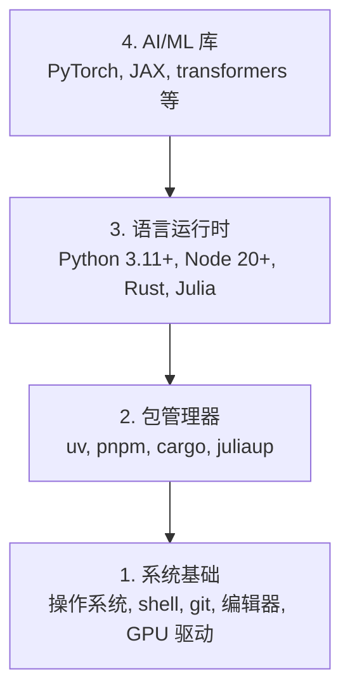

# 开发环境

> 工具塑造思维方式。一次配好，终身受用。

**类型：** 动手搭建  
**语言：** Python, Node.js, Rust  
**前置要求：** 无  
**时间：** 约 45 分钟

## 学习目标

- 从零搭建 Python 3.11+、Node.js 20+、Rust 工具链
- 配置虚拟环境和包管理器，实现可复现的构建环境
- 验证 GPU 是否可用（CUDA/MPS），并运行一次张量计算
- 理解四层架构：系统基础、包管理、语言运行时、AI 库

## 为什么要做这件事

你即将通过 200 多节课学习 AI 工程，涉及 Python、TypeScript、Rust 和 Julia。如果环境有问题，你的每节课都会变成和工具链的搏斗，而非真正的学习。

大多数人跳过环境配置，结果花大量时间调试 import 错误、版本冲突和 CUDA 驱动问题。我们要一次性把环境搞定。

## 核心概念

AI 工程的开发环境分为四层：



安装顺序是自底向上的：每一层都依赖它下面那一层。

## 动手搭建

### 第 1 步：系统基础

先检查操作系统，安装最基本的工具。

```bash
# macOS
xcode-select --install
brew install git curl wget

# Ubuntu/Debian
sudo apt update && sudo apt install -y build-essential git curl wget

# Windows（使用 WSL2）
wsl --install -d Ubuntu-24.04
```

### 第 2 步：用 uv 安装 Python

我们用 `uv` 来管理 Python —— 它比 pip 快 10-100 倍，而且自动处理虚拟环境。

```bash
curl -LsSf https://astral.sh/uv/install.sh | sh

uv python install 3.12

uv venv
source .venv/bin/activate  # Windows 用 .venv\Scripts\activate

uv pip install numpy matplotlib jupyter
```

验证安装是否成功：

```python
import sys
print(f"Python {sys.version}")

import numpy as np
print(f"NumPy {np.__version__}")
a = np.array([1, 2, 3])
print(f"向量: {a}, 自身点积: {np.dot(a, a)}")
```

### 第 3 步：用 pnpm 安装 Node.js

后续 TypeScript 课程（Agent、MCP 服务器、Web 应用）会用到。

```bash
curl -fsSL https://fnm.vercel.app/install | bash
fnm install 22
fnm use 22

npm install -g pnpm

node -e "console.log('Node', process.version)"
```

### 第 4 步：安装 Rust

用于性能关键的课程（推理引擎、系统编程）。

```bash
curl --proto '=https' --tlsv1.2 -sSf https://sh.rustup.rs | sh

rustc --version
cargo --version
```

### 第 5 步：安装 Julia（可选）

某些数学密集型课程用 Julia 会更方便。

```bash
curl -fsSL https://install.julialang.org | sh

julia -e 'println("Julia ", VERSION)'
```

### 第 6 步：GPU 设置（如果你有显卡）

```bash
# NVIDIA 显卡
nvidia-smi

# 安装带 CUDA 支持的 PyTorch
uv pip install torch torchvision torchaudio --index-url https://download.pytorch.org/whl/cu124
```

```python
import torch
print(f"CUDA 可用: {torch.cuda.is_available()}")
if torch.cuda.is_available():
    print(f"GPU: {torch.cuda.get_device_name(0)}")
```

没有 GPU？没关系。大部分课程在 CPU 上就能跑。需要训练模型时，可以用 Google Colab 或云 GPU。

### 第 7 步：一键验证

运行验证脚本，确认所有环境就绪：

```bash
python phases/00-setup-and-tooling/01-dev-environment/code/verify.py
```

## 各语言的用途

环境搭好之后，各语言在课程中的分工如下：

| 语言 | 使用阶段 | 包管理器 |
|------|----------|----------|
| Python | Phase 1-12（机器学习、深度学习、NLP、视觉、音频、LLM） | uv |
| TypeScript | Phase 13-17（工具协议、Agent、多智能体、基础设施） | pnpm |
| Rust | Phase 12, 15-17（性能关键系统） | cargo |
| Julia | Phase 1（数学基础） | Pkg |

## 交付物

本课产出一个验证脚本，任何人都可以运行它来检查自己的环境是否配置正确。

参见 `outputs/prompt-env-check.md` —— 一个帮助 AI 助手诊断环境问题的提示词模板。

## 练习

1. 运行验证脚本，修复所有失败项
2. 为本课程创建一个 Python 虚拟环境并安装 PyTorch
3. 用四种语言（Python、Node.js、Rust、Julia）各写一个 "hello world" 并运行
