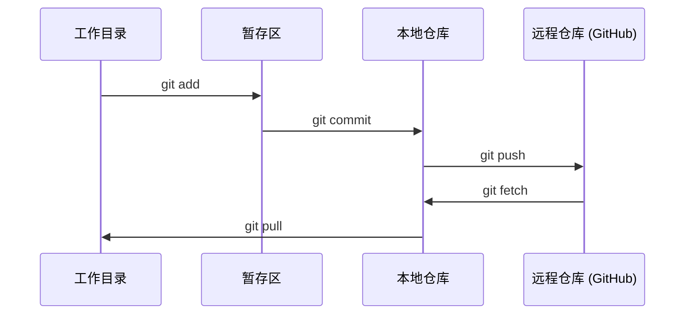

# Git 与协作

> 版本控制不是可选项。你在这里做的每个实验、每个模型、每节课的代码，都应该被追踪。

**类型：** 概念学习  
**语言：** --  
**前置要求：** Phase 0, Lesson 01  
**时间：** 约 30 分钟

## 学习目标

- 配置 git 身份信息，掌握 add、commit、push 的日常工作流
- 创建和合并分支，在不破坏 main 的前提下进行独立实验
- 编写 `.gitignore` 排除模型权重文件和大型二进制文件
- 用 `git log` 浏览提交历史，了解项目的演进过程

## 为什么要做这件事

你即将在 20 个阶段中编写数百个代码文件。没有版本控制，你会丢失工作成果、搞坏无法恢复的东西，也没法和别人协作。

Git 是工具，GitHub 是代码存放的地方。这节课只讲本课程需要用到的部分，不多不少。

## 核心概念



记住三件事：
1. 频繁保存（`git commit`）
2. 推送到远程（`git push`）
3. 用分支做实验（`git checkout -b experiment`）

## 动手搭建

### 第 1 步：配置 git

```bash
git config --global user.name "Your Name"
git config --global user.email "you@example.com"
```

### 第 2 步：日常工作流

```bash
git status
git add file.py
git commit -m "Add perceptron implementation"
git push origin main
```

### 第 3 步：用分支做实验

```bash
git checkout -b experiment/new-optimizer

# ... 修改代码，提交 ...

git checkout main
git merge experiment/new-optimizer
```

### 第 4 步：使用本课程仓库

```bash
git clone https://github.com/rohitg00/ai-engineering-from-scratch.git
cd ai-engineering-from-scratch

git checkout -b my-progress
# 边学边写代码，随时 commit
git push origin my-progress
```

## 实际使用

学习本课程，你只需要这些命令：

| 命令 | 什么时候用 |
|------|-----------|
| `git clone` | 获取课程仓库 |
| `git add` + `git commit` | 保存你的工作 |
| `git push` | 备份到 GitHub |
| `git checkout -b` | 在不影响 main 的情况下尝试新东西 |
| `git log --oneline` | 查看自己做了什么 |

就这些。本课程不需要 rebase、cherry-pick 或 submodules。

## 练习

1. clone 这个仓库，创建一个叫 `my-progress` 的分支，新建一个文件，commit 并 push
2. 创建一个 `.gitignore`，排除模型权重文件（`.pt`、`.pth`、`.safetensors`）
3. 用 `git log --oneline` 查看本仓库的提交历史，看看课程是如何一步步构建的

## 关键术语

| 术语 | 通俗说法 | 实际含义 |
|------|---------|---------|
| Commit | "保存" | 项目在某个时间点的完整快照 |
| Branch | "一个副本" | 一个指向 commit 的指针，随着你的工作向前移动 |
| Merge | "合并代码" | 把一个分支的变更应用到另一个分支上 |
| Remote | "云端" | 仓库在其他地方（GitHub、GitLab）的一份拷贝 |
