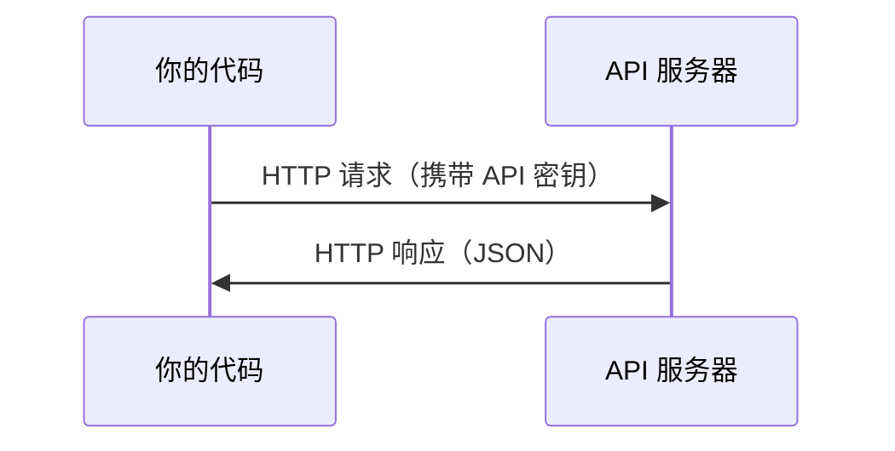

# API 与密钥管理

> 所有 AI API 的工作方式都一样：发请求，收响应。细节在变，模式不变。

**类型：** 动手搭建  
**语言：** Python, TypeScript  
**前置要求：** Phase 0, Lesson 01  
**时间：** 约 30 分钟

## 学习目标

- 用环境变量和 `.env` 文件安全地存储 API 密钥
- 分别用 Anthropic Python SDK 和原始 HTTP 请求调用 LLM API
- 对比 SDK 和原始 HTTP 的请求/响应格式，学会调试
- 识别并处理常见 API 错误（认证失败、频率限制等）

## 为什么要做这件事

从 Phase 11 开始，你会调用 LLM API（Anthropic、OpenAI、Google）。Phase 13-16 你会构建循环调用这些 API 的 Agent。你需要理解 API 密钥的工作原理、如何安全存储，以及如何发出第一次 API 调用。

## 核心概念



每次 API 调用都包含：
1. 一个端点（URL）
2. 一个 API 密钥（身份认证）
3. 一个请求体（你想要什么）
4. 一个响应体（返回给你什么）

## 动手搭建

### 第 1 步：安全存储 API 密钥

永远不要把密钥写在代码里。用环境变量。

```bash
export ANTHROPIC_API_KEY="sk-ant-..."
export OPENAI_API_KEY="sk-..."
```

或者用 `.env` 文件（记得把它加到 `.gitignore`）：

```
ANTHROPIC_API_KEY=sk-ant-...
OPENAI_API_KEY=sk-...
```

### 第 2 步：第一次 API 调用（Python）

```python
import anthropic

client = anthropic.Anthropic()

response = client.messages.create(
    model="claude-sonnet-4-20250514",
    max_tokens=256,
    messages=[{"role": "user", "content": "What is a neural network in one sentence?"}]
)

print(response.content[0].text)
```

### 第 3 步：第一次 API 调用（TypeScript）

```typescript
import Anthropic from "@anthropic-ai/sdk";

const client = new Anthropic();

const response = await client.messages.create({
  model: "claude-sonnet-4-20250514",
  max_tokens: 256,
  messages: [{ role: "user", content: "What is a neural network in one sentence?" }],
});

console.log(response.content[0].text);
```

### 第 4 步：原始 HTTP 请求（不用 SDK）

```python
import os
import urllib.request
import json

url = "https://api.anthropic.com/v1/messages"
headers = {
    "Content-Type": "application/json",
    "x-api-key": os.environ["ANTHROPIC_API_KEY"],
    "anthropic-version": "2023-06-01",
}
body = json.dumps({
    "model": "claude-sonnet-4-20250514",
    "max_tokens": 256,
    "messages": [{"role": "user", "content": "What is a neural network in one sentence?"}],
}).encode()

req = urllib.request.Request(url, data=body, headers=headers, method="POST")
with urllib.request.urlopen(req) as resp:
    result = json.loads(resp.read())
    print(result["content"][0]["text"])
```

这就是 SDK 底层做的事情。理解原始 HTTP 调用在调试时非常有帮助。

## 实际使用

本课程中各 API 的使用时机：

| API | 什么时候需要 | 免费额度 |
|-----|-------------|----------|
| Anthropic (Claude) | Phase 11-16（Agent、工具调用） | 注册送 $5 |
| OpenAI | Phase 11（对比测试） | 注册送 $5 |
| Hugging Face | Phase 4-10（模型、数据集） | 免费 |

你现在不需要全部注册，到相关课程时再配置即可。

## 交付物

本课产出：
- `outputs/prompt-api-troubleshooter.md` — 诊断常见 API 错误的提示词模板

## 练习

1. 获取一个 Anthropic API 密钥，发出你的第一次 API 调用
2. 试试原始 HTTP 版本，对比响应格式和 SDK 版本的区别
3. 故意使用错误的 API 密钥，看看错误信息长什么样

## 关键术语

| 术语 | 通俗说法 | 实际含义 |
|------|---------|---------|
| API key | "API 的密码" | 标识你的账户并授权请求的唯一字符串 |
| Rate limit | "被限流了" | 每分钟/小时的最大请求数，防止滥用并保证公平使用 |
| Token | "一个词"（API 语境下） | 计费单位：输入和输出的 token 分开计数和收费 |
| Streaming | "实时响应" | 逐字接收响应，而不是等整个响应生成完 |
