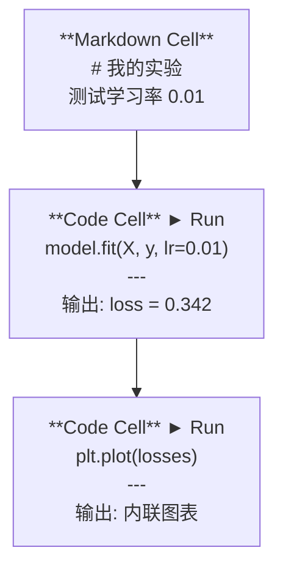
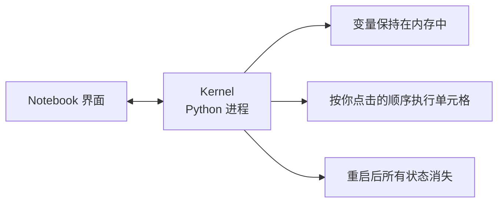

# Jupyter Notebooks

> Notebook 是 AI 工程师的实验台。在这里做原型验证，确认可行后再移入生产环境。

**类型：** 动手搭建  
**语言：** Python  
**前置要求：** Phase 0, Lesson 01  
**时间：** 约 30 分钟

## 学习目标

- 安装并启动 JupyterLab、Jupyter Notebook 或 VS Code Jupyter 扩展
- 使用 magic 命令（`%timeit`、`%%time`、`%matplotlib inline`）做性能测试和内联可视化
- 区分何时用 notebook、何时用脚本，掌握"在 notebook 探索，用脚本交付"的工作流
- 识别并避免 notebook 的常见陷阱：乱序执行、隐藏状态、内存泄漏

## 为什么要做这件事

几乎所有 AI 论文、教程和 Kaggle 比赛都用 Jupyter notebook。它能让你分段运行代码、内联查看输出、把代码和说明混在一起，快速迭代。学 AI 不用 notebook，就像做数学题不打草稿。

但 notebook 有真实的坑。很多人什么都用 notebook 写，包括它并不擅长的事情。搞清楚什么时候该用 notebook、什么时候该用脚本，能帮你避免后续大量的调试噩梦。

## 核心概念

Notebook 就是一个单元格（cell）列表，每个单元格要么是代码，要么是文本。



Kernel 是在后台运行的 Python 进程。当你运行一个单元格时，代码被发送给 kernel 执行，然后把结果返回。所有单元格共享同一个 kernel，所以变量在不同单元格之间是持久的。



"按你点击的顺序执行"这一点，既是 notebook 的超能力，也是它的坑。

## 动手搭建

### 第 1 步：选择界面

三种选择，同一种文件格式：

| 界面 | 安装方式 | 适合场景 |
|------|---------|---------|
| JupyterLab | `pip install jupyterlab` 然后 `jupyter lab` | 完整 IDE 体验，多标签、文件浏览器、终端 |
| Jupyter Notebook | `pip install notebook` 然后 `jupyter notebook` | 简单轻量，一次只看一个 notebook |
| VS Code | 安装 "Jupyter" 扩展 | 不用切换编辑器，集成 git，支持调试 |

三种都读写相同的 `.ipynb` 文件。随你喜好选择。AI 领域最常用的是 JupyterLab。

```bash
pip install jupyterlab
jupyter lab
```

### 第 2 步：必知快捷键

Notebook 有两种模式：按 `Escape` 进入命令模式（左侧蓝色条），按 `Enter` 进入编辑模式（左侧绿色条）。

**命令模式（最常用）：**

| 按键 | 功能 |
|------|------|
| `Shift+Enter` | 运行当前单元格，跳到下一个 |
| `A` | 在上方插入新单元格 |
| `B` | 在下方插入新单元格 |
| `DD` | 删除单元格 |
| `M` | 转为 Markdown |
| `Y` | 转为代码 |
| `Z` | 撤销单元格操作 |
| `Ctrl+Shift+H` | 显示所有快捷键 |

**编辑模式：**

| 按键 | 功能 |
|------|------|
| `Tab` | 自动补全 |
| `Shift+Tab` | 显示函数签名 |
| `Ctrl+/` | 切换注释 |

`Shift+Enter` 是你每天会按上千次的快捷键，先记住它。

### 第 3 步：单元格类型

**代码单元格**运行 Python 并显示输出：

```python
import numpy as np
data = np.random.randn(1000)
data.mean(), data.std()
```

输出：`(0.0032, 0.9987)`

**Markdown 单元格**渲染格式化文本。用它来记录你在做什么、为什么这样做。支持标题、加粗、斜体、LaTeX 数学公式（`$E = mc^2$`）、表格和图片。

### 第 4 步：Magic 命令

这些不是 Python 语法，而是 Jupyter 特有的命令，以 `%`（行魔法）或 `%%`（单元格魔法）开头。

**计时你的代码：**

```python
%timeit np.random.randn(10000)
```

输出：`45.2 us +/- 1.3 us per loop`

```python
%%time
model.fit(X_train, y_train, epochs=10)
```

输出：`Wall time: 2.34 s`

`%timeit` 会多次运行代码取平均值，`%%time` 只运行一次。微基准测试用 `%timeit`，训练任务用 `%%time`。

**启用内联绘图：**

```python
%matplotlib inline
```

之后每次 `plt.plot()` 或 `plt.show()` 都会直接在 notebook 里渲染图表。

**不离开 notebook 安装包：**

```python
!pip install scikit-learn
```

`!` 前缀可以运行任何 shell 命令。

**检查环境变量：**

```python
%env CUDA_VISIBLE_DEVICES
```

### 第 5 步：内联显示丰富内容

Notebook 会自动显示单元格中最后一个表达式的值。你也可以主动控制显示：

```python
import pandas as pd

df = pd.DataFrame({
    "model": ["Linear", "Random Forest", "Neural Net"],
    "accuracy": [0.72, 0.89, 0.94],
    "training_time": [0.1, 2.3, 45.6]
})
df
```

这会渲染出一个格式化的 HTML 表格，而不是纯文本。图表也一样：

```python
import matplotlib.pyplot as plt

plt.figure(figsize=(8, 4))
plt.plot([1, 2, 3, 4], [1, 4, 2, 3])
plt.title("Inline Plot")
plt.show()
```

图表直接出现在单元格下方。这就是为什么 notebook 在 AI 领域占主导地位 —— 你能同时看到数据、图表和代码。

显示图片：

```python
from IPython.display import Image, display
display(Image(filename="architecture.png"))
```

### 第 6 步：Google Colab

Colab 是免费的云端 Jupyter notebook，提供 GPU、预装库和 Google Drive 集成，无需配置。

1. 打开 [colab.research.google.com](https://colab.research.google.com)
2. 上传本课程的任何 `.ipynb` 文件
3. 运行时 > 更改运行时类型 > T4 GPU（免费）

Colab 和本地 Jupyter 的区别：
- 文件在会话之间不保留（需要保存到 Drive 或下载）
- 预装了：numpy、pandas、matplotlib、torch、tensorflow、sklearn
- `from google.colab import files` 用于上传/下载文件
- `from google.colab import drive; drive.mount('/content/drive')` 用于持久存储
- 免费版闲置 90 分钟后会话超时

## 实际使用

### Notebook vs 脚本：各自的适用场景

| 用 notebook | 用脚本 |
|------------|--------|
| 探索数据集 | 训练流水线 |
| 快速验证模型 | 可复用的工具函数 |
| 可视化结果 | 包含 `if __name__` 的代码 |
| 解释你的工作 | 定时运行的任务 |
| 快速实验 | 生产环境代码 |
| 课程练习 | 包和库 |

原则：**在 notebook 中探索，用脚本交付。**

AI 工作中的常见流程：
1. 在 notebook 中探索数据
2. 在 notebook 中做模型原型
3. 确认可行后，把代码移到 `.py` 文件
4. 在 notebook 中 import 这些 `.py` 文件，继续做进一步的实验

### 常见陷阱

**乱序执行。** 你先运行了第 5 个单元格，再运行第 2 个，再运行第 7 个。在你机器上 notebook 能跑通，但别人从头到尾运行就报错。解决办法：分享前先 Kernel > Restart & Run All。

**隐藏状态。** 你删除了一个单元格，但它创建的变量还在内存中。Notebook 看起来很干净，实际依赖一个已经不存在的"幽灵"单元格。解决办法：定期重启 kernel。

**内存泄漏。** 加载 4GB 数据集、训练模型、再加载另一个数据集，内存从不释放。解决办法：`del variable_name` 加 `gc.collect()`，或者直接重启 kernel。

## 交付物

本课产出：
- `outputs/prompt-notebook-helper.md` 用于调试 notebook 问题

## 练习

1. 打开 JupyterLab，创建一个 notebook，用 `%timeit` 对比列表推导式和 numpy 创建 100,000 个随机数的速度
2. 创建一个包含 markdown 和代码单元格的 notebook：加载一个 CSV、显示 DataFrame、画一张图。然后运行 Kernel > Restart & Run All 验证能从头到尾跑通
3. 把 `code/notebook_tips.py` 的代码粘贴到 Colab notebook 中，用免费 GPU 运行

## 关键术语

| 术语 | 通俗说法 | 实际含义 |
|------|---------|---------|
| Kernel | "跑代码的那个东西" | 一个独立的 Python 进程，负责执行单元格并把变量保持在内存中 |
| Cell | "一个代码块" | Notebook 中可以独立运行的单元，可以是代码或 Markdown |
| Magic command | "Jupyter 的黑科技" | 以 `%` 或 `%%` 开头的特殊命令，用于控制 notebook 环境 |
| `.ipynb` | "Notebook 文件" | 一个 JSON 文件，包含单元格、输出和元数据。名字来自 IPython Notebook |

## 延伸阅读

- [JupyterLab 文档](https://jupyterlab.readthedocs.io/) — 完整功能说明
- [Google Colab FAQ](https://research.google.com/colaboratory/faq.html) — Colab 限制和特性
- [28 个 Jupyter Notebook 技巧](https://www.dataquest.io/blog/jupyter-notebook-tips-tricks-shortcuts/) — 高效使用指南
