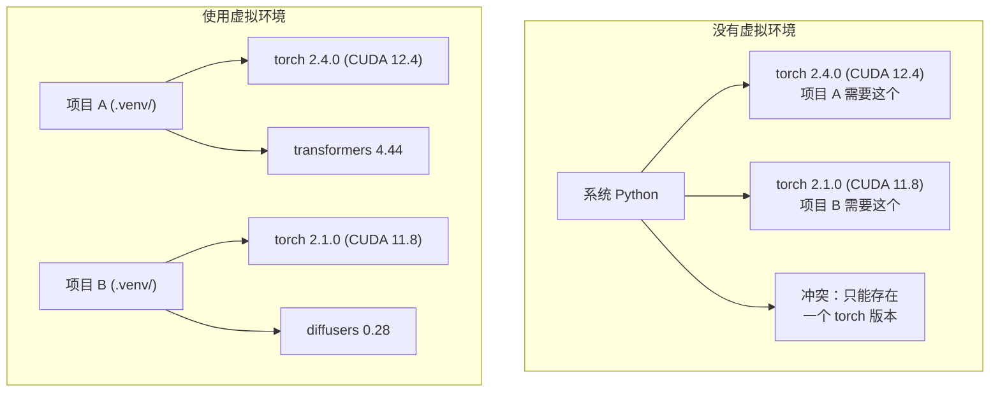

# Python 环境管理

> 依赖地狱是真实存在的。虚拟环境就是解药。

**类型：** 动手搭建  
**语言：** Python  
**前置要求：** Phase 0, Lesson 01  
**时间：** 约 30 分钟

## 学习目标

- 用 `uv`、`venv` 或 `conda` 创建隔离的虚拟环境
- 编写带有可选依赖组的 `pyproject.toml`，并生成 lockfile 保证可复现性
- 诊断并解决常见问题：全局安装、pip/conda 混用、CUDA 版本不匹配
- 针对依赖冲突的项目实施"按阶段分环境"策略

## 为什么要做这件事

你为一个微调项目安装了 PyTorch 2.4。下周另一个项目需要 PyTorch 2.1，因为它绑定了特定的 CUDA 版本。你全局升级，第一个项目挂了；你降级回去，第二个又挂了。

这就是依赖地狱。在 AI/ML 工作中它频繁发生，因为：

- PyTorch、JAX 和 TensorFlow 各自带有自己的 CUDA 绑定
- 模型库会锁定特定的框架版本
- 全局 `pip install` 会直接覆盖之前安装的版本
- CUDA 11.8 的构建和 CUDA 12.x 的驱动互不兼容

解决方法：每个项目拥有自己的隔离环境和独立的包。

## 核心概念



## 动手搭建

### 选项 1：uv venv（推荐）

`uv` 是最快的 Python 包管理器（比 pip 快 10-100 倍），一个工具搞定虚拟环境、Python 版本和依赖解析。

```bash
curl -LsSf https://astral.sh/uv/install.sh | sh

uv python install 3.12

cd your-project
uv venv
source .venv/bin/activate
```

安装包：

```bash
uv pip install torch numpy
```

一步创建带 `pyproject.toml` 的项目：

```bash
uv init my-ai-project
cd my-ai-project
uv add torch numpy matplotlib
```

### 选项 2：venv（Python 自带）

如果装不了 `uv`，Python 自带 `venv`：

```bash
python3 -m venv .venv
source .venv/bin/activate  # Linux/macOS
.venv\Scripts\activate     # Windows

pip install torch numpy
```

比 `uv` 慢，但只要有 Python 就能用。

### 选项 3：conda（特定场景下使用）

conda 能管理非 Python 的依赖，比如 CUDA toolkit、cuDNN 和 C 语言库。以下情况用 conda：

- 需要特定版本的 CUDA toolkit 但不想全局安装
- 在共享集群上无法安装系统级软件包
- 某个库的安装说明写着"用 conda"

```bash
# 安装 miniconda（不要装完整的 Anaconda）
curl -LsSf https://repo.anaconda.com/miniconda/Miniconda3-latest-Linux-x86_64.sh -o miniconda.sh
bash miniconda.sh -b

conda create -n myproject python=3.12
conda activate myproject

conda install pytorch torchvision torchaudio pytorch-cuda=12.4 -c pytorch -c nvidia
```

一条规则：如果用了 conda 创建环境，就用 conda 管理里面所有的包。在 conda 环境里混用 `pip install` 会导致很难调试的依赖冲突。

### 本课程的策略：按阶段分环境

你可能想为整个课程创建一个环境。别这样做。不同阶段需要不同（有时冲突的）依赖。

策略：

```
ai-engineering-from-scratch/
├── .venv/                    <-- Phase 0-3 的轻量共享环境
├── phases/
│   ├── 04-neural-networks/
│   │   └── .venv/            <-- PyTorch 环境
│   ├── 05-cnns/
│   │   └── .venv/            <-- 同一个 PyTorch 环境（符号链接或共享）
│   ├── 08-transformers/
│   │   └── .venv/            <-- 可能需要不同版本的 transformers
│   └── 11-llm-apis/
│       └── .venv/            <-- API SDK，不需要 torch
```

`code/env_setup.sh` 脚本会为本课程创建基础环境。

## pyproject.toml 基础

每个 Python 项目都应该有一个 `pyproject.toml`。它用一个文件取代了 `setup.py`、`setup.cfg` 和 `requirements.txt`。

```toml
[project]
name = "ai-engineering-from-scratch"
version = "0.1.0"
requires-python = ">=3.11"
dependencies = [
    "numpy>=1.26",
    "matplotlib>=3.8",
    "jupyter>=1.0",
    "scikit-learn>=1.4",
]

[project.optional-dependencies]
torch = ["torch>=2.3", "torchvision>=0.18"]
llm = ["anthropic>=0.39", "openai>=1.50"]
```

然后安装：

```bash
uv pip install -e ".[torch]"    # 基础 + PyTorch
uv pip install -e ".[llm]"     # 基础 + LLM SDK
uv pip install -e ".[torch,llm]" # 全部
```

## Lockfile

Lockfile 把每个依赖（包括传递依赖）锁定到精确版本，保证可复现性：任何人从 lockfile 安装都会得到完全一样的包。

```bash
# uv 在使用 uv add 时自动生成 uv.lock
uv add numpy

# pip-tools 方式
uv pip compile pyproject.toml -o requirements.lock
uv pip install -r requirements.lock
```

把 lockfile 提交到 git。别人 clone 仓库后从 lockfile 安装就能获得一致的环境。

## 常见错误

### 1. 全局安装

```bash
pip install torch  # 错误：安装到了系统 Python

source .venv/bin/activate
pip install torch  # 正确：安装到虚拟环境
```

检查包安装到了哪里：

```bash
which python       # 应该显示 .venv/bin/python，而不是 /usr/bin/python
which pip           # 应该显示 .venv/bin/pip
```

### 2. 混用 pip 和 conda

```bash
conda create -n myenv python=3.12
conda activate myenv
conda install pytorch -c pytorch
pip install some-other-package   # 错误：会破坏 conda 的依赖追踪
conda install some-other-package # 正确：让 conda 管理一切
```

如果必须在 conda 里用 pip（某些包只有 pip 版本），先装完所有 conda 包，最后再装 pip 包。

### 3. 忘记激活环境

```bash
python train.py           # 用的系统 Python，找不到包
source .venv/bin/activate
python train.py           # 用的项目 Python，包都在
```

shell 提示符应该显示环境名：

```
(.venv) $ python train.py
```

### 4. 把 .venv 提交到 git

```bash
echo ".venv/" >> .gitignore
```

虚拟环境有 200MB-2GB。它们是本地的，无法跨机器移植。应该提交 `pyproject.toml` 和 lockfile。

### 5. CUDA 版本不匹配

```bash
nvidia-smi                # 显示驱动的 CUDA 版本（如 12.4）
python -c "import torch; print(torch.version.cuda)"  # 显示 PyTorch 的 CUDA 版本

# 两者必须兼容
# PyTorch 的 CUDA 版本必须 <= 驱动的 CUDA 版本
```

## 实际使用

运行配置脚本来创建课程环境：

```bash
bash phases/00-setup-and-tooling/06-python-environments/code/env_setup.sh
```

这会在仓库根目录创建一个 `.venv`，安装并验证核心依赖。

## 练习

1. 运行 `env_setup.sh`，确认所有检查通过
2. 创建第二个虚拟环境，安装不同版本的 numpy，确认两个环境互相隔离
3. 为一个同时需要 PyTorch 和 Anthropic SDK 的项目编写 `pyproject.toml`
4. 故意不激活 venv 进行全局安装，观察包装到了哪里，然后卸载它

## 关键术语

| 术语 | 通俗说法 | 实际含义 |
|------|---------|---------|
| Virtual environment | "一个 venv" | 一个隔离的目录，包含独立的 Python 解释器和包，与系统 Python 分离 |
| Lockfile | "锁定的依赖" | 列出每个包及其精确版本的文件，保证不同机器上安装结果一致 |
| pyproject.toml | "新版 setup.py" | 标准的 Python 项目配置文件，取代 setup.py/setup.cfg/requirements.txt |
| Transitive dependency | "依赖的依赖" | 包 B 依赖 C；如果你安装的 A 依赖 B，那么 C 就是 A 的传递依赖 |
| CUDA mismatch | "GPU 不工作了" | PyTorch 编译时用的 CUDA 版本和你 GPU 驱动支持的 CUDA 版本不兼容 |
