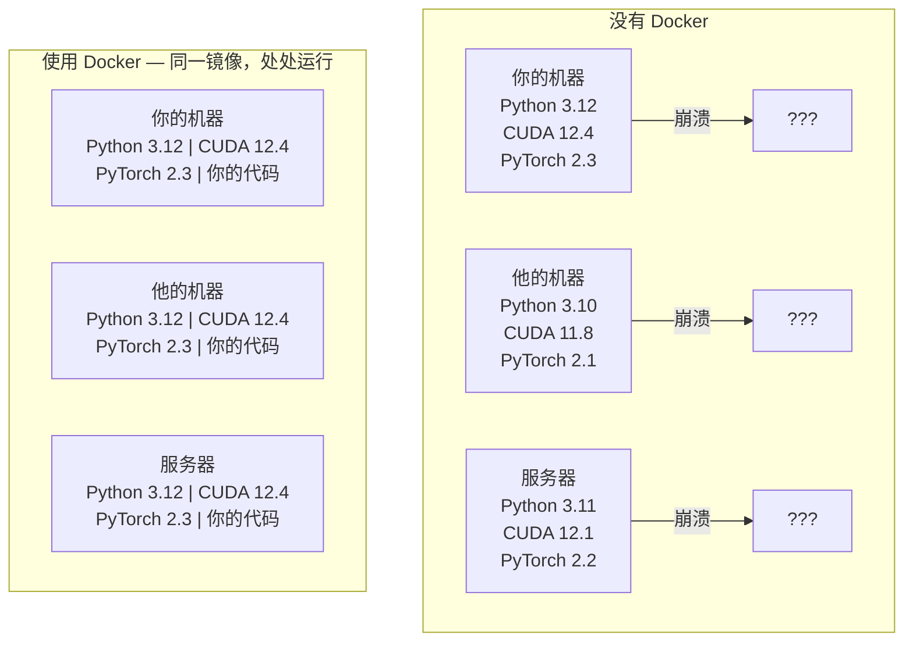

# Docker 在 AI 开发中的应用

> 容器让"在我机器上能跑"成为历史。

**类型：** 构建
**语言：** Python
**前置课程：** Phase 0，第 01 课和第 03 课
**时长：** 约 60 分钟

## 学习目标

- 通过 Dockerfile 构建支持 GPU 的 Docker 镜像（Image），内含 CUDA、PyTorch 和 AI 库
- 使用卷挂载（Volume Mount）将宿主机目录映射到容器中，使模型、数据集和代码在容器重建后依然保留
- 配置 NVIDIA Container Toolkit，让容器内部能够访问 GPU
- 使用 Docker Compose 编排多服务 AI 应用（推理服务器 + 向量数据库）

## 为什么要做这件事

你在自己的笔记本上用 PyTorch 2.3、CUDA 12.4 和 Python 3.12 训练了一个模型。你的同事使用的是 PyTorch 2.1、CUDA 11.8 和 Python 3.10。模型在他的机器上直接崩溃。但如果你用 Dockerfile，两台机器都能正常运行。

AI 项目是依赖地狱。一个典型的技术栈包括 Python、PyTorch、CUDA 驱动、cuDNN、系统级 C 库，以及像 flash-attn 这样需要精确编译器版本的特殊包。Docker 把所有这些打包成一个镜像，在任何地方运行结果都完全一致。

## 核心概念

Docker 把你的代码、运行时、库和系统工具封装到一个隔离的单元中，叫做容器（Container）。你可以把它理解为一个轻量级虚拟机——区别在于它共享宿主机的操作系统内核而不是运行自己的内核，所以启动只需几秒而非几分钟。



### 为什么 AI 项目比其他项目更需要 Docker

1. **GPU 驱动非常脆弱。** CUDA 12.4 的代码无法在 CUDA 11.8 上运行。Docker 将 CUDA 工具包隔离在容器内部，同时通过 NVIDIA Container Toolkit 共享宿主机的 GPU 驱动。

2. **模型权重文件很大。** 一个 7B 参数的模型在 fp16 精度下有 14 GB。你不会希望每次重建容器都重新下载一遍。Docker 卷可以从宿主机挂载模型目录。

3. **多服务架构很常见。** 真实的 AI 应用不仅仅是一个 Python 脚本。它包含推理服务器、用于 RAG 的向量数据库，可能还有一个 Web 前端。Docker Compose 用一条命令就能编排所有这些服务。

### 核心术语

| 术语 | 含义 |
|------|------|
| 镜像（Image） | 只读模板，相当于你的配方。由 Dockerfile 构建而成。 |
| 容器（Container） | 镜像的运行实例，相当于你的厨房。 |
| Dockerfile | 构建镜像的指令文件，一层一层叠加。 |
| 卷（Volume） | 持久化存储，容器重启后数据依然存在。 |
| docker-compose | 用 YAML 定义多容器应用的工具。 |

### AI 中常见的容器模式

```
开发容器
  完整工具链。编辑器支持。Jupyter。调试工具。
  用于开发和实验阶段。

训练容器
  极简。只有训练脚本和依赖。
  在 GPU 集群上运行。没有编辑器，没有 Jupyter。

推理容器
  针对服务进行优化。镜像小。冷启动快。
  在生产环境中运行于负载均衡器之后。
```

## 动手搭建

### 第 1 步：安装 Docker

```bash
# macOS
brew install --cask docker
open /Applications/Docker.app

# Ubuntu
curl -fsSL https://get.docker.com | sh
sudo usermod -aG docker $USER
# 注销并重新登录以使用户组变更生效
```

验证安装：

```bash
docker --version
docker run hello-world
```

### 第 2 步：安装 NVIDIA Container Toolkit（Linux + NVIDIA GPU）

这一步让 Docker 容器能够访问你的 GPU。macOS 和 Windows（WSL2）用户可以跳过这一步——Docker Desktop 在这些平台上通过不同方式处理 GPU 透传。

```bash
distribution=$(. /etc/os-release;echo $ID$VERSION_ID)
curl -fsSL https://nvidia.github.io/libnvidia-container/gpgkey | sudo gpg --dearmor -o /usr/share/keyrings/nvidia-container-toolkit-keyring.gpg
curl -s -L https://nvidia.github.io/libnvidia-container/$distribution/libnvidia-container.list | \
    sed 's#deb https://#deb [signed-by=/usr/share/keyrings/nvidia-container-toolkit-keyring.gpg] https://#g' | \
    sudo tee /etc/apt/sources.list.d/nvidia-container-toolkit.list

sudo apt-get update
sudo apt-get install -y nvidia-container-toolkit
sudo nvidia-ctk runtime configure --runtime=docker
sudo systemctl restart docker
```

在容器内测试 GPU 访问：

```bash
docker run --rm --gpus all nvidia/cuda:12.4.1-base-ubuntu22.04 nvidia-smi
```

如果你能看到 GPU 信息，说明工具包已正确配置。

### 第 3 步：理解基础镜像

选对基础镜像能省下数小时的调试时间。

```
nvidia/cuda:12.4.1-devel-ubuntu22.04
  完整 CUDA 工具包，包含编译器。
  用途：构建需要 nvcc 的包（flash-attn、bitsandbytes）
  大小：约 4 GB

nvidia/cuda:12.4.1-runtime-ubuntu22.04
  仅 CUDA 运行时，无编译器。
  用途：运行已编译的代码
  大小：约 1.5 GB

pytorch/pytorch:2.3.1-cuda12.4-cudnn9-runtime
  预装 PyTorch，基于 CUDA 构建。
  用途：跳过 PyTorch 安装步骤
  大小：约 6 GB

python:3.12-slim
  无 CUDA，仅 CPU。
  用途：CPU 推理、轻量级工具
  大小：约 150 MB
```

### 第 4 步：编写用于 AI 开发的 Dockerfile

以下是 `code/Dockerfile` 中的内容，逐步解读：

```dockerfile
FROM nvidia/cuda:12.4.1-devel-ubuntu22.04

ENV DEBIAN_FRONTEND=noninteractive
ENV PYTHONUNBUFFERED=1

RUN apt-get update && apt-get install -y --no-install-recommends \
    python3.12 \
    python3.12-venv \
    python3.12-dev \
    python3-pip \
    git \
    curl \
    build-essential \
    && rm -rf /var/lib/apt/lists/*

RUN update-alternatives --install /usr/bin/python python /usr/bin/python3.12 1

RUN python -m pip install --no-cache-dir --upgrade pip setuptools wheel

RUN python -m pip install --no-cache-dir \
    torch==2.3.1 \
    torchvision==0.18.1 \
    torchaudio==2.3.1 \
    --index-url https://download.pytorch.org/whl/cu124

RUN python -m pip install --no-cache-dir \
    numpy \
    pandas \
    scikit-learn \
    matplotlib \
    jupyter \
    transformers \
    datasets \
    accelerate \
    safetensors

WORKDIR /workspace

VOLUME ["/workspace", "/models"]

EXPOSE 8888

CMD ["python"]
```

构建镜像：

```bash
docker build -t ai-dev -f phases/00-setup-and-tooling/07-docker-for-ai/code/Dockerfile .
```

第一次构建会比较慢（需要下载 CUDA 基础镜像和 PyTorch）。后续构建会使用缓存层，速度快很多。

运行容器：

```bash
docker run --rm -it --gpus all \
    -v $(pwd):/workspace \
    -v ~/models:/models \
    ai-dev python -c "import torch; print(f'PyTorch {torch.__version__}, CUDA: {torch.cuda.is_available()}')"
```

在容器内启动 Jupyter：

```bash
docker run --rm -it --gpus all \
    -v $(pwd):/workspace \
    -v ~/models:/models \
    -p 8888:8888 \
    ai-dev jupyter notebook --ip=0.0.0.0 --port=8888 --no-browser --allow-root
```

### 第 5 步：用卷挂载管理数据和模型

卷挂载对于 AI 工作至关重要。没有它们，你 14 GB 的模型下载会在容器停止时消失。

```bash
# 挂载你的代码
-v $(pwd):/workspace

# 挂载共享模型目录
-v ~/models:/models

# 挂载数据集
-v ~/datasets:/data
```

在训练脚本中，从挂载路径加载模型：

```python
from transformers import AutoModel

model = AutoModel.from_pretrained("/models/llama-7b")
```

模型存放在宿主机文件系统上。无论重建多少次容器，都不需要重新下载。

### 第 6 步：用 Docker Compose 编排多服务 AI 应用

一个真实的 RAG 应用需要推理服务器和向量数据库。Docker Compose 用一条命令同时启动它们。

参见 `code/docker-compose.yml`：

```yaml
services:
  ai-dev:
    build:
      context: .
      dockerfile: Dockerfile
    deploy:
      resources:
        reservations:
          devices:
            - driver: nvidia
              count: all
              capabilities: [gpu]
    volumes:
      - ../../../:/workspace
      - ~/models:/models
      - ~/datasets:/data
    ports:
      - "8888:8888"
    stdin_open: true
    tty: true
    command: jupyter notebook --ip=0.0.0.0 --port=8888 --no-browser --allow-root

  qdrant:
    image: qdrant/qdrant:v1.12.5
    ports:
      - "6333:6333"
      - "6334:6334"
    volumes:
      - qdrant_data:/qdrant/storage

volumes:
  qdrant_data:
```

启动所有服务：

```bash
cd phases/00-setup-and-tooling/07-docker-for-ai/code
docker compose up -d
```

现在你的 AI 开发容器可以通过服务名称访问向量数据库：`http://qdrant:6333`。Docker Compose 会自动创建一个共享网络。

从 AI 容器内部测试连接：

```python
from qdrant_client import QdrantClient

client = QdrantClient(host="qdrant", port=6333)
print(client.get_collections())
```

停止所有服务：

```bash
docker compose down
```

如果还想删除 qdrant 数据卷，加上 `-v` 参数：

```bash
docker compose down -v
```

### 第 7 步：AI 工作中常用的 Docker 命令

```bash
# 列出正在运行的容器
docker ps

# 列出所有镜像及其大小
docker images

# 删除未使用的镜像（回收磁盘空间）
docker system prune -a

# 查看运行中容器内的 GPU 使用情况
docker exec -it <container_id> nvidia-smi

# 从容器复制文件到宿主机
docker cp <container_id>:/workspace/results.csv ./results.csv

# 查看容器日志
docker logs -f <container_id>
```

## 实际使用

现在你拥有了一个可复现的 AI 开发环境。在本课程的后续内容中：

- 使用 `docker compose up` 同时启动开发环境和向量数据库
- 通过卷挂载你的代码、模型和数据，确保重建容器时不丢失任何东西
- 当某节课需要新的 Python 包时，将其添加到 Dockerfile 并重新构建
- 把你的 Dockerfile 分享给队友，他们会得到完全相同的环境

### 没有 GPU？

去掉 `--gpus all` 参数和 NVIDIA deploy 配置块即可。容器对于纯 CPU 的课程仍然可以正常工作。PyTorch 会自动检测 CUDA 不可用并回退到 CPU 模式。

## 练习

1. 构建 Dockerfile 并在容器内运行 `python -c "import torch; print(torch.__version__)"`
2. 启动 docker-compose 服务栈，验证 AI 容器能通过 `http://qdrant:6333/collections` 访问 Qdrant
3. 在 Dockerfile 中添加 `flask`，重新构建，然后在 5000 端口运行一个简单的 API 服务器。使用 `-p 5000:5000` 映射端口
4. 用 `docker images` 查看镜像大小。尝试将基础镜像从 `devel` 换成 `runtime`，比较大小差异

## 关键术语

| 术语 | 通俗说法 | 实际含义 |
|------|---------|---------|
| 容器（Container） | "轻量虚拟机" | 使用宿主机内核的隔离进程，拥有自己的文件系统和网络 |
| 镜像层（Image Layer） | "缓存的步骤" | Dockerfile 中每条指令创建一层。未改变的层会被缓存，因此重建速度很快 |
| NVIDIA Container Toolkit | "Docker 里用 GPU" | 一个运行时钩子，通过 `--gpus` 参数将宿主机 GPU 暴露给容器 |
| 卷挂载（Volume Mount） | "共享文件夹" | 宿主机上的一个目录映射到容器内部。容器停止后更改依然保留 |
| 基础镜像（Base Image） | "起点" | Dockerfile 中 `FROM` 指定的镜像。决定了预装了哪些东西 |
