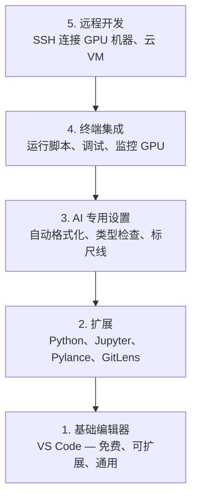

# 编辑器配置

> 编辑器是你的副驾驶。一次性配置好，让它不添乱的同时发挥作用。

**类型：** 构建
**语言：** --
**前置课程：** Phase 0，第 01 课
**时长：** 约 20 分钟

## 学习目标

- 安装 VS Code 及其用于 Python、Jupyter、代码检查和远程 SSH 的核心扩展
- 配置保存时自动格式化、类型检查和 Notebook 输出滚动，以适应 AI 工作流
- 设置 Remote SSH，在远程 GPU 机器上编辑和调试代码，体验如同本地操作
- 评估编辑器替代方案（Cursor、Windsurf、Neovim）及其在 AI 工作中的优劣

## 为什么要做这件事

你会在编辑器中花上数千小时来编写 Python、运行 Notebook、调试训练循环、通过 SSH 连接 GPU 服务器。一个配置不当的编辑器会让每次工作都充满摩擦：没有自动补全、没有类型提示、没有内联错误提醒、手动格式化、笨拙的终端操作。

正确的配置只需 20 分钟。跳过这一步，你每天都会浪费 20 分钟。

## 核心概念

AI 工程的编辑器配置需要五个层次：



## 动手搭建

### 第 1 步：安装 VS Code

VS Code 是推荐的编辑器。它免费、支持所有操作系统、对 Jupyter Notebook 有一流的支持，而且扩展生态覆盖了 AI 工作所需的一切。

从 [code.visualstudio.com](https://code.visualstudio.com/) 下载。

在终端中验证：

```bash
code --version
```

如果在 macOS 上找不到 `code` 命令，打开 VS Code，按 `Cmd+Shift+P`，输入 "Shell Command"，选择 "Install 'code' command in PATH"。

### 第 2 步：安装核心扩展

在 VS Code 集成终端（`Ctrl+`` ` 或 `` Cmd+` ``）中安装对 AI 工作有用的扩展：

```bash
code --install-extension ms-python.python
code --install-extension ms-python.vscode-pylance
code --install-extension ms-toolsai.jupyter
code --install-extension eamodio.gitlens
code --install-extension ms-vscode-remote.remote-ssh
code --install-extension ms-python.debugpy
code --install-extension ms-python.black-formatter
code --install-extension charliermarsh.ruff
```

各扩展的作用：

| 扩展 | 用途 |
|------|------|
| Python | 语言支持、虚拟环境检测、运行/调试 |
| Pylance | 快速类型检查、自动补全、导入解析 |
| Jupyter | 在 VS Code 中运行 Notebook、变量浏览器 |
| GitLens | 查看谁改了什么、内联 git blame |
| Remote SSH | 像本地一样打开远程 GPU 机器上的文件夹 |
| Debugpy | Python 逐步调试 |
| Black Formatter | 保存时自动格式化，风格一致 |
| Ruff | 快速代码检查，捕获常见错误 |

本课的 `code/.vscode/extensions.json` 文件包含完整的推荐列表。当你打开项目文件夹时，VS Code 会提示你安装这些扩展。

### 第 3 步：配置设置

从本课的 `code/.vscode/settings.json` 复制设置，或通过 `Settings > Open Settings (JSON)` 手动添加。

AI 工作的关键设置：

```jsonc
{
    "python.analysis.typeCheckingMode": "basic",
    "editor.formatOnSave": true,
    "editor.rulers": [88, 120],
    "notebook.output.scrolling": true,
    "files.autoSave": "afterDelay"
}
```

为什么这些设置很重要：

- **类型检查设为 basic**：在运行之前捕获参数类型错误。能省下调试 Tensor 形状不匹配和 API 参数错误的时间。
- **保存时格式化**：再也不用想格式化的事。Black 帮你搞定。
- **标尺线在 88 和 120 列**：Black 在 88 列换行。120 列标记显示文档字符串和注释何时过长。
- **Notebook 输出滚动**：训练循环会打印数千行。没有滚动，输出面板会爆掉。
- **自动保存**：你会忘记保存。你的训练脚本会运行过时的代码。自动保存能避免这个问题。

### 第 4 步：终端集成

VS Code 的集成终端是你运行训练脚本、监控 GPU 和管理环境的地方。

正确配置：

```jsonc
{
    "terminal.integrated.defaultProfile.osx": "zsh",
    "terminal.integrated.defaultProfile.linux": "bash",
    "terminal.integrated.fontSize": 13,
    "terminal.integrated.scrollback": 10000
}
```

常用快捷键：

| 操作 | macOS | Linux/Windows |
|------|-------|---------------|
| 切换终端 | `` Ctrl+` `` | `` Ctrl+` `` |
| 新建终端 | `Ctrl+Shift+`` ` | `Ctrl+Shift+`` ` |
| 拆分终端 | `Cmd+\` | `Ctrl+\` |

拆分终端非常实用：一个运行脚本，另一个用 `nvidia-smi -l 1` 或 `watch -n 1 nvidia-smi` 监控 GPU。

### 第 5 步：远程开发（SSH 连接 GPU 机器）

这是 AI 工作中最重要的扩展。你会在远程机器上运行训练（云 VM、实验室服务器、Lambda、Vast.ai）。Remote SSH 让你打开远程文件系统、编辑文件、运行终端、调试代码，一切都如同在本地操作。

设置步骤：

1. 安装 Remote SSH 扩展（第 2 步已完成）。
2. 按 `Ctrl+Shift+P`（或 `Cmd+Shift+P`），输入 "Remote-SSH: Connect to Host"。
3. 输入 `user@your-gpu-box-ip`。
4. VS Code 会自动在远程机器上安装其服务端组件。

要实现免密登录，设置 SSH 密钥：

```bash
ssh-keygen -t ed25519 -C "your-email@example.com"
ssh-copy-id user@your-gpu-box-ip
```

将主机添加到 `~/.ssh/config` 以便快速连接：

```
Host gpu-box
    HostName 203.0.113.50
    User ubuntu
    IdentityFile ~/.ssh/id_ed25519
    ForwardAgent yes
```

现在 `Remote-SSH: Connect to Host > gpu-box` 即可一键连接。

## 替代方案

### Cursor

[cursor.com](https://cursor.com) 是一个内置 AI 代码生成功能的 VS Code 分支。它使用相同的扩展生态和设置格式。如果你使用 Cursor，本课的所有内容仍然适用。直接导入相同的 `settings.json` 和 `extensions.json` 即可。

### Windsurf

[windsurf.com](https://windsurf.com) 是另一个以 AI 为核心的 VS Code 分支。情况相同：相同的扩展、相同的设置格式、相同的 Remote SSH 支持。

### Vim/Neovim

如果你已经在使用 Vim 或 Neovim 并且效率很高，那就继续用。AI Python 工作的最低配置：

- **pyright** 或 **pylsp** 做类型检查（通过 Mason 或手动安装）
- **nvim-lspconfig** 做语言服务器集成
- **jupyter-vim** 或 **molten-nvim** 实现类 Notebook 的执行
- **telescope.nvim** 做文件/符号搜索
- **none-ls.nvim** 配合 black 和 ruff 做格式化/代码检查

如果你还没用过 Vim，现在不要开始学。学习曲线会跟学习 AI 工程互相争夺精力。用 VS Code 就好。

## 实际使用

配置完成后，你的日常工作流是这样的：

1. 在 VS Code 中打开项目文件夹（或通过 Remote SSH 连接到 GPU 机器）。
2. 在编辑器中编写 Python，享受自动补全、类型提示和内联错误提醒。
3. 用 Jupyter 扩展直接在编辑器中运行 Notebook。
4. 用集成终端运行训练脚本、`uv pip install`、监控 GPU。
5. 提交前用 GitLens 审查变更。

## 练习

1. 安装 VS Code 及第 2 步中列出的所有扩展
2. 将本课的 `settings.json` 复制到你的 VS Code 配置中
3. 打开一个 Python 文件，验证 Pylance 显示类型提示且 Black 在保存时格式化
4. 如果你有远程机器的访问权限，设置 Remote SSH 并打开远程文件夹

## 关键术语

| 术语 | 通俗说法 | 实际含义 |
|------|---------|---------|
| LSP（语言服务器协议） | "自动补全引擎" | Language Server Protocol：一种标准协议，让编辑器从特定语言的服务器获取类型信息、补全和诊断 |
| Pylance | "Python 插件" | 微软的 Python 语言服务器，使用 Pyright 进行类型检查和智能提示 |
| Remote SSH | "在服务器上工作" | VS Code 扩展，在远程机器上运行轻量级服务器并将 UI 流式传输到本地编辑器 |
| 保存时格式化（Format on Save） | "自动美化" | 每次保存时编辑器运行格式化工具（Black、Ruff），确保代码风格始终一致 |
