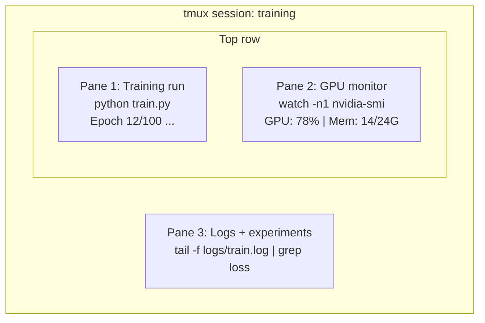

# 终端与 Shell

> 终端是 AI 工程师的主战场。你必须在这里如鱼得水。

**类型：** 学习
**语言：** --
**前置条件：** Phase 0，第 01 课
**时间：** 约 35 分钟

## 学习目标

- 使用管道（Pipe）、重定向（Redirect）和 `grep` 从命令行过滤和处理训练日志
- 创建持久化的 tmux 会话，利用多窗格同时进行训练和 GPU 监控
- 用 `htop`、`nvtop` 和 `nvidia-smi` 监控系统和 GPU 资源
- 通过 SSH、`scp` 和 `rsync` 在本地与远程机器间传输文件

## 为什么要做这件事

你在终端里花的时间会比在任何编辑器里都多。训练运行、GPU 监控、日志追踪、远程 SSH 会话、环境管理——所有 AI 工作流都离不开 Shell。如果你在这里慢吞吞的，那你做什么都会慢。

这节课涵盖 AI 工作中真正用得到的终端技能。不讲 Unix 历史，不深入 Bash 脚本，只讲你需要的东西。

## 核心概念



三个任务同时运行，只需一个终端。你可以断开连接，回家，SSH 重新连上，再重新挂载。训练会一直在跑。

## 动手搭建

### 第 1 步：了解你的 Shell

查看当前运行的是哪个 Shell：

```bash
echo $SHELL
```

大部分系统使用 `bash` 或 `zsh`。两者都没问题，本课程中的命令在哪个下面都能用。

你需要知道的要点：

```bash
# 移动目录
cd ~/projects/ai-engineering-from-scratch
pwd
ls -la

# 历史搜索（你会学到的最有用的快捷键）
# Ctrl+R 然后输入之前命令的一部分
# 再按 Ctrl+R 在匹配结果中循环切换

# 清屏
clear   # 或 Ctrl+L

# 取消正在运行的命令
# Ctrl+C

# 挂起正在运行的命令（用 fg 恢复）
# Ctrl+Z
```

### 第 2 步：管道和重定向

管道将命令串联在一起。这是你处理日志、过滤输出、链接工具的方式。你会不停地用到它。

```bash
# 统计日志中 "loss" 出现了多少次
cat train.log | grep "loss" | wc -l

# 从训练输出中只提取 loss 值
grep "loss:" train.log | awk '{print $NF}' > losses.txt

# 实时查看日志更新，只过滤错误信息
tail -f train.log | grep --line-buffered "ERROR"

# 按最终准确率排序所有实验
grep "final_accuracy" results/*.log | sort -t= -k2 -n -r

# 将标准输出和标准错误分别重定向到不同文件
python train.py > output.log 2> errors.log

# 将两者重定向到同一个文件
python train.py > train_full.log 2>&1
```

你需要掌握的重定向符号：

| 符号 | 作用 |
|--------|-------------|
| `>` | 将标准输出写入文件（覆盖） |
| `>>` | 将标准输出追加到文件 |
| `2>` | 将标准错误写入文件 |
| `2>&1` | 将标准错误发送到与标准输出相同的位置 |
| `\|` | 将前一个命令的标准输出作为下一个命令的标准输入 |

### 第 3 步：后台进程

训练需要跑好几个小时，你不会想一直开着终端等着。

```bash
# 后台运行（输出仍会打印到终端）
python train.py &

# 后台运行，且不受挂断信号影响（关闭终端不会杀死进程）
nohup python train.py > train.log 2>&1 &

# 查看后台正在运行的任务
jobs
ps aux | grep train.py

# 将后台任务拉回前台
fg %1

# 杀掉后台进程
kill %1
# 或者找到它的 PID 然后 kill
kill $(pgrep -f "train.py")
```

`&`、`nohup` 和 `screen`/`tmux` 的区别：

| 方式 | 终端关闭后还活着吗？ | 能重新连接吗？ |
|--------|-------------------------|---------------|
| `command &` | 不能 | 不能 |
| `nohup command &` | 能 | 不能（只能看日志文件） |
| `screen` / `tmux` | 能 | 能 |

任何超过几分钟的任务，都应该用 tmux。

### 第 4 步：tmux

tmux 允许你创建持久化的终端会话，包含多个窗格。对于管理训练任务而言，它是最有用的单一工具。

```bash
# 安装
# macOS
brew install tmux
# Ubuntu
sudo apt install tmux

# 创建一个命名会话
tmux new -s training

# 水平分割
# Ctrl+B 然后 "

# 垂直分割
# Ctrl+B 然后 %

# 在窗格间切换
# Ctrl+B 然后方向键

# 断开（会话继续运行）
# Ctrl+B 然后 d

# 重新挂载
tmux attach -t training

# 列出所有会话
tmux ls

# 关闭一个会话
tmux kill-session -t training
```

一个典型的 AI 工作流会话：

```bash
tmux new -s train

# 窗格 1：开始训练
python train.py --epochs 100 --lr 1e-4

# Ctrl+B, " 分割窗格，然后运行 GPU 监控
watch -n1 nvidia-smi

# Ctrl+B, % 垂直分割，tail 日志
tail -f logs/experiment.log

# 现在按 Ctrl+B, d 断开
# SSH 退出，去喝杯咖啡，回来
# tmux attach -t train
```

### 第 5 步：用 htop 和 nvtop 监控

```bash
# 系统进程（比 top 好用）
htop

# GPU 进程（如果有 NVIDIA GPU）
# 安装：sudo apt install nvtop (Ubuntu) 或 brew install nvtop (macOS)
nvtop

# 不装 nvtop 也能快速查看 GPU
nvidia-smi

# 每秒刷新 GPU 使用情况
watch -n1 nvidia-smi

# 查看哪些进程在使用 GPU
nvidia-smi --query-compute-apps=pid,name,used_memory --format=csv
```

`htop` 常用快捷键：
- `F6` 或 `>` 按列排序（按内存排序可以发现内存泄漏）
- `F5` 切换树形视图（查看子进程）
- `F9` 杀掉进程
- `/` 搜索进程名

### 第 6 步：SSH 连接远程 GPU 服务器

当你租用云 GPU（Lambda、RunPod、Vast.ai），你需要通过 SSH 连接。

```bash
# 基本连接
ssh user@gpu-box-ip

# 指定密钥
ssh -i ~/.ssh/my_gpu_key user@gpu-box-ip

# 将文件复制到远程
scp model.pt user@gpu-box-ip:~/models/

# 从远程复制文件
scp user@gpu-box-ip:~/results/metrics.json ./

# 同步整个目录（多文件时比 scp 更快）
rsync -avz ./data/ user@gpu-box-ip:~/data/

# 端口转发（在本地访问远程的 Jupyter/TensorBoard）
ssh -L 8888:localhost:8888 user@gpu-box-ip
# 然后在浏览器中打开 localhost:8888

# SSH 配置文件让连接更方便
# 添加到 ~/.ssh/config:
# Host gpu
#     HostName 192.168.1.100
#     User ubuntu
#     IdentityFile ~/.ssh/gpu_key
#
# 然后直接：
# ssh gpu
```

### 第 7 步：AI 工作中的实用别名

将以下内容添加到你的 `~/.bashrc` 或 `~/.zshrc`：

```bash
source phases/00-setup-and-tooling/10-terminal-and-shell/code/shell_aliases.sh
```

或者挑选你需要的。关键别名如下：

```bash
# 一眼看 GPU 状态
alias gpu='nvidia-smi --query-gpu=index,name,utilization.gpu,memory.used,memory.total,temperature.gpu --format=csv,noheader'

# 杀掉所有 Python 训练进程
alias killtraining='pkill -f "python.*train"'

# 快速激活虚拟环境
alias ae='source .venv/bin/activate'

# 监控训练 loss
alias watchloss='tail -f logs/*.log | grep --line-buffered "loss"'
```

完整列表见 `code/shell_aliases.sh`。

### 第 8 步：常见的 AI 终端操作模式

这些在实际工作中反复出现：

```bash
# 运行训练，记录所有输出，完成后发通知
python train.py 2>&1 | tee train.log; echo "DONE" | mail -s "Training complete" you@email.com

# 并排比较两个实验的日志
diff <(grep "accuracy" exp1.log) <(grep "accuracy" exp2.log)

# 找到最大的模型文件（清理磁盘空间）
find . -name "*.pt" -o -name "*.safetensors" | xargs du -h | sort -rh | head -20

# 从 Hugging Face 下载模型
wget https://huggingface.co/model/resolve/main/model.safetensors

# 解压数据集
tar xzf dataset.tar.gz -C ./data/

# 统计所有 Python 文件的行数（看看项目有多大）
find . -name "*.py" | xargs wc -l | tail -1

# 检查磁盘空间（训练数据很快就能把磁盘填满）
df -h
du -sh ./data/*

# 训练前检查环境变量
env | grep -i cuda
env | grep -i torch
```

## 实际使用

以下是本课程中各工具的使用时机：

| 工具 | 使用场景 |
|------|----------------|
| tmux | 每次训练运行（Phase 3 及以后） |
| `tail -f` + `grep` | 监控训练日志 |
| `nohup` / `&` | 快速后台任务 |
| `htop` / `nvtop` | 调试训练慢、OOM 错误 |
| SSH + `rsync` | 在云 GPU 上工作 |
| 管道 + 重定向 | 处理实验结果 |
| 别名 | 节省重复命令的时间 |

## 练习

1. 安装 tmux，创建一个包含三个窗格的会话，在一个里运行 `htop`，另一个里运行 `watch -n1 date`，第三个里运行一个 Python 脚本。然后断开并重新挂载。
2. 将 `code/shell_aliases.sh` 中的别名添加到你的 Shell 配置文件，然后用 `source ~/.zshrc`（或 `~/.bashrc`）重新加载。
3. 用 `for i in $(seq 1 100); do echo "epoch $i loss: $(echo "scale=4; 1/$i" | bc)"; sleep 0.1; done > fake_train.log` 创建一个假的训练日志，然后用 `grep`、`tail` 和 `awk` 提取 loss 值。
4. 为你有访问权限的服务器（或用 `localhost` 练习语法）设置一个 SSH config 条目。

## 关键术语

| 术语 | 通俗说法 | 实际含义 |
|------|----------------|----------------------|
| Shell | "终端" | 解释你输入命令的程序（bash、zsh、fish） |
| tmux | "终端复用器" | 一个让你在单个窗口内运行多个终端会话，并可以断开/重新挂载的程序 |
| Pipe（管道） | "那个竖线" | `\|` 操作符，将一个命令的输出作为另一个命令的输入 |
| PID | "进程 ID" | 分配给每个运行中进程的唯一编号，用于监控或终止进程 |
| nohup | "不挂断" | 让命令免受挂断信号影响运行，关闭终端也不会杀掉它 |
| SSH | "连服务器" | Secure Shell，一种用于在远程机器上执行命令的加密协议 |
