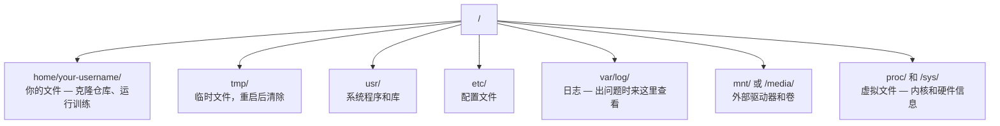

# Linux 基础（面向 AI）

> 大多数 AI 工作负载跑在 Linux 上。你需要掌握足够多的知识，才不会被卡住。

**类型：** 学习
**语言：** --
**前置条件：** Phase 0，第 01 课
**时间：** 约 30 分钟

## 学习目标

- 在命令行中浏览 Linux 文件系统并执行基本文件操作
- 使用 `chmod` 和 `chown` 管理文件权限，解决 "Permission denied" 错误
- 使用 `apt` 安装系统软件包，并为 AI 工作配置一台全新的 GPU 服务器
- 识别 macOS 与 Linux 之间常见的差异，避免在远程机器上踩坑

## 为什么要做这件事

你在 macOS 或 Windows 上开发。但当你 SSH 到云端 GPU 服务器、租用 Lambda 实例或启动 EC2 机器时，你面对的是 Ubuntu。终端是你唯一的界面——没有 Finder，没有资源管理器，没有 GUI。如果你不会在命令行下浏览文件系统、安装软件包、管理进程，那就只能一边为闲置的 GPU 付费，一边搜索"怎么在 Linux 里解压文件"。

这是一份生存指南。它涵盖在远程 Linux 机器上进行 AI 工作所需的全部知识，不多不少。

## 文件系统布局

Linux 把所有东西组织在一个根目录 `/` 下。没有 `C:\`，也没有 `/Volumes`。你实际会接触到的目录：



你的主目录是 `~` 或 `/home/your-username`。你做的几乎所有事情都在这里。

## 基本命令

这 15 个命令覆盖了你在远程 GPU 服务器上 95% 的操作。

### 目录移动

```bash
pwd                         # 我在哪？
ls                          # 这里有什么？
ls -la                      # 显示详细信息，包括隐藏文件
cd /path/to/dir             # 去那里
cd ~                        # 回到主目录
cd ..                       # 上一层
```

### 文件和目录操作

```bash
mkdir my-project            # 创建目录
mkdir -p a/b/c              # 一次性创建嵌套目录

cp file.txt backup.txt      # 复制文件
cp -r src/ src-backup/      # 递归复制目录

mv old.txt new.txt          # 重命名文件
mv file.txt /tmp/           # 移动文件

rm file.txt                 # 删除文件（没有回收站，直接消失）
rm -rf my-dir/              # 删除目录及其中所有内容
```

`rm -rf` 是永久性的，没有撤销。按回车之前务必检查路径。

### 查看文件

```bash
cat file.txt                # 打印整个文件
head -20 file.txt           # 前 20 行
tail -20 file.txt           # 最后 20 行
tail -f log.txt             # 实时追踪日志文件（Ctrl+C 停止）
less file.txt               # 滚动浏览文件（q 退出）
```

### 搜索

```bash
grep "error" training.log           # 查找包含 "error" 的行
grep -r "learning_rate" .           # 在当前目录下所有文件中搜索
grep -i "cuda" config.yaml          # 不区分大小写搜索

find . -name "*.py"                 # 查找当前目录下所有 Python 文件
find . -name "*.ckpt" -size +1G     # 查找大于 1GB 的检查点文件
```

## 权限

Linux 中每个文件都有所有者和权限位。当脚本无法执行或你无法写入某个目录时，这就是问题所在。

```bash
ls -l train.py
# -rwxr-xr-- 1 user group 2048 Mar 19 10:00 train.py
#  ^^^             所有者权限：读、写、执行
#     ^^^          组权限：读、执行
#        ^^        其他人：只读
```

常见修复方法：

```bash
chmod +x train.sh           # 让脚本可执行
chmod 755 deploy.sh         # 所有者：全部权限，其他人：读+执行
chmod 644 config.yaml       # 所有者：读+写，其他人：只读

chown user:group file.txt   # 更改文件所有者（需要 sudo）
```

当看到 "Permission denied" 时，几乎都是权限问题。`chmod +x` 或 `sudo` 能解决大多数情况。

## 包管理（apt）

Ubuntu 使用 `apt`。这是安装系统级软件的方式。

```bash
sudo apt update             # 刷新软件包列表（永远先执行这个）
sudo apt install -y htop    # 安装软件包（-y 跳过确认）
sudo apt install -y build-essential  # C 编译器、make 等。很多 Python 包依赖它
sudo apt install -y tmux    # 终端复用器（断开连接后保持会话）

apt list --installed        # 查看已安装的包
sudo apt remove htop        # 卸载
```

在全新 GPU 服务器上常装的软件包：

```bash
sudo apt update && sudo apt install -y \
    build-essential \
    git \
    curl \
    wget \
    tmux \
    htop \
    unzip \
    python3-venv
```

## 用户和 sudo

你通常以普通用户身份登录。某些操作需要 root（管理员）权限。

```bash
whoami                      # 我是哪个用户？
sudo command                # 以 root 身份执行单条命令
sudo su                     # 切换到 root（exit 退回来，尽量少用）
```

在云 GPU 实例上，你通常是唯一用户并且已经有 sudo 权限。不要什么都用 root 运行。只在必要时使用 sudo。

## 进程和 systemd

当训练卡住，或者你需要检查正在运行的程序时：

```bash
htop                        # 交互式进程查看器（q 退出）
ps aux | grep python        # 查找正在运行的 Python 进程
kill 12345                  # 优雅地停止 PID 为 12345 的进程
kill -9 12345               # 强制终止（优雅方式无效时使用）
nvidia-smi                  # GPU 进程和显存使用情况
```

systemd 管理服务（后台守护进程）。如果你运行推理服务器会用到它：

```bash
sudo systemctl start nginx          # 启动服务
sudo systemctl stop nginx           # 停止服务
sudo systemctl restart nginx        # 重启服务
sudo systemctl status nginx         # 检查是否在运行
sudo systemctl enable nginx         # 开机自动启动
```

## 磁盘空间

GPU 服务器的磁盘空间通常有限。模型和数据集很快就会把它填满。

```bash
df -h                       # 所有挂载驱动器的磁盘使用情况
df -h /home                 # /home 的磁盘使用情况

du -sh *                    # 当前目录每个项目的大小
du -sh ~/.cache             # 缓存大小（pip、Hugging Face 模型都在这里）
du -sh /data/checkpoints/   # 检查点有多大

# 找出最占空间的目录
du -h --max-depth=1 / 2>/dev/null | sort -hr | head -20
```

常见的释放空间方法：

```bash
# 清除 pip 缓存
pip cache purge

# 清除 apt 缓存
sudo apt clean

# 删除不需要的旧检查点
rm -rf checkpoints/epoch_01/ checkpoints/epoch_02/
```

## 网络

你会从命令行下载模型、传输文件和调用 API。

```bash
# 下载文件
wget https://example.com/model.bin                   # 下载文件
curl -O https://example.com/data.tar.gz              # 用 curl 下载
curl -s https://api.example.com/health | python3 -m json.tool  # 调用 API，格式化 JSON 输出

# 在机器之间传输文件
scp model.bin user@remote:/data/                     # 复制文件到远程
scp user@remote:/data/results.csv .                  # 从远程复制到本地
scp -r user@remote:/data/checkpoints/ ./local-dir/   # 复制目录

# 同步目录（大量传输时比 scp 更快，支持断点续传）
rsync -avz --progress ./data/ user@remote:/data/
rsync -avz --progress user@remote:/results/ ./results/
```

传输大文件时优先用 `rsync` 而不是 `scp`。它只传输变化的字节，并能处理中断的连接。

## tmux：保持会话存活

当你 SSH 到远程服务器后合上笔记本，你的训练就会被杀掉。tmux 可以避免这个问题。

```bash
tmux new -s train           # 启动名为 "train" 的新会话
# ... 开始训练，然后：
# Ctrl+B, 然后 D            # 断开（训练继续运行）

tmux ls                     # 列出所有会话
tmux attach -t train        # 重新挂载到会话

# 在 tmux 内：
# Ctrl+B, 然后 %            # 垂直分割窗格
# Ctrl+B, 然后 "            # 水平分割窗格
# Ctrl+B, 然后方向键        # 在窗格之间切换
```

长时间训练任务一定要在 tmux 里运行。一定。

## Windows 用户的 WSL2

如果你用 Windows，WSL2 可以提供一个真正的 Linux 环境，无需双系统启动。

```bash
# 在 PowerShell（管理员模式）中
wsl --install -d Ubuntu-24.04

# 重启后，从开始菜单打开 Ubuntu
sudo apt update && sudo apt upgrade -y
```

WSL2 运行的是真正的 Linux 内核。这节课中的所有内容在里面都能用。在 WSL 内部，你的 Windows 文件位于 `/mnt/c/Users/YourName/`。

GPU 直通需要在 Windows 端安装 NVIDIA 驱动（不是 Linux 端的）。安装 Windows NVIDIA 驱动后，WSL2 内部即可使用 CUDA。

## 踩坑提醒：macOS 到 Linux

如果你从 macOS 过来，以下差异会让你栽跟头：

| macOS | Linux | 说明 |
|-------|-------|-------|
| `brew install` | `sudo apt install` | 包名有时不同。`brew install htop` 与 `sudo apt install htop` 一样，但 `brew install readline` 与 `sudo apt install libreadline-dev` 就不同了。 |
| `open file.txt` | `xdg-open file.txt` | 但远程服务器没有 GUI。用 `cat` 或 `less`。 |
| `pbcopy` / `pbpaste` | 不可用 | 通过 SSH 没有剪贴板功能。 |
| `~/.zshrc` | `~/.bashrc` | macOS 默认是 zsh，大多数 Linux 服务器用 bash。 |
| `/opt/homebrew/` | `/usr/bin/`、`/usr/local/bin/` | 可执行文件存放的位置不同。 |
| `sed -i '' 's/a/b/' file` | `sed -i 's/a/b/' file` | macOS 的 sed 在 `-i` 后需要空字符串，Linux 不需要。 |
| 文件系统不区分大小写 | 文件系统区分大小写 | 在 Linux 上 `Model.py` 和 `model.py` 是两个不同的文件。 |
| 换行符 `\n` | 换行符 `\n` | 相同。但 Windows 用 `\r\n`，会导致 bash 脚本出错。用 `dos2unix` 修复。 |

## 速查卡

```
导航：          pwd, ls, cd, find
文件操作：      cp, mv, rm, mkdir, cat, head, tail, less
搜索：          grep, find
权限：          chmod, chown, sudo
包管理：        apt update, apt install
进程：          htop, ps, kill, nvidia-smi
服务：          systemctl start/stop/restart/status
磁盘：          df -h, du -sh
网络：          curl, wget, scp, rsync
会话：          tmux new/attach/detach
```

## 练习

1. SSH 到任意 Linux 机器（或打开 WSL2），进入你的主目录。创建一个项目文件夹，用 `touch` 在里面创建三个空文件，然后用 `ls -la` 列出它们。
2. 用 apt 安装 `htop`，运行它，找出占用内存最多的进程。
3. 启动一个 tmux 会话，在里面运行 `sleep 300`，断开连接，列出所有会话，然后重新挂载。
4. 用 `df -h` 查看可用磁盘空间，然后用 `du -sh ~/.cache/*` 查看缓存目录中什么占了最多空间。
5. 用 `scp` 将一个文件从本地传输到远程机器，再用 `rsync` 做同样的传输并比较两者的体验。
