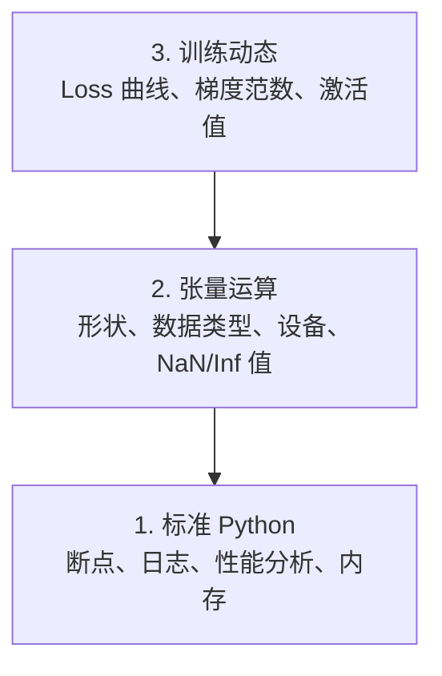

# 调试与性能分析

> 最糟糕的 AI bug 不会崩溃。它们在垃圾数据上默默训练，还给你画出一条漂亮的 loss 曲线。

**类型：** 实践
**语言：** Python
**前置条件：** 第 1 课（开发环境），PyTorch 基础
**时间：** 约 60 分钟

## 学习目标

- 使用条件 `breakpoint()` 和 `debug_print` 在训练过程中检查张量的形状、数据类型和 NaN 值
- 用 `cProfile`、`line_profiler` 和 `tracemalloc` 对训练循环进行性能分析，定位瓶颈
- 检测常见 AI bug：形状不匹配、NaN loss、数据泄漏（Data Leakage）和设备错误
- 设置 TensorBoard 来可视化 loss 曲线、权重直方图和梯度分布

## 为什么要做这件事

AI 代码的失败方式与普通代码不同。Web 应用崩溃时会抛出堆栈跟踪。而配置错误的训练循环会跑 8 个小时、烧掉 200 美元的 GPU 费用，然后生成一个对任何输入都预测均值的模型。代码从未报错，bug 可能只是一个放错设备的张量、一个忘记的 `.detach()`，或者标签泄漏到了特征里。

你需要能在这些"静默失败"浪费你的时间和算力之前就将其捕获的调试工具。

## 核心概念

AI 调试在三个层面运作：



大多数人直接跳到第 3 层（盯着 TensorBoard 看），但 80% 的 AI bug 存在于第 1 层和第 2 层。

## 动手搭建

### 第 1 部分：Print 调试（没错，它管用）

Print 调试经常被人看不起，但不应该如此。对于张量代码，一条有针对性的 print 语句比单步调试更有效，因为你需要同时看到形状、数据类型和值的范围。

```python
def debug_print(name, tensor):
    print(f"{name}: shape={tensor.shape}, dtype={tensor.dtype}, "
          f"device={tensor.device}, "
          f"min={tensor.min().item():.4f}, max={tensor.max().item():.4f}, "
          f"mean={tensor.mean().item():.4f}, "
          f"has_nan={tensor.isnan().any().item()}")
```

在每个可疑操作之后调用它。找到 bug 后，删掉 print。就这么简单。

### 第 2 部分：Python 调试器（pdb 和 breakpoint）

内置调试器在 AI 工作中被严重低估。在训练循环中放一个 `breakpoint()`，即可交互式地检查张量。

```python
def training_step(model, batch, criterion, optimizer):
    inputs, labels = batch
    outputs = model(inputs)
    loss = criterion(outputs, labels)

    if loss.item() > 100 or torch.isnan(loss):
        breakpoint()

    loss.backward()
    optimizer.step()
```

当调试器弹出时，常用命令：

- `p outputs.shape` 检查形状
- `p loss.item()` 查看 loss 值
- `p torch.isnan(outputs).sum()` 统计 NaN 数量
- `p model.fc1.weight.grad` 检查梯度
- `c` 继续，`q` 退出

这就是条件调试——只有在出现异常时才会暂停。对于一个 10,000 步的训练来说，这很重要。

### 第 3 部分：Python 日志

当调试工作不再是简单的快速检查时，用 logging 替代 print 语句。

```python
import logging

logging.basicConfig(
    level=logging.INFO,
    format="%(asctime)s [%(levelname)s] %(message)s",
    handlers=[
        logging.FileHandler("training.log"),
        logging.StreamHandler()
    ]
)
logger = logging.getLogger(__name__)

logger.info("Starting training: lr=%.4f, batch_size=%d", lr, batch_size)
logger.warning("Loss spike detected: %.4f at step %d", loss.item(), step)
logger.error("NaN loss at step %d, stopping", step)
```

日志提供时间戳、严重级别和文件输出。当训练在凌晨 3 点失败时，你需要的是日志文件，而不是已经滚出屏幕的终端输出。

### 第 4 部分：计时代码段

知道时间花在哪里是优化的第一步。

```python
import time

class Timer:
    def __init__(self, name=""):
        self.name = name

    def __enter__(self):
        self.start = time.perf_counter()
        return self

    def __exit__(self, *args):
        elapsed = time.perf_counter() - self.start
        print(f"[{self.name}] {elapsed:.4f}s")

with Timer("data loading"):
    batch = next(dataloader_iter)

with Timer("forward pass"):
    outputs = model(batch)

with Timer("backward pass"):
    loss.backward()
```

常见发现：数据加载占了训练时间的 60%。解决方法是把 DataLoader 的 `num_workers` 设大于 0，而不是换更快的 GPU。

### 第 5 部分：cProfile 和 line_profiler

当手动计时不够用时：

```bash
python -m cProfile -s cumtime train.py
```

这会列出所有函数调用，按累计时间排序。需要逐行分析时：

```bash
pip install line_profiler
```

```python
@profile
def train_step(model, data, target):
    output = model(data)
    loss = F.cross_entropy(output, target)
    loss.backward()
    return loss

# 运行：kernprof -l -v train.py
```

### 第 6 部分：内存分析

#### 用 tracemalloc 分析 CPU 内存

```python
import tracemalloc

tracemalloc.start()

# 你的代码
model = build_model()
data = load_dataset()

snapshot = tracemalloc.take_snapshot()
top_stats = snapshot.statistics("lineno")
for stat in top_stats[:10]:
    print(stat)
```

#### 用 memory_profiler 分析 CPU 内存

```bash
pip install memory_profiler
```

```python
from memory_profiler import profile

@profile
def load_data():
    raw = read_csv("data.csv")       # 注意这里内存跳升
    processed = preprocess(raw)       # 还有这里
    return processed
```

用 `python -m memory_profiler your_script.py` 运行，即可查看逐行内存使用情况。

#### 用 PyTorch 分析 GPU 显存

```python
import torch

if torch.cuda.is_available():
    print(torch.cuda.memory_summary())

    print(f"Allocated: {torch.cuda.memory_allocated() / 1e9:.2f} GB")
    print(f"Cached: {torch.cuda.memory_reserved() / 1e9:.2f} GB")
```

遇到 OOM（Out of Memory，显存不足）时：

1. 减小 batch size（永远第一个尝试的方法）
2. 用 `torch.cuda.empty_cache()` 释放缓存显存
3. 对大型中间结果用 `del tensor` 再调用 `torch.cuda.empty_cache()`
4. 使用混合精度训练（`torch.cuda.amp`）将显存占用减半
5. 对非常深的模型使用梯度检查点（Gradient Checkpointing）

### 第 7 部分：常见 AI Bug 及检测方法

#### 形状不匹配（Shape Mismatch）

最常见的 bug。张量的形状是 `[batch, features]`，但模型期望的是 `[batch, channels, height, width]`。

```python
def check_shapes(model, sample_input):
    print(f"Input: {sample_input.shape}")
    hooks = []

    def make_hook(name):
        def hook(module, inp, out):
            in_shape = inp[0].shape if isinstance(inp, tuple) else inp.shape
            out_shape = out.shape if hasattr(out, "shape") else type(out)
            print(f"  {name}: {in_shape} -> {out_shape}")
        return hook

    for name, module in model.named_modules():
        hooks.append(module.register_forward_hook(make_hook(name)))

    with torch.no_grad():
        model(sample_input)

    for h in hooks:
        h.remove()
```

用一个样本 batch 运行一次。它会映射出模型中每一步的形状变换。

#### NaN Loss

NaN loss 意味着某些值爆炸了。常见原因：

- 学习率太高
- 自定义 loss 中除以零
- 对零或负数取对数
- RNN 中的梯度爆炸

```python
def detect_nan(model, loss, step):
    if torch.isnan(loss):
        print(f"NaN loss at step {step}")
        for name, param in model.named_parameters():
            if param.grad is not None:
                if torch.isnan(param.grad).any():
                    print(f"  NaN gradient in {name}")
                if torch.isinf(param.grad).any():
                    print(f"  Inf gradient in {name}")
        return True
    return False
```

#### 数据泄漏（Data Leakage）

你的模型在测试集上达到了 99% 的准确率。听起来很棒，但这是 bug。

```python
def check_data_leakage(train_set, test_set, id_column="id"):
    train_ids = set(train_set[id_column].tolist())
    test_ids = set(test_set[id_column].tolist())
    overlap = train_ids & test_ids
    if overlap:
        print(f"DATA LEAKAGE: {len(overlap)} samples in both train and test")
        return True
    return False
```

也要检查时间泄漏：用未来的数据预测过去。分割前按时间戳排序。

#### 设备错误（Wrong Device）

不同设备上的张量（CPU vs GPU）会导致运行时错误。但有时一个张量默默留在 CPU 上，而其他所有东西都在 GPU 上，训练只是变慢而不会报错。

```python
def check_devices(model, *tensors):
    model_device = next(model.parameters()).device
    print(f"Model device: {model_device}")
    for i, t in enumerate(tensors):
        if t.device != model_device:
            print(f"  WARNING: tensor {i} on {t.device}, model on {model_device}")
```

### 第 8 部分：TensorBoard 基础

TensorBoard 能让你看到训练过程中的内部状态随时间的变化。

```bash
pip install tensorboard
```

```python
from torch.utils.tensorboard import SummaryWriter

writer = SummaryWriter("runs/experiment_1")

for step in range(num_steps):
    loss = train_step(model, batch)

    writer.add_scalar("loss/train", loss.item(), step)
    writer.add_scalar("lr", optimizer.param_groups[0]["lr"], step)

    if step % 100 == 0:
        for name, param in model.named_parameters():
            writer.add_histogram(f"weights/{name}", param, step)
            if param.grad is not None:
                writer.add_histogram(f"grads/{name}", param.grad, step)

writer.close()
```

启动方式：

```bash
tensorboard --logdir=runs
```

需要关注的信号：

- **Loss 不下降**：学习率太低，或模型架构有问题
- **Loss 剧烈震荡**：学习率太高
- **Loss 变成 NaN**：数值不稳定（见上方 NaN 部分）
- **训练 loss 下降，验证 loss 上升**：过拟合
- **权重直方图坍缩到零**：梯度消失
- **梯度直方图爆炸**：需要梯度裁剪

### 第 9 部分：VS Code 调试器

用于交互式调试，在 VS Code 中配置 `launch.json`：

```json
{
    "version": "0.2.0",
    "configurations": [
        {
            "name": "Debug Training",
            "type": "debugpy",
            "request": "launch",
            "program": "${file}",
            "console": "integratedTerminal",
            "justMyCode": false
        }
    ]
}
```

点击行号旁边的空白区域设置断点。使用"变量"面板检查张量属性。调试控制台允许你在执行过程中运行任意 Python 表达式。

适合逐步跟踪数据预处理管道，查看每一步转换的情况。

## 实际使用

以下是能捕获大多数 AI bug 的调试工作流：

1. **训练前**：用样本 batch 运行 `check_shapes`。验证输入和输出维度符合预期。
2. **前 10 步**：对 loss、输出和梯度使用 `debug_print`。确认没有 NaN，值在合理范围内。
3. **训练过程中**：记录 loss、学习率和梯度范数。用 TensorBoard 可视化。
4. **出问题时**：在故障点放 `breakpoint()`。交互式检查张量。
5. **性能优化**：对数据加载、前向传播和反向传播分别计时。接近 OOM 时做内存分析。

## 交付物

运行调试工具脚本：

```bash
python phases/00-setup-and-tooling/12-debugging-and-profiling/code/debug_tools.py
```

参见 `outputs/prompt-debug-ai-code.md` 获取一个帮助诊断 AI 特有 bug 的提示词。

## 练习

1. 运行 `debug_tools.py` 并阅读各部分的输出。修改 dummy 模型，引入一个 NaN（提示：在前向传播中除以零），观察检测器如何捕获它。
2. 用 `cProfile` 对一个训练循环进行性能分析，找出最慢的函数。
3. 用 `tracemalloc` 找出数据加载管道中哪一行分配了最多内存。
4. 为一个简单的训练运行设置 TensorBoard，判断模型是否过拟合。
5. 在训练循环内使用 `breakpoint()`。练习从调试器提示符中检查张量的形状、设备和梯度值。
