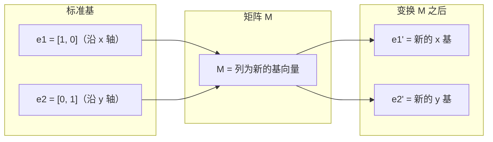
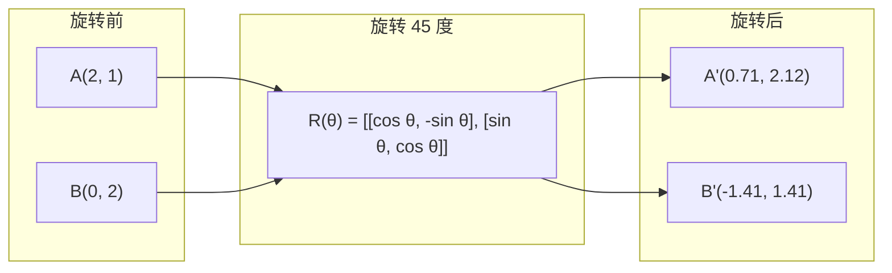
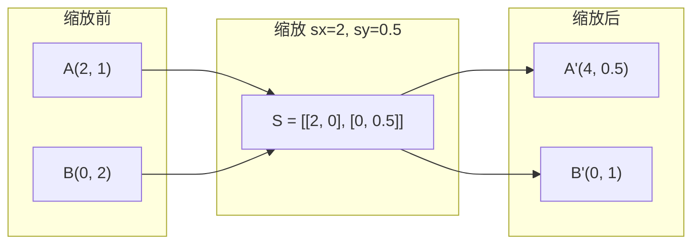
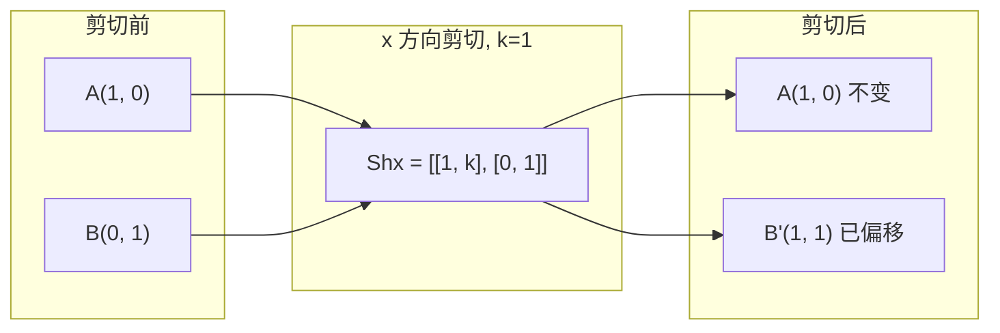
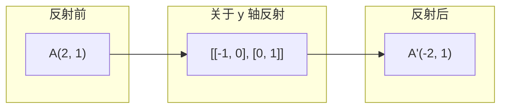
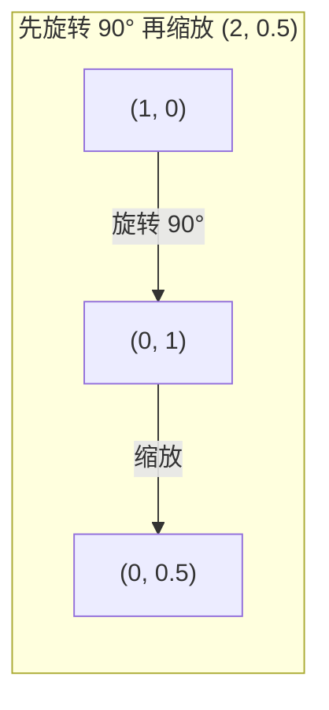
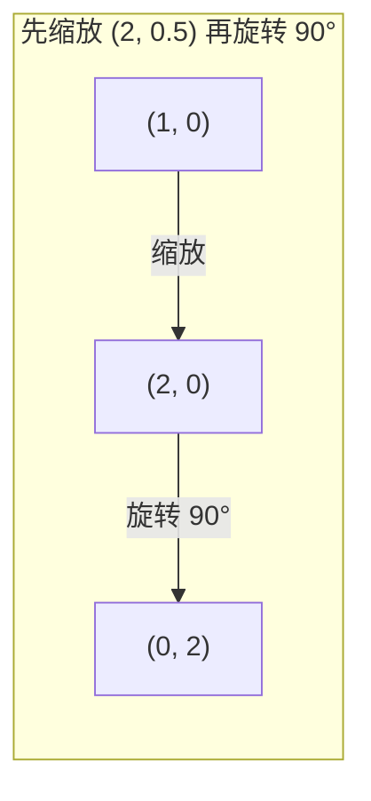

# 矩阵变换

> 矩阵是一台重塑空间的机器。理解它对每个点做了什么，你就理解了整个变换。

**类型：** 动手构建
**编程语言：** Python, Julia
**前置知识：** 第 1 阶段，第 01-02 课（线性代数直觉、向量与矩阵运算）
**时长：** 约 75 分钟

## 学习目标

- 构造旋转、缩放、剪切和反射矩阵，并将其应用于二维和三维点
- 通过矩阵乘法组合多个变换，并验证运算顺序的影响
- 利用特征方程（Characteristic Equation）计算 2x2 矩阵的特征值和特征向量
- 解释为什么特征值决定了 PCA 的方向、RNN 的稳定性以及谱聚类的行为

## 问题背景

你在读 PCA 的资料时看到"求协方差矩阵的特征向量"。你在读模型稳定性分析时看到"检查所有特征值的模是否小于 1"。你在读数据增强时看到"施加一个随机旋转"。如果不理解矩阵在几何上对空间做了什么，这一切都无从谈起。

矩阵不只是一堆数字排列成的网格，它们是空间变换的机器。旋转矩阵让点旋转，缩放矩阵拉伸或压缩点，剪切矩阵使点倾斜。神经网络对数据施加的每一个变换，都是这些操作或其组合。本课将这些操作变得具体可感。

## 核心概念

### 变换即矩阵

二维空间中的每一个线性变换（Linear Transformation）都可以写成一个 2x2 矩阵。矩阵告诉你基向量 [1, 0] 和 [0, 1] 最终到了哪里，其他所有的点都随之确定。



### 旋转

二维旋转角度为 theta 时，距离和角度保持不变。每个点沿圆弧移动。



在三维空间中，旋转是绕某个轴进行的。每个轴有各自的旋转矩阵：

```
Rz(theta) = | cos  -sin  0 |     绕 z 轴旋转
            | sin   cos  0 |     （x-y 平面旋转，z 不变）
            |  0     0   1 |

Rx(theta) = | 1   0     0    |   绕 x 轴旋转
            | 0  cos  -sin   |   （y-z 平面旋转，x 不变）
            | 0  sin   cos   |

Ry(theta) = |  cos  0  sin |     绕 y 轴旋转
            |   0   1   0  |     （x-z 平面旋转，y 不变）
            | -sin  0  cos |
```

### 缩放

缩放沿每个轴独立地拉伸或压缩。



### 剪切

剪切（Shearing）使一个轴倾斜，同时保持另一个轴不变。它把矩形变成平行四边形。



剪切矩阵：
- `Shx = [[1, k], [0, 1]]` 将 x 偏移 k * y
- `Shy = [[1, 0], [k, 1]]` 将 y 偏移 k * x

### 反射

反射将点关于某个轴或直线做镜像翻转。



反射矩阵：
- 关于 y 轴反射：`[[-1, 0], [0, 1]]`
- 关于 x 轴反射：`[[1, 0], [0, -1]]`

### 组合：链式变换

先施加变换 A 再施加变换 B，等价于将它们的矩阵相乘：`result = B @ A @ point`。顺序很重要——先旋转再缩放和先缩放再旋转的结果不同。



组合矩阵：`S @ R = [[0, -2], [0.5, 0]]`



组合矩阵：`R @ S = [[0, -0.5], [2, 0]]`

结果不同。矩阵乘法不满足交换律。

### 特征值与特征向量

大多数向量被矩阵作用后会改变方向。特征向量（Eigenvector）是特殊的：矩阵只对其做缩放，而不改变方向。缩放因子就是特征值（Eigenvalue）。

```
A @ v = lambda * v

v 是特征向量（方向保持不变）
lambda 是特征值（拉伸倍数）

示例：A = | 2  1 |
          | 1  2 |

特征向量 [1, 1]，特征值为 3：
  A @ [1,1] = [3, 3] = 3 * [1, 1]     （方向不变，缩放 3 倍）

特征向量 [1, -1]，特征值为 1：
  A @ [1,-1] = [1, -1] = 1 * [1, -1]  （方向不变，大小不变）
```

矩阵沿 [1, 1] 方向将空间拉伸 3 倍，而 [1, -1] 方向保持不变。所有其他方向都是这两个方向的混合。

### 特征分解

如果一个矩阵有 n 个线性无关的特征向量，它可以被分解为：

```
A = V @ D @ V^(-1)

V = 列为特征向量的矩阵
D = 特征值构成的对角矩阵
V^(-1) = V 的逆矩阵

含义：先旋转到特征向量坐标系，沿各轴缩放，再旋转回来。
```

### 特征值为什么重要

**PCA。** 协方差矩阵的特征向量就是主成分。特征值表示每个主成分捕获的方差大小。按特征值排序，保留前 k 个，就实现了降维。

**稳定性。** 在循环神经网络和动力系统中，模大于 1 的特征值会导致输出爆炸，模小于 1 的特征值会导致输出消失。这就是梯度消失/梯度爆炸问题的一句话概括。

**谱方法。** 图神经网络使用邻接矩阵的特征值。谱聚类使用拉普拉斯矩阵的特征值。特征向量揭示了图的结构。

### 行列式作为面积/体积缩放因子

变换矩阵的行列式（Determinant）告诉你它将面积（二维）或体积（三维）缩放了多少倍。

```
det = 1：   面积不变（旋转）
det = 2：   面积翻倍
det = 0：   空间被压缩到更低的维度（奇异矩阵）
det = -1：  面积不变但方向翻转（反射）

| det(旋转) | = 1          （恒等）
| det(缩放 sx, sy) | = sx * sy
| det(剪切) | = 1           （面积不变）
| det(反射) | = -1          （方向翻转）
```

## 动手构建

### 第 1 步：从零实现变换矩阵（Python）

```python
import math

def rotation_2d(theta):
    c, s = math.cos(theta), math.sin(theta)
    return [[c, -s], [s, c]]

def scaling_2d(sx, sy):
    return [[sx, 0], [0, sy]]

def shearing_2d(kx, ky):
    return [[1, kx], [ky, 1]]

def reflection_x():
    return [[1, 0], [0, -1]]

def reflection_y():
    return [[-1, 0], [0, 1]]

def mat_vec_mul(matrix, vector):
    return [
        sum(matrix[i][j] * vector[j] for j in range(len(vector)))
        for i in range(len(matrix))
    ]

def mat_mul(a, b):
    rows_a, cols_b = len(a), len(b[0])
    cols_a = len(a[0])
    return [
        [sum(a[i][k] * b[k][j] for k in range(cols_a)) for j in range(cols_b)]
        for i in range(rows_a)
    ]

point = [1.0, 0.0]
angle = math.pi / 4

rotated = mat_vec_mul(rotation_2d(angle), point)
print(f"Rotate (1,0) by 45 deg: ({rotated[0]:.4f}, {rotated[1]:.4f})")

scaled = mat_vec_mul(scaling_2d(2, 3), [1.0, 1.0])
print(f"Scale (1,1) by (2,3): ({scaled[0]:.1f}, {scaled[1]:.1f})")

sheared = mat_vec_mul(shearing_2d(1, 0), [1.0, 1.0])
print(f"Shear (1,1) kx=1: ({sheared[0]:.1f}, {sheared[1]:.1f})")

reflected = mat_vec_mul(reflection_y(), [2.0, 1.0])
print(f"Reflect (2,1) across y: ({reflected[0]:.1f}, {reflected[1]:.1f})")
```

### 第 2 步：变换的组合

```python
R = rotation_2d(math.pi / 2)
S = scaling_2d(2, 0.5)

rotate_then_scale = mat_mul(S, R)
scale_then_rotate = mat_mul(R, S)

point = [1.0, 0.0]
result1 = mat_vec_mul(rotate_then_scale, point)
result2 = mat_vec_mul(scale_then_rotate, point)

print(f"Rotate 90 then scale: ({result1[0]:.2f}, {result1[1]:.2f})")
print(f"Scale then rotate 90: ({result2[0]:.2f}, {result2[1]:.2f})")
print(f"Same? {result1 == result2}")
```

### 第 3 步：从零计算特征值（2x2 矩阵）

对于 2x2 矩阵 `[[a, b], [c, d]]`，特征值满足特征方程：`lambda^2 - (a+d)*lambda + (ad - bc) = 0`。

```python
def eigenvalues_2x2(matrix):
    a, b = matrix[0]
    c, d = matrix[1]
    trace = a + d
    det = a * d - b * c
    discriminant = trace ** 2 - 4 * det
    if discriminant < 0:
        real = trace / 2
        imag = (-discriminant) ** 0.5 / 2
        return (complex(real, imag), complex(real, -imag))
    sqrt_disc = discriminant ** 0.5
    return ((trace + sqrt_disc) / 2, (trace - sqrt_disc) / 2)

def eigenvector_2x2(matrix, eigenvalue):
    a, b = matrix[0]
    c, d = matrix[1]
    if abs(b) > 1e-10:
        v = [b, eigenvalue - a]
    elif abs(c) > 1e-10:
        v = [eigenvalue - d, c]
    else:
        if abs(a - eigenvalue) < 1e-10:
            v = [1, 0]
        else:
            v = [0, 1]
    mag = (v[0] ** 2 + v[1] ** 2) ** 0.5
    return [v[0] / mag, v[1] / mag]

A = [[2, 1], [1, 2]]
vals = eigenvalues_2x2(A)
print(f"Matrix: {A}")
print(f"Eigenvalues: {vals[0]:.4f}, {vals[1]:.4f}")

for val in vals:
    vec = eigenvector_2x2(A, val)
    result = mat_vec_mul(A, vec)
    scaled = [val * vec[0], val * vec[1]]
    print(f"  lambda={val:.1f}, v={[round(x,4) for x in vec]}")
    print(f"    A@v = {[round(x,4) for x in result]}")
    print(f"    l*v = {[round(x,4) for x in scaled]}")
```

### 第 4 步：行列式作为面积缩放因子

```python
def det_2x2(matrix):
    return matrix[0][0] * matrix[1][1] - matrix[0][1] * matrix[1][0]

print(f"det(rotation 45) = {det_2x2(rotation_2d(math.pi/4)):.4f}")
print(f"det(scale 2,3)   = {det_2x2(scaling_2d(2, 3)):.1f}")
print(f"det(shear kx=1)  = {det_2x2(shearing_2d(1, 0)):.1f}")
print(f"det(reflect y)   = {det_2x2(reflection_y()):.1f}")

singular = [[1, 2], [2, 4]]
print(f"det(singular)     = {det_2x2(singular):.1f}")
print("Singular: columns are proportional, space collapses to a line.")
```

## 实际应用

NumPy 通过优化的底层实现来完成上述所有操作。

```python
import numpy as np

theta = np.pi / 4
R = np.array([[np.cos(theta), -np.sin(theta)],
              [np.sin(theta),  np.cos(theta)]])

point = np.array([1.0, 0.0])
print(f"Rotate (1,0) by 45 deg: {R @ point}")

S = np.diag([2.0, 3.0])
composed = S @ R
print(f"Scale(2,3) after Rotate(45): {composed @ point}")

A = np.array([[2, 1], [1, 2]], dtype=float)
eigenvalues, eigenvectors = np.linalg.eig(A)
print(f"\nEigenvalues: {eigenvalues}")
print(f"Eigenvectors (columns):\n{eigenvectors}")

for i in range(len(eigenvalues)):
    v = eigenvectors[:, i]
    lam = eigenvalues[i]
    print(f"  A @ v{i} = {A @ v}, lambda * v{i} = {lam * v}")

print(f"\ndet(R) = {np.linalg.det(R):.4f}")
print(f"det(S) = {np.linalg.det(S):.1f}")

B = np.array([[3, 1], [0, 2]], dtype=float)
vals, vecs = np.linalg.eig(B)
D = np.diag(vals)
V = vecs
reconstructed = V @ D @ np.linalg.inv(V)
print(f"\nEigendecomposition A = V @ D @ V^-1:")
print(f"Original:\n{B}")
print(f"Reconstructed:\n{reconstructed}")
```

### 使用 NumPy 进行三维旋转

```python
def rotation_3d_z(theta):
    c, s = np.cos(theta), np.sin(theta)
    return np.array([[c, -s, 0], [s, c, 0], [0, 0, 1]])

def rotation_3d_x(theta):
    c, s = np.cos(theta), np.sin(theta)
    return np.array([[1, 0, 0], [0, c, -s], [0, s, c]])

point_3d = np.array([1.0, 0.0, 0.0])
rotated_z = rotation_3d_z(np.pi / 2) @ point_3d
rotated_x = rotation_3d_x(np.pi / 2) @ point_3d

print(f"\n3D point: {point_3d}")
print(f"Rotate 90 around z: {np.round(rotated_z, 4)}")
print(f"Rotate 90 around x: {np.round(rotated_x, 4)}")
```

## 交付成果

本课构建了 PCA（第 2 阶段）和神经网络权重分析的几何基础。这里实现的特征值/特征向量算法，与生产环境中机器学习系统的降维、谱聚类和稳定性分析所使用的算法完全一致。

## 练习

1. 将旋转、缩放和剪切分别应用到单位正方形（顶点为 [0,0]、[1,0]、[1,1]、[0,1]）。打印每种变换后的顶点坐标。验证旋转是否保持了顶点之间的距离。

2. 手动使用特征方程求矩阵 [[4, 2], [1, 3]] 的特征值。然后用你从零实现的函数和 NumPy 分别验证。

3. 创建由三个变换组成的复合变换（旋转 30 度，缩放 [1.5, 0.8]，剪切 kx=0.3），并将其应用到圆上均匀分布的 8 个点。打印变换前后的坐标。计算组合矩阵的行列式，验证它等于各个变换行列式的乘积。

## 关键术语

| 术语 | 通俗说法 | 准确含义 |
|------|---------|---------|
| 旋转矩阵 | "转一转" | 一个正交矩阵，沿圆弧移动点，同时保持距离和角度不变。行列式恒为 1。 |
| 缩放矩阵 | "放大缩小" | 一个对角矩阵，沿各轴独立地拉伸或压缩。行列式等于各缩放因子的乘积。 |
| 剪切矩阵 | "倾斜变形" | 将一个坐标按另一个坐标的比例偏移的矩阵，把矩形变成平行四边形。行列式为 1。 |
| 反射 | "镜像翻转" | 将空间关于某个轴或平面翻转的矩阵。行列式为 -1。 |
| 组合 | "连续做两件事" | 将变换矩阵相乘以链式组合操作。顺序很重要：B @ A 表示先做 A，再做 B。 |
| 特征向量 | "特殊方向" | 矩阵只对其缩放而不旋转的方向。是变换的"指纹"。 |
| 特征值 | "拉伸多少倍" | 矩阵对其特征向量的缩放系数。可以是负数（翻转）或复数（旋转）。 |
| 特征分解 | "把矩阵拆开" | 将矩阵写成 V @ D @ V^(-1) 的形式，分离出基本的缩放方向和缩放大小。 |
| 行列式 | "矩阵的一个数" | 变换对面积（二维）或体积（三维）的缩放因子。为零意味着变换不可逆。 |
| 特征方程 | "特征值从哪来" | det(A - lambda * I) = 0。其根就是特征值的多项式方程。 |

## 延伸阅读

- [3Blue1Brown: Linear Transformations](https://www.3blue1brown.com/lessons/linear-transformations) -- 关于矩阵如何重塑空间的可视化直觉
- [3Blue1Brown: Eigenvectors and Eigenvalues](https://www.3blue1brown.com/lessons/eigenvalues) -- 特征向量几何含义的最佳可视化讲解
- [MIT 18.06 Lecture 21: Eigenvalues and Eigenvectors](https://ocw.mit.edu/courses/18-06-linear-algebra-spring-2010/) -- Gilbert Strang 的经典讲解
