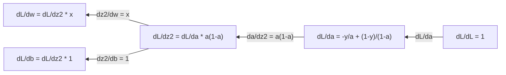
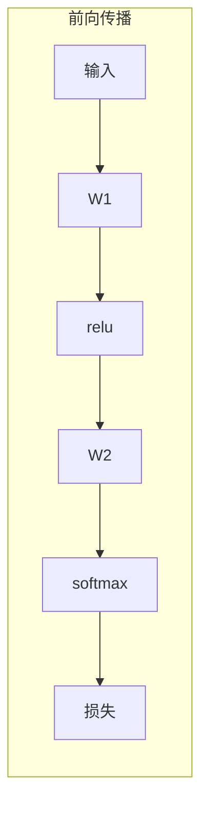
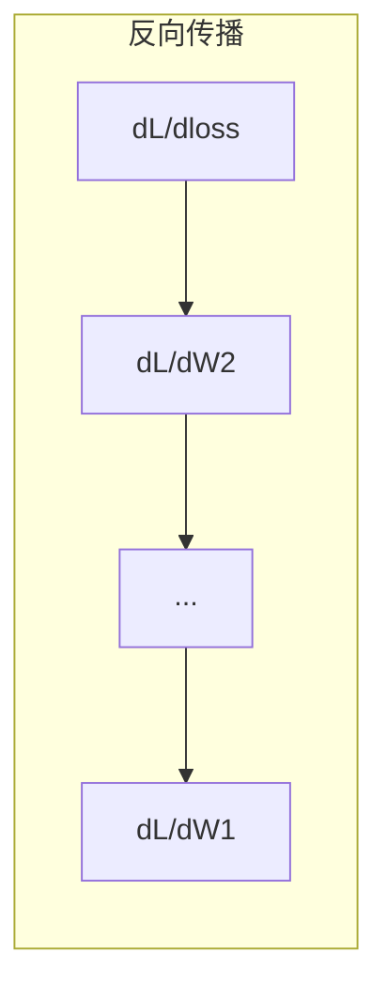

# 机器学习中的微积分

> 导数告诉你哪个方向是下坡。这就是神经网络学习所需要的全部。

**类型：** 学习理解
**编程语言：** Python
**前置知识：** 第 1 阶段，第 01-03 课
**时长：** 约 60 分钟

## 学习目标

- 对常见的机器学习函数（x^2、sigmoid、交叉熵）计算数值导数和解析导数
- 从零实现梯度下降，在一维和二维空间中最小化损失函数
- 推导线性回归模型的梯度，并通过手动更新权重进行训练
- 解释 Hessian 矩阵、Taylor 级数近似及其与优化方法的关系

## 问题背景

你有一个包含数百万权重的神经网络。每个权重就像一个旋钮。你需要弄清楚每个旋钮该往哪个方向转，才能让模型的错误稍微减少一点。微积分给你的就是这个方向。

没有微积分，训练神经网络就意味着随机尝试各种改变，然后祈祷结果变好。有了导数（Derivative），你就能确切地知道每个权重如何影响误差。你每次都能把每个旋钮转向正确的方向。

## 核心概念

### 什么是导数？

导数衡量变化率。对于函数 y = f(x)，导数 f'(x) 告诉你：如果把 x 微微挪动一点，y 会变化多少？

从几何角度看，导数就是某一点处切线的斜率。

**f(x) = x^2：**

| x | f(x) | f'(x)（斜率） |
|---|------|---------------|
| 0 | 0    | 0（水平，位于底部） |
| 1 | 1    | 2 |
| 2 | 4    | 4（该点处切线的斜率） |
| 3 | 9    | 6 |

在 x=2 处，斜率为 4。如果把 x 向右微移一点，y 大约增加该移动量的 4 倍。在 x=0 处，斜率为 0，说明你已经在碗底了。

形式化定义：

```
f'(x) = lim   f(x + h) - f(x)
        h->0  -----------------
                     h
```

在代码中，我们跳过取极限的步骤，直接使用一个非常小的 h，这就是数值导数。

### 偏导数：一次只看一个变量

真实的函数有很多输入。神经网络的损失函数取决于成千上万个权重。偏导数（Partial Derivative）固定所有其他变量不动，只对其中一个变量求导。

```
f(x, y) = x^2 + 3xy + y^2

df/dx = 2x + 3y     （将 y 视为常数）
df/dy = 3x + 2y     （将 x 视为常数）
```

每个偏导数回答的问题是：如果我只微调这一个权重，损失函数会怎么变？

### 梯度：所有偏导数组成的向量

梯度（Gradient）将所有偏导数收集到一个向量中。对于函数 f(x, y, z)，梯度为：

```
grad f = [ df/dx, df/dy, df/dz ]
```

梯度指向函数增长最快的方向。要最小化一个函数，就朝相反方向走。

**f(x,y) = x^2 + y^2 的等高线图：**

该函数呈碗状，等高线为同心圆，最小值在 (0, 0)。

| 点 | grad f | -grad f（下降方向） |
|-------|--------|----------------------------|
| (1, 1) | [2, 2]（指向上坡，远离最小值） | [-2, -2]（指向下坡，朝向最小值） |
| (0, 0) | [0, 0]（水平，位于最小值） | [0, 0] |

这就是梯度下降的图示：计算梯度，取反，迈一步。

### 与优化的关系

训练神经网络就是做优化。你有一个损失函数 L(w1, w2, ..., wn) 衡量模型的错误程度，你要把它最小化。

```
梯度下降更新规则：

  w_new = w_old - learning_rate * dL/dw

对每个权重：
  1. 计算损失函数对该权重的偏导数
  2. 从该权重中减去偏导数的一个小倍数
  3. 重复
```

学习率（Learning Rate）控制步长。太大会越过最优点，太小则收敛缓慢。

**损失曲面（一维切面）：**

损失函数 L(w) 随权重 w 的变化形成有峰有谷的曲线。

| 特征 | 说明 |
|---------|-------------|
| 全局最小值 | 整条曲线上的最低点——最优解 |
| 局部最小值 | 比邻域低但不是全局最低的谷 |
| 斜率 | 梯度下降从任意起点沿着斜率向下走 |

梯度下降沿斜率方向下山。它可能卡在局部最小值中，但在高维空间（数百万权重）中这很少成为实际问题。

### 数值导数 vs 解析导数

计算导数有两种方式。

解析法：手动应用微积分规则。对于 f(x) = x^2，导数为 f'(x) = 2x。精确且快速。

数值法：利用定义来近似。对一个很小的 h，计算 f(x+h) 和 f(x-h)，然后取差值。

```
数值法（中心差分）：

f'(x) ~= f(x + h) - f(x - h)
          -----------------------
                  2h

h = 0.0001 在实际中效果很好
```

数值导数更慢，但对任何函数都适用。解析导数更快，但需要你手动推导公式。神经网络框架使用第三种方式：自动微分（Automatic Differentiation），它能机械地计算精确导数。你将在第 3 阶段看到这一技术。

### 常见函数的手算导数

这些是你在机器学习中反复会见到的导数。

```
函数              导数                  应用场景
--------          ----------           -------
f(x) = x^2       f'(x) = 2x           损失函数（MSE）
f(x) = wx + b    f'(w) = x            线性层（对权重求导）
                  f'(b) = 1            线性层（对偏置求导）
                  f'(x) = w            线性层（对输入求导）
f(x) = e^x       f'(x) = e^x          Softmax、注意力机制
f(x) = ln(x)     f'(x) = 1/x          交叉熵损失
f(x) = 1/(1+e^-x)  f'(x) = f(x)(1-f(x))   Sigmoid 激活函数
```

对于 f(x) = x^2：

```
f(x) = x^2    f'(x) = 2x

  x    f(x)   f'(x)   含义
  -2    4      -4      斜率向左倾斜（递减）
  -1    1      -2      斜率向左倾斜（递减）
   0    0       0      水平（极小值！）
   1    1       2      斜率向右倾斜（递增）
   2    4       4      斜率向右倾斜（递增）
```

对于 f(w) = wx + b，其中 x=3, b=1：

```
f(w) = 3w + 1    f'(w) = 3

对 w 的导数就是 x。
如果 x 很大，w 的微小变化就会导致输出的大变化。
```

### 链式法则

当函数嵌套组合时，链式法则（Chain Rule）告诉你如何求导。

```
若 y = f(g(x))，则 dy/dx = f'(g(x)) * g'(x)

示例：y = (3x + 1)^2
  外层：f(u) = u^2       f'(u) = 2u
  内层：g(x) = 3x + 1    g'(x) = 3
  dy/dx = 2(3x + 1) * 3 = 6(3x + 1)
```

神经网络就是一连串函数的嵌套：输入 -> 线性层 -> 激活函数 -> 线性层 -> 激活函数 -> 损失。反向传播（Backpropagation）就是从输出到输入反复应用链式法则。这就是算法的全部。

### Hessian 矩阵

梯度告诉你斜率，Hessian 矩阵告诉你曲率。

Hessian 是二阶偏导数组成的矩阵。对于函数 f(x1, x2, ..., xn)，Hessian 的第 (i, j) 个元素为：

```
H[i][j] = d^2f / (dx_i * dx_j)
```

对于二元函数 f(x, y)：

```
H = | d^2f/dx^2    d^2f/dxdy |
    | d^2f/dydx    d^2f/dy^2 |
```

**Hessian 在临界点（梯度为零处）告诉你什么：**

| Hessian 性质 | 含义 | 曲面形状 |
|-----------------|---------|-----------------|
| 正定（所有特征值 > 0） | 局部最小值 | 碗口朝上 |
| 负定（所有特征值 < 0） | 局部最大值 | 碗口朝下 |
| 不定（特征值正负混合） | 鞍点 | 马鞍形 |

**示例：** f(x, y) = x^2 - y^2（一个鞍面函数）

```
df/dx = 2x       df/dy = -2y
d^2f/dx^2 = 2    d^2f/dy^2 = -2    d^2f/dxdy = 0

H = | 2   0 |
    | 0  -2 |

特征值：2 和 -2（一正一负）
--> (0, 0) 处为鞍点
```

与 f(x, y) = x^2 + y^2（一个碗形函数）对比：

```
H = | 2  0 |
    | 0  2 |

特征值：2 和 2（都是正数）
--> (0, 0) 处为局部最小值
```

**Hessian 在机器学习中为什么重要：**

牛顿法（Newton's Method）利用 Hessian 来做出比梯度下降更好的优化步骤。它不只是跟着斜率走，还考虑了曲率：

```
牛顿法更新：    w_new = w_old - H^(-1) * gradient
梯度下降：      w_new = w_old - lr * gradient
```

牛顿法收敛更快，因为 Hessian "重新缩放"了梯度——陡峭方向上步子更小，平坦方向上步子更大。

问题在于：对于有 N 个参数的神经网络，Hessian 是 N x N 的。一个有 100 万参数的模型需要一个万亿级元素的矩阵。所以实际中我们使用近似方法。

| 方法 | 使用的信息 | 代价 | 收敛速度 |
|--------|-------------|------|-------------|
| 梯度下降 | 仅一阶导数 | 每步 O(N) | 慢（线性） |
| 牛顿法 | 完整 Hessian | 每步 O(N^3) | 快（二次） |
| L-BFGS | 用梯度历史近似 Hessian | 每步 O(N) | 中等（超线性） |
| Adam | 逐参数自适应速率（对角 Hessian 近似） | 每步 O(N) | 中等 |
| 自然梯度 | Fisher 信息矩阵（统计意义上的 Hessian） | 每步 O(N^2) | 快 |

在实践中，Adam 是深度学习的默认优化器。它通过跟踪每个参数梯度的运行均值和方差来廉价地近似二阶信息。

### Taylor 级数近似

任何光滑函数都可以在局部用多项式来近似：

```
f(x + h) = f(x) + f'(x)*h + (1/2)*f''(x)*h^2 + (1/6)*f'''(x)*h^3 + ...
```

包含的项越多，近似越精确——但仅在 x 点附近有效。

**Taylor 级数对机器学习为什么重要：**

- **一阶 Taylor = 梯度下降。** 当你使用 f(x + h) ~ f(x) + f'(x)*h 时，你做的是线性近似。梯度下降通过最小化这个线性模型来选择 h = -lr * f'(x)。

- **二阶 Taylor = 牛顿法。** 使用 f(x + h) ~ f(x) + f'(x)*h + (1/2)*f''(x)*h^2，你得到一个二次模型。最小化它得到 h = -f'(x)/f''(x)——即牛顿步。

- **损失函数设计。** MSE 和交叉熵都是光滑的，这意味着它们的 Taylor 展开表现良好。这不是巧合——光滑的损失函数使优化过程可预测。

```
近似阶数               捕获的信息         对应优化方法
-------------------    -----------------   -------------------
第 0 阶（常数）         仅函数值            随机搜索
第 1 阶（线性）         斜率                梯度下降
第 2 阶（二次）         曲率                牛顿法
更高阶                  更精细的结构         在机器学习中很少使用
```

关键洞见：所有基于梯度的优化，本质上都是在局部近似损失函数，然后走向该近似的极小值。

### 积分在机器学习中的应用

导数衡量变化率，积分（Integral）计算累积量——曲线下的面积。

在机器学习中，你很少手算积分，但这个概念无处不在：

**概率。** 对于具有密度函数 p(x) 的连续随机变量：
```
P(a < X < b) = integral from a to b of p(x) dx
```
概率密度曲线在 a 到 b 之间的面积就是落在该区间的概率。

**期望值。** 以概率为权重的平均结果：
```
E[f(X)] = integral of f(x) * p(x) dx
```
数据分布上的期望损失就是一个积分。训练过程最小化的是它的经验近似。

**KL 散度。** 衡量两个分布的差异程度：
```
KL(p || q) = integral of p(x) * log(p(x) / q(x)) dx
```
用于 VAE、知识蒸馏和贝叶斯推断。

**归一化常数。** 在贝叶斯推断中：
```
p(w | data) = p(data | w) * p(w) / integral of p(data | w) * p(w) dw
```
分母是对所有可能参数值的积分。它往往不可解析求解，这就是为什么我们使用 MCMC 和变分推断等近似方法。

| 积分概念 | 在机器学习中的出现场景 |
|-----------------|----------------------|
| 曲线下面积 | 从密度函数得到概率 |
| 期望值 | 损失函数、风险最小化 |
| KL 散度 | VAE、策略优化、知识蒸馏 |
| 归一化 | 贝叶斯后验、Softmax 分母 |
| 边际似然 | 模型比较、证据下界（ELBO） |

### 计算图中的多变量链式法则

链式法则不仅适用于一串标量函数。在神经网络中，变量会分叉和汇合。以下是导数如何在一个简单前向传播中流动的示意：


反向传播从右向左计算梯度：



每条箭头乘以局部导数。任何参数的梯度就是从损失到该参数路径上所有局部导数的乘积。当路径分叉和汇合时，需要将各路径的贡献求和（多变量链式法则）。

这就是反向传播的全部：在计算图中从输出到输入系统地应用链式法则。

### Jacobian 矩阵

当函数将向量映射到向量（比如神经网络的一层）时，它的导数是一个矩阵。Jacobian 矩阵包含每个输出对每个输入的所有偏导数。

对于 f: R^n -> R^m，Jacobian J 是一个 m x n 矩阵：

| | x1 | x2 | ... | xn |
|---|---|---|---|---|
| f1 | df1/dx1 | df1/dx2 | ... | df1/dxn |
| f2 | df2/dx1 | df2/dx2 | ... | df2/dxn |
| ... | ... | ... | ... | ... |
| fm | dfm/dx1 | dfm/dx2 | ... | dfm/dxn |

你不会为神经网络手算 Jacobian。PyTorch 会自动处理。但了解它的存在有助于理解反向传播中的形状：如果一层将 R^n 映射到 R^m，它的 Jacobian 就是 m x n 的。梯度通过该矩阵的转置向后传播。

### 这对神经网络为什么重要

神经网络中的每个权重都会得到一个梯度。梯度告诉你如何调整该权重来减小损失。





每次权重更新：
- `W1 = W1 - lr * dL/dW1`
- `W2 = W2 - lr * dL/dW2`

前向传播计算预测和损失。反向传播计算损失对每个权重的梯度。然后每个权重朝下坡方向迈一小步。重复数百万步。这就是深度学习。

## 动手构建

### 第 1 步：从零实现数值导数

```python
def numerical_derivative(f, x, h=1e-7):
    return (f(x + h) - f(x - h)) / (2 * h)

def f(x):
    return x ** 2

for x in [-2, -1, 0, 1, 2]:
    numerical = numerical_derivative(f, x)
    analytical = 2 * x
    print(f"x={x:2d}  f'(x) numerical={numerical:.6f}  analytical={analytical:.1f}")
```

数值导数与解析导数在多位小数上精确吻合。

### 第 2 步：偏导数与梯度

```python
def numerical_gradient(f, point, h=1e-7):
    gradient = []
    for i in range(len(point)):
        point_plus = list(point)
        point_minus = list(point)
        point_plus[i] += h
        point_minus[i] -= h
        partial = (f(point_plus) - f(point_minus)) / (2 * h)
        gradient.append(partial)
    return gradient

def f_multi(point):
    x, y = point
    return x**2 + 3*x*y + y**2

grad = numerical_gradient(f_multi, [1.0, 2.0])
print(f"Numerical gradient at (1,2): {[f'{g:.4f}' for g in grad]}")
print(f"Analytical gradient at (1,2): [2*1+3*2, 3*1+2*2] = [{2*1+3*2}, {3*1+2*2}]")
```

### 第 3 步：用梯度下降找 f(x) = x^2 的最小值

```python
x = 5.0
lr = 0.1
for step in range(20):
    grad = 2 * x
    x = x - lr * grad
    print(f"step {step:2d}  x={x:8.4f}  f(x)={x**2:10.6f}")
```

从 x=5 出发，每一步都更接近 x=0（最小值）。

### 第 4 步：二维函数上的梯度下降

```python
def f_2d(point):
    x, y = point
    return x**2 + y**2

point = [4.0, 3.0]
lr = 0.1
for step in range(30):
    grad = numerical_gradient(f_2d, point)
    point = [p - lr * g for p, g in zip(point, grad)]
    loss = f_2d(point)
    if step % 5 == 0 or step == 29:
        print(f"step {step:2d}  point=({point[0]:7.4f}, {point[1]:7.4f})  f={loss:.6f}")
```

### 第 5 步：比较数值导数和解析导数

```python
import math

test_functions = [
    ("x^2",      lambda x: x**2,          lambda x: 2*x),
    ("x^3",      lambda x: x**3,          lambda x: 3*x**2),
    ("sin(x)",   lambda x: math.sin(x),   lambda x: math.cos(x)),
    ("e^x",      lambda x: math.exp(x),   lambda x: math.exp(x)),
    ("1/x",      lambda x: 1/x,           lambda x: -1/x**2),
]

x = 2.0
print(f"{'Function':<12} {'Numerical':>12} {'Analytical':>12} {'Error':>12}")
print("-" * 50)
for name, f, df in test_functions:
    num = numerical_derivative(f, x)
    ana = df(x)
    err = abs(num - ana)
    print(f"{name:<12} {num:12.6f} {ana:12.6f} {err:12.2e}")
```

### 第 6 步：数值计算 Hessian 矩阵

```python
def hessian_2d(f, x, y, h=1e-5):
    fxx = (f(x + h, y) - 2 * f(x, y) + f(x - h, y)) / (h ** 2)
    fyy = (f(x, y + h) - 2 * f(x, y) + f(x, y - h)) / (h ** 2)
    fxy = (f(x + h, y + h) - f(x + h, y - h) - f(x - h, y + h) + f(x - h, y - h)) / (4 * h ** 2)
    return [[fxx, fxy], [fxy, fyy]]

def saddle(x, y):
    return x ** 2 - y ** 2

def bowl(x, y):
    return x ** 2 + y ** 2

H_saddle = hessian_2d(saddle, 0.0, 0.0)
H_bowl = hessian_2d(bowl, 0.0, 0.0)
print(f"Saddle Hessian: {H_saddle}")  # [[2, 0], [0, -2]] -- 正负混合
print(f"Bowl Hessian:   {H_bowl}")    # [[2, 0], [0, 2]]  -- 都是正数
```

鞍面函数的 Hessian 特征值为 2 和 -2（正负混合，确认为鞍点）。碗形函数的特征值为 2 和 2（都是正数，确认为最小值点）。

### 第 7 步：Taylor 近似实战

```python
import math

def taylor_approx(f, f_prime, f_double_prime, x0, h, order=2):
    result = f(x0)
    if order >= 1:
        result += f_prime(x0) * h
    if order >= 2:
        result += 0.5 * f_double_prime(x0) * h ** 2
    return result

x0 = 0.0
for h in [0.1, 0.5, 1.0, 2.0]:
    true_val = math.sin(h)
    t1 = taylor_approx(math.sin, math.cos, lambda x: -math.sin(x), x0, h, order=1)
    t2 = taylor_approx(math.sin, math.cos, lambda x: -math.sin(x), x0, h, order=2)
    print(f"h={h:.1f}  sin(h)={true_val:.4f}  order1={t1:.4f}  order2={t2:.4f}")
```

在 x0=0 附近，sin(x) ~ x（一阶 Taylor）。当 h 较小时近似非常精确，但 h 较大时近似就会失效。这就是为什么梯度下降用小学习率效果最好——每一步都假设线性近似是准确的。

### 第 8 步：这对神经网络为什么重要

```python
import random

random.seed(42)

w = random.gauss(0, 1)
b = random.gauss(0, 1)
lr = 0.01

xs = [1.0, 2.0, 3.0, 4.0, 5.0]
ys = [3.0, 5.0, 7.0, 9.0, 11.0]

for epoch in range(200):
    total_loss = 0
    dw = 0
    db = 0
    for x, y in zip(xs, ys):
        pred = w * x + b
        error = pred - y
        total_loss += error ** 2
        dw += 2 * error * x
        db += 2 * error
    dw /= len(xs)
    db /= len(xs)
    total_loss /= len(xs)
    w -= lr * dw
    b -= lr * db
    if epoch % 40 == 0 or epoch == 199:
        print(f"epoch {epoch:3d}  w={w:.4f}  b={b:.4f}  loss={total_loss:.6f}")

print(f"\nLearned: y = {w:.2f}x + {b:.2f}")
print(f"Actual:  y = 2x + 1")
```

每个基于梯度的训练循环都遵循这个模式：预测、计算损失、计算梯度、更新权重。

## 实际应用

使用 NumPy，同样的操作更快更简洁：

```python
import numpy as np

x = np.array([1, 2, 3, 4, 5], dtype=float)
y = np.array([3, 5, 7, 9, 11], dtype=float)

w, b = np.random.randn(), np.random.randn()
lr = 0.01

for epoch in range(200):
    pred = w * x + b
    error = pred - y
    loss = np.mean(error ** 2)
    dw = np.mean(2 * error * x)
    db = np.mean(2 * error)
    w -= lr * dw
    b -= lr * db

print(f"Learned: y = {w:.2f}x + {b:.2f}")
```

你刚刚从零构建了梯度下降。PyTorch 自动化了梯度计算部分，但更新循环完全一样。

## 练习

1. 实现 `numerical_second_derivative(f, x)`，对 `numerical_derivative` 调用两次。验证 x^3 在 x=2 处的二阶导数为 12。
2. 用梯度下降找 f(x, y) = (x - 3)^2 + (y + 1)^2 的最小值。从 (0, 0) 出发，结果应收敛到 (3, -1)。
3. 为梯度下降循环添加动量：维护一个速度向量来累积过去的梯度。在 f(x) = x^4 - 3x^2 上比较有动量和无动量的收敛速度。

## 关键术语

| 术语 | 通俗说法 | 准确含义 |
|------|---------|---------|
| 导数 | "斜率" | 函数在某一点的变化率。告诉你输入每变化一个单位，输出变化多少。 |
| 偏导数 | "对一个变量的导数" | 固定其他所有变量不变，只对一个变量求的导数。 |
| 梯度 | "最陡上升方向" | 所有偏导数组成的向量。指向函数增长最快的方向。 |
| 梯度下降 | "往下坡走" | 从参数中减去梯度（乘以学习率）来减小损失。神经网络训练的核心。 |
| 学习率 | "步长" | 控制每步梯度下降步幅大小的标量。太大会发散，太小收敛慢。 |
| 链式法则 | "把导数相乘" | 对复合函数求导的法则：df/dx = df/dg * dg/dx。反向传播的数学基础。 |
| Jacobian 矩阵 | "导数矩阵" | 当函数将向量映射到向量时，Jacobian 是所有输出对所有输入的偏导数矩阵。 |
| 数值导数 | "有限差分" | 通过在两个相近点处求函数值并计算斜率来近似导数。 |
| 反向传播 | "反向自动微分" | 利用链式法则从输出到输入逐层计算梯度。神经网络的学习方式。 |
| Hessian 矩阵 | "二阶导数矩阵" | 所有二阶偏导数组成的矩阵。描述函数的曲率。临界点处 Hessian 正定意味着该点是局部最小值。 |
| Taylor 级数 | "多项式近似" | 利用导数在某点附近近似函数：f(x+h) ~ f(x) + f'(x)h + (1/2)f''(x)h^2 + ... 理解梯度下降和牛顿法为什么有效的基础。 |
| 积分 | "曲线下面积" | 某个量在一个范围内的累积。在机器学习中，积分定义概率、期望值和 KL 散度。 |

## 延伸阅读

- [3Blue1Brown: Essence of Calculus](https://www.3blue1brown.com/topics/calculus) - 导数、积分和链式法则的可视化直觉
- [Stanford CS231n: Backpropagation](https://cs231n.github.io/optimization-2/) - 梯度如何在神经网络各层中流动
