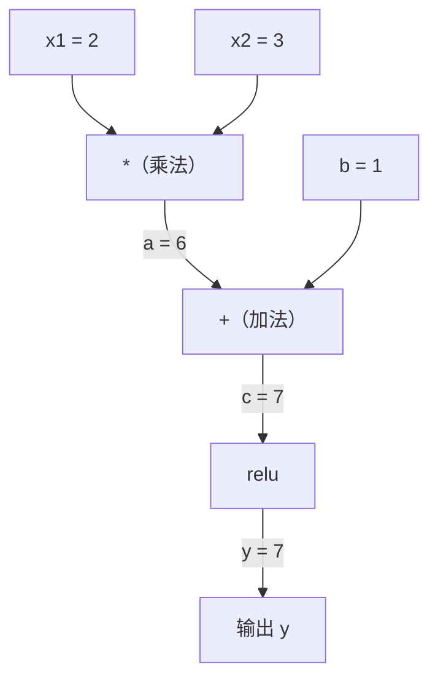
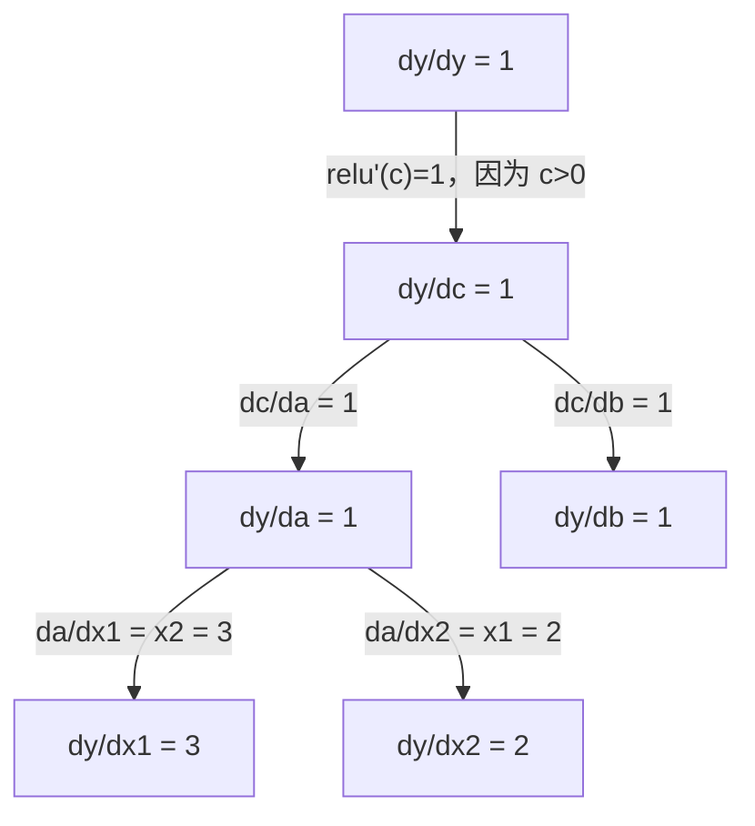

# 链式法则与自动微分

> 链式法则是每一个能够学习的神经网络背后的引擎。

**类型：** 构建
**语言：** Python
**前置课程：** 第 1 阶段，第 04 课（导数与梯度）
**时间：** 约 90 分钟

## 学习目标

- 构建一个最小化的自动求导引擎（Value 类），记录运算过程并通过反向模式自动微分（Reverse-mode Autodiff）计算梯度
- 使用拓扑排序实现计算图的前向传播和反向传播
- 仅使用从零构建的自动求导引擎，搭建并训练一个多层感知机来解决 XOR 问题
- 通过与数值有限差分法对比，使用梯度检验来验证自动微分的正确性

## 问题

你已经能够计算简单函数的导数。但神经网络不是简单函数——它是数百个函数的复合：矩阵乘法、加偏置、应用激活函数、再次矩阵乘法、softmax、交叉熵损失。输出是函数嵌套函数再嵌套函数的结果。

要训练网络，你需要计算损失函数对每一个权重的梯度。对于数百万个参数，手动计算是不可能的。用数值方法（有限差分法）又太慢。

链式法则（Chain Rule）提供了数学基础。自动微分（Automatic Differentiation）提供了算法。它们结合在一起，让你能够在与一次前向传播成正比的时间内，精确计算任意函数复合的梯度。

这就是 PyTorch、TensorFlow 和 JAX 的工作原理。你将从零构建一个微型版本。

## 概念

### 链式法则

如果 `y = f(g(x))`，`y` 对 `x` 的导数为：

```
dy/dx = dy/dg * dg/dx = f'(g(x)) * g'(x)
```

沿着链条逐个相乘。每一环都贡献其局部导数。

例子：`y = sin(x^2)`

```
g(x) = x^2       g'(x) = 2x
f(g) = sin(g)     f'(g) = cos(g)

dy/dx = cos(x^2) * 2x
```

对于更深层的复合，链条继续延伸：

```
y = f(g(h(x)))

dy/dx = f'(g(h(x))) * g'(h(x)) * h'(x)
```

神经网络中的每一层就是这条链中的一个环节。

### 计算图

计算图（Computational Graph）使链式法则可视化。每个运算变成一个节点。数据沿正向流过图。梯度沿反向流回。

**前向传播（计算数值）：**



**反向传播（计算梯度）：**



反向传播在每个节点应用链式法则，将梯度从输出传播到输入。

### 前向模式 vs 反向模式

有两种方式在图中应用链式法则。

**前向模式（Forward Mode）** 从输入出发，将导数向前推进。它计算 `dx/dx = 1` 并通过每个运算传播。适合输入少、输出多的情况。

```
前向模式：设置种子 dx/dx = 1，向前传播

  x = 2       (dx/dx = 1)
  a = x^2     (da/dx = 2x = 4)
  y = sin(a)  (dy/dx = cos(a) * da/dx = cos(4) * 4 = -2.615)
```

**反向模式（Reverse Mode）** 从输出出发，将梯度向后拉回。它计算 `dy/dy = 1` 并逆序通过每个运算传播。适合输入多、输出少的情况。

```
反向模式：设置种子 dy/dy = 1，向后传播

  y = sin(a)  (dy/dy = 1)
  a = x^2     (dy/da = cos(a) = cos(4) = -0.654)
  x = 2       (dy/dx = dy/da * da/dx = -0.654 * 4 = -2.615)
```

神经网络有数百万个输入（权重）和一个输出（损失）。反向模式只需一次反向传播就能计算所有梯度。这就是反向传播使用反向模式的原因。

| 模式 | 种子 | 方向 | 适用场景 |
|------|------|------|---------|
| 前向 | `dx_i/dx_i = 1` | 输入到输出 | 输入少、输出多 |
| 反向 | `dy/dy = 1` | 输出到输入 | 输入多、输出少（神经网络） |

### 对偶数与前向模式

前向模式可以用对偶数（Dual Numbers）优雅地实现。对偶数的形式为 `a + b*epsilon`，其中 `epsilon^2 = 0`。

```
对偶数：(值, 导数)

(2, 1) 表示：值为 2，对 x 的导数为 1

运算规则：
  (a, a') + (b, b') = (a+b, a'+b')
  (a, a') * (b, b') = (a*b, a'*b + a*b')
  sin(a, a')         = (sin(a), cos(a)*a')
```

将输入变量的导数设为 1。导数会自动通过每一步运算传播下去。

### 构建自动求导引擎

一个自动求导引擎需要三个要素：

1. **值封装。** 将每个数字包装在一个对象中，存储其值和梯度。
2. **图记录。** 每次运算记录其输入和局部梯度函数。
3. **反向传播。** 对图进行拓扑排序，然后逆序遍历，在每个节点应用链式法则。

这正是 PyTorch 的 `autograd` 所做的事情。`torch.Tensor` 类封装数值，在 `requires_grad=True` 时记录运算，调用 `.backward()` 时计算梯度。

### PyTorch Autograd 底层原理

当你编写 PyTorch 代码时：

```python
x = torch.tensor(2.0, requires_grad=True)
y = x ** 2 + 3 * x + 1
y.backward()
print(x.grad)  # 7.0 = 2*x + 3 = 2*2 + 3
```

PyTorch 在底层：

1. 创建一个 `requires_grad=True` 的 `Tensor` 节点 `x`
2. 每个运算（`**`、`*`、`+`）创建一个新节点并记录反向函数
3. `y.backward()` 触发反向模式自动微分，遍历已记录的计算图
4. 每个节点的 `grad_fn` 计算局部梯度，并传递给父节点
5. 梯度通过加法在 `.grad` 属性中累积（而非替换）

计算图是动态的（即时定义，define-by-run）。每次前向传播都会构建新的图。这就是为什么 PyTorch 能在模型中支持控制流（if/else、循环）。

## 构建它

### 第 1 步：Value 类

```python
class Value:
    def __init__(self, data, children=(), op=''):
        self.data = data
        self.grad = 0.0
        self._backward = lambda: None
        self._prev = set(children)
        self._op = op

    def __repr__(self):
        return f"Value(data={self.data:.4f}, grad={self.grad:.4f})"
```

每个 `Value` 存储其数值数据、梯度（初始为零）、反向传播函数，以及指向产生它的子节点的指针。

### 第 2 步：带梯度追踪的算术运算

```python
    def __add__(self, other):
        other = other if isinstance(other, Value) else Value(other)
        out = Value(self.data + other.data, (self, other), '+')
        def _backward():
            self.grad += out.grad
            other.grad += out.grad
        out._backward = _backward
        return out

    def __mul__(self, other):
        other = other if isinstance(other, Value) else Value(other)
        out = Value(self.data * other.data, (self, other), '*')
        def _backward():
            self.grad += other.data * out.grad
            other.grad += self.data * out.grad
        out._backward = _backward
        return out

    def relu(self):
        out = Value(max(0, self.data), (self,), 'relu')
        def _backward():
            self.grad += (1.0 if out.data > 0 else 0.0) * out.grad
        out._backward = _backward
        return out
```

每个运算创建一个闭包，这个闭包知道如何计算局部梯度，并乘以上游梯度（`out.grad`）。`+=` 处理了一个值被多个运算使用的情况。

### 第 3 步：反向传播

```python
    def backward(self):
        topo = []
        visited = set()
        def build_topo(v):
            if v not in visited:
                visited.add(v)
                for child in v._prev:
                    build_topo(child)
                topo.append(v)
        build_topo(self)

        self.grad = 1.0
        for v in reversed(topo):
            v._backward()
```

拓扑排序（Topological Sort）确保每个节点的梯度在传播给其子节点之前已经完全计算。种子梯度为 1.0（dy/dy = 1）。

### 第 4 步：更多运算以构建完整引擎

基本的 Value 类支持加法、乘法和 relu。一个真正的自动求导引擎还需要更多运算。以下是构建神经网络所需的运算：

```python
    def __neg__(self):
        return self * -1

    def __sub__(self, other):
        return self + (-other)

    def __radd__(self, other):
        return self + other

    def __rmul__(self, other):
        return self * other

    def __rsub__(self, other):
        return other + (-self)

    def __pow__(self, n):
        out = Value(self.data ** n, (self,), f'**{n}')
        def _backward():
            self.grad += n * (self.data ** (n - 1)) * out.grad
        out._backward = _backward
        return out

    def __truediv__(self, other):
        return self * (other ** -1) if isinstance(other, Value) else self * (Value(other) ** -1)

    def exp(self):
        import math
        e = math.exp(self.data)
        out = Value(e, (self,), 'exp')
        def _backward():
            self.grad += e * out.grad
        out._backward = _backward
        return out

    def log(self):
        import math
        out = Value(math.log(self.data), (self,), 'log')
        def _backward():
            self.grad += (1.0 / self.data) * out.grad
        out._backward = _backward
        return out

    def tanh(self):
        import math
        t = math.tanh(self.data)
        out = Value(t, (self,), 'tanh')
        def _backward():
            self.grad += (1 - t ** 2) * out.grad
        out._backward = _backward
        return out
```

**每个运算的意义：**

| 运算 | 反向规则 | 用途 |
|------|---------|------|
| `__sub__` | 复用 add + neg | 损失计算（pred - target） |
| `__pow__` | n * x^(n-1) | 多项式激活、MSE（error^2） |
| `__truediv__` | 复用 mul + pow(-1) | 归一化、学习率缩放 |
| `exp` | exp(x) * upstream | Softmax、对数似然 |
| `log` | (1/x) * upstream | 交叉熵损失、对数概率 |
| `tanh` | (1 - tanh^2) * upstream | 经典激活函数 |

巧妙之处在于：`__sub__` 和 `__truediv__` 是基于已有运算定义的。它们能免费获得正确的梯度，因为链式法则会通过底层的 add/mul/pow 运算自动复合。

### 第 5 步：从零构建迷你 MLP

有了完整的 Value 类，你就可以构建神经网络了。不用 PyTorch，不用 NumPy，只用 Value 和链式法则。

```python
import random

class Neuron:
    def __init__(self, n_inputs):
        self.w = [Value(random.uniform(-1, 1)) for _ in range(n_inputs)]
        self.b = Value(0.0)

    def __call__(self, x):
        act = sum((wi * xi for wi, xi in zip(self.w, x)), self.b)
        return act.tanh()

    def parameters(self):
        return self.w + [self.b]

class Layer:
    def __init__(self, n_inputs, n_outputs):
        self.neurons = [Neuron(n_inputs) for _ in range(n_outputs)]

    def __call__(self, x):
        return [n(x) for n in self.neurons]

    def parameters(self):
        return [p for n in self.neurons for p in n.parameters()]

class MLP:
    def __init__(self, sizes):
        self.layers = [Layer(sizes[i], sizes[i+1]) for i in range(len(sizes)-1)]

    def __call__(self, x):
        for layer in self.layers:
            x = layer(x)
        return x[0] if len(x) == 1 else x

    def parameters(self):
        return [p for layer in self.layers for p in layer.parameters()]
```

一个 `Neuron` 计算 `tanh(w1*x1 + w2*x2 + ... + b)`。一个 `Layer` 是一组神经元。一个 `MLP` 将多层堆叠在一起。每个权重都是一个 `Value`，因此调用 `loss.backward()` 就能将梯度传播到每一个参数。

**在 XOR 上训练：**

```python
random.seed(42)
model = MLP([2, 4, 1])  # 2 个输入，4 个隐藏神经元，1 个输出

xs = [[0, 0], [0, 1], [1, 0], [1, 1]]
ys = [-1, 1, 1, -1]  # XOR 模式（使用 -1/1 配合 tanh）

for step in range(100):
    preds = [model(x) for x in xs]
    loss = sum((p - y) ** 2 for p, y in zip(preds, ys))

    for p in model.parameters():
        p.grad = 0.0
    loss.backward()

    lr = 0.05
    for p in model.parameters():
        p.data -= lr * p.grad

    if step % 20 == 0:
        print(f"step {step:3d}  loss = {loss.data:.4f}")

print("\nPredictions after training:")
for x, y in zip(xs, ys):
    print(f"  input={x}  target={y:2d}  pred={model(x).data:6.3f}")
```

这就是 micrograd。一个完整的纯 Python 神经网络训练循环，具备自动微分功能。每一个商业深度学习框架在大规模上做的都是同样的事情。

### 第 6 步：梯度检验

如何知道你的自动微分是否正确？将它与数值导数对比。这就是梯度检验（Gradient Checking）。

```python
def gradient_check(build_expr, x_val, h=1e-7):
    x = Value(x_val)
    y = build_expr(x)
    y.backward()
    autodiff_grad = x.grad

    y_plus = build_expr(Value(x_val + h)).data
    y_minus = build_expr(Value(x_val - h)).data
    numerical_grad = (y_plus - y_minus) / (2 * h)

    diff = abs(autodiff_grad - numerical_grad)
    return autodiff_grad, numerical_grad, diff
```

在一个复杂表达式上测试：

```python
def expr(x):
    return (x ** 3 + x * 2 + 1).tanh()

ad, num, diff = gradient_check(expr, 0.5)
print(f"Autodiff:  {ad:.8f}")
print(f"Numerical: {num:.8f}")
print(f"Difference: {diff:.2e}")
# 差异应小于 1e-5
```

在实现新运算时，梯度检验至关重要。如果你的反向传播有 bug，数值检验会发现它。每一个严肃的深度学习实现在开发过程中都会进行梯度检验。

**何时使用梯度检验：**

| 场景 | 是否需要梯度检验？ |
|------|-------------------|
| 向自动求导引擎添加新运算 | 是，必须 |
| 调试无法收敛的训练循环 | 是，先检查梯度 |
| 生产环境训练 | 否，太慢（每个参数需要 2 次前向传播） |
| 自动求导代码的单元测试 | 是，将其自动化 |

### 第 7 步：与手动计算对照验证

```python
x1 = Value(2.0)
x2 = Value(3.0)
a = x1 * x2          # a = 6.0
b = a + Value(1.0)    # b = 7.0
y = b.relu()          # y = 7.0

y.backward()

print(f"y = {y.data}")          # 7.0
print(f"dy/dx1 = {x1.grad}")   # 3.0 (= x2)
print(f"dy/dx2 = {x2.grad}")   # 2.0 (= x1)
```

手动验证：`y = relu(x1*x2 + 1)`。因为 `x1*x2 + 1 = 7 > 0`，relu 相当于恒等函数。
`dy/dx1 = x2 = 3`。`dy/dx2 = x1 = 2`。引擎的结果与手动计算一致。

## 使用它

### 与 PyTorch 对照验证

```python
import torch

x1 = torch.tensor(2.0, requires_grad=True)
x2 = torch.tensor(3.0, requires_grad=True)
a = x1 * x2
b = a + 1.0
y = torch.relu(b)
y.backward()

print(f"PyTorch dy/dx1 = {x1.grad.item()}")  # 3.0
print(f"PyTorch dy/dx2 = {x2.grad.item()}")  # 2.0
```

相同的梯度。你的引擎计算出了与 PyTorch 相同的结果，因为数学原理是一样的：通过链式法则实现反向模式自动微分。

### 更复杂的表达式

```python
a = Value(2.0)
b = Value(-3.0)
c = Value(10.0)
f = (a * b + c).relu()  # relu(2*(-3) + 10) = relu(4) = 4

f.backward()
print(f"df/da = {a.grad}")  # -3.0 (= b)
print(f"df/db = {b.grad}")  #  2.0 (= a)
print(f"df/dc = {c.grad}")  #  1.0
```

## 交付它

本课产出：
- `outputs/skill-autodiff.md` -- 构建和调试自动求导系统的技能文档
- `code/autodiff.py` -- 一个可以扩展的最小化自动求导引擎

这里构建的 Value 类是第 3 阶段神经网络训练循环的基础。

## 练习

1. 为 Value 类添加 `__pow__`，使其能够计算 `x ** n`。验证 `d/dx(x^3)` 在 `x=2` 时等于 `12.0`。

2. 添加 `tanh` 作为激活函数。验证 `tanh'(0) = 1` 且 `tanh'(2) = 0.0707`（近似值）。

3. 为单个神经元构建计算图：`y = relu(w1*x1 + w2*x2 + b)`。计算全部五个梯度，并与 PyTorch 对照验证。

4. 使用对偶数实现前向模式自动微分。创建一个 `Dual` 类，并验证它给出的导数与你的反向模式引擎一致。

## 关键术语

| 术语 | 通俗说法 | 实际含义 |
|------|---------|---------|
| 链式法则（Chain Rule） | "把导数乘起来" | 复合函数的导数等于各函数局部导数的乘积，在正确的点上求值 |
| 计算图（Computational Graph） | "网络示意图" | 一个有向无环图，节点是运算，边在前向传播中传递数值、在反向传播中传递梯度 |
| 前向模式（Forward Mode） | "把导数向前推" | 将导数从输入传播到输出的自动微分方式。每个输入变量需要一次传播 |
| 反向模式（Reverse Mode） | "反向传播" | 将梯度从输出传播到输入的自动微分方式。每个输出变量需要一次传播 |
| 自动求导（Autograd） | "自动计算梯度" | 一个记录数值运算、构建计算图、并通过链式法则计算精确梯度的系统 |
| 对偶数（Dual Numbers） | "值加导数" | 形如 a + b*epsilon（epsilon^2 = 0）的数，在算术运算中携带导数信息 |
| 拓扑排序（Topological Sort） | "依赖顺序" | 对图节点排序，使每个节点排在其所有依赖之后。正确梯度传播的必要条件 |
| 梯度累积（Gradient Accumulation） | "累加，不要替换" | 当一个值参与多个运算时，其梯度是所有传入梯度贡献的总和 |
| 动态图（Dynamic Graph） | "即时定义" | 每次前向传播都重新构建的计算图，允许在模型中使用 Python 控制流（PyTorch 风格） |
| 梯度检验（Gradient Checking） | "数值验证" | 将自动微分梯度与数值有限差分梯度进行对比，以验证正确性。调试时不可或缺 |
| MLP | "多层感知机" | 具有一个或多个隐藏层的神经网络。每个神经元计算加权和加偏置，然后应用激活函数 |
| 神经元（Neuron） | "加权求和 + 激活" | 基本计算单元：output = activation(w1*x1 + w2*x2 + ... + b)。权重和偏置是可学习参数 |

## 延伸阅读

- [3Blue1Brown: 反向传播的微积分](https://www.youtube.com/watch?v=tIeHLnjs5U8) -- 链式法则在神经网络中的可视化讲解
- [PyTorch Autograd 机制](https://pytorch.org/docs/stable/notes/autograd.html) -- 真实系统的工作原理
- [Baydin 等人，机器学习中的自动微分综述](https://arxiv.org/abs/1502.05767) -- 全面的参考文献
