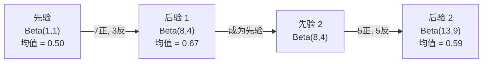

# 贝叶斯定理（Bayes' Theorem）

> 概率讲的是你的预期，贝叶斯定理讲的是你从数据中学到了什么。

**类型：** 动手构建
**语言：** Python
**前置课程：** 第1阶段，第06课（概率基础）
**时间：** 约75分钟

## 学习目标

- 运用贝叶斯定理，根据先验、似然和证据计算后验概率
- 从零构建一个朴素贝叶斯文本分类器，包含拉普拉斯平滑和对数空间计算
- 比较最大似然估计和最大后验估计，并解释 MAP 与 L2 正则化的对应关系
- 使用 Beta-二项共轭先验实现贝叶斯序贯更新，应用于 A/B 测试

## 问题引入

一项医学检测的准确率为 99%。你的检测结果呈阳性。你真正患病的概率是多少？

大多数人会说 99%。但真正的答案取决于这种疾病有多罕见。如果每 10,000 人中只有 1 人患病，那么一次阳性结果只意味着你大约有 1% 的概率真的生病了。其余 99% 的阳性结果都来自健康人群的假阳性。

这不是脑筋急转弯，这就是贝叶斯定理。每一个垃圾邮件过滤器、每一个医学诊断系统、每一个量化不确定性的机器学习模型，用的都是这个推理方式。你从一个信念出发，看到证据，然后更新信念。

如果你在不理解这些的情况下构建 ML 系统，你会误解模型输出、设置错误的阈值，并交付过度自信的预测。

## 核心概念

### 从联合概率到贝叶斯

你在第06课中已经知道条件概率（Conditional Probability）是：

```
P(A|B) = P(A and B) / P(B)
```

对称地：

```
P(B|A) = P(A and B) / P(A)
```

两个表达式共享同一个分子：P(A and B)。令它们相等并整理：

```
P(A and B) = P(A|B) * P(B) = P(B|A) * P(A)

因此：

P(A|B) = P(B|A) * P(A) / P(B)
```

这就是贝叶斯定理。四个量，一个等式。

### 四个组成部分

| 部分 | 名称 | 含义 |
|------|------|------|
| P(A\|B) | 后验概率（Posterior） | 看到证据 B 后，对 A 的更新信念 |
| P(B\|A) | 似然（Likelihood） | 如果 A 为真，证据 B 出现的概率 |
| P(A) | 先验概率（Prior） | 在看到任何证据之前，对 A 的信念 |
| P(B) | 证据（Evidence） | 在所有可能情况下，看到 B 的总概率 |

证据项 P(B) 起归一化的作用。你可以用全概率公式展开它：

```
P(B) = P(B|A) * P(A) + P(B|not A) * P(not A)
```

### 医学检测示例

一种疾病的发病率为万分之一。检测准确率为 99%（能检出 99% 的患者，假阳性率为 1%）。

```
P(sick)          = 0.0001     (先验：疾病很罕见)
P(positive|sick) = 0.99       (似然：检测能检出)
P(positive|healthy) = 0.01    (假阳性率)

P(positive) = P(positive|sick) * P(sick) + P(positive|healthy) * P(healthy)
            = 0.99 * 0.0001 + 0.01 * 0.9999
            = 0.000099 + 0.009999
            = 0.010098

P(sick|positive) = P(positive|sick) * P(sick) / P(positive)
                 = 0.99 * 0.0001 / 0.010098
                 = 0.0098
                 = 0.98%
```

不到 1%。先验占了主导地位。当某种状况很罕见时，即使是准确的检测也会产生大量假阳性。这就是医生要求做确认检测的原因。

### 垃圾邮件过滤器示例

你收到一封包含"lottery"这个词的邮件。它是垃圾邮件吗？

```
P(spam)                = 0.3      (30%的邮件是垃圾邮件)
P("lottery"|spam)      = 0.05     (5%的垃圾邮件包含"lottery")
P("lottery"|not spam)  = 0.001    (0.1%的正常邮件包含"lottery")

P("lottery") = 0.05 * 0.3 + 0.001 * 0.7
             = 0.015 + 0.0007
             = 0.0157

P(spam|"lottery") = 0.05 * 0.3 / 0.0157
                  = 0.955
                  = 95.5%
```

一个词就把概率从 30% 提升到了 95.5%。真正的垃圾邮件过滤器会同时对数百个词应用贝叶斯定理。

### 朴素贝叶斯：独立性假设

朴素贝叶斯（Naive Bayes）通过假设所有特征在给定类别下条件独立，将贝叶斯定理扩展到多个特征：

```
P(class | feature_1, feature_2, ..., feature_n)
  = P(class) * P(feature_1|class) * P(feature_2|class) * ... * P(feature_n|class)
    / P(feature_1, feature_2, ..., feature_n)
```

"朴素"的部分就是独立性假设。在文本中，词的出现并不独立（"New"和"York"是相关的）。但这个假设在实践中出奇地有效，因为分类器只需要对类别进行排序，而不需要产生校准良好的概率。

由于分母对所有类别都相同，你可以跳过它，直接比较分子：

```
score(class) = P(class) * product of P(feature_i | class)
```

选择得分最高的类别。

### 最大似然估计（MLE）

如何从训练数据中得到 P(feature|class)？数数即可。

```
P("free"|spam) = (包含"free"的垃圾邮件数) / (垃圾邮件总数)
```

这就是 MLE（Maximum Likelihood Estimation）：选择使观测数据最有可能出现的参数值。你在最大化似然函数，对于离散计数来说就是相对频率。

问题是：如果某个词在训练时从未出现在垃圾邮件中，MLE 给出的概率就是零。一个未见过的词就能让整个乘积归零。用拉普拉斯平滑（Laplace Smoothing）来修复：

```
P(word|class) = (count(word, class) + 1) / (total_words_in_class + vocabulary_size)
```

给每个计数加 1，确保没有概率为零。

### 最大后验估计（MAP）

MLE 问的是：什么参数使 P(data|parameters) 最大？

MAP（Maximum A Posteriori）问的是：什么参数使 P(parameters|data) 最大？

根据贝叶斯定理：

```
P(parameters|data) 正比于 P(data|parameters) * P(parameters)
```

MAP 在参数本身上加了一个先验。如果你认为参数应该较小，就把这个信念编码为一个惩罚大值的先验。这和 ML 中的 L2 正则化完全相同。岭回归中的"岭"惩罚项就是对权重的高斯先验。

| 估计方法 | 优化目标 | ML 中的等价物 |
|----------|----------|---------------|
| MLE | P(data\|params) | 无正则化训练 |
| MAP | P(data\|params) * P(params) | L2 / L1 正则化 |

### 贝叶斯与频率学派：实际区别

频率学派（Frequentist）将参数视为固定的未知量。他们问："如果我重复这个实验很多次，会发生什么？"

贝叶斯学派（Bayesian）将参数视为分布。他们问："根据我观察到的数据，我对参数有什么信念？"

在构建 ML 系统时，实际区别如下：

| 方面 | 频率学派 | 贝叶斯学派 |
|------|----------|------------|
| 输出 | 点估计 | 值的分布 |
| 不确定性 | 置信区间（关于程序） | 可信区间（关于参数） |
| 数据量小 | 容易过拟合 | 先验起正则化作用 |
| 计算量 | 通常更快 | 通常需要采样（MCMC） |

大多数生产环境的 ML 是频率学派的（SGD，点估计）。贝叶斯方法在需要校准的不确定性（医疗决策、安全关键系统）或数据稀缺（少样本学习、冷启动）时最为突出。

### 为什么贝叶斯思维对 ML 很重要

这种联系不只是类比：

**先验就是正则化。** 权重的高斯先验就是 L2 正则化。拉普拉斯先验就是 L1。每当你加一个正则化项，你就在做一个贝叶斯声明——你期望参数值是什么样的。

**后验就是不确定性。** 单个预测概率不能告诉你模型对这个估计有多自信。贝叶斯方法给你一个分布："我认为 P(spam) 在 0.8 和 0.95 之间。"

**贝叶斯更新就是在线学习。** 今天的后验成为明天的先验。当模型看到新数据时，它增量地更新信念，而不是从头重新训练。

**模型比较是贝叶斯的。** 贝叶斯信息准则（BIC）、边际似然和贝叶斯因子都使用贝叶斯推理来在模型之间做选择，同时避免过拟合。

## 动手构建

### 第1步：贝叶斯定理函数

```python
def bayes(prior, likelihood, false_positive_rate):
    evidence = likelihood * prior + false_positive_rate * (1 - prior)
    posterior = likelihood * prior / evidence
    return posterior

result = bayes(prior=0.0001, likelihood=0.99, false_positive_rate=0.01)
print(f"P(sick|positive) = {result:.4f}")
```

### 第2步：朴素贝叶斯分类器

```python
import math
from collections import defaultdict

class NaiveBayes:
    def __init__(self, smoothing=1.0):
        self.smoothing = smoothing
        self.class_counts = defaultdict(int)
        self.word_counts = defaultdict(lambda: defaultdict(int))
        self.class_word_totals = defaultdict(int)
        self.vocab = set()

    def train(self, documents, labels):
        for doc, label in zip(documents, labels):
            self.class_counts[label] += 1
            words = doc.lower().split()
            for word in words:
                self.word_counts[label][word] += 1
                self.class_word_totals[label] += 1
                self.vocab.add(word)

    def predict(self, document):
        words = document.lower().split()
        total_docs = sum(self.class_counts.values())
        vocab_size = len(self.vocab)
        best_class = None
        best_score = float("-inf")
        for cls in self.class_counts:
            score = math.log(self.class_counts[cls] / total_docs)
            for word in words:
                count = self.word_counts[cls].get(word, 0)
                total = self.class_word_totals[cls]
                score += math.log((count + self.smoothing) / (total + self.smoothing * vocab_size))
            if score > best_score:
                best_score = score
                best_class = cls
        return best_class
```

对数概率可以防止下溢。将许多小概率相乘会产生浮点数无法表示的极小数字。对对数概率求和在数值上是稳定的，且在数学上等价。

### 第3步：在垃圾邮件数据上训练

```python
train_docs = [
    "win free money now",
    "free lottery ticket winner",
    "claim your prize today free",
    "urgent offer free cash",
    "congratulations you won free",
    "meeting tomorrow at noon",
    "project update attached",
    "can we schedule a call",
    "quarterly report review",
    "lunch on thursday sounds good",
    "team standup notes attached",
    "please review the pull request",
]

train_labels = [
    "spam", "spam", "spam", "spam", "spam",
    "ham", "ham", "ham", "ham", "ham", "ham", "ham",
]

classifier = NaiveBayes()
classifier.train(train_docs, train_labels)

test_messages = [
    "free money waiting for you",
    "meeting rescheduled to friday",
    "you won a free prize",
    "please review the attached report",
]

for msg in test_messages:
    print(f"  '{msg}' -> {classifier.predict(msg)}")
```

### 第4步：查看学习到的概率

```python
def show_top_words(classifier, cls, n=5):
    vocab_size = len(classifier.vocab)
    total = classifier.class_word_totals[cls]
    probs = {}
    for word in classifier.vocab:
        count = classifier.word_counts[cls].get(word, 0)
        probs[word] = (count + classifier.smoothing) / (total + classifier.smoothing * vocab_size)
    sorted_words = sorted(probs.items(), key=lambda x: x[1], reverse=True)
    for word, prob in sorted_words[:n]:
        print(f"    {word}: {prob:.4f}")

print("\nTop spam words:")
show_top_words(classifier, "spam")
print("\nTop ham words:")
show_top_words(classifier, "ham")
```

## 实际使用

scikit-learn 提供了生产级的朴素贝叶斯实现：

```python
from sklearn.feature_extraction.text import CountVectorizer
from sklearn.naive_bayes import MultinomialNB
from sklearn.metrics import classification_report

vectorizer = CountVectorizer()
X_train = vectorizer.fit_transform(train_docs)
clf = MultinomialNB()
clf.fit(X_train, train_labels)

X_test = vectorizer.transform(test_messages)
predictions = clf.predict(X_test)
for msg, pred in zip(test_messages, predictions):
    print(f"  '{msg}' -> {pred}")
```

算法是一样的。CountVectorizer 负责分词和词汇表构建。MultinomialNB 在内部处理平滑和对数概率。你从零实现的版本用 40 行代码做了同样的事情。

## 交付成果

这里构建的 NaiveBayes 类演示了完整的流水线：分词、带拉普拉斯平滑的概率估计、对数空间预测。`code/bayes.py` 中的代码可以端到端运行，除了 Python 标准库外没有其他依赖。

### 共轭先验

当先验和后验属于同一分布族时，该先验称为"共轭先验（Conjugate Prior）"。这使得贝叶斯更新在代数上非常简洁——你可以得到封闭形式的后验，不需要数值积分。

| 似然 | 共轭先验 | 后验 | 示例 |
|------|----------|------|------|
| 伯努利 | Beta(a, b) | Beta(a + 成功次数, b + 失败次数) | 硬币偏差估计 |
| 正态（已知方差） | Normal(mu_0, sigma_0) | Normal(加权均值, 更小的方差) | 传感器校准 |
| 泊松 | Gamma(a, b) | Gamma(a + 计数之和, b + n) | 到达率建模 |
| 多项式 | Dirichlet(alpha) | Dirichlet(alpha + 计数) | 主题建模，语言模型 |

为什么这很重要：没有共轭先验，你需要蒙特卡洛采样或变分推断来近似后验。有了共轭先验，你只需更新两个数字。

Beta 分布是实践中最常见的共轭先验。Beta(a, b) 表示你对一个概率参数的信念。均值是 a/(a+b)。a+b 越大，分布越集中（越自信）。

Beta 先验的特殊情况：
- Beta(1, 1) = 均匀分布。你对参数没有任何意见。
- Beta(10, 10) = 在 0.5 处有峰值。你强烈相信参数接近 0.5。
- Beta(1, 10) = 偏向 0。你相信参数很小。

更新规则非常简单：

```
先验：     Beta(a, b)
数据：     s 次成功，f 次失败
后验：     Beta(a + s, b + f)
```

不需要积分。不需要采样。只需要加法。

### 贝叶斯序贯更新

贝叶斯推断天然是序贯的。今天的后验成为明天的先验。这就是真实系统如何在不重新处理所有历史数据的情况下增量学习的。

具体例子：估计一枚硬币是否公平。

**第1天：还没有数据。**
从 Beta(1, 1) 开始——均匀先验。你没有任何意见。
- 先验均值：0.5
- 先验在 [0, 1] 上是平坦的

**第2天：观察到 7 次正面，3 次反面。**
后验 = Beta(1 + 7, 1 + 3) = Beta(8, 4)
- 后验均值：8/12 = 0.667
- 证据表明硬币偏向正面

**第3天：再观察到 5 次正面，5 次反面。**
将昨天的后验作为今天的先验。
后验 = Beta(8 + 5, 4 + 5) = Beta(13, 9)
- 后验均值：13/22 = 0.591
- 平衡的新数据把估计拉回了 0.5 附近



观察的顺序无关紧要。将 Beta(1,1) 一次性用所有 12 次正面和 8 次反面来更新，结果也是 Beta(13, 9)——完全相同。序贯更新和批量更新在数学上是等价的。但序贯更新让你在每一步都能做出决策，而不需要存储原始数据。

这是生产环境 ML 系统中在线学习的基础。用于多臂老虎机的 Thompson 采样、增量推荐系统和流式异常检测器都使用了这种模式。

### 与 A/B 测试的联系

A/B 测试本质上就是贝叶斯推断。

设置：你正在测试两种按钮颜色。方案 A（蓝色）和方案 B（绿色）。你想知道哪个获得更多点击。

贝叶斯 A/B 测试：

1. **先验。** 两个方案都从 Beta(1, 1) 开始。没有先验偏好。
2. **数据。** 方案 A：1000 次浏览中 50 次点击。方案 B：1000 次浏览中 65 次点击。
3. **后验。**
   - A: Beta(1 + 50, 1 + 950) = Beta(51, 951)。均值 = 0.051
   - B: Beta(1 + 65, 1 + 935) = Beta(66, 936)。均值 = 0.066
4. **决策。** 计算 P(B > A)——B 的真实转化率高于 A 的概率。

解析计算 P(B > A) 很困难。但蒙特卡洛方法使其变得简单：

```
1. 从 Beta(51, 951) 抽取 100,000 个样本  -> samples_A
2. 从 Beta(66, 936) 抽取 100,000 个样本  -> samples_B
3. P(B > A) = B > A 的样本占比
```

如果 P(B > A) > 0.95，就上线方案 B。如果在 0.05 到 0.95 之间，继续收集数据。如果 P(B > A) < 0.05，就上线方案 A。

相比频率学派 A/B 测试的优势：
- 你得到直接的概率声明："B 更好的概率是 97%"
- 没有 p 值的困惑。没有"无法拒绝零假设"的含糊说法。
- 你可以在任何时候查看结果，而不会膨胀假阳性率（没有"偷看问题"）
- 你可以纳入先验知识（例如，以前的测试表明转化率通常在 3-8% 之间）

| 方面 | 频率学派 A/B | 贝叶斯 A/B |
|------|-------------|------------|
| 输出 | p 值 | P(B > A) |
| 解释 | "如果 A=B，这个数据有多令人惊讶？" | "B 比 A 更好的可能性有多大？" |
| 提前停止 | 膨胀假阳性率 | 在任何时间点都安全（前提是先验选择合理且模型正确） |
| 先验知识 | 不使用 | 编码为 Beta 先验 |
| 决策规则 | p < 0.05 | P(B > A) > 阈值 |

## 练习

1. **多次检测。** 一位患者在两次独立检测中均呈阳性（两次检测都是 99% 准确，疾病发病率为万分之一）。两次检测后 P(sick) 是多少？使用第一次检测的后验作为第二次检测的先验。

2. **平滑参数的影响。** 用平滑值 0.01、0.1、1.0 和 10.0 运行垃圾邮件分类器。排名靠前的词的概率如何变化？当 smoothing=0 且某个词只出现在正常邮件中时会发生什么？

3. **添加特征。** 扩展 NaiveBayes 类，使其除了词频之外还使用消息长度（短/长）作为特征。从训练数据中估计 P(short|spam) 和 P(short|ham)，并将其纳入预测分数。

4. **手动计算 MAP。** 给定观测数据（10 次抛硬币中 7 次正面），使用 Beta(2,2) 先验计算偏差的 MAP 估计。与 MLE 估计（7/10）进行比较。

## 关键术语

| 术语 | 通俗说法 | 实际含义 |
|------|----------|----------|
| 先验（Prior） | "我的初始猜测" | P(hypothesis)，在观察证据之前对假设的信念。在 ML 中即正则化项。 |
| 似然（Likelihood） | "数据的拟合程度" | P(evidence\|hypothesis)，在特定假设下观测数据出现的概率。 |
| 后验（Posterior） | "我的更新信念" | P(hypothesis\|evidence)，先验乘以似然再归一化。 |
| 证据（Evidence） | "归一化常数" | P(data)，在所有假设下数据的概率，确保后验之和为 1。 |
| 朴素贝叶斯（Naive Bayes） | "那个简单的文本分类器" | 一种假设特征在给定类别下独立的分类器。尽管假设不成立，但效果不错。 |
| 拉普拉斯平滑（Laplace Smoothing） | "加一平滑" | 给每个特征加一个小的计数，防止未见过的数据产生零概率。 |
| MLE | "直接用频率" | 选择使 P(data\|parameters) 最大的参数。没有先验。数据量小时容易过拟合。 |
| MAP | "带先验的 MLE" | 选择使 P(data\|parameters) * P(parameters) 最大的参数。等价于正则化的 MLE。 |
| 对数概率（Log-probability） | "在对数空间工作" | 使用 log(P) 代替 P，避免多个小数相乘时的浮点下溢。 |
| 假阳性（False Positive） | "虚假的警报" | 检测结果为阳性，但真实状态为阴性。导致基率谬误。 |

## 延伸阅读

- [3Blue1Brown: Bayes' theorem](https://www.youtube.com/watch?v=HZGCoVF3YvM) - 用医学检测示例做的可视化讲解
- [Stanford CS229: Generative Learning Algorithms](https://cs229.stanford.edu/notes2022fall/cs229-notes2.pdf) - 朴素贝叶斯及其与判别模型的联系
- [Think Bayes](https://greenteapress.com/wp/think-bayes/) - 免费书籍，用 Python 代码讲解贝叶斯统计
- [scikit-learn Naive Bayes](https://scikit-learn.org/stable/modules/naive_bayes.html) - 生产级实现及各变体的适用场景
