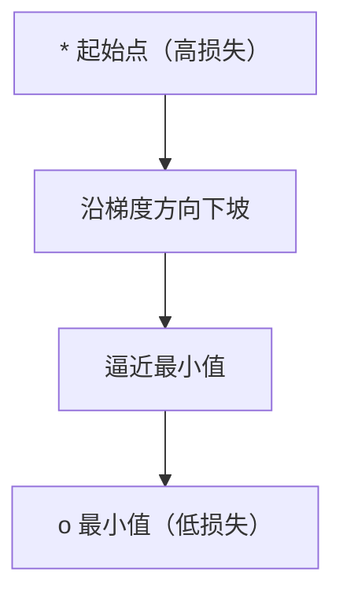
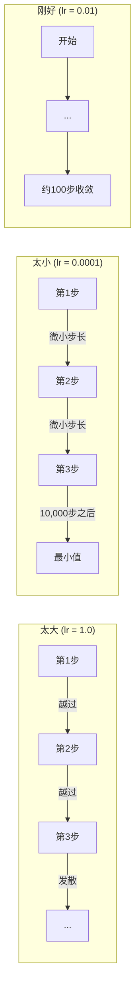
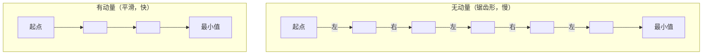
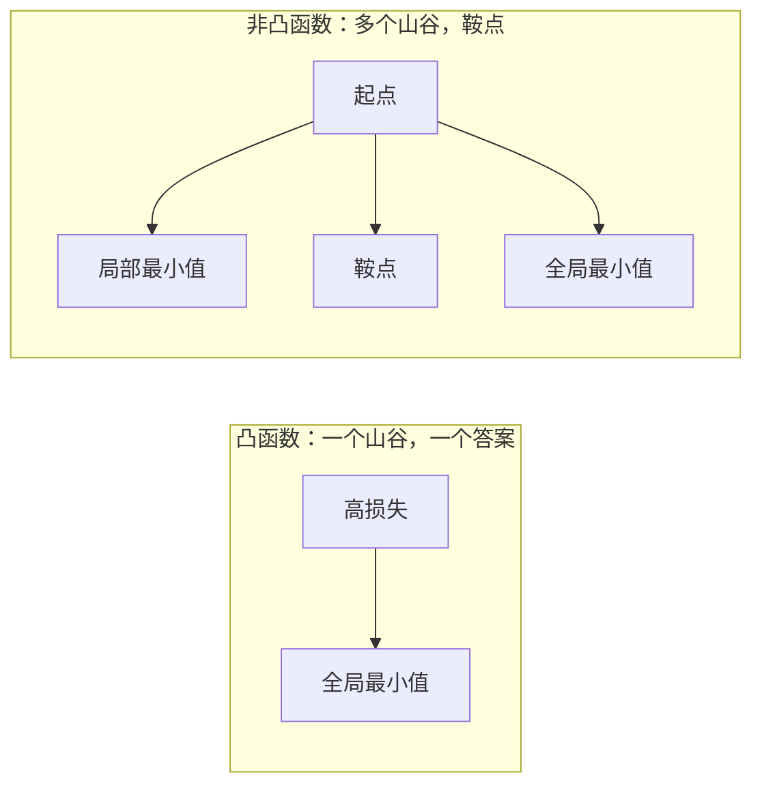
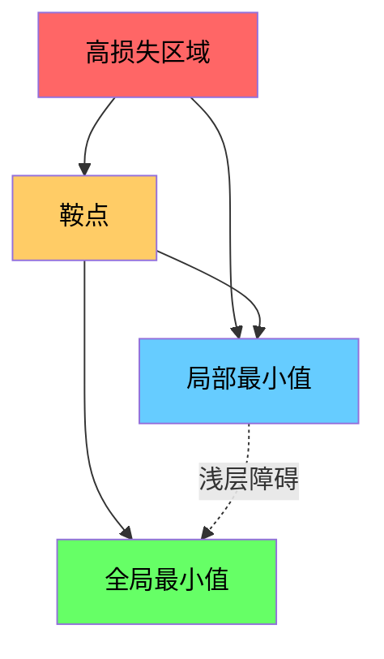

# 优化（Optimization）

> 训练神经网络不过是在找一个山谷的谷底。

**类型：** 动手构建
**语言：** Python
**前置课程：** 第1阶段，第04-05课（导数、梯度）
**时间：** 约75分钟

## 学习目标

- 从零实现原始梯度下降、带动量的 SGD 和 Adam
- 在 Rosenbrock 函数上比较优化器的收敛表现，并解释为什么 Adam 为每个权重自适应调整学习率
- 区分凸与非凸损失地形，并解释鞍点在高维空间中的作用
- 配置学习率调度策略（阶梯衰减、余弦退火、预热）以保持训练稳定性

## 问题引入

你有一个损失函数，它告诉你模型错得有多离谱。你有梯度，它们告诉你哪个方向会让损失变得更大。现在你需要一个策略来沿着坡往下走。

最朴素的方法很简单：沿梯度的反方向移动，按一个叫做学习率的数字来缩放步长，然后重复。这就是梯度下降（Gradient Descent），它是有效的。但"有效"有一些附加条件。学习率太大，你会完全越过山谷，在两侧之间来回弹跳。太小则会在数千个不必要的步骤中缓慢爬向答案。碰到鞍点（Saddle Point），你就会停下来，尽管你并没有找到最小值。

深度学习中的每一个优化器都在回答同一个问题：如何更快、更可靠地到达山谷的谷底？

## 核心概念

### 什么是优化

优化是找到使函数最小化（或最大化）的输入值。在机器学习中，函数是损失函数，输入是模型的权重。训练就是优化。

```
minimize L(w) 其中：
  L = 损失函数
  w = 模型权重（可能有数百万个参数）
```

### 梯度下降（原始版本）

最简单的优化器。计算损失对每个权重的梯度。将每个权重沿其梯度的反方向移动。按学习率缩放步长。

```
w = w - lr * gradient
```

整个算法就这一行。



### 学习率：最重要的超参数

学习率控制步长大小，它决定了收敛的一切。



没有公式可以算出正确的学习率。你只能通过实验来找。常见的起点：Adam 用 0.001，带动量的 SGD 用 0.01。

### SGD、批量与小批量

原始梯度下降在整个数据集上计算梯度后才走一步。这叫做批量梯度下降（Batch Gradient Descent）。它稳定但很慢。

随机梯度下降（SGD，Stochastic Gradient Descent）在单个随机样本上计算梯度并立即更新。它噪声大但速度快。

小批量梯度下降（Mini-batch Gradient Descent）是折中方案。在一个小批量（32、64、128、256 个样本）上计算梯度，然后更新。这才是大家实际使用的方法。

| 变体 | 批量大小 | 梯度质量 | 每步速度 | 噪声 |
|------|----------|----------|----------|------|
| 批量梯度下降 | 整个数据集 | 精确 | 慢 | 无 |
| SGD | 1个样本 | 噪声很大 | 快 | 高 |
| 小批量 | 32-256 | 良好估计 | 均衡 | 中等 |

SGD 和小批量中的噪声不是缺陷。它有助于逃离浅的局部最小值和鞍点。

### 动量：下坡滚动的球

原始梯度下降只看当前梯度。如果梯度来回摆动（在狭窄山谷中很常见），进度就会很慢。动量（Momentum）通过将过去的梯度累积到一个速度项中来解决这个问题。

```
v = beta * v + gradient
w = w - lr * v
```

类比：一个下坡滚动的球。它不会在每个颠簸处停下来重新启动。它在一致的方向上积累速度，抑制振荡。



`beta`（通常为 0.9）控制保留多少历史信息。beta 越高意味着动量越大、路径越平滑，但对方向变化的响应越慢。

### Adam：自适应学习率

不同的权重需要不同的学习率。一个很少收到大梯度的权重，当它终于收到大梯度时应该走更大的步。一个持续收到巨大梯度的权重应该走更小的步。

Adam（Adaptive Moment Estimation，自适应矩估计）为每个权重追踪两个量：

1. 一阶矩（m）：梯度的运行平均值（类似动量）
2. 二阶矩（v）：梯度平方的运行平均值（梯度幅度）

```
m = beta1 * m + (1 - beta1) * gradient
v = beta2 * v + (1 - beta2) * gradient^2

m_hat = m / (1 - beta1^t)    偏差修正
v_hat = v / (1 - beta2^t)    偏差修正

w = w - lr * m_hat / (sqrt(v_hat) + epsilon)
```

除以 `sqrt(v_hat)` 是关键洞察。梯度大的权重被一个大数除（有效步长小）。梯度小的权重被一个小数除（有效步长大）。每个权重都有自己的自适应学习率。

默认超参数：`lr=0.001, beta1=0.9, beta2=0.999, epsilon=1e-8`。这些默认值对大多数问题都效果不错。

### 学习率调度

固定的学习率是一种折中。训练早期，你想要大步前进以快速取得进展。训练后期，你想要小步微调以靠近最小值。

常见调度策略：

| 调度策略 | 公式 | 适用场景 |
|----------|------|----------|
| 阶梯衰减（Step Decay） | lr = lr * factor 每 N 个 epoch | 简单，手动控制 |
| 指数衰减（Exponential Decay） | lr = lr_0 * decay^t | 平滑递减 |
| 余弦退火（Cosine Annealing） | lr = lr_min + 0.5 * (lr_max - lr_min) * (1 + cos(pi * t / T)) | Transformer，现代训练 |
| 预热+衰减（Warmup + Decay） | 线性升温，然后衰减 | 大模型，防止早期不稳定 |

### 凸与非凸

凸函数（Convex Function）只有一个最小值。梯度下降总能找到它。像 `f(x) = x^2` 这样的二次函数就是凸的。

神经网络的损失函数是非凸的。它们有许多局部最小值、鞍点和平坦区域。



在实践中，高维神经网络中的局部最小值很少是问题。大多数局部最小值的损失值接近全局最小值。鞍点（某些方向是平的，其他方向是弯曲的）才是真正的障碍。动量和小批量带来的噪声有助于逃离鞍点。

### 损失地形可视化

损失是所有权重的函数。对于一个有 100 万个权重的模型，损失地形存在于 1,000,001 维空间中。我们通过在权重空间中选择两个随机方向并沿这些方向绘制损失来可视化它，生成一个二维曲面。



尖锐的最小值泛化能力差。平坦的最小值泛化能力好。这是带动量的 SGD 在最终测试精度上经常优于 Adam 的原因之一：它的噪声防止模型落入尖锐的最小值。

## 动手构建

### 第1步：定义测试函数

Rosenbrock 函数是经典的优化基准测试。它的最小值在 (1, 1)，位于一个狭窄的弯曲山谷内，容易找到但难以沿着前进。

```
f(x, y) = (1 - x)^2 + 100 * (y - x^2)^2
```

```python
def rosenbrock(params):
    x, y = params
    return (1 - x) ** 2 + 100 * (y - x ** 2) ** 2

def rosenbrock_gradient(params):
    x, y = params
    df_dx = -2 * (1 - x) + 200 * (y - x ** 2) * (-2 * x)
    df_dy = 200 * (y - x ** 2)
    return [df_dx, df_dy]
```

### 第2步：原始梯度下降

```python
class GradientDescent:
    def __init__(self, lr=0.001):
        self.lr = lr

    def step(self, params, grads):
        return [p - self.lr * g for p, g in zip(params, grads)]
```

### 第3步：带动量的 SGD

```python
class SGDMomentum:
    def __init__(self, lr=0.001, momentum=0.9):
        self.lr = lr
        self.momentum = momentum
        self.velocity = None

    def step(self, params, grads):
        if self.velocity is None:
            self.velocity = [0.0] * len(params)
        self.velocity = [
            self.momentum * v + g
            for v, g in zip(self.velocity, grads)
        ]
        return [p - self.lr * v for p, v in zip(params, self.velocity)]
```

### 第4步：Adam

```python
class Adam:
    def __init__(self, lr=0.001, beta1=0.9, beta2=0.999, epsilon=1e-8):
        self.lr = lr
        self.beta1 = beta1
        self.beta2 = beta2
        self.epsilon = epsilon
        self.m = None
        self.v = None
        self.t = 0

    def step(self, params, grads):
        if self.m is None:
            self.m = [0.0] * len(params)
            self.v = [0.0] * len(params)

        self.t += 1

        self.m = [
            self.beta1 * m + (1 - self.beta1) * g
            for m, g in zip(self.m, grads)
        ]
        self.v = [
            self.beta2 * v + (1 - self.beta2) * g ** 2
            for v, g in zip(self.v, grads)
        ]

        m_hat = [m / (1 - self.beta1 ** self.t) for m in self.m]
        v_hat = [v / (1 - self.beta2 ** self.t) for v in self.v]

        return [
            p - self.lr * mh / (vh ** 0.5 + self.epsilon)
            for p, mh, vh in zip(params, m_hat, v_hat)
        ]
```

### 第5步：运行并比较

```python
def optimize(optimizer, func, grad_func, start, steps=5000):
    params = list(start)
    history = [params[:]]
    for _ in range(steps):
        grads = grad_func(params)
        params = optimizer.step(params, grads)
        history.append(params[:])
    return history

start = [-1.0, 1.0]

gd_history = optimize(GradientDescent(lr=0.0005), rosenbrock, rosenbrock_gradient, start)
sgd_history = optimize(SGDMomentum(lr=0.0001, momentum=0.9), rosenbrock, rosenbrock_gradient, start)
adam_history = optimize(Adam(lr=0.01), rosenbrock, rosenbrock_gradient, start)

for name, history in [("GD", gd_history), ("SGD+M", sgd_history), ("Adam", adam_history)]:
    final = history[-1]
    loss = rosenbrock(final)
    print(f"{name:6s} -> x={final[0]:.6f}, y={final[1]:.6f}, loss={loss:.8f}")
```

预期输出：Adam 收敛最快。带动量的 SGD 路径更平滑。原始梯度下降在狭窄山谷中进展缓慢。

## 实际使用

在实践中，请使用 PyTorch 或 JAX 的优化器。它们处理参数组、权重衰减、梯度裁剪和 GPU 加速。

```python
import torch

model = torch.nn.Linear(784, 10)

sgd = torch.optim.SGD(model.parameters(), lr=0.01, momentum=0.9)
adam = torch.optim.Adam(model.parameters(), lr=0.001)
adamw = torch.optim.AdamW(model.parameters(), lr=0.001, weight_decay=0.01)

scheduler = torch.optim.lr_scheduler.CosineAnnealingLR(adam, T_max=100)
```

经验法则：

- 从 Adam（lr=0.001）开始。它不需要调参就能在大多数问题上有效。
- 当你需要最佳的最终精度且能承受更多调参时，切换到带动量的 SGD（lr=0.01, momentum=0.9）。
- 对 Transformer 使用 AdamW（带解耦权重衰减的 Adam）。
- 训练超过几个 epoch 时，一定要使用学习率调度。
- 如果训练不稳定，降低学习率。如果训练太慢，提高学习率。

## 交付成果

本课程生成一份选择正确优化器的指南。详见 `outputs/prompt-optimizer-guide.md`。

这里构建的优化器类会在第3阶段从零训练神经网络时再次出现。

## 练习

1. **学习率扫描。** 用学习率 [0.0001, 0.0005, 0.001, 0.005, 0.01] 在 Rosenbrock 函数上运行原始梯度下降。绘制或打印每个学习率在 5000 步后的最终损失。找到仍然能收敛的最大学习率。

2. **动量比较。** 用动量值 [0.0, 0.5, 0.9, 0.99] 在 Rosenbrock 函数上运行 SGD。跟踪每一步的损失。哪个动量值收敛最快？哪个会越过最小值？

3. **逃离鞍点。** 定义函数 `f(x, y) = x^2 - y^2`（原点处有一个鞍点）。从 (0.01, 0.01) 开始。比较原始梯度下降、带动量的 SGD 和 Adam 的表现。哪个能逃离鞍点？

4. **实现学习率衰减。** 给 GradientDescent 类添加指数衰减调度：`lr = lr_0 * 0.999^step`。在 Rosenbrock 函数上比较有衰减和无衰减时的收敛表现。

## 关键术语

| 术语 | 通俗说法 | 实际含义 |
|------|----------|----------|
| 梯度下降（Gradient Descent） | "往下走" | 通过减去梯度乘以学习率来更新权重。最基本的优化器。 |
| 学习率（Learning Rate） | "步长" | 控制每次更新将权重移动多远的标量。太大导致发散，太小浪费算力。 |
| 动量（Momentum） | "继续滚动" | 将过去的梯度累积到一个速度向量中。抑制振荡并加速一致方向上的移动。 |
| SGD | "随机采样" | 随机梯度下降。在随机子集上计算梯度而非全部数据集。实际中几乎总是指小批量 SGD。 |
| 小批量（Mini-batch） | "一小块数据" | 用于估计梯度的训练数据的小子集（32-256个样本）。平衡速度和梯度精度。 |
| Adam | "默认优化器" | 自适应矩估计。追踪每个权重的梯度和梯度平方的运行平均值，为每个权重提供自己的学习率。 |
| 偏差修正（Bias Correction） | "修复冷启动" | Adam 的一阶和二阶矩初始化为零。偏差修正在早期步骤中除以 (1 - beta^t) 来补偿。 |
| 学习率调度（Learning Rate Schedule） | "随时间改变 lr" | 在训练过程中调整学习率的函数。早期大步，后期小步。 |
| 凸函数（Convex Function） | "一个山谷" | 任何局部最小值都是全局最小值的函数。梯度下降总能找到它。神经网络的损失不是凸的。 |
| 鞍点（Saddle Point） | "平坦但不是最小值" | 梯度为零的点，但在某些方向上是最小值，在其他方向上是最大值。在高维空间中很常见。 |
| 损失地形（Loss Landscape） | "地形" | 损失函数在权重空间上的图像。通过沿两个随机方向切片来可视化。 |
| 收敛（Convergence） | "到达目标" | 优化器已到达一个点，进一步的步骤不会再显著降低损失。 |

## 延伸阅读

- [Sebastian Ruder: An overview of gradient descent optimization algorithms](https://ruder.io/optimizing-gradient-descent/) - 所有主流优化器的综合综述
- [Why Momentum Really Works (Distill)](https://distill.pub/2017/momentum/) - 动量动力学的交互式可视化
- [Adam: A Method for Stochastic Optimization (Kingma & Ba, 2014)](https://arxiv.org/abs/1412.6980) - Adam 原始论文，可读性强且篇幅简短
- [Visualizing the Loss Landscape of Neural Nets (Li et al., 2018)](https://arxiv.org/abs/1712.09913) - 展示尖锐最小值与平坦最小值的论文
