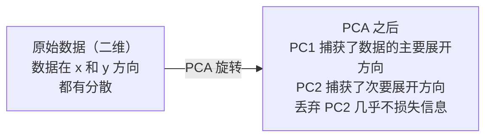

# 降维

> 高维数据中蕴含着结构，关键在于找到正确的观察角度。

**类型：** 构建
**语言：** Python
**前置知识：** 第1阶段，第01课（线性代数直觉）、第02课（向量、矩阵与运算）、第03课（特征值与特征向量）、第06课（概率与分布）
**时长：** 约90分钟

## 学习目标

- 从零实现 PCA：中心化数据、计算协方差矩阵、特征分解、投影
- 使用解释方差比和肘部法则选择主成分数量
- 对比 PCA、t-SNE 和 UMAP 在将 MNIST 数字可视化到二维空间时的效果，并解释它们的权衡
- 使用带 RBF 核的核 PCA（Kernel PCA）来分离标准 PCA 无法处理的非线性数据结构

## 问题引入

你有一个每个样本含784个特征的数据集。也许是手写数字的像素值，也许是基因表达水平，也许是用户行为信号。你无法可视化784个维度，无法绘制它们，甚至无法想象它们。

但这784个特征中的大多数是冗余的。真正的信息存在于一个小得多的表面上。描述一个手写的"7"并不需要784个独立的数字，只需要几个就够了：笔画的角度、横杠的长度、倾斜程度。其余的都是噪声。

降维（Dimensionality Reduction）就是找到那个更小的表面。它将你的784维数据压缩到2维、10维或50维，同时保留重要的结构。

## 核心概念

### 维度灾难

高维空间是反直觉的。随着维度增长，三件事情会出问题。

**距离变得毫无意义。** 在高维空间中，任意两个随机点之间的距离趋向于相同的值。如果每个点到其他所有点的距离大致相同，最近邻搜索就失效了。

```
维度         平均距离比（随机点间的最大/最小距离）
2            ~5.0
10           ~1.8
100          ~1.2
1000         ~1.02
```

**体积集中在角落。** d 维的单位超立方体有 2^d 个角。在100维中，几乎所有体积都在角落里，远离中心。数据点散布到边缘，你的模型在内部区域就缺乏数据。

**你需要指数级增长的数据量。** 要在空间中保持相同的样本密度，从二维到20维意味着你需要多出 10^18 倍的数据。你永远不会有足够的数据。降低维度能让数据密度回到可操作的水平。

### PCA：找到重要的方向

主成分分析（PCA）找到数据变化最大的轴。它旋转你的坐标系，使第一个轴捕获最大方差，第二个轴捕获次大方差，依此类推。

算法步骤：

```
1. 中心化数据        （从每个特征中减去均值）
2. 计算协方差        （特征之间如何共同变化）
3. 特征分解          （找到主方向）
4. 按特征值排序      （方差最大的在前）
5. 投影              （保留前 k 个特征向量，丢弃其余）
```

为什么要做特征分解？协方差矩阵是对称半正定的。它的特征向量是特征空间中的正交方向。特征值告诉你每个方向捕获了多少方差。具有最大特征值的特征向量指向最大方差的方向。



- **PCA 之前：** 数据云沿对角方向分散在 x 和 y 轴上
- **PCA 之后：** 坐标系被旋转，使 PC1 与最大方差方向（主要展开方向）对齐，PC2 与最小方差方向（次要展开方向）对齐
- **降维：** 丢弃 PC2 将数据投影到 PC1 上，几乎不损失信息

### 解释方差比

每个主成分捕获总方差的一个比例。解释方差比告诉你具体是多少。

```
成分         特征值       解释方差比      累计方差比
PC1          4.73          0.473              0.473
PC2          2.51          0.251              0.724
PC3          1.12          0.112              0.836
PC4          0.89          0.089              0.925
...
```

当累计解释方差达到0.95时，你知道这么多成分就捕获了95%的信息。之后的基本上都是噪声。

### 选择成分数量

三种策略：

1. **阈值法。** 保留足够的成分来解释90-95%的方差。
2. **肘部法则。** 绘制每个成分的解释方差。寻找急剧下降的拐点。
3. **下游性能。** 将 PCA 作为预处理。扫描不同的 k 值并度量模型的准确率。最佳 k 值在准确率趋于平稳的位置。

### t-SNE：保留邻域关系

t-分布随机邻域嵌入（t-SNE）是为可视化而设计的。它将高维数据映射到二维（或三维），同时保留哪些点彼此靠近。

直觉：在原始空间中，根据点对之间的距离计算一个概率分布。近的点获得高概率，远的点获得低概率。然后找到一个二维排列，使得同样的概率分布成立。在784维中是邻居的点，在二维中仍然是邻居。

t-SNE 的关键特性：
- 非线性。它能展开 PCA 无法处理的复杂流形。
- 随机性。不同次运行会产生不同的布局。
- 困惑度参数控制考虑多少邻居（典型范围：5-50）。
- 输出中聚类之间的距离没有意义。只有聚类本身有意义。
- 在大数据集上较慢。默认为 O(n^2)。

### UMAP：更快，全局结构更好

统一流形近似与投影（UMAP）的工作方式与 t-SNE 类似，但有两个优势：
- 更快。它使用近似最近邻图，而不是计算所有成对距离。
- 全局结构更好。输出中聚类的相对位置往往比 t-SNE 中更有意义。

UMAP 在高维空间中构建一个加权图（"模糊拓扑表示"），然后找到一个尽可能保留这个图的低维布局。

关键参数：
- `n_neighbors`：定义局部结构需要多少邻居（类似于困惑度）。较高的值保留更多全局结构。
- `min_dist`：输出中点的紧密程度。较低的值产生更密集的聚类。

### 何时使用哪种方法

| 方法 | 使用场景 | 保留的信息 | 速度 |
|--------|----------|-----------|-------|
| PCA | 训练前的预处理 | 全局方差 | 快（精确），可处理百万级样本 |
| PCA | 快速探索性可视化 | 线性结构 | 快 |
| t-SNE | 出版级二维图 | 局部邻域 | 慢（理想情况不超过1万样本） |
| UMAP | 大规模二维可视化 | 局部 + 部分全局结构 | 中等（可处理百万级） |
| PCA | 模型的特征降维 | 按方差排序的特征 | 快 |
| t-SNE / UMAP | 理解聚类结构 | 聚类分离度 | 中等到慢 |

经验法则：使用 PCA 进行预处理和数据压缩。需要在二维中可视化结构时使用 t-SNE 或 UMAP。

### 核 PCA

标准 PCA 找到的是线性子空间。它旋转你的坐标系并丢弃某些轴。但如果数据位于非线性流形上呢？二维中的一个圆无法被任何直线分离。标准 PCA 在这种情况下无能为力。

核 PCA 在由核函数诱导的高维特征空间中应用 PCA，而无需显式计算该空间中的坐标。这就是核技巧——与 SVM 背后的思想相同。

算法步骤：
1. 计算核矩阵 K，其中 K_ij = k(x_i, x_j)
2. 在特征空间中对核矩阵进行中心化
3. 对中心化后的核矩阵进行特征分解
4. 前几个特征向量（按 1/sqrt(特征值) 缩放）就是投影结果

常用核函数：

| 核函数 | 公式 | 适用场景 |
|--------|---------|----------|
| RBF（高斯） | exp(-gamma * \|\|x - y\|\|^2) | 大多数非线性数据，光滑流形 |
| 多项式 | (x . y + c)^d | 多项式关系 |
| Sigmoid | tanh(alpha * x . y + c) | 类神经网络映射 |

何时使用核 PCA 与标准 PCA：

| 标准 | 标准 PCA | 核 PCA |
|-----------|-------------|------------|
| 数据结构 | 线性子空间 | 非线性流形 |
| 速度 | O(min(n^2 d, d^2 n)) | O(n^2 d + n^3) |
| 可解释性 | 成分是特征的线性组合 | 成分缺乏直接的特征解释 |
| 可扩展性 | 可处理百万级样本 | 核矩阵为 n x n，受内存限制 |
| 重构 | 直接逆变换 | 需要原像近似 |

经典例子：二维中的同心圆。两个点环，一个在另一个里面。标准 PCA 将两者投影到同一条线上——对分类毫无用处。使用 RBF 核的核 PCA 将内圆和外圆映射到不同的区域，使它们线性可分。

### 重构误差

你的降维效果如何？你把784维压缩到了50维，损失了什么？

度量重构误差：
1. 将数据投影到 k 维：X_reduced = X @ W_k
2. 重构：X_hat = X_reduced @ W_k^T
3. 计算 MSE：mean((X - X_hat)^2)

对于 PCA，重构误差与解释方差有清晰的关系：

```
重构误差 = 未包含的特征值之和
总方差 = 所有特征值之和
损失比例 = (丢弃的特征值之和) / (所有特征值之和)
```

每个成分的解释方差比为：

```
explained_ratio_k = eigenvalue_k / sum(所有特征值)
```

将累计解释方差与成分数量作图，就得到"肘部"曲线。合适的成分数量是在以下位置：
- 曲线趋于平坦（收益递减）
- 累计方差超过你的阈值（通常为0.90或0.95）
- 下游任务性能趋于平稳

重构误差的用途不仅限于选择 k 值。你还可以用它进行异常检测：重构误差高的样本是不符合学习到的子空间的离群点。这就是生产系统中基于 PCA 的异常检测的基础。

## 动手实现

### 第1步：从零实现 PCA

```python
import numpy as np

class PCA:
    def __init__(self, n_components):
        self.n_components = n_components
        self.components = None
        self.mean = None
        self.eigenvalues = None
        self.explained_variance_ratio_ = None

    def fit(self, X):
        self.mean = np.mean(X, axis=0)
        X_centered = X - self.mean

        cov_matrix = np.cov(X_centered, rowvar=False)

        eigenvalues, eigenvectors = np.linalg.eigh(cov_matrix)

        sorted_idx = np.argsort(eigenvalues)[::-1]
        eigenvalues = eigenvalues[sorted_idx]
        eigenvectors = eigenvectors[:, sorted_idx]

        self.components = eigenvectors[:, :self.n_components].T
        self.eigenvalues = eigenvalues[:self.n_components]
        total_var = np.sum(eigenvalues)
        self.explained_variance_ratio_ = self.eigenvalues / total_var

        return self

    def transform(self, X):
        X_centered = X - self.mean
        return X_centered @ self.components.T

    def fit_transform(self, X):
        self.fit(X)
        return self.transform(X)
```

### 第2步：在合成数据上测试

```python
np.random.seed(42)
n_samples = 500

t = np.random.uniform(0, 2 * np.pi, n_samples)
x1 = 3 * np.cos(t) + np.random.normal(0, 0.2, n_samples)
x2 = 3 * np.sin(t) + np.random.normal(0, 0.2, n_samples)
x3 = 0.5 * x1 + 0.3 * x2 + np.random.normal(0, 0.1, n_samples)

X_synthetic = np.column_stack([x1, x2, x3])

pca = PCA(n_components=2)
X_reduced = pca.fit_transform(X_synthetic)

print(f"Original shape: {X_synthetic.shape}")
print(f"Reduced shape:  {X_reduced.shape}")
print(f"Explained variance ratios: {pca.explained_variance_ratio_}")
print(f"Total variance captured: {sum(pca.explained_variance_ratio_):.4f}")
```

### 第3步：MNIST 数字的二维可视化

```python
from sklearn.datasets import fetch_openml

mnist = fetch_openml("mnist_784", version=1, as_frame=False, parser="auto")
X_mnist = mnist.data[:5000].astype(float)
y_mnist = mnist.target[:5000].astype(int)

pca_mnist = PCA(n_components=50)
X_pca50 = pca_mnist.fit_transform(X_mnist)
print(f"50 components capture {sum(pca_mnist.explained_variance_ratio_):.2%} of variance")

pca_2d = PCA(n_components=2)
X_pca2d = pca_2d.fit_transform(X_mnist)
print(f"2 components capture {sum(pca_2d.explained_variance_ratio_):.2%} of variance")
```

### 第4步：与 sklearn 对比

```python
from sklearn.decomposition import PCA as SklearnPCA
from sklearn.manifold import TSNE

sklearn_pca = SklearnPCA(n_components=2)
X_sklearn_pca = sklearn_pca.fit_transform(X_mnist)

print(f"\nOur PCA explained variance:     {pca_2d.explained_variance_ratio_}")
print(f"Sklearn PCA explained variance: {sklearn_pca.explained_variance_ratio_}")

diff = np.abs(np.abs(X_pca2d) - np.abs(X_sklearn_pca))
print(f"Max absolute difference: {diff.max():.10f}")

tsne = TSNE(n_components=2, perplexity=30, random_state=42)
X_tsne = tsne.fit_transform(X_mnist)
print(f"\nt-SNE output shape: {X_tsne.shape}")
```

### 第5步：UMAP 对比

```python
try:
    from umap import UMAP

    reducer = UMAP(n_components=2, n_neighbors=15, min_dist=0.1, random_state=42)
    X_umap = reducer.fit_transform(X_mnist)
    print(f"UMAP output shape: {X_umap.shape}")
except ImportError:
    print("Install umap-learn: pip install umap-learn")
```

## 实际应用

PCA 作为分类器的预处理：

```python
from sklearn.decomposition import PCA as SklearnPCA
from sklearn.linear_model import LogisticRegression
from sklearn.model_selection import train_test_split
from sklearn.metrics import accuracy_score

X_train, X_test, y_train, y_test = train_test_split(
    X_mnist, y_mnist, test_size=0.2, random_state=42
)

results = {}
for k in [10, 30, 50, 100, 200]:
    pca_k = SklearnPCA(n_components=k)
    X_tr = pca_k.fit_transform(X_train)
    X_te = pca_k.transform(X_test)

    clf = LogisticRegression(max_iter=1000, random_state=42)
    clf.fit(X_tr, y_train)
    acc = accuracy_score(y_test, clf.predict(X_te))
    var_captured = sum(pca_k.explained_variance_ratio_)
    results[k] = (acc, var_captured)
    print(f"k={k:>3d}  accuracy={acc:.4f}  variance={var_captured:.4f}")
```

性能在远未达到784维时就趋于平稳。那个平稳点就是你的最佳工作点。

## 交付物

本课产出：
- `outputs/skill-dimensionality-reduction.md` - 一个用于针对给定任务选择正确降维技术的技能文档

## 练习

1. 修改 PCA 类，添加 `inverse_transform` 方法。分别用10、50和200个成分重构 MNIST 数字。打印每种情况的重构误差（与原始数据的均方差）。

2. 在同一个 MNIST 子集上，分别用困惑度值5、30和100运行 t-SNE。描述输出如何变化。为什么困惑度会影响聚类的紧密程度？

3. 取一个有50个特征但只有5个是有信息量的数据集（用 `sklearn.datasets.make_classification` 生成）。应用 PCA 并检查解释方差曲线是否正确识别出数据实际上是5维的。

## 关键术语

| 术语 | 通俗说法 | 实际含义 |
|------|----------------|----------------------|
| 维度灾难 | "特征太多了" | 随着维度增长，距离、体积和数据密度都会表现出反直觉的行为。模型需要指数级增长的数据来补偿。 |
| PCA | "降维" | 旋转坐标系使轴与最大方差方向对齐，然后丢弃低方差的轴。 |
| 主成分 | "一个重要方向" | 协方差矩阵的一个特征向量。特征空间中数据变化最大的方向。 |
| 解释方差比 | "这个成分包含多少信息" | 一个主成分捕获的总方差比例。将前 k 个比率求和可以看到 k 个成分保留了多少。 |
| 协方差矩阵 | "特征之间的相关性" | 一个对称矩阵，其中 (i,j) 元素度量特征 i 和特征 j 如何共同变化。对角线元素是各自的方差。 |
| t-SNE | "那个聚类图" | 一种非线性方法，通过保留成对邻域概率将高维数据映射到二维。适合可视化，不适合预处理。 |
| UMAP | "更快的 t-SNE" | 一种基于拓扑数据分析的非线性方法。同时保留局部和部分全局结构。比 t-SNE 扩展性更好。 |
| 困惑度 | "t-SNE 的调节旋钮" | 控制每个点考虑的有效邻居数。低困惑度关注非常局部的结构。高困惑度捕获更广泛的模式。 |
| 流形 | "数据所在的表面" | 嵌入在高维空间中的低维表面。一张揉皱在三维空间中的纸就是一个二维流形。 |

## 延伸阅读

- [A Tutorial on Principal Component Analysis](https://arxiv.org/abs/1404.1100)（Shlens）- 从零开始清晰推导 PCA
- [How to Use t-SNE Effectively](https://distill.pub/2016/misread-tsne/)（Wattenberg 等）- 关于 t-SNE 陷阱和参数选择的交互式指南
- [UMAP 文档](https://umap-learn.readthedocs.io/) - 来自 UMAP 作者的理论和实践指导
