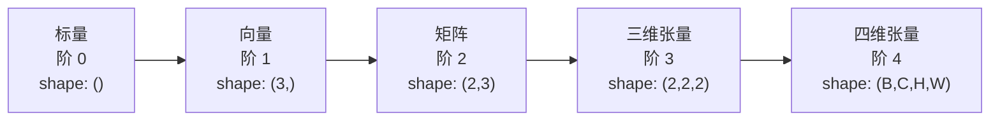
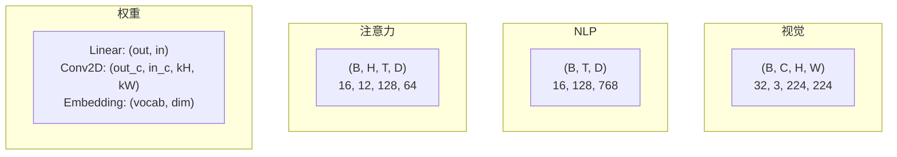
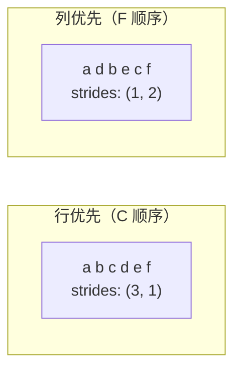
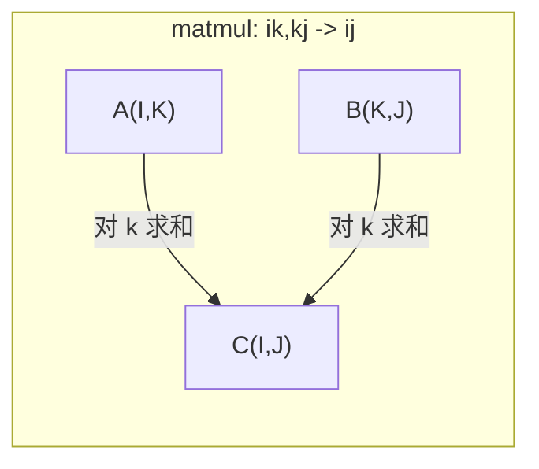

# 张量运算

> 张量是数据与深度学习之间的通用语言。每一张图像、每一个句子、每一个梯度都通过张量来流转。

**类型：** 动手构建
**语言：** Python
**前置课程：** 第一阶段，第 01 课（线性代数直觉）、第 02 课（向量、矩阵及运算）
**时间：** 约 90 分钟

## 学习目标

- 从零实现一个张量类，支持形状、步幅、reshape、转置和逐元素运算
- 应用广播（Broadcasting）规则对不同形状的张量进行运算，且无需复制数据
- 编写 einsum 表达式来实现点积、矩阵乘法、外积和批量运算
- 逐步追踪多头注意力机制中每一步的精确张量形状

## 问题背景

你构建了一个 Transformer。前向传播看起来很干净。你运行它，得到了错误：`RuntimeError: mat1 and mat2 shapes cannot be multiplied (32x768 and 512x768)`。你盯着形状看，尝试转置，现在它又说 `Expected 4D input (got 3D input)`。你加了一个 unsqueeze，别的地方又坏了。

形状错误是深度学习代码中最常见的 bug。从概念上来说它们并不难——每个运算都有形状契约——但它们会迅速叠加。一个 Transformer 有几十个 reshape、转置和广播操作链在一起。搞错一个轴，误差就会级联传播。更糟糕的是，有些形状错误根本不会抛出异常。它们会悄悄地沿着错误的维度广播或在错误的轴上求和，产生垃圾结果。

矩阵处理的是两组事物之间的成对关系。真实数据并不适合放入二维空间。一个包含 32 张 224x224 RGB 图像的批次是一个四维张量：`(32, 3, 224, 224)`。12 个头的自注意力机制也是四维的：`(batch, heads, seq_len, head_dim)`。你需要一种能推广到任意维度的数据结构，其运算能在所有维度上干净地组合。这种结构就是张量（Tensor）。掌握张量运算后，形状错误就变得易如反掌。

## 概念讲解

### 什么是张量

张量是一个具有统一数据类型的多维数组。维度的数量称为**阶**（或**秩**）。每个维度是一个**轴**。**形状**是一个元组，列出每个轴上的大小。



总元素数 = 所有维度大小的乘积。形状为 `(2, 3, 4)` 的张量包含 `2 * 3 * 4 = 24` 个元素。

### 深度学习中的张量形状

不同数据类型按照惯例映射到特定的张量形状。



PyTorch 使用 NCHW（通道优先）格式。TensorFlow 默认使用 NHWC（通道在后）格式。格式不匹配会导致静默的性能下降或错误。

### 内存布局的工作原理

内存中的二维数组是一个一维字节序列。**步幅（Strides）** 告诉你沿每个轴移动一步需要跳过多少个元素。



转置不会移动数据。它交换步幅，使张量变为**非连续的**——一行中的元素在内存中不再相邻。

### 广播规则

广播允许你对不同形状的张量进行运算，而无需复制数据。从右边开始对齐形状。当两个维度相等或其中一个为 1 时，它们是兼容的。维度较少的张量会在左侧补 1。

```
张量 A:     (8, 1, 6, 1)
张量 B:        (7, 1, 5)
补齐后的 B: (1, 7, 1, 5)
结果:       (8, 7, 6, 5)
```

### Einsum：通用张量运算

爱因斯坦求和约定（Einstein Summation）用字母标记每个轴。出现在输入中但不在输出中的轴被求和。同时出现在输入和输出中的轴被保留。



常用模式：`i,i->` （点积）、`i,j->ij`（外积）、`ii->`（矩阵的迹）、`ij->ji`（转置）、`bij,bjk->bik`（批量矩阵乘法）、`bhtd,bhsd->bhts`（注意力分数）。

## 动手构建

代码在 `code/tensors.py` 中。每一步都引用了其中的实现。

### 第 1 步：张量的存储和步幅

张量存储一个扁平的数字列表加上形状元数据。步幅告诉索引逻辑如何将多维索引映射到扁平位置。

```python
class Tensor:
    def __init__(self, data, shape=None):
        if isinstance(data, (list, tuple)):
            self._data, self._shape = self._flatten_nested(data)
        elif isinstance(data, np.ndarray):
            self._data = data.flatten().tolist()
            self._shape = tuple(data.shape)
        else:
            self._data = [data]
            self._shape = ()

        if shape is not None:
            total = reduce(lambda a, b: a * b, shape, 1)
            if total != len(self._data):
                raise ValueError(
                    f"Cannot reshape {len(self._data)} elements into shape {shape}"
                )
            self._shape = tuple(shape)

        self._strides = self._compute_strides(self._shape)

    @staticmethod
    def _compute_strides(shape):
        if len(shape) == 0:
            return ()
        strides = [1] * len(shape)
        for i in range(len(shape) - 2, -1, -1):
            strides[i] = strides[i + 1] * shape[i + 1]
        return tuple(strides)
```

对于形状 `(3, 4)`，步幅为 `(4, 1)`——跳过 4 个元素前进一行，跳过 1 个元素前进一列。

### 第 2 步：Reshape、squeeze、unsqueeze

Reshape 在不改变元素顺序的情况下改变形状。元素总数必须保持不变。可以用 `-1` 表示某个维度，让系统自动推断其大小。

```python
t = Tensor(list(range(12)), shape=(2, 6))
r = t.reshape((3, 4))
r = t.reshape((-1, 3))
```

Squeeze 移除大小为 1 的轴。Unsqueeze 插入一个大小为 1 的轴。Unsqueeze 对广播至关重要——一个偏置向量 `(D,)` 要加到批次 `(B, T, D)` 上，需要先 unsqueeze 为 `(1, 1, D)`。

```python
t = Tensor(list(range(6)), shape=(1, 3, 1, 2))
s = t.squeeze()
v = Tensor([1, 2, 3])
u = v.unsqueeze(0)
```

### 第 3 步：转置和维度置换

转置交换两个轴。Permute 重新排列所有轴。这就是在 NCHW 和 NHWC 之间转换的方法。

```python
mat = Tensor(list(range(6)), shape=(2, 3))
tr = mat.transpose(0, 1)

t4d = Tensor(list(range(24)), shape=(1, 2, 3, 4))
perm = t4d.permute((0, 2, 3, 1))
```

转置或 permute 之后，张量在内存中是非连续的。在 PyTorch 中，`view` 在非连续张量上会失败——请使用 `reshape` 或先调用 `.contiguous()`。

### 第 4 步：逐元素运算和归约

逐元素运算（加法、乘法、减法）独立地应用于每个元素，并保持形状不变。归约运算（求和、均值、最大值）沿一个或多个轴收缩。

```python
a = Tensor([[1, 2], [3, 4]])
b = Tensor([[10, 20], [30, 40]])
c = a + b
d = a * 2
s = a.sum(axis=0)
```

CNN 中的全局平均池化：`(B, C, H, W).mean(axis=[2, 3])` 生成 `(B, C)`。NLP 中的序列均值池化：`(B, T, D).mean(axis=1)` 生成 `(B, D)`。

### 第 5 步：使用 NumPy 的广播

`tensors.py` 中的 `demo_broadcasting_numpy()` 函数展示了核心模式。

```python
activations = np.random.randn(4, 3)
bias = np.array([0.1, 0.2, 0.3])
result = activations + bias

images = np.random.randn(2, 3, 4, 4)
scale = np.array([0.5, 1.0, 1.5]).reshape(1, 3, 1, 1)
result = images * scale

a = np.array([1, 2, 3]).reshape(-1, 1)
b = np.array([10, 20, 30, 40]).reshape(1, -1)
outer = a * b
```

通过广播计算成对距离：将 `(M, 2)` reshape 为 `(M, 1, 2)`，将 `(N, 2)` reshape 为 `(1, N, 2)`，相减、平方、沿最后一个轴求和、取平方根。结果：`(M, N)`。

### 第 6 步：Einsum 运算

`demo_einsum()` 和 `demo_einsum_gallery()` 函数遍历了每种常用模式。

```python
a = np.array([1.0, 2.0, 3.0])
b = np.array([4.0, 5.0, 6.0])
dot = np.einsum("i,i->", a, b)

A = np.array([[1, 2], [3, 4], [5, 6]], dtype=float)
B = np.array([[7, 8, 9], [10, 11, 12]], dtype=float)
matmul = np.einsum("ik,kj->ij", A, B)

batch_A = np.random.randn(4, 3, 5)
batch_B = np.random.randn(4, 5, 2)
batch_mm = np.einsum("bij,bjk->bik", batch_A, batch_B)
```

一次收缩的计算成本是所有索引大小（保留的和被求和的）的乘积。对于 `bij,bjk->bik`，当 B=32, I=128, J=64, K=128 时：`32 * 128 * 64 * 128 = 33,554,432` 次乘加运算。

### 第 7 步：使用 einsum 实现注意力机制

`demo_attention_einsum()` 函数端到端地实现了多头注意力。

```python
B, H, T, D = 2, 4, 8, 16
E = H * D

X = np.random.randn(B, T, E)
W_q = np.random.randn(E, E) * 0.02

Q = np.einsum("bte,ek->btk", X, W_q)
Q = Q.reshape(B, T, H, D).transpose(0, 2, 1, 3)

scores = np.einsum("bhtd,bhsd->bhts", Q, K) / np.sqrt(D)
weights = softmax(scores, axis=-1)
attn_output = np.einsum("bhts,bhsd->bhtd", weights, V)

concat = attn_output.transpose(0, 2, 1, 3).reshape(B, T, E)
output = np.einsum("bte,ek->btk", concat, W_o)
```

每一步都是张量运算：投影（通过 einsum 的矩阵乘法）、头分割（reshape + 转置）、注意力分数（通过 einsum 的批量矩阵乘法）、加权求和（通过 einsum 的批量矩阵乘法）、头合并（转置 + reshape）、输出投影（通过 einsum 的矩阵乘法）。

## 使用方式

### 自制版 vs NumPy

| 运算 | 自制版（Tensor 类） | NumPy |
|---|---|---|
| 创建 | `Tensor([[1,2],[3,4]])` | `np.array([[1,2],[3,4]])` |
| Reshape | `t.reshape((3,4))` | `a.reshape(3,4)` |
| 转置 | `t.transpose(0,1)` | `a.T` 或 `a.transpose(0,1)` |
| Squeeze | `t.squeeze(0)` | `np.squeeze(a, 0)` |
| 求和 | `t.sum(axis=0)` | `a.sum(axis=0)` |
| Einsum | 不支持 | `np.einsum("ij,jk->ik", a, b)` |

### 自制版 vs PyTorch

```python
import torch

t = torch.tensor([[1, 2, 3], [4, 5, 6]], dtype=torch.float32)
t.shape
t.stride()
t.is_contiguous()

t.reshape(3, 2)
t.unsqueeze(0)
t.transpose(0, 1)
t.transpose(0, 1).contiguous()

torch.einsum("ik,kj->ij", A, B)
```

PyTorch 额外提供了自动微分、GPU 支持和优化的 BLAS 内核。形状语义是完全相同的。如果你理解了自制版本，PyTorch 的形状错误就变得可读了。

### 每个神经网络层都是一个张量运算

| 运算 | 张量形式 | Einsum |
|---|---|---|
| 线性层 | `Y = X @ W.T + b` | `"bd,od->bo"` + 偏置 |
| 注意力 QKV | `Q = X @ W_q` | `"btd,dh->bth"` |
| 注意力分数 | `Q @ K.T / sqrt(d)` | `"bhtd,bhsd->bhts"` |
| 注意力输出 | `softmax(scores) @ V` | `"bhts,bhsd->bhtd"` |
| 批归一化 | `(X - mu) / sigma * gamma` | 逐元素 + 广播 |
| Softmax | `exp(x) / sum(exp(x))` | 逐元素 + 归约 |

## 交付产出

本课程产出两个可复用的 prompt：

1. **`outputs/prompt-tensor-shapes.md`** —— 一个系统性的 prompt，用于调试张量形状不匹配问题。包含每种常用运算（matmul、广播、cat、Linear、Conv2d、BatchNorm、softmax）的决策表和修复查询表。

2. **`outputs/prompt-tensor-debugger.md`** —— 一个分步调试 prompt，当形状错误阻碍你时，可以粘贴到任何 AI 助手中。输入错误消息和你的张量形状，即可得到精确的修复方案。

## 练习

1. **简单 -- Reshape 往返。** 取一个形状为 `(2, 3, 4)` 的张量。将其 reshape 为 `(6, 4)`，再到 `(24,)`，再回到 `(2, 3, 4)`。通过打印扁平数据，验证每一步的元素顺序是否保持不变。

2. **中等 -- 实现广播。** 为 `Tensor` 类添加一个 `broadcast_to(shape)` 方法，将大小为 1 的维度扩展到匹配目标形状。然后修改 `_elementwise_op` 使其在运算前自动广播。用形状 `(3, 1)` 和 `(1, 4)` 测试，预期生成 `(3, 4)`。

3. **困难 -- 从零构建 einsum。** 实现一个基本的 `einsum(subscripts, *tensors)` 函数，至少处理：点积（`i,i->`）、矩阵乘法（`ij,jk->ik`）、外积（`i,j->ij`）和转置（`ij->ji`）。解析下标字符串，识别收缩索引，遍历所有索引组合。将结果与 `np.einsum` 进行比较。

4. **困难 -- 注意力形状追踪器。** 编写一个函数，接受 `batch_size`、`seq_len`、`embed_dim` 和 `num_heads` 作为输入，打印多头注意力每一步的精确形状：输入、Q/K/V 投影、头分割、注意力分数、softmax 权重、加权求和、头合并、输出投影。与 `demo_attention_einsum()` 的输出进行验证。

## 关键术语

| 术语 | 通俗说法 | 准确含义 |
|---|---|---|
| 张量 | "多维矩阵" | 具有统一类型、定义了形状、步幅和运算的多维数组 |
| 阶 | "维度的数量" | 轴的数量。矩阵的阶为 2，不要和矩阵秩混淆 |
| 形状 | "张量的大小" | 列出每个轴大小的元组。`(2, 3)` 表示 2 行 3 列 |
| 步幅 | "内存的排列方式" | 沿每个轴前进一个位置需要跳过的元素数 |
| 广播 | "形状不同也能运算" | 一套严格的规则：从右侧对齐，维度必须相等或其中一个为 1 |
| 连续 | "张量是正常的" | 元素在内存中按逻辑布局顺序连续存储，没有间隙或重排 |
| Einsum | "花哨的矩阵乘法写法" | 一种通用符号，可在一行中表达任意张量收缩、外积、迹或转置 |
| View | "和 reshape 一样" | 共享相同内存缓冲区但具有不同形状/步幅元数据的张量。在非连续数据上会失败 |
| 收缩 | "对一个索引求和" | 两个张量的共享索引进行逐元素乘法后求和的通用运算，产生阶更低的结果 |
| NCHW / NHWC | "PyTorch 格式 vs TensorFlow 格式" | 图像张量的内存布局约定。NCHW 把通道放在空间维度之前，NHWC 把通道放在之后 |

## 延伸阅读

- [NumPy Broadcasting](https://numpy.org/doc/stable/user/basics.broadcasting.html) -- 规范的广播规则与可视化示例
- [PyTorch Tensor Views](https://pytorch.org/docs/stable/tensor_view.html) -- view 何时有效，何时会复制数据
- [einops](https://github.com/arogozhnikov/einops) -- 一个让张量 reshape 变得可读且安全的库
- [The Illustrated Transformer](https://jalammar.github.io/illustrated-transformer/) -- 可视化注意力机制中流转的张量形状
- [Einstein Summation in NumPy](https://numpy.org/doc/stable/reference/generated/numpy.einsum.html) -- 完整的 einsum 文档及示例
