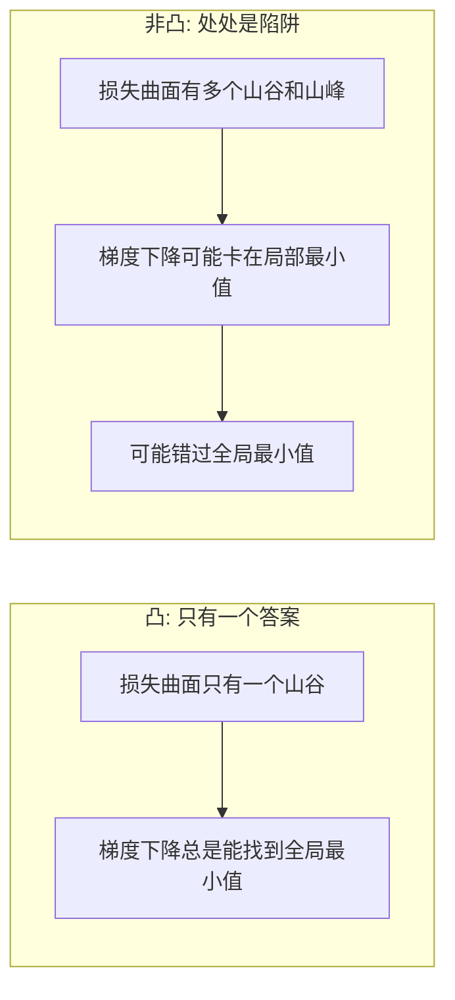
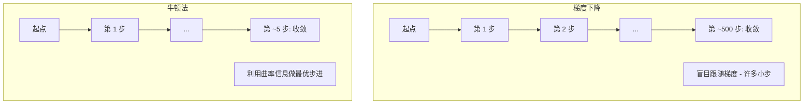
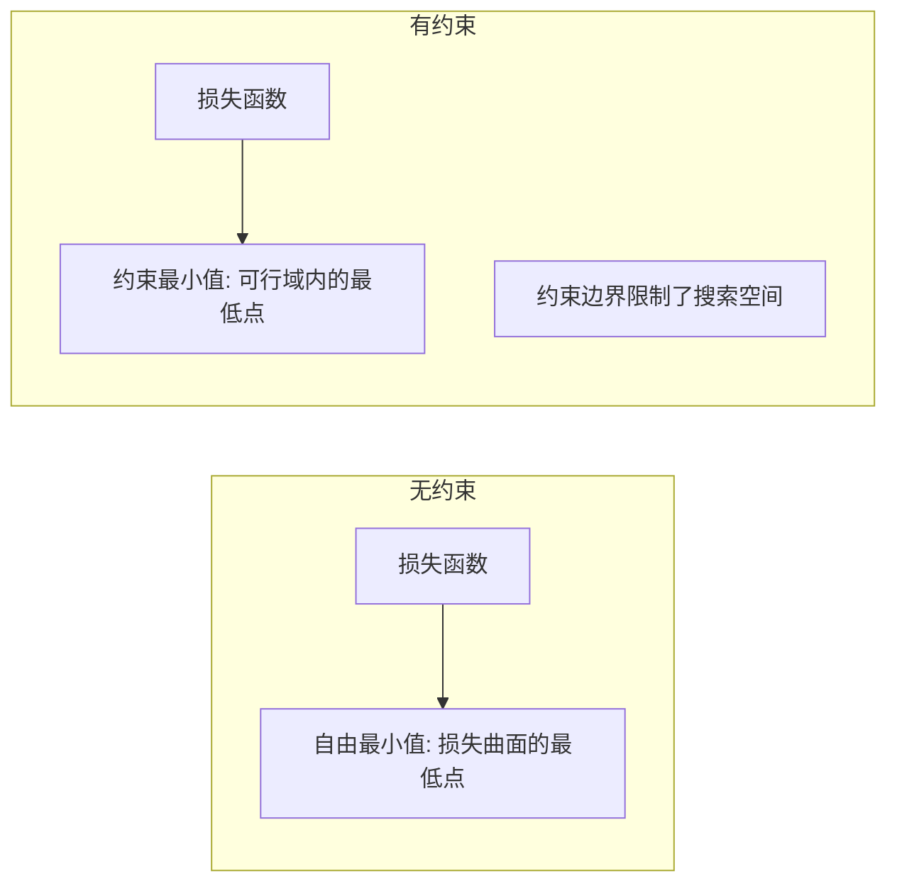
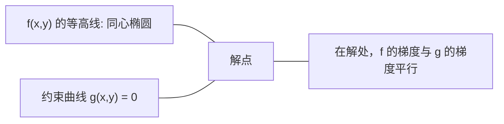

# 凸优化

> 凸问题只有一个山谷。神经网络有数百万个。了解两者的区别至关重要。

**类型：** 动手构建
**语言：** Python
**前置课程：** 第 1 阶段，第 04 课（ML 微积分）、第 08 课（优化）
**时间：** 约 90 分钟

## 学习目标

- 使用定义、二阶导数和 Hessian 矩阵准则检验函数是否为凸函数
- 实现牛顿法（Newton's Method）并将其二次收敛速度与梯度下降法进行比较
- 使用拉格朗日乘数法（Lagrange Multipliers）求解约束优化问题，并解释 KKT 条件
- 解释为什么神经网络的损失曲面是非凸的，但 SGD 仍能找到好的解

## 问题背景

第 08 课教你学习了梯度下降法、动量法和 Adam。这些优化器在任何曲面上沿下坡方向行走，但它们不提供任何保证。在非凸曲面上做梯度下降可能陷入差的局部最小值、卡在鞍点上，或者永远震荡。你照用不误，因为神经网络是非凸的，别无选择。

但机器学习中有许多问题是凸的。线性回归、逻辑回归、SVM、LASSO、岭回归。对于这些问题，存在更强大的工具：带有数学保证的优化方法。凸问题恰好只有一个山谷。任何沿下坡方向行走的算法都会到达全局最小值。不需要重启，不需要学习率调度，不需要碰运气。

理解凸性有三个作用。第一，它告诉你问题何时是简单的（凸）、何时是困难的（非凸）。第二，它为凸问题提供更快的工具，如牛顿法。第三，它解释了贯穿 ML 的概念：正则化即约束、SVM 中的对偶性，以及为什么深度学习在违反凸性给你的一切好性质的情况下仍然能工作。

## 概念讲解

### 凸集

集合 S 是凸的，如果 S 中任意两点之间的线段也完全在 S 内。

| 凸集 | 非凸集 |
|---|---|
| **矩形**：内部任意两点的连线段始终在内部 | **星形/月牙形**：两个内部点之间的连线可能穿出集合 |
| **三角形**：对所有内部点都成立 | **环形**：中间的空洞意味着某些线段会离开集合 |
| 任意两点间的线段始终在集合内 | 某些点对之间的线段会离开集合 |

形式化检验：对 S 中任意点 x、y 和任意 t 属于 [0, 1]，点 tx + (1-t)y 也在 S 中。

凸集的例子：
- 一条直线、一个平面、整个 R^n
- 一个球（圆、球体、超球体）
- 一个半空间：{x : a^T x <= b}
- 任意数量凸集的交集

非凸集的例子：
- 环形（圆环）
- 两个不相交的圆的并集
- 任何有"凹陷"或"空洞"的集合

### 凸函数

函数 f 是凸的，如果它的定义域是凸集，并且对定义域中任意两点 x、y 和任意 t 属于 [0, 1]：

```
f(tx + (1-t)y) <= t*f(x) + (1-t)*f(y)
```

几何含义：图像上任意两点之间的线段位于图像的上方或恰好在图像上。

| 性质 | 凸函数 | 非凸函数 |
|---|---|---|
| **线段检验** | 图像上任意两点之间的连线位于曲线**上方或恰好在曲线上** | 某些点之间的连线会**低于**曲线 |
| **形状** | 单一碗形/山谷，向上弯曲 | 有多个峰和谷，曲率方向混合 |
| **局部最小值** | 每个局部最小值都是全局最小值 | 可能存在多个高度不同的局部最小值 |

常见的凸函数：
- f(x) = x^2（抛物线）
- f(x) = |x|（绝对值）
- f(x) = e^x（指数函数）
- f(x) = max(0, x)（ReLU，分段线性）
- f(x) = -log(x)，x > 0（负对数）
- 任何线性函数 f(x) = a^T x + b（既是凸的也是凹的）

### 凸性检验

三种实用检验方法，从最简单到最严格。

**检验 1：二阶导数检验（一维）。** 如果对所有 x 都有 f''(x) >= 0，则 f 是凸的。

- f(x) = x^2: f''(x) = 2 >= 0。凸。
- f(x) = x^3: f''(x) = 6x。当 x < 0 时为负。非凸。
- f(x) = e^x: f''(x) = e^x > 0。凸。

**检验 2：Hessian 检验（多元）。** 如果 Hessian 矩阵 H(x) 对所有 x 都是半正定的，则 f 是凸的。Hessian 矩阵是二阶偏导数组成的矩阵。

**检验 3：定义检验。** 直接验证不等式 f(tx + (1-t)y) <= t*f(x) + (1-t)*f(y)。适用于导数难以计算的函数。

### 凸性为什么重要

凸优化的核心定理：

**对于凸函数，每个局部最小值都是全局最小值。**

这意味着梯度下降不会被困住。任何下坡路径都通向同一个答案。算法保证收敛到最优解。



由此带来的好处：
- 不需要随机重启
- 不需要精心设计的学习率调度
- 可以证明收敛性（收敛速度取决于函数的性质）
- 解是唯一的（平坦区域除外）

### ML 中的凸与非凸

| 问题 | 是否凸？ | 原因 |
|---------|---------|-----|
| 线性回归 (MSE) | 是 | 损失关于权重是二次的 |
| 逻辑回归 | 是 | 对数损失关于权重是凸的 |
| SVM（合页损失） | 是 | 线性函数的最大值 |
| LASSO（L1 回归） | 是 | 凸函数之和仍为凸 |
| 岭回归（L2） | 是 | 二次 + 二次 = 凸 |
| 神经网络（任意损失） | 否 | 非线性激活函数产生非凸曲面 |
| k-means 聚类 | 否 | 离散的分配步骤 |
| 矩阵分解 | 否 | 未知量的乘积 |

具有凸损失的线性模型是凸的。一旦加入带有非线性激活函数的隐藏层，凸性就被打破了。

### Hessian 矩阵

函数 f: R^n -> R 的 Hessian 矩阵 H 是由二阶偏导数组成的 n x n 矩阵。

```
H[i][j] = d^2 f / (dx_i dx_j)
```

对于 f(x, y) = x^2 + 3xy + y^2：

```
df/dx = 2x + 3y       d^2f/dx^2 = 2      d^2f/dxdy = 3
df/dy = 3x + 2y       d^2f/dydx = 3      d^2f/dy^2 = 2

H = [ 2  3 ]
    [ 3  2 ]
```

Hessian 矩阵描述了曲率信息：
- 特征值全为正：函数在每个方向上都向上弯曲（该点处为凸）
- 特征值全为负：在每个方向上都向下弯曲（凹的，局部极大值）
- 符号混合：鞍点（某些方向向上弯，某些方向向下弯）
- 特征值为零：在该方向上平坦（退化的）

要判定凸性，Hessian 矩阵必须在所有点上都是半正定的（所有特征值 >= 0），不是仅在某一点。

### 牛顿法

梯度下降使用一阶信息（梯度）。牛顿法使用二阶信息（Hessian 矩阵）。它在当前点拟合一个二次近似，然后直接跳到该二次函数的最小值处。

```
更新规则:
  x_new = x - H^(-1) * gradient

对比梯度下降:
  x_new = x - lr * gradient
```

牛顿法用 Hessian 逆矩阵取代了标量学习率。这根据局部曲率自动调整步长和方向。



优点：
- 在最小值附近具有二次收敛速度（误差每步平方缩小）
- 无需调学习率
- 尺度不变（无论怎样参数化问题都有效）

缺点：
- 计算 Hessian 矩阵需要 O(n^2) 内存，求逆需要 O(n^3) 运算
- 对于有 100 万权重的神经网络，这意味着 10^12 个元素和 10^18 次运算
- 对深度学习不实用

### 约束优化

无约束优化：在所有 x 上最小化 f(x)。
约束优化：在约束条件下最小化 f(x)。

实际问题都有约束。你想最小化成本但预算有限。你想最小化误差但模型复杂度受限。



### 拉格朗日乘数法

拉格朗日乘数法将约束问题转化为无约束问题。

问题：最小化 f(x)，约束 g(x) = 0。

解法：引入一个新变量（拉格朗日乘数 lambda），求解无约束问题：

```
L(x, lambda) = f(x) + lambda * g(x)
```

在解处，L 的梯度为零：

```
dL/dx = df/dx + lambda * dg/dx = 0
dL/dlambda = g(x) = 0
```

几何直觉：在约束最小值处，f 的梯度必须与约束 g 的梯度平行。如果不平行，你就可以沿着约束曲面移动来进一步减小 f。



示例：最小化 f(x,y) = x^2 + y^2，约束 x + y = 1。

```
L = x^2 + y^2 + lambda(x + y - 1)

dL/dx = 2x + lambda = 0  =>  x = -lambda/2
dL/dy = 2y + lambda = 0  =>  y = -lambda/2
dL/dlambda = x + y - 1 = 0

由前两个方程: x = y
代入: 2x = 1, 所以 x = y = 0.5, lambda = -1
```

直线 x + y = 1 上距原点最近的点是 (0.5, 0.5)。

### KKT 条件

KKT 条件（Karush-Kuhn-Tucker 条件）将拉格朗日乘数法扩展到不等式约束。

问题：最小化 f(x)，约束 g_i(x) <= 0，i = 1, ..., m。

KKT 条件（最优性的必要条件）：

```
1. 稳定性:          df/dx + sum(lambda_i * dg_i/dx) = 0
2. 原始可行性:      g_i(x) <= 0  对所有 i
3. 对偶可行性:      lambda_i >= 0  对所有 i
4. 互补松弛性:      lambda_i * g_i(x) = 0  对所有 i
```

互补松弛性是核心洞见：要么约束是激活的（g_i = 0，解位于边界上），要么乘数为零（约束不起作用）。不影响解的约束其 lambda = 0。

KKT 条件是 SVM 的核心。支持向量就是约束激活（lambda > 0）的那些数据点。所有其他数据点的 lambda = 0，不影响决策边界。

### 正则化即约束优化

L1 和 L2 正则化不是随意的技巧。它们本质上是伪装的约束优化问题。

**L2 正则化（岭回归）：**

```
minimize  Loss(w)  subject to  ||w||^2 <= t

等价的无约束形式:
minimize  Loss(w) + lambda * ||w||^2
```

约束 ||w||^2 <= t 定义了一个球（二维中是圆，三维中是球）。解是损失等高线首次触碰这个球的位置。

**L1 正则化（LASSO）：**

```
minimize  Loss(w)  subject to  ||w||_1 <= t

等价的无约束形式:
minimize  Loss(w) + lambda * ||w||_1
```

约束 ||w||_1 <= t 定义了一个菱形（二维中是旋转的正方形）。

| 性质 | L2 约束（圆） | L1 约束（菱形） |
|---|---|---|
| **约束形状** | 圆（高维中为球） | 菱形（二维中为旋转的正方形） |
| **损失等高线触碰位置** | 光滑的边界——圆上的任意点 | 角点——与坐标轴对齐 |
| **解的行为** | 权重较小但非零 | 某些权重恰好为零（稀疏） |
| **结果** | 权重收缩 | 特征选择 |

这解释了为什么 L1 产生稀疏模型（特征选择）而 L2 只收缩权重。菱形的角点与坐标轴对齐。损失等高线更容易触碰角点，使一个或多个权重恰好为零。

### 对偶性

每个约束优化问题（原问题）都有一个对应的伴随问题（对偶问题）。对于凸问题，原问题和对偶问题的最优值相同。这就是强对偶性。

拉格朗日对偶函数：

```
原问题: minimize f(x) subject to g(x) <= 0
拉格朗日函数: L(x, lambda) = f(x) + lambda * g(x)
对偶函数: d(lambda) = min_x L(x, lambda)
对偶问题: maximize d(lambda) subject to lambda >= 0
```

对偶性为什么重要：
- 对偶问题有时比原问题更容易求解
- SVM 就是在对偶形式下求解的，其中问题只涉及数据点之间的内积（从而实现核技巧）
- 对偶提供了原问题最优值的下界，可用于检验解的质量

具体到 SVM：

```
原问题: 找到 w, b 使得间隔 2/||w|| 最大，约束为
        y_i(w^T x_i + b) >= 1 对所有 i

对偶:   maximize sum(alpha_i) - 0.5 * sum_ij(alpha_i * alpha_j * y_i * y_j * x_i^T x_j)
        subject to alpha_i >= 0 and sum(alpha_i * y_i) = 0

对偶只涉及内积 x_i^T x_j。
将 x_i^T x_j 替换为 K(x_i, x_j) 就得到了核技巧。
```

### 为什么深度学习在非凸条件下仍然有效

神经网络的损失函数是极其非凸的。按照经典理论的每一条标准，优化它们都应该失败。然而随机梯度下降法可靠地找到了好的解。有几个因素可以解释这一现象。

**大多数局部最小值已经足够好了。** 在高维空间中，随机临界点（梯度为零的点）绝大多数是鞍点，而非局部最小值。存在的少数局部最小值其损失值往往接近全局最小值。当参数空间有数百万维度时，陷入一个很差的局部最小值的概率极低。

**鞍点才是真正的障碍，而不是局部最小值。** 在一个有 n 个参数的函数中，鞍点在某些方向上具有正曲率，在另一些方向上具有负曲率。对于高维中的随机临界点，所有 n 个特征值都为正（局部最小值）的概率大约为 2^(-n)。几乎所有临界点都是鞍点。SGD 的噪声有助于逃离鞍点。

**过参数化平滑了损失曲面。** 参数比训练样本多的网络具有更平滑、更连通的损失曲面。更宽的网络有更少的坏局部最小值。这虽然反直觉，但在实验中一致成立。

**损失曲面的结构：**

| 性质 | 低维空间 | 高维空间 |
|---|---|---|
| **曲面** | 许多孤立的峰和谷 | 平滑连通的山谷 |
| **极小值** | 许多孤立的局部最小值 | 很少有坏的局部最小值；大多数接近最优 |
| **导航** | 难以找到全局最小值 | 许多路径通向好的解 |
| **临界点** | 局部最小值和鞍点混合 | 绝大多数是鞍点，不是局部最小值 |

**随机噪声起到隐式正则化作用。** 小批量 SGD 添加的噪声防止优化过程落入尖锐的最小值。尖锐的最小值导致过拟合；平坦的最小值泛化能力好。噪声使优化过程偏向损失曲面的平坦区域。

### 二阶方法在实践中的应用

纯粹的牛顿法对大模型不实用。以下几种近似方法使二阶信息变得可用。

**L-BFGS（有限内存 BFGS）：** 利用最近 m 次梯度差来近似 Hessian 逆矩阵。内存需求为 O(mn) 而非 O(n^2)。适用于最多约 10,000 个参数的问题。用于经典 ML（逻辑回归、CRF）但不用于深度学习。

**自然梯度（Natural Gradient）：** 使用 Fisher 信息矩阵（对数似然函数的 Hessian 期望）代替标准 Hessian。这考虑了概率分布的几何结构。K-FAC（Kronecker 因子化近似曲率）将 Fisher 矩阵近似为 Kronecker 积，使其在神经网络中可行。

**无 Hessian 优化（Hessian-free Optimization）：** 使用共轭梯度法求解 Hx = g，无需显式构建 H。只需要 Hessian-向量积，可以通过自动微分以 O(n) 时间计算。

**对角近似：** Adam 的二阶矩就是对 Hessian 对角线的对角近似。AdaHessian 通过 Hutchinson 估计器使用实际的 Hessian 对角元素来扩展这一方法。

| 方法 | 内存 | 每步代价 | 适用场景 |
|--------|--------|--------------|-------------|
| 梯度下降 | O(n) | O(n) | 基准方法，大模型 |
| 牛顿法 | O(n^2) | O(n^3) | 小型凸问题 |
| L-BFGS | O(mn) | O(mn) | 中型凸问题 |
| Adam | O(n) | O(n) | 深度学习默认选择 |
| K-FAC | O(n) | O(n) 每层 | 研究用途，大批量训练 |

## 动手构建

### 第 1 步：凸性检验器

构建一个通过采样点并检验定义来经验性地检测凸性的函数。

```python
import random
import math

def check_convexity(f, dim, bounds=(-5, 5), samples=1000):
    violations = 0
    for _ in range(samples):
        x = [random.uniform(*bounds) for _ in range(dim)]
        y = [random.uniform(*bounds) for _ in range(dim)]
        t = random.uniform(0, 1)
        mid = [t * xi + (1 - t) * yi for xi, yi in zip(x, y)]
        lhs = f(mid)
        rhs = t * f(x) + (1 - t) * f(y)
        if lhs > rhs + 1e-10:
            violations += 1
    return violations == 0, violations
```

### 第 2 步：二维牛顿法

使用显式 Hessian 矩阵实现牛顿法。将收敛速度与梯度下降法进行比较。

```python
def newtons_method(f, grad_f, hessian_f, x0, steps=50, tol=1e-12):
    x = list(x0)
    history = [x[:]]
    for _ in range(steps):
        g = grad_f(x)
        H = hessian_f(x)
        det = H[0][0] * H[1][1] - H[0][1] * H[1][0]
        if abs(det) < 1e-15:
            break
        H_inv = [
            [H[1][1] / det, -H[0][1] / det],
            [-H[1][0] / det, H[0][0] / det],
        ]
        dx = [
            H_inv[0][0] * g[0] + H_inv[0][1] * g[1],
            H_inv[1][0] * g[0] + H_inv[1][1] * g[1],
        ]
        x = [x[0] - dx[0], x[1] - dx[1]]
        history.append(x[:])
        if sum(gi ** 2 for gi in g) < tol:
            break
    return history
```

### 第 3 步：拉格朗日乘数求解器

通过对拉格朗日函数做梯度下降来求解约束优化问题。

```python
def lagrange_solve(f_grad, g_val, g_grad, x0, lr=0.01,
                   lr_lambda=0.01, steps=5000):
    x = list(x0)
    lam = 0.0
    history = []
    for _ in range(steps):
        fg = f_grad(x)
        gv = g_val(x)
        gg = g_grad(x)
        x = [
            xi - lr * (fgi + lam * ggi)
            for xi, fgi, ggi in zip(x, fg, gg)
        ]
        lam = lam + lr_lambda * gv
        history.append((x[:], lam, gv))
    return history
```

### 第 4 步：一阶方法与二阶方法的对比

在同一个二次函数上运行梯度下降和牛顿法。统计收敛所需的步数。

```python
def quadratic(x):
    return 5 * x[0] ** 2 + x[1] ** 2

def quadratic_grad(x):
    return [10 * x[0], 2 * x[1]]

def quadratic_hessian(x):
    return [[10, 0], [0, 2]]
```

牛顿法将在 1 步内收敛（对二次函数是精确的）。梯度下降则需要数百步，因为 Hessian 矩阵的特征值相差 5 倍，形成了一个狭长的山谷。

## 实际应用

凸性分析直接影响 ML 模型和求解器的选择。

对于凸问题（逻辑回归、SVM、LASSO）：
- 使用专用求解器（liblinear、CVXPY、scipy.optimize.minimize 配合 method='L-BFGS-B'）
- 期望得到唯一的全局解
- 二阶方法实用且高效

对于非凸问题（神经网络）：
- 使用一阶方法（SGD、Adam）
- 接受解取决于初始化和随机性的事实
- 利用过参数化、噪声和学习率调度作为隐式正则化
- 不要浪费时间寻找全局最小值。一个好的局部最小值就够了。

```python
from scipy.optimize import minimize

result = minimize(
    fun=lambda w: sum((y - X @ w) ** 2) + 0.1 * sum(w ** 2),
    x0=np.zeros(d),
    method='L-BFGS-B',
    jac=lambda w: -2 * X.T @ (y - X @ w) + 0.2 * w,
)
```

对于 SVM，对偶形式让你使用核技巧：

```python
from sklearn.svm import SVC

svm = SVC(kernel='rbf', C=1.0)
svm.fit(X_train, y_train)
print(f"Support vectors: {svm.n_support_}")
```

## 练习

1. **凸性检验库。** 用检验器测试以下函数的凸性：f(x) = x^4, f(x) = sin(x), f(x,y) = x^2 + y^2, f(x,y) = x*y, f(x) = max(x, 0)。解释每个结果为什么合理。

2. **牛顿法 vs 梯度下降竞赛。** 从起点 (10, 10) 对 f(x,y) = 50*x^2 + y^2 分别运行两种方法。每种需要多少步才能达到损失 < 1e-10？当条件数（Hessian 矩阵最大与最小特征值之比）增大时，梯度下降会怎样？

3. **拉格朗日乘数几何。** 在约束 x + 2y = 4 下最小化 f(x,y) = (x-3)^2 + (y-3)^2。通过检验在解处 f 的梯度是否与 g 的梯度平行来验证结果。

4. **正则化约束。** 实现 L1 约束优化：在 |x| + |y| <= 1 约束下最小化 (x-3)^2 + (y-2)^2。证明解中有一个坐标恰好为零（菱形约束产生的稀疏性）。

5. **Hessian 特征值分析。** 在 (1,1) 和 (-1,1) 处计算 Rosenbrock 函数的 Hessian 矩阵，并计算两处的特征值。特征值关于最小值处和远离最小值处的曲率告诉你什么？

## 关键术语

| 术语 | 含义 |
|------|---------------|
| 凸集 | 集合中任意两点之间的线段始终在集合内部 |
| 凸函数 | 图像上任意两点之间的连线位于图像的上方或恰好在图像上。等价地，Hessian 矩阵在所有点上半正定 |
| 局部最小值 | 比所有邻近点都低的点。对凸函数而言，每个局部最小值都是全局最小值 |
| 全局最小值 | 函数在整个定义域上的最低点 |
| Hessian 矩阵 | 所有二阶偏导数组成的矩阵。编码曲率信息 |
| 半正定 | 所有特征值都非负的矩阵。是"二阶导数 >= 0"的多维推广 |
| 条件数 | Hessian 矩阵最大特征值与最小特征值之比。条件数高意味着狭长的山谷和缓慢的梯度下降 |
| 牛顿法 | 使用 Hessian 逆矩阵确定步长和方向的二阶优化器。在最小值附近具有二次收敛速度 |
| 拉格朗日乘数 | 为将约束优化问题转化为无约束问题而引入的变量 |
| KKT 条件 | 不等式约束下最优性的必要条件。是拉格朗日乘数法的推广 |
| 互补松弛性 | 在解处，要么约束是激活的，要么其乘数为零。不会两者同时非零 |
| 对偶性 | 每个约束问题都有一个对应的对偶问题。对凸问题而言，两者具有相同的最优值 |
| 强对偶性 | 原问题与对偶问题的最优值相等。在满足 Slater 条件的凸问题中成立 |
| L-BFGS | 近似二阶方法，存储最近 m 次梯度差而非完整 Hessian 矩阵 |
| 鞍点 | 梯度为零但在某些方向是极小值、在另一些方向是极大值的点 |
| 过参数化 | 使用比训练样本更多的参数。平滑损失曲面并减少坏的局部最小值 |

## 延伸阅读

- [Boyd & Vandenberghe: Convex Optimization](https://web.stanford.edu/~boyd/cvxbook/) - 标准教科书，可免费在线获取
- [Bottou, Curtis, Nocedal: Optimization Methods for Large-Scale Machine Learning (2018)](https://arxiv.org/abs/1606.04838) - 连接凸优化理论与深度学习实践的桥梁
- [Choromanska et al.: The Loss Surfaces of Multilayer Networks (2015)](https://arxiv.org/abs/1412.0233) - 为什么非凸的神经网络损失曲面没有看上去那么糟糕
- [Nocedal & Wright: Numerical Optimization](https://link.springer.com/book/10.1007/978-0-387-40065-5) - 关于牛顿法、L-BFGS 和约束优化的综合参考
