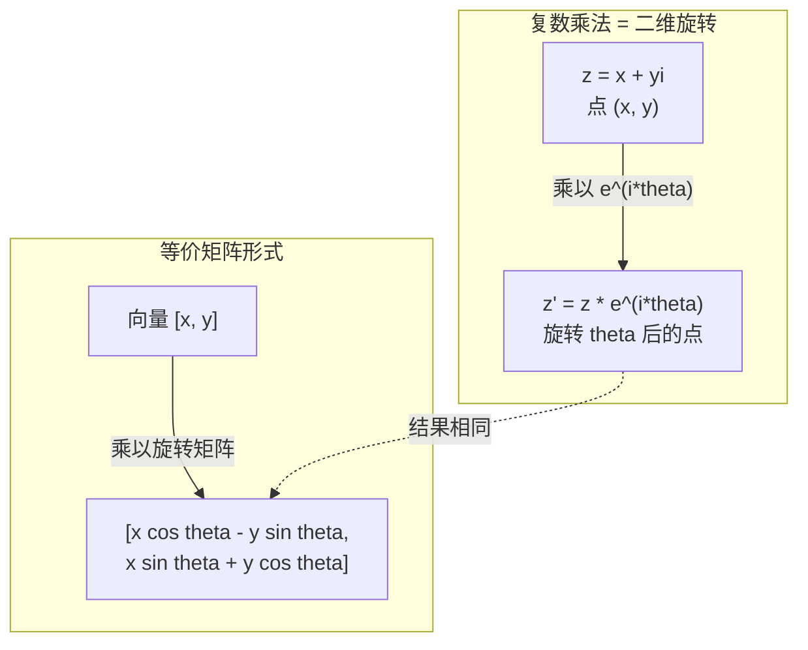
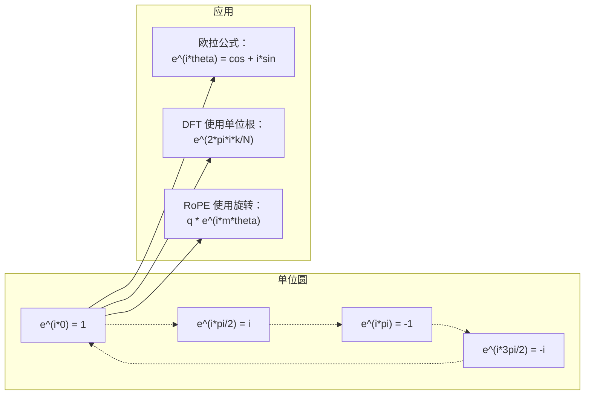

# 面向 AI 的复数

> -1 的平方根并非"虚构"的。它是理解旋转、频率以及半个信号处理领域的关键。

**类型：** 学习
**语言：** Python
**前置知识：** 第 1 阶段，第 01-04 课（线性代数、微积分）
**时间：** 约 60 分钟

## 学习目标

- 在直角坐标形式和极坐标形式下进行复数运算（加、乘、除、共轭）
- 运用欧拉公式（Euler's formula）在复指数与三角函数之间进行转换
- 利用单位根实现离散傅里叶变换（Discrete Fourier Transform）
- 解释复数旋转如何构成 Transformer 中 RoPE 和正弦位置编码的基础

## 问题引入

你打开一篇关于傅里叶变换的论文，到处都是 `i`。你查看 Transformer 的位置编码，发现不同频率的 `sin` 和 `cos` —— 复指数的实部和虚部。你读到量子计算的内容，发现一切都用复向量空间来表达。

复数看起来很抽象。一个建立在 -1 的平方根之上的数系，感觉像是一种数学技巧。但它不是技巧，而是旋转和振荡的自然语言。每当有东西旋转、振动或振荡时，复数就是最合适的工具。

如果不理解复数，你就无法理解离散傅里叶变换，无法理解 FFT，无法理解现代语言模型中 RoPE（旋转位置编码，Rotary Position Embedding）的工作原理，也无法理解原始 Transformer 论文中正弦位置编码为何采用那些特定频率。

本课从零开始构建复数运算，将其与几何联系起来，并向你展示复数在机器学习中究竟出现在哪些地方。

## 核心概念

### 什么是复数？

复数由两部分组成：实部和虚部。

```
z = a + bi

其中：
  a 是实部
  b 是虚部
  i 是虚数单位，定义为 i^2 = -1
```

就是这样。你把数轴扩展成了一个平面。实数在一个轴上，虚数在另一个轴上。每个复数都是这个平面上的一个点。

### 复数运算

**加法。** 实部相加，虚部相加。

```
(a + bi) + (c + di) = (a + c) + (b + d)i

示例：(3 + 2i) + (1 + 4i) = 4 + 6i
```

**乘法。** 使用分配律，并记住 i^2 = -1。

```
(a + bi)(c + di) = ac + adi + bci + bdi^2
                 = ac + adi + bci - bd
                 = (ac - bd) + (ad + bc)i

示例：(3 + 2i)(1 + 4i) = 3 + 12i + 2i + 8i^2
                        = 3 + 14i - 8
                        = -5 + 14i
```

**共轭。** 翻转虚部的符号。

```
(a + bi) 的共轭 = a - bi
```

一个复数与其共轭的乘积总是实数：

```
(a + bi)(a - bi) = a^2 + b^2
```

**除法。** 将分子和分母同时乘以分母的共轭。

```
(a + bi) / (c + di) = (a + bi)(c - di) / (c^2 + d^2)
```

这样就消除了分母中的虚部，得到一个简洁的复数结果。

### 复平面

复平面将每个复数映射为一个二维点。水平轴是实轴，垂直轴是虚轴。

```
z = 3 + 2i  对应点 (3, 2)
z = -1 + 0i 对应实轴上的点 (-1, 0)
z = 0 + 4i  对应虚轴上的点 (0, 4)
```

一个复数同时是一个点和一个从原点出发的向量。这种双重解释使得复数在几何中非常有用。

### 极坐标形式

平面上的任何点都可以用它到原点的距离和它与正实轴的夹角来描述。

```
z = r * (cos(theta) + i*sin(theta))

其中：
  r = |z| = sqrt(a^2 + b^2)     （模，即大小）
  theta = atan2(b, a)             （辐角，即相位）
```

直角坐标形式 (a + bi) 适合做加法。极坐标形式 (r, theta) 适合做乘法。

**极坐标形式下的乘法。** 模相乘，辐角相加。

```
z1 = r1 * e^(i*theta1)
z2 = r2 * e^(i*theta2)

z1 * z2 = (r1 * r2) * e^(i*(theta1 + theta2))
```

这就是为什么复数天然适合表示旋转。乘以一个模为 1 的复数就是纯旋转。

### 欧拉公式

连接复指数与三角函数的桥梁：

```
e^(i*theta) = cos(theta) + i*sin(theta)
```

这是本课最重要的公式。当 theta = pi 时：

```
e^(i*pi) = cos(pi) + i*sin(pi) = -1 + 0i = -1

因此：e^(i*pi) + 1 = 0
```

五个基本常数（e、i、pi、1、0）联结在一个等式中。

### 为什么欧拉公式对机器学习很重要

欧拉公式表明，当 theta 变化时，`e^(i*theta)` 在单位圆上描迹。theta = 0 时在 (1, 0)，theta = pi/2 时在 (0, 1)，theta = pi 时在 (-1, 0)，theta = 3*pi/2 时在 (0, -1)。完整一圈对应 theta = 2*pi。

这意味着复指数就是旋转。而旋转在信号处理和机器学习中无处不在。

### 与二维旋转的关系

将复数 (x + yi) 乘以 e^(i*theta)，就是将点 (x, y) 绕原点旋转角度 theta。

```
通过复数乘法实现旋转：
  (x + yi) * (cos(theta) + i*sin(theta))
  = (x*cos(theta) - y*sin(theta)) + (x*sin(theta) + y*cos(theta))i

通过矩阵乘法实现旋转：
  [cos(theta)  -sin(theta)] [x]   [x*cos(theta) - y*sin(theta)]
  [sin(theta)   cos(theta)] [y] = [x*sin(theta) + y*cos(theta)]
```

两者得到的结果完全相同。复数乘法就是二维旋转。旋转矩阵只是用矩阵表示法写出来的复数乘法。



### 相量与旋转信号

复指数 e^(i*omega*t) 是以角频率 omega 在单位圆上旋转的点。随着 t 增大，该点沿圆周运动。

这个旋转点的实部是 cos(omega*t)，虚部是 sin(omega*t)。正弦信号是旋转复数的投影。

```
e^(i*omega*t) = cos(omega*t) + i*sin(omega*t)

实部：      cos(omega*t)    -- 余弦波
虚部：      sin(omega*t)    -- 正弦波
```

这就是相量（Phasor）表示法。你不再追踪抖动的正弦波，而是追踪一个平滑旋转的箭头。相移变成角度偏移，幅度变化变成模的变化，信号叠加变成向量加法。

### 单位根

N 次单位根是单位圆上 N 个等距分布的点：

```
w_k = e^(2*pi*i*k/N)    其中 k = 0, 1, 2, ..., N-1
```

当 N = 4 时，单位根为：1, i, -1, -i（四个基本方位点）。
当 N = 8 时，你得到四个基本方位点加上四个对角线方向的点。

单位根是离散傅里叶变换的基础。DFT 将信号分解为这 N 个等距频率上的分量。

### 与 DFT 的关系

信号 x[0], x[1], ..., x[N-1] 的离散傅里叶变换为：

```
X[k] = sum_{n=0}^{N-1} x[n] * e^(-2*pi*i*k*n/N)
```

每个 X[k] 衡量的是信号与第 k 个单位根——频率为 k 的复正弦信号——的相关程度。DFT 将信号分解为 N 个旋转相量，并告诉你每个相量的幅度和相位。

### 为什么 i 并不"虚"

"虚数"这个词是历史上的偶然。笛卡尔（Descartes）轻蔑地使用了这个术语。但 i 并不比负数刚被人们排斥时更"虚幻"。负数回答的是"从 3 中减去多少得到 5？"虚数单位回答的是"什么数的平方等于 -1？"

更实用地说：i 是一个 90 度旋转算子。将一个实数乘以 i 一次，就旋转 90 度到虚轴上。再乘以 i（即 i^2），再旋转 90 度——现在你指向实数轴的负方向。这就是为什么 i^2 = -1，一点也不神秘，它就是两个四分之一转组成的半圈旋转。

这就是为什么复数在工程中无处不在。任何旋转的东西——电磁波、量子态、信号振荡、位置编码——都可以用复数来自然描述。

### 复指数 vs 三角函数

在欧拉公式出现之前，工程师用 A*cos(omega*t + phi)——幅度 A、频率 omega、相位 phi——来表示信号。这种方法可行但运算繁琐，叠加两个不同相位的余弦波需要使用三角恒等式。

有了复指数，同一个信号可以写成 A*e^(i*(omega*t + phi))。叠加两个信号只是两个复数相加。调制（乘法）只是模相乘、辐角相加。相移变成角度相加，频移变成与相量相乘。

整个信号处理领域都转向了复指数表示法，因为数学更加简洁。"真实信号"始终只是复数表示的实部，虚部作为辅助记录跟随其后，使所有代数运算自然而然地成立。

### 与 Transformer 的关系

**正弦位置编码**（原始 Transformer 论文）：

```
PE(pos, 2i) = sin(pos / 10000^(2i/d))
PE(pos, 2i+1) = cos(pos / 10000^(2i/d))
```

sin 和 cos 对是不同频率复指数的实部和虚部。每个频率提供不同的"分辨率"来编码位置。低频变化缓慢（粗粒度位置），高频变化迅速（细粒度位置）。它们共同为每个位置赋予独一无二的频率指纹。

**RoPE（旋转位置编码）** 更进一步。它显式地将查询和键向量乘以复数旋转矩阵。两个 token 之间的相对位置变成旋转角度。注意力计算使用这些旋转后的向量，使模型通过复数乘法感知相对位置。

| 运算 | 代数形式 | 几何含义 |
|-----------|---------------|-------------------|
| 加法 | (a+c) + (b+d)i | 平面上的向量加法 |
| 乘法 | (ac-bd) + (ad+bc)i | 旋转并缩放 |
| 共轭 | a - bi | 关于实轴的反射 |
| 模 | sqrt(a^2 + b^2) | 到原点的距离 |
| 辐角 | atan2(b, a) | 与正实轴的夹角 |
| 除法 | 乘以共轭 | 反向旋转并重新缩放 |
| 幂 | r^n * e^(i*n*theta) | 旋转 n 次，缩放 r^n 倍 |



## 动手构建

### 第 1 步：Complex 类

构建一个支持运算、模、辐角以及直角坐标和极坐标互转的 Complex 类。

```python
import math

class Complex:
    def __init__(self, real, imag=0.0):
        self.real = real
        self.imag = imag

    def __add__(self, other):
        return Complex(self.real + other.real, self.imag + other.imag)

    def __mul__(self, other):
        r = self.real * other.real - self.imag * other.imag
        i = self.real * other.imag + self.imag * other.real
        return Complex(r, i)

    def __truediv__(self, other):
        denom = other.real ** 2 + other.imag ** 2
        r = (self.real * other.real + self.imag * other.imag) / denom
        i = (self.imag * other.real - self.real * other.imag) / denom
        return Complex(r, i)

    def magnitude(self):
        return math.sqrt(self.real ** 2 + self.imag ** 2)

    def phase(self):
        return math.atan2(self.imag, self.real)

    def conjugate(self):
        return Complex(self.real, -self.imag)
```

### 第 2 步：极坐标转换与欧拉公式

```python
def to_polar(z):
    return z.magnitude(), z.phase()

def from_polar(r, theta):
    return Complex(r * math.cos(theta), r * math.sin(theta))

def euler(theta):
    return Complex(math.cos(theta), math.sin(theta))
```

验证：`euler(theta).magnitude()` 应始终为 1.0。`euler(0)` 应返回 (1, 0)。`euler(pi)` 应返回 (-1, 0)。

### 第 3 步：旋转

将点 (x, y) 旋转角度 theta 只需一次复数乘法：

```python
point = Complex(3, 4)
rotated = point * euler(math.pi / 4)
```

模保持不变，只有角度改变。

### 第 4 步：用复数运算实现 DFT

```python
def dft(signal):
    N = len(signal)
    result = []
    for k in range(N):
        total = Complex(0, 0)
        for n in range(N):
            angle = -2 * math.pi * k * n / N
            total = total + Complex(signal[n], 0) * euler(angle)
        result.append(total)
    return result
```

这是 O(N^2) 的 DFT。每个输出 X[k] 是信号样本与单位根的乘积之和。

### 第 5 步：逆 DFT

逆 DFT 从频谱重建原始信号。与正向 DFT 的唯一区别是：指数符号取反并除以 N。

```python
def idft(spectrum):
    N = len(spectrum)
    result = []
    for n in range(N):
        total = Complex(0, 0)
        for k in range(N):
            angle = 2 * math.pi * k * n / N
            total = total + spectrum[k] * euler(angle)
        result.append(Complex(total.real / N, total.imag / N))
    return result
```

这实现了完美重建。先做 DFT，再做 IDFT，你可以在机器精度范围内恢复原始信号。没有信息丢失。

### 第 6 步：单位根

```python
def roots_of_unity(N):
    return [euler(2 * math.pi * k / N) for k in range(N)]
```

验证两个性质：
- 每个根的模恰好为 1。
- 所有 N 个根的和为零（它们因对称性互相抵消）。

这些性质使得 DFT 可逆。单位根构成了频域的正交基。

## 实际使用

Python 内置了复数支持。字面量 `j` 表示虚数单位。

```python
z = 3 + 2j
w = 1 + 4j

print(z + w)
print(z * w)
print(abs(z))

import cmath
print(cmath.phase(z))
print(cmath.exp(1j * cmath.pi))
```

对于数组操作，NumPy 原生支持复数：

```python
import numpy as np

z = np.array([1+2j, 3+4j, 5+6j])
print(np.abs(z))
print(np.angle(z))
print(np.conj(z))
print(np.real(z))
print(np.imag(z))

signal = np.sin(2 * np.pi * 5 * np.linspace(0, 1, 128))
spectrum = np.fft.fft(signal)
freqs = np.fft.fftfreq(128, d=1/128)
```

## 交付成果

运行 `code/complex_numbers.py` 以生成 `outputs/skill-complex-arithmetic.md`。

## 练习

1. **手算复数运算。** 计算 (2 + 3i) * (4 - i) 并用代码验证。然后计算 (5 + 2i) / (1 - 3i)。在复平面上画出两个结果，检查乘法是否对第一个数进行了旋转和缩放。

2. **旋转序列。** 从点 (1, 0) 开始，连续乘以 e^(i*pi/6) 十二次。验证 12 次乘法后回到 (1, 0)。打印每步的坐标，确认它们描出一个正十二边形。

3. **已知信号的 DFT。** 创建一个信号，它是 sin(2*pi*3*t) 和 0.5*sin(2*pi*7*t) 之和，采样 32 个点。运行你的 DFT。验证幅度谱在频率 3 和 7 处有峰值，且频率 7 处的峰值高度是频率 3 处的一半。

4. **单位根可视化。** 计算 8 次单位根。验证它们的和为零。验证任何一个根乘以原根 e^(2*pi*i/8) 会得到下一个根。

5. **旋转矩阵等价性。** 对 10 个随机角度和 10 个随机点，验证复数乘法与 2x2 旋转矩阵的矩阵-向量乘法给出相同的结果。打印最大数值差异。

## 关键术语

| 术语 | 含义 |
|------|---------------|
| 复数（Complex number） | 形如 a + bi 的数，其中 a 是实部，b 是虚部，i^2 = -1 |
| 虚数单位（Imaginary unit） | 数 i，由 i^2 = -1 定义。从哲学意义上说并不"虚幻"——它是一个旋转算子 |
| 复平面（Complex plane） | x 轴为实轴、y 轴为虚轴的二维平面。也称阿尔冈图（Argand plane） |
| 模（Magnitude / modulus） | 到原点的距离：sqrt(a^2 + b^2)，记为 \|z\| |
| 辐角（Phase / argument） | 与正实轴的夹角：atan2(b, a)，记为 arg(z) |
| 共轭（Conjugate） | 关于实轴的镜像：a + bi 的共轭是 a - bi |
| 极坐标形式（Polar form） | 将 z 表示为 r * e^(i*theta) 而非 a + bi，使乘法变得简单 |
| 欧拉公式（Euler's formula） | e^(i*theta) = cos(theta) + i*sin(theta)，连接指数与三角函数 |
| 相量（Phasor） | 旋转复数 e^(i*omega*t)，表示一个正弦信号 |
| 单位根（Roots of unity） | N 个复数 e^(2*pi*i*k/N)，k = 0 到 N-1，单位圆上 N 个等距分布的点 |
| DFT | 离散傅里叶变换。使用单位根将信号分解为复正弦分量 |
| RoPE | 旋转位置编码（Rotary Position Embedding）。利用复数乘法在 Transformer 注意力中编码相对位置 |

## 延伸阅读

- [欧拉公式的直观介绍](https://betterexplained.com/articles/intuitive-understanding-of-eulers-formula/) - 无需繁重符号即可建立几何直觉
- [Su et al.: RoFormer (2021)](https://arxiv.org/abs/2104.09864) - 提出利用复数旋转实现旋转位置编码的论文
- [Vaswani et al.: Attention Is All You Need (2017)](https://arxiv.org/abs/1706.03762) - 使用正弦位置编码的原始 Transformer 论文
- [3Blue1Brown: 欧拉公式与入门群论](https://www.youtube.com/watch?v=mvmuCPvRoWQ) - 以可视化方式解释为什么 e^(i*pi) = -1
- [Needham: Visual Complex Analysis](https://global.oup.com/academic/product/visual-complex-analysis-9780198534464) - 最佳的复数可视化教材，充满几何洞见
- [Strang: Introduction to Linear Algebra, Ch. 10](https://math.mit.edu/~gs/linearalgebra/) - 在线性代数与特征值语境下讲解复数
