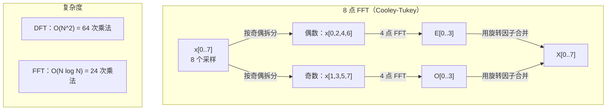
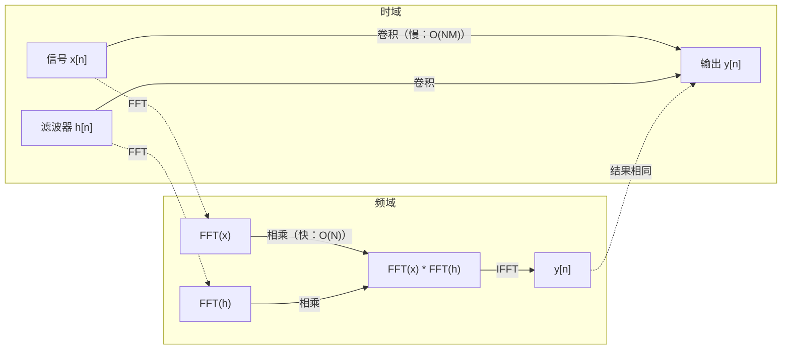

# 傅里叶变换

> 每个信号都是正弦波的叠加。傅里叶变换告诉你具体是哪些正弦波。

**类型：** 构建
**语言：** Python
**前置知识：** 第 1 阶段，第 01-04 课、第 19 课（复数）
**时间：** 约 90 分钟

## 学习目标

- 从零实现 DFT，并与 O(N log N) 的 Cooley-Tukey FFT 进行对比验证
- 解读频率系数：从信号中提取幅度、相位和功率谱
- 应用卷积定理，通过 FFT 乘法实现卷积运算
- 将傅里叶频率分解与 Transformer 位置编码和 CNN 卷积层联系起来

## 问题引入

一段音频录音是随时间采集的气压变化序列。股票价格是随天数变化的数值序列。图像是空间上的像素强度网格。所有这些都是时域（或空域）数据——你看到的是值随某个索引的变化。

但许多模式在时域中是看不见的。这段音频是纯音还是和弦？这个股价有没有周周期？这张图像有没有重复纹理？这些问题都关乎频率内容，而时域会将其隐藏。

傅里叶变换（Fourier Transform）将数据从时域转换到频域。它将信号分解为不同频率的正弦波。每个正弦波都有幅度（强度大小）和相位（起始位置）。傅里叶变换两者都能告诉你。

这对机器学习很重要，因为频域思维无处不在。卷积神经网络（CNN）执行的是卷积运算，而卷积在频域中就是乘法。Transformer 位置编码使用频率分解来表示位置。音频模型（语音识别、音乐生成）在频谱图上工作——声音的频域表示。时间序列模型寻找周期性模式。理解傅里叶变换能给你在所有这些领域工作的共同语言。

## 核心概念

### DFT 的定义

给定 N 个采样值 x[0], x[1], ..., x[N-1]，离散傅里叶变换产生 N 个频率系数 X[0], X[1], ..., X[N-1]：

```
X[k] = sum_{n=0}^{N-1} x[n] * e^(-2*pi*i*k*n/N)

其中 k = 0, 1, ..., N-1
```

每个 X[k] 都是一个复数。它的模 |X[k]| 表示频率 k 的幅度，辐角 angle(X[k]) 表示该频率的相位偏移。

核心洞察：`e^(-2*pi*i*k*n/N)` 是频率为 k 的旋转相量。DFT 计算信号与 N 个等间距频率中每一个的相关性。如果信号在频率 k 处有能量，相关值就大；如果没有，就接近零。

### 每个系数的含义

**X[0]：直流分量（DC component）。** 这是所有采样值的总和——与均值成正比。它代表信号的恒定（零频率）偏移。

```
X[0] = sum_{n=0}^{N-1} x[n] * e^0 = 所有采样值之和
```

**X[k]，1 <= k <= N/2：正频率。** X[k] 表示每 N 个采样中有 k 个完整周期的频率。k 越大意味着频率越高（振荡越快）。

**X[N/2]：奈奎斯特频率（Nyquist frequency）。** 用 N 个采样点能表示的最高频率。超过此频率就会产生混叠——高频伪装成低频。

**X[k]，N/2 < k < N：负频率。** 对于实值信号，X[N-k] = conj(X[k])。负频率是正频率的镜像。这就是为什么有用的信息集中在前 N/2 + 1 个系数中。

### 逆 DFT

逆 DFT 从频率系数重建原始信号：

```
x[n] = (1/N) * sum_{k=0}^{N-1} X[k] * e^(2*pi*i*k*n/N)

其中 n = 0, 1, ..., N-1
```

与正向 DFT 的唯一区别是：指数中的符号为正（而非负），并且有 1/N 的归一化因子。

逆 DFT 实现完美重建。没有信息丢失。你可以从时域到频域再回到时域，不产生任何误差。DFT 是一种基变换——它用不同的坐标系重新表达相同的信息。

### FFT：让它变快

上面定义的 DFT 是 O(N^2) 的：对每个输出系数，都需要对 N 个输入采样求和。当 N = 100 万时，就是 10^12 次运算。

快速傅里叶变换（Fast Fourier Transform，FFT）以 O(N log N) 的复杂度计算相同的结果。当 N = 100 万时，大约只需 2000 万次运算而非一万亿次。这使得频率分析在实际中变得可行。

Cooley-Tukey 算法（最常见的 FFT 算法）采用分治策略：

1. 将信号拆分为偶数索引和奇数索引的采样。
2. 对每一半递归计算 DFT。
3. 使用"旋转因子"e^(-2*pi*i*k/N) 合并两个半长 DFT。

```
X[k] = E[k] + e^(-2*pi*i*k/N) * O[k]          其中 k = 0, ..., N/2 - 1
X[k + N/2] = E[k] - e^(-2*pi*i*k/N) * O[k]    其中 k = 0, ..., N/2 - 1

其中 E = 偶数索引采样的 DFT
     O = 奇数索引采样的 DFT
```

由于对称性，每层递归只需 O(N) 的工作量，共有 log2(N) 层。总复杂度：O(N log N)。



FFT 要求信号长度为 2 的幂次。实际中，信号会被补零到下一个 2 的幂次长度。

### 频谱分析

**功率谱（Power spectrum）** 是 |X[k]|^2——每个频率系数的模的平方。它显示每个频率上有多少能量。

**相位谱（Phase spectrum）** 是 angle(X[k])——每个频率的相位偏移。对于大多数分析任务，你关心功率谱而忽略相位。

```
频率 k 的功率：P[k] = |X[k]|^2 = X[k].real^2 + X[k].imag^2
频率 k 的相位：phi[k] = atan2(X[k].imag, X[k].real)
```

### 频率分辨率

DFT 的频率分辨率取决于采样数 N 和采样率 fs。

```
第 k 个频率仓的频率：f_k = k * fs / N
频率分辨率：          delta_f = fs / N
最大频率：            f_max = fs / 2（奈奎斯特频率）
```

要分辨两个靠近的频率，你需要更多的采样点。要捕获高频成分，你需要更高的采样率。

### 卷积定理

这是信号处理中最重要的结论之一，与 CNN 直接相关。

**时域中的卷积等于频域中的逐点相乘。**

```
x * h = IFFT(FFT(x) . FFT(h))

其中 * 是卷积，. 是逐元素乘法
```

为什么这很重要：

- 对两个长度分别为 N 和 M 的信号直接卷积需要 O(N*M) 次运算。
- 基于 FFT 的卷积只需 O(N log N)：变换、相乘、反变换。
- 对于大卷积核，FFT 卷积速度优势巨大。
- 这正是具有大感受野的卷积层中所发生的事情。

注意：DFT 计算的是循环卷积（信号首尾相连）。对于线性卷积（不首尾相连），需要在计算前将两个信号补零到长度 N + M - 1。



### 加窗

DFT 假设信号是周期性的——它将 N 个采样视为一个无限重复信号的一个周期。如果信号的首尾值不相同，就会在边界处产生不连续，从而在频谱中出现虚假的高频内容。这称为频谱泄漏（Spectral leakage）。

加窗通过在计算 DFT 之前将信号两端逐渐衰减到零来减少泄漏。

常用窗函数：

| 窗函数 | 形状 | 主瓣宽度 | 旁瓣水平 | 用途 |
|--------|-------|----------------|-----------------|----------|
| 矩形窗（Rectangular） | 平坦（无窗） | 最窄 | 最高（-13 dB） | 信号在 N 个采样内恰好完整周期时 |
| 汉宁窗（Hann） | 升余弦 | 中等 | 较低（-31 dB） | 通用频谱分析 |
| 汉明窗（Hamming） | 修正余弦 | 中等 | 更低（-42 dB） | 音频处理、语音分析 |
| 布莱克曼窗（Blackman） | 三重余弦 | 较宽 | 极低（-58 dB） | 旁瓣抑制要求很高时 |

```
汉宁窗：  w[n] = 0.5 * (1 - cos(2*pi*n / (N-1)))
汉明窗：  w[n] = 0.54 - 0.46 * cos(2*pi*n / (N-1))
```

在 DFT 之前，将窗函数与信号逐元素相乘来应用加窗：`X = DFT(x * w)`。

### DFT 性质

| 性质 | 时域 | 频域 |
|----------|-------------|-----------------|
| 线性 | a*x + b*y | a*X + b*Y |
| 时移 | x[n - k] | X[f] * e^(-2*pi*i*f*k/N) |
| 频移 | x[n] * e^(2*pi*i*f0*n/N) | X[f - f0] |
| 卷积 | x * h | X * H（逐点相乘） |
| 逐点乘法 | x * h（逐点） | X * H（循环卷积，缩放 1/N） |
| 帕塞瓦尔定理 | sum \|x[n]\|^2 | (1/N) * sum \|X[k]\|^2 |
| 共轭对称性（实输入） | x[n] 为实数 | X[k] = conj(X[N-k]) |

帕塞瓦尔定理（Parseval's theorem）表明两个域中的总能量相同。能量在变换过程中守恒。

### 与位置编码的关系

原始 Transformer 使用正弦位置编码：

```
PE(pos, 2i)   = sin(pos / 10000^(2i/d_model))
PE(pos, 2i+1) = cos(pos / 10000^(2i/d_model))
```

每对维度 (2i, 2i+1) 以不同频率振荡。频率从高（维度 0, 1）到低（最后的维度）呈几何间隔分布。这使每个位置在所有频段上获得唯一的模式——类似于傅里叶系数唯一标识一个信号的方式。

这提供的关键性质：

- **唯一性：** 没有两个位置有相同的编码。
- **有界值：** sin 和 cos 始终在 [-1, 1] 范围内。
- **相对位置：** 位置 p+k 的编码可以表示为位置 p 编码的线性函数。模型可以学会关注相对位置。

### 与 CNN 的关系

卷积层通过在信号或图像上滑动来应用学习到的滤波器（卷积核）。从数学上说，这就是卷积运算。

根据卷积定理，这等价于：
1. 对输入做 FFT
2. 对卷积核做 FFT
3. 在频域中相乘
4. 对结果做 IFFT

标准 CNN 实现使用直接卷积（对于小的 3x3 卷积核更快）。但对于大卷积核或全局卷积，基于 FFT 的方法速度优势明显。一些架构（如 FNet）用 FFT 完全替代注意力机制，以 O(N log N) 而非 O(N^2) 的复杂度实现了有竞争力的准确率。

### 频谱图与短时傅里叶变换

单次 FFT 给你的是整个信号的频率内容，但它不告诉你这些频率何时出现。一个啁啾信号（频率随时间递增）和一个和弦（所有频率同时出现）可以有相同的幅度谱。

短时傅里叶变换（Short-Time Fourier Transform，STFT）通过在信号的重叠窗口上计算 FFT 来解决这个问题。结果是频谱图（Spectrogram）：一个二维表示，一个轴是时间，另一个轴是频率。每个点的强度表示该时刻该频率上的能量。

```
STFT 步骤：
1. 选择窗口大小（如 1024 个采样）
2. 选择跳步大小（如 256 个采样——75% 重叠）
3. 对每个窗口位置：
   a. 提取窗口内的信号段
   b. 应用汉宁/汉明窗
   c. 计算 FFT
   d. 将幅度谱作为频谱图的一列存储
```

频谱图是音频机器学习模型的标准输入表示。语音识别模型（Whisper、DeepSpeech）在梅尔频谱图（Mel-spectrogram）上工作——即频率映射到梅尔尺度的频谱图，该尺度更符合人类的音高感知。

### 混叠

如果信号包含高于 fs/2（奈奎斯特频率）的频率成分，以 fs 采样率采样会产生混叠（Aliasing）。一个 90 Hz 的信号以 100 Hz 采样后看起来与 10 Hz 的信号完全一样。仅凭采样点无法区分它们。

```
示例：
  真实信号：90 Hz 正弦波
  采样率：100 Hz
  表观频率：100 - 90 = 10 Hz

  以 100 Hz 采样率对 90 Hz 信号的采样点
  与对 10 Hz 信号的采样点完全相同。
  再多的数学运算也无法恢复原始的 90 Hz。
```

这就是为什么模数转换器包含抗混叠滤波器——在采样前去除高于奈奎斯特频率的成分。在机器学习中，当对特征图进行下采样时如果没有适当的低通滤波就会出现混叠——一些架构通过抗混叠池化层来解决这个问题。

### 补零不能提高分辨率

一个常见的误解：在 FFT 前对信号补零可以提高频率分辨率。事实并非如此。补零是在现有频率仓之间进行插值，使频谱看起来更平滑。但它无法揭示原始采样中不存在的频率细节。

真正的频率分辨率仅取决于观测时间 T = N / fs。要分辨间隔为 delta_f 的两个频率，你至少需要 T = 1 / delta_f 秒的数据。再多的补零也无法改变这个基本限制。

## 动手构建

### 第 1 步：从零实现 DFT

O(N^2) 的 DFT 直接由定义得出。

```python
import math

class Complex:
    ...

def dft(x):
    N = len(x)
    result = []
    for k in range(N):
        total = Complex(0, 0)
        for n in range(N):
            angle = -2 * math.pi * k * n / N
            w = Complex(math.cos(angle), math.sin(angle))
            xn = x[n] if isinstance(x[n], Complex) else Complex(x[n])
            total = total + xn * w
        result.append(total)
    return result
```

### 第 2 步：逆 DFT

结构相同，指数取正，除以 N。

```python
def idft(X):
    N = len(X)
    result = []
    for n in range(N):
        total = Complex(0, 0)
        for k in range(N):
            angle = 2 * math.pi * k * n / N
            w = Complex(math.cos(angle), math.sin(angle))
            total = total + X[k] * w
        result.append(Complex(total.real / N, total.imag / N))
    return result
```

### 第 3 步：FFT（Cooley-Tukey）

递归 FFT 要求长度为 2 的幂次。按奇偶拆分，递归，用旋转因子合并。

```python
def fft(x):
    N = len(x)
    if N <= 1:
        return [x[0] if isinstance(x[0], Complex) else Complex(x[0])]
    if N % 2 != 0:
        return dft(x)

    even = fft([x[i] for i in range(0, N, 2)])
    odd = fft([x[i] for i in range(1, N, 2)])

    result = [Complex(0)] * N
    for k in range(N // 2):
        angle = -2 * math.pi * k / N
        twiddle = Complex(math.cos(angle), math.sin(angle))
        t = twiddle * odd[k]
        result[k] = even[k] + t
        result[k + N // 2] = even[k] - t
    return result
```

### 第 4 步：频谱分析辅助函数

```python
def power_spectrum(X):
    return [xk.real ** 2 + xk.imag ** 2 for xk in X]

def convolve_fft(x, h):
    N = len(x) + len(h) - 1
    padded_N = 1
    while padded_N < N:
        padded_N *= 2

    x_padded = x + [0.0] * (padded_N - len(x))
    h_padded = h + [0.0] * (padded_N - len(h))

    X = fft(x_padded)
    H = fft(h_padded)

    Y = [xk * hk for xk, hk in zip(X, H)]

    y = idft(Y)
    return [y[n].real for n in range(N)]
```

## 实际使用

在实际工作中，使用 NumPy 的 FFT，它由高度优化的 C 库支持。

```python
import numpy as np

signal = np.sin(2 * np.pi * 5 * np.arange(256) / 256)
spectrum = np.fft.fft(signal)
freqs = np.fft.fftfreq(256, d=1/256)

power = np.abs(spectrum) ** 2

positive_freqs = freqs[:len(freqs)//2]
positive_power = power[:len(power)//2]
```

加窗和更高级的频谱分析：

```python
from scipy.signal import windows, stft

window = windows.hann(256)
windowed = signal * window
spectrum = np.fft.fft(windowed)
```

卷积：

```python
from scipy.signal import fftconvolve

result = fftconvolve(signal, kernel, mode='full')
```

频谱图：

```python
from scipy.signal import stft

frequencies, times, Zxx = stft(signal, fs=sample_rate, nperseg=256)
spectrogram = np.abs(Zxx) ** 2
```

频谱图矩阵的形状为 (n_frequencies, n_time_frames)。每一列是一个时间窗口的功率谱。这就是音频机器学习模型所消费的输入。

## 交付成果

运行 `code/fourier.py` 以生成 `outputs/prompt-spectral-analyzer.md`。

## 练习

1. **纯音识别。** 创建一个包含单个未知频率（1 到 50 Hz 之间）正弦波的信号，以 128 Hz 采样 1 秒。使用你的 DFT 识别该频率，验证答案是否匹配。然后添加标准差为 0.5 的高斯噪声并重复实验。噪声如何影响频谱？

2. **FFT vs DFT 验证。** 生成长度为 64 的随机信号。分别计算 DFT（O(N^2)）和 FFT。验证所有系数在 1e-10 精度内一致。在长度为 256、512、1024 和 2048 的信号上计时两个函数，绘制 DFT 耗时与 FFT 耗时的比值。

3. **卷积定理的示例验证。** 创建信号 x = [1, 2, 3, 4, 0, 0, 0, 0] 和滤波器 h = [1, 1, 1, 0, 0, 0, 0, 0]。直接计算它们的循环卷积（嵌套循环）。然后通过 FFT（变换、相乘、反变换）计算。验证结果一致。再通过适当的补零实现线性卷积。

4. **加窗效果。** 创建一个由 10 Hz 和 12 Hz 两个正弦波叠加的信号（频率非常接近）。以 128 Hz 采样 1 秒。分别用无窗、汉宁窗和汉明窗计算功率谱。哪个窗函数最容易分辨出两个峰值？为什么？

5. **位置编码分析。** 生成 d_model = 128、max_pos = 512 的正弦位置编码。对每对位置 (p1, p2)，计算它们编码的点积。证明点积仅取决于 |p1 - p2| 而非绝对位置。当距离增大时点积如何变化？

## 关键术语

| 术语 | 含义 |
|------|---------------|
| DFT（离散傅里叶变换） | 将 N 个时域采样转换为 N 个频域系数。每个系数是信号与该频率的复正弦信号的相关性 |
| FFT（快速傅里叶变换） | 计算 DFT 的 O(N log N) 算法。Cooley-Tukey 算法按奇偶索引递归拆分 |
| 逆 DFT | 从频率系数重建时域信号。与 DFT 相同的公式，但指数符号取反并乘以 1/N |
| 频率仓（Frequency bin） | DFT 输出中的每个索引 k 表示频率 k*fs/N Hz。"仓"是离散频率槽 |
| 直流分量（DC component） | X[0]，零频率系数。与信号均值成正比 |
| 奈奎斯特频率（Nyquist frequency） | fs/2，在采样率 fs 下可表示的最高频率。高于此频率会产生混叠 |
| 功率谱（Power spectrum） | \|X[k]\|^2，每个频率系数模的平方。显示各频率上的能量分布 |
| 相位谱（Phase spectrum） | angle(X[k])，每个频率分量的相位偏移。在分析中通常被忽略 |
| 频谱泄漏（Spectral leakage） | 将非周期信号视为周期信号所产生的虚假频率内容。通过加窗来减少 |
| 窗函数（Window function） | 在 DFT 之前应用的衰减函数（汉宁、汉明、布莱克曼），用于减少频谱泄漏 |
| 旋转因子（Twiddle factor） | FFT 蝶形运算中用于合并子 DFT 的复指数 e^(-2*pi*i*k/N) |
| 卷积定理（Convolution theorem） | 时域中的卷积等于频域中的逐点相乘。是信号处理和 CNN 的基础 |
| 循环卷积（Circular convolution） | 信号首尾相连的卷积。这是 DFT 自然计算的结果 |
| 线性卷积（Linear convolution） | 无首尾相连的标准卷积。通过在 DFT 前补零来实现 |
| 帕塞瓦尔定理（Parseval's theorem） | 总能量在傅里叶变换中守恒。sum \|x[n]\|^2 = (1/N) sum \|X[k]\|^2 |
| 混叠（Aliasing） | 由于采样率不足，高于奈奎斯特频率的成分表现为低频成分 |

## 延伸阅读

- [Cooley & Tukey: An Algorithm for the Machine Calculation of Complex Fourier Series (1965)](https://www.ams.org/journals/mcom/1965-19-090/S0025-5718-1965-0178586-1/) - 改变了计算领域的原始 FFT 论文
- [3Blue1Brown: 但傅里叶变换到底是什么？](https://www.youtube.com/watch?v=spUNpyF58BY) - 最佳的傅里叶变换可视化入门
- [Lee-Thorp et al.: FNet: Mixing Tokens with Fourier Transforms (2021)](https://arxiv.org/abs/2105.03824) - 在 Transformer 中用 FFT 替代自注意力
- [Smith: The Scientist and Engineer's Guide to Digital Signal Processing](http://www.dspguide.com/) - 深入讲解 FFT、加窗和频谱分析的免费在线教材
- [Vaswani et al.: Attention Is All You Need (2017)](https://arxiv.org/abs/1706.03762) - 正弦位置编码源自傅里叶频率分解
- [Radford et al.: Whisper (2022)](https://arxiv.org/abs/2212.04356) - 使用梅尔频谱图作为输入表示的语音识别模型
