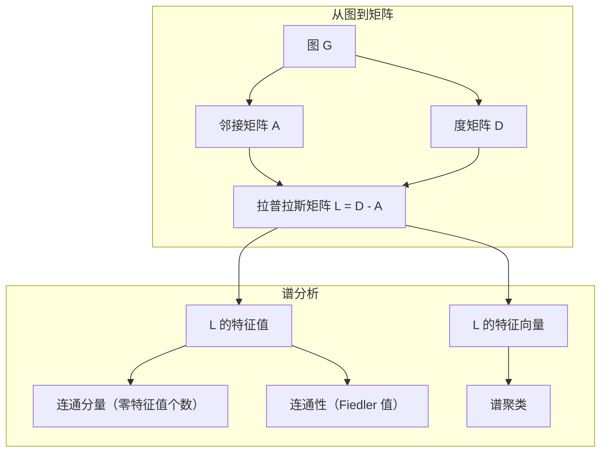
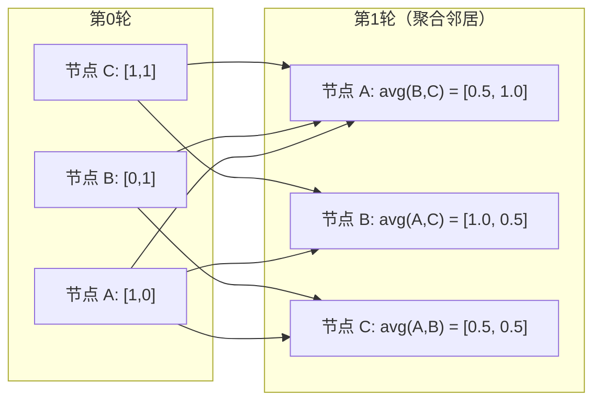

# 面向机器学习的图论

> 图是关系的数据结构。如果你的数据包含连接关系，你就需要图论。

**类型：** 动手构建
**语言：** Python
**前置知识：** 第一阶段，第01-03课（线性代数、矩阵）
**时间：** 约90分钟

## 学习目标

- 构建一个图类，实现邻接矩阵/邻接表两种表示方式，并实现 BFS 和 DFS 遍历
- 计算图的拉普拉斯矩阵（Graph Laplacian），利用其特征值检测连通分量和聚类节点
- 实现一轮 GNN 风格的消息传递（Message Passing），本质上是归一化邻接矩阵乘法
- 应用谱聚类（Spectral Clustering），利用 Fiedler 向量对图进行划分

## 问题背景

社交网络、分子结构、知识库、引文网络、道路地图——这些都是图。传统机器学习将数据当作扁平的表格处理，每一行相互独立，每个特征是一列。但当连接的结构至关重要时，表格就无能为力了。

以社交网络为例。你想预测用户会购买什么产品。用户自身的购买历史固然重要，但朋友的购买历史更重要。连接关系本身就携带着信号。

再看分子结构。你想预测一个分子是否能与某种蛋白质结合。原子本身当然重要，但真正关键的是原子之间如何成键。结构本身就是数据。

图神经网络（Graph Neural Networks, GNNs）是深度学习中增长最快的领域。它们驱动着药物发现、社交推荐、欺诈检测和知识图谱推理。每一个 GNN 都建立在相同的基础之上：基本图论。

你需要四样东西：
1. 将图表示为矩阵的方法（这样才能进行矩阵运算）
2. 遍历算法，用于探索图的结构
3. 拉普拉斯矩阵——谱图论中最重要的矩阵
4. 消息传递——使 GNN 得以工作的核心操作

## 核心概念

### 图：节点与边

一个图 G = (V, E) 由顶点（节点）V 和边 E 组成。每条边连接两个节点。

**有向图与无向图。** 在无向图（Undirected Graph）中，边 (u, v) 表示 u 连接 v 且 v 也连接 u。在有向图（Directed Graph）中，边 (u, v) 表示 u 指向 v，但不一定反过来。

**加权图与无权图。** 在无权图（Unweighted Graph）中，边要么存在要么不存在。在加权图（Weighted Graph）中，每条边有一个数值权重——可以是距离、成本或强度。

| 图类型 | 示例 |
|--------|------|
| 无向无权图 | Facebook 好友关系网络 |
| 有向无权图 | Twitter 关注网络 |
| 无向加权图 | 道路地图（距离） |
| 有向加权图 | 网页链接（PageRank 分数） |

### 邻接矩阵

邻接矩阵（Adjacency Matrix）A 是图的核心表示方式。对于一个有 n 个节点的图：

```
A[i][j] = 1    如果存在从节点 i 到节点 j 的边
A[i][j] = 0    否则
```

对于无向图，A 是对称的：A[i][j] = A[j][i]。对于加权图，A[i][j] = 边 (i, j) 的权重。

**示例——一个三角形：**

```
节点: 0, 1, 2
边: (0,1), (1,2), (0,2)

A = [[0, 1, 1],
     [1, 0, 1],
     [1, 1, 0]]
```

邻接矩阵是每个 GNN 的输入。对 A 的矩阵运算对应着对图的操作。

### 度

节点的度（Degree）是与之相连的边的数量。对于有向图，分为入度（边指向该节点）和出度（边从该节点指出）。

度矩阵（Degree Matrix）D 是对角矩阵：

```
D[i][i] = 节点 i 的度
D[i][j] = 0    当 i != j 时
```

以三角形为例：D = diag(2, 2, 2)，因为每个节点都连接着另外两个节点。

度反映了节点的重要性。高度数 = 枢纽节点。网络的度分布揭示了其结构。社交网络遵循幂律分布（少数枢纽节点，大量叶子节点）。随机图的度服从泊松分布。

### BFS 和 DFS

两种基本的图遍历算法。两者你都需要掌握。

**广度优先搜索（BFS）：** 先探索所有邻居，再探索邻居的邻居。使用队列（FIFO）。

```
从节点 0 开始 BFS：
  访问 0
  队列: [1, 2]        （0 的邻居）
  访问 1
  队列: [2, 3]        （加入 1 的邻居）
  访问 2
  队列: [3]           （2 的邻居已访问过）
  访问 3
  队列: []            （完成）
```

BFS 能找到无权图中的最短路径。从起点到任意节点的距离等于该节点首次被发现时的 BFS 层级。这就是为什么 BFS 被用于社交网络中的跳数距离计算。

**深度优先搜索（DFS）：** 尽可能深入，然后回溯。使用栈（LIFO）或递归。

```
从节点 0 开始 DFS：
  访问 0
  栈: [1, 2]          （0 的邻居）
  访问 2               （从栈中弹出）
  栈: [1, 3]           （加入 2 的邻居）
  访问 3               （从栈中弹出）
  栈: [1]
  访问 1               （从栈中弹出）
  栈: []               （完成）
```

DFS 适用于：
- 查找连通分量（从未访问的节点启动 DFS）
- 环检测（DFS 树中的回边）
- 拓扑排序（DFS 完成顺序的逆序）

| 算法 | 数据结构 | 发现 | 应用场景 |
|------|---------|------|---------|
| BFS | 队列 | 最短路径 | 社交网络距离、知识图谱遍历 |
| DFS | 栈 | 连通分量、环 | 连通性判断、拓扑排序 |

### 图拉普拉斯矩阵

L = D - A。谱图论中最重要的矩阵。

以三角形为例：

```
D = [[2, 0, 0],    A = [[0, 1, 1],    L = [[2, -1, -1],
     [0, 2, 0],         [1, 0, 1],         [-1, 2, -1],
     [0, 0, 2]]         [1, 1, 0]]         [-1, -1,  2]]
```

拉普拉斯矩阵有几个重要性质：

1. **L 是半正定的。** 所有特征值 >= 0。

2. **零特征值的个数等于连通分量的个数。** 连通图恰好有一个零特征值。有3个不相连子图的图有三个零特征值。

3. **最小的非零特征值（Fiedler 值）衡量连通性。** Fiedler 值大意味着图连通性好。Fiedler 值小意味着图有薄弱环节——一个瓶颈。

4. **Fiedler 值对应的特征向量（Fiedler 向量）揭示最佳分割方式。** 特征向量中正值对应的节点归为一组，负值对应的节点归为另一组。这就是谱聚类。



### 谱性质

邻接矩阵和拉普拉斯矩阵的特征值无需遍历即可揭示图的结构性质。

**谱聚类**的工作流程：
1. 计算拉普拉斯矩阵 L
2. 找到 L 的 k 个最小特征向量（跳过第一个，因为对连通图来说它是全1向量）
3. 将这些特征向量作为每个节点的新坐标
4. 在这些坐标上运行 k-means 聚类

为什么这样做有效？L 的特征向量编码了图上"最平滑"的函数。紧密连接的节点具有相似的特征向量值。被瓶颈隔开的节点具有不同的值。特征向量自然地将聚类分离开来。

**与随机游走的关联。** 归一化拉普拉斯矩阵与图上的随机游走相关。随机游走的平稳分布与节点的度成正比。混合时间（游走收敛的速度）取决于谱间隙。

### 消息传递

图神经网络的核心操作。每个节点从邻居那里收集消息、聚合消息，然后更新自己的状态。

```
h_v^(k+1) = UPDATE(h_v^(k), AGGREGATE({h_u^(k) : u in neighbors(v)}))
```

最简单的形式中，AGGREGATE = 均值，UPDATE = 线性变换 + 激活函数：

```
h_v^(k+1) = sigma(W * mean({h_u^(k) : u in neighbors(v)}))
```

本质上这就是矩阵乘法。如果 H 是所有节点特征的矩阵，A 是邻接矩阵：

```
H^(k+1) = sigma(A_norm * H^(k) * W)
```

其中 A_norm 是归一化邻接矩阵（每行之和为1）。

一轮消息传递让每个节点"看到"其直接邻居。两轮让它看到邻居的邻居。K 轮让每个节点获得来自 K 跳邻域的信息。



### 概念与机器学习应用

| 概念 | 机器学习应用 |
|------|-------------|
| 邻接矩阵 | GNN 输入表示 |
| 图拉普拉斯矩阵 | 谱聚类、社区发现 |
| BFS/DFS | 知识图谱遍历、路径搜索 |
| 度分布 | 节点重要性、特征工程 |
| 消息传递 | GNN 层（GCN、GAT、GraphSAGE） |
| L 的特征值 | 社区发现、图划分 |
| 谱聚类 | 无监督节点分组 |
| PageRank | 节点重要性排名、网页搜索 |

## 动手构建

### 第1步：从零实现图类

```python
class Graph:
    def __init__(self, n_nodes, directed=False):
        self.n = n_nodes
        self.directed = directed
        self.adj = {i: {} for i in range(n_nodes)}

    def add_edge(self, u, v, weight=1.0):
        self.adj[u][v] = weight
        if not self.directed:
            self.adj[v][u] = weight

    def neighbors(self, node):
        return list(self.adj[node].keys())

    def degree(self, node):
        return len(self.adj[node])

    def adjacency_matrix(self):
        import numpy as np
        A = np.zeros((self.n, self.n))
        for u in range(self.n):
            for v, w in self.adj[u].items():
                A[u][v] = w
        return A

    def degree_matrix(self):
        import numpy as np
        D = np.zeros((self.n, self.n))
        for i in range(self.n):
            D[i][i] = self.degree(i)
        return D

    def laplacian(self):
        return self.degree_matrix() - self.adjacency_matrix()
```

邻接表（`self.adj`）高效地存储邻居信息。邻接矩阵的转换使用 NumPy，因为所有的谱运算都需要它。

### 第2步：BFS 和 DFS

```python
from collections import deque

def bfs(graph, start):
    visited = set()
    order = []
    distances = {}
    queue = deque([(start, 0)])
    visited.add(start)
    while queue:
        node, dist = queue.popleft()
        order.append(node)
        distances[node] = dist
        for neighbor in graph.neighbors(node):
            if neighbor not in visited:
                visited.add(neighbor)
                queue.append((neighbor, dist + 1))
    return order, distances


def dfs(graph, start):
    visited = set()
    order = []
    stack = [start]
    while stack:
        node = stack.pop()
        if node in visited:
            continue
        visited.add(node)
        order.append(node)
        for neighbor in reversed(graph.neighbors(node)):
            if neighbor not in visited:
                stack.append(neighbor)
    return order
```

BFS 使用双端队列（deque），实现 O(1) 的左端弹出操作。DFS 使用列表作为栈。两者都恰好访问每个节点一次——时间复杂度 O(V + E)。

### 第3步：连通分量与拉普拉斯特征值

```python
def connected_components(graph):
    visited = set()
    components = []
    for node in range(graph.n):
        if node not in visited:
            order, _ = bfs(graph, node)
            visited.update(order)
            components.append(order)
    return components


def laplacian_eigenvalues(graph):
    import numpy as np
    L = graph.laplacian()
    eigenvalues = np.linalg.eigvalsh(L)
    return eigenvalues
```

`eigvalsh` 专用于对称矩阵——对于无向图，拉普拉斯矩阵总是对称的。它按升序返回特征值。统计零特征值的个数即可得到连通分量的数量。

### 第4步：谱聚类

```python
def spectral_clustering(graph, k=2):
    import numpy as np
    L = graph.laplacian()
    eigenvalues, eigenvectors = np.linalg.eigh(L)
    features = eigenvectors[:, 1:k+1]

    labels = np.zeros(graph.n, dtype=int)
    for i in range(graph.n):
        if features[i, 0] >= 0:
            labels[i] = 0
        else:
            labels[i] = 1
    return labels
```

当 k=2 时，Fiedler 向量的正负号将图分为两个聚类。当 k>2 时，你需要在前 k 个特征向量（排除平凡的全1特征向量）上运行 k-means 聚类。

### 第5步：消息传递

```python
def message_passing(graph, features, weight_matrix):
    import numpy as np
    A = graph.adjacency_matrix()
    row_sums = A.sum(axis=1, keepdims=True)
    row_sums[row_sums == 0] = 1
    A_norm = A / row_sums
    aggregated = A_norm @ features
    output = aggregated @ weight_matrix
    return output
```

这是一轮 GNN 消息传递。每个节点的新特征是其邻居特征的加权平均值，再经过权重矩阵变换。堆叠多轮可以将信息传播得更远。

## 实际使用

使用 networkx 和 NumPy，同样的操作可以用一行代码完成：

```python
import networkx as nx
import numpy as np

G = nx.karate_club_graph()

A = nx.adjacency_matrix(G).toarray()
L = nx.laplacian_matrix(G).toarray()

eigenvalues = np.linalg.eigvalsh(L.astype(float))
print(f"Smallest eigenvalues: {eigenvalues[:5]}")
print(f"Connected components: {nx.number_connected_components(G)}")

communities = nx.community.greedy_modularity_communities(G)
print(f"Communities found: {len(communities)}")

pr = nx.pagerank(G)
top_nodes = sorted(pr.items(), key=lambda x: x[1], reverse=True)[:5]
print(f"Top 5 PageRank nodes: {top_nodes}")
```

networkx 使用优化的 C 后端处理任意规模的图。生产环境中请使用它。用你从零实现的版本来理解它的原理。

### NumPy 谱分析

```python
import numpy as np

A = np.array([
    [0, 1, 1, 0, 0],
    [1, 0, 1, 0, 0],
    [1, 1, 0, 1, 0],
    [0, 0, 1, 0, 1],
    [0, 0, 0, 1, 0]
])

D = np.diag(A.sum(axis=1))
L = D - A

eigenvalues, eigenvectors = np.linalg.eigh(L)
print(f"Eigenvalues: {np.round(eigenvalues, 4)}")
print(f"Fiedler value: {eigenvalues[1]:.4f}")
print(f"Fiedler vector: {np.round(eigenvectors[:, 1], 4)}")

fiedler = eigenvectors[:, 1]
group_a = np.where(fiedler >= 0)[0]
group_b = np.where(fiedler < 0)[0]
print(f"Cluster A: {group_a}")
print(f"Cluster B: {group_b}")
```

Fiedler 向量完成了关键工作。正值的节点归入一个聚类，负值的归入另一个。无需迭代优化——只需一次特征分解。

## 产出物

本课产出：
- `outputs/skill-graph-analysis.md`——图结构数据分析的技能参考手册

## 关联知识

| 概念 | 出现场景 |
|------|---------|
| 邻接矩阵 | GCN、GAT、GraphSAGE 的输入 |
| 拉普拉斯矩阵 | 谱聚类、ChebNet 滤波器 |
| BFS | 知识图谱遍历、最短路径查询 |
| 消息传递 | 每个 GNN 层、神经消息传递 |
| 谱间隙 | 图连通性、随机游走的混合时间 |
| 度分布 | 幂律网络、节点特征工程 |
| 连通分量 | 预处理、处理不连通图 |
| PageRank | 节点重要性排名、注意力初始化 |

GNN 值得特别说明。GCN（Kipf & Welling, 2017）中的图卷积操作使用了添加自环的邻接矩阵 A_hat = A + I：

```text
H^(l+1) = sigma(D_hat^(-1/2) * A_hat * D_hat^(-1/2) * H^(l) * W^(l))
```

其中 A_hat = A + I（邻接矩阵加自环），D_hat 是 A_hat 的度矩阵。自环确保每个节点在聚合时包含自身的特征。这本质上就是带对称归一化的消息传递。D_hat^(-1/2) * A_hat * D_hat^(-1/2) 就是归一化邻接矩阵。拉普拉斯矩阵在此出现，因为这种归一化与 L_sym = I - D^(-1/2) * A * D^(-1/2) 相关。理解拉普拉斯矩阵就是理解 GCN 为什么有效。

## 练习

1. **从零实现 PageRank。** 从均匀分数开始。每一步计算：score(v) = (1-d)/n + d * sum(score(u)/out_degree(u))，对所有指向 v 的节点 u 求和。使用 d=0.85。运行至收敛（变化量 < 1e-6）。在一个小型网页图上测试。

2. **使用谱聚类发现社区。** 创建一个有两个明显分离的聚类的图（例如，两个完全子图通过一条边相连）。运行谱聚类并验证它找到了正确的分割。当你增加更多跨聚类的边时会发生什么？

3. **实现 Dijkstra 算法**，用于加权图的最短路径。将结果与在相同图（统一权重）上运行 BFS 的结果进行比较。

4. **构建一个2层消息传递网络。** 使用不同的权重矩阵进行两次消息传递。证明经过2轮之后，每个节点拥有了其2跳邻域的信息。

5. **分析一个真实世界的图。** 使用空手道俱乐部图（34个节点，78条边）。计算度分布、拉普拉斯特征值和谱聚类结果。将谱聚类结果与已知的真实分割进行比较。

## 关键术语

| 术语 | 通俗说法 | 准确含义 |
|------|---------|---------|
| 图 | "节点和边" | 一种编码成对关系的数学结构 G=(V,E) |
| 邻接矩阵 | "连接表" | 一个 n x n 矩阵，当节点 i 和 j 相连时 A[i][j] = 1 |
| 度 | "节点连接了多少" | 与一个节点相连的边的数量 |
| 拉普拉斯矩阵 | "D 减 A" | L = D - A，其特征值揭示图的结构 |
| Fiedler 值 | "代数连通度" | L 的最小非零特征值，衡量图的连通程度 |
| BFS | "逐层搜索" | 先访问所有邻居再深入的遍历方式，能找到最短路径 |
| DFS | "先往深处走" | 沿着一条路径走到底再回溯的遍历方式 |
| 消息传递 | "节点与邻居对话" | 每个节点聚合邻居的信息，是 GNN 的核心 |
| 谱聚类 | "按特征向量聚类" | 利用拉普拉斯矩阵的特征向量对图进行划分 |
| 连通分量 | "一个独立的部分" | 一个极大子图，其中每个节点都可以到达其他每个节点 |

## 延伸阅读

- **Kipf & Welling (2017)** —— "Semi-Supervised Classification with Graph Convolutional Networks"。开创了现代 GNN 的论文。证明了谱图卷积可以简化为消息传递。
- **Spielman (2012)** —— "Spectral Graph Theory" 讲义。关于拉普拉斯矩阵、谱间隙和图划分的权威入门资料。
- **Hamilton (2020)** —— "Graph Representation Learning"。涵盖从基础到应用的 GNN 书籍。
- **Bronstein et al. (2021)** —— "Geometric Deep Learning: Grids, Groups, Graphs, Geodesics, and Gauges"。统一框架论文。
- **Velickovic et al. (2018)** —— "Graph Attention Networks"。将注意力机制引入消息传递。
