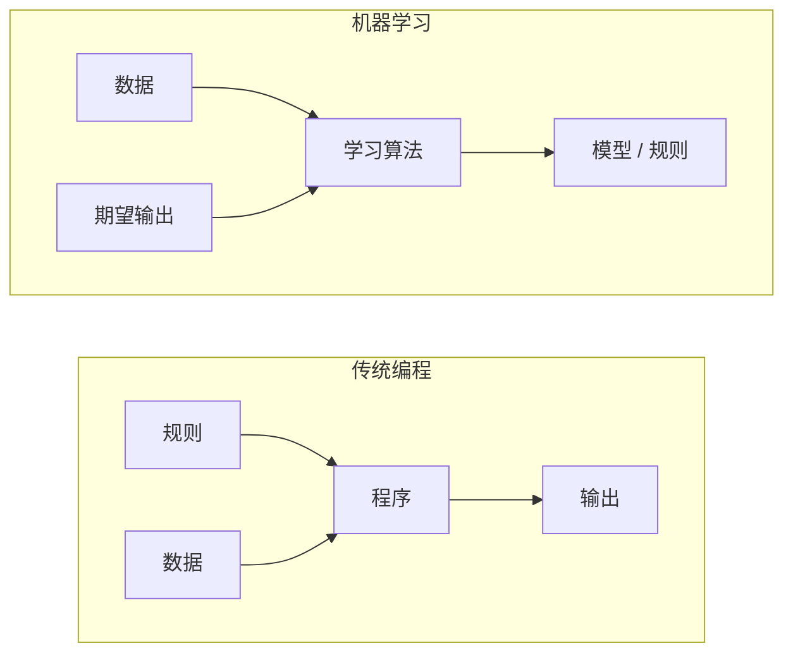
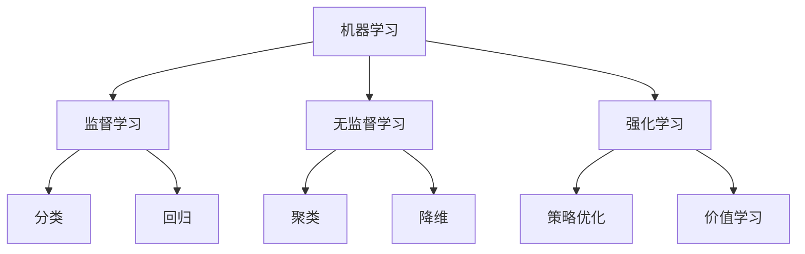
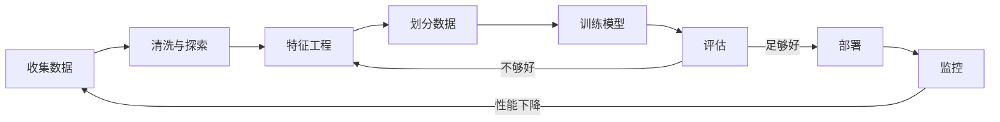
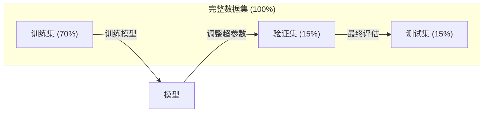
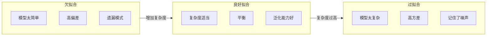
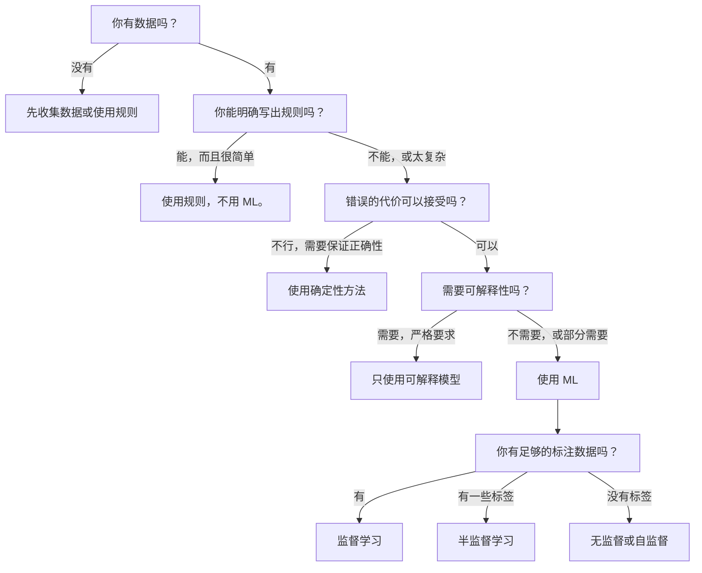

# 什么是机器学习

> 机器学习就是教计算机从数据中找规律，而不是手写规则。

**类型：** 学习
**语言：** Python
**前置条件：** 第 1 阶段（数学基础）
**时间：** 约 45 分钟

## 学习目标

- 解释监督学习（Supervised Learning）、无监督学习（Unsupervised Learning）和强化学习（Reinforcement Learning）之间的区别，并能判断给定问题属于哪种类型
- 从零实现一个最近质心分类器，并与随机基线进行对比评估
- 区分分类（Classification）和回归（Regression）任务，并为每种任务选择合适的损失函数
- 评估一个业务问题是否适合用机器学习解决，还是更适合用确定性规则处理

## 问题引入

你想做一个垃圾邮件过滤器。传统做法：坐下来写几百条规则。"如果邮件包含 'FREE MONEY'，标记为垃圾邮件。如果感叹号超过 3 个，标记为垃圾邮件。" 你花几周写规则。然后发垃圾邮件的人换了措辞。你的规则失效了。你再写新规则。这个循环永远不会结束。

机器学习反转了这个过程。你不再手写规则，而是给计算机数千封已标注的邮件（"垃圾邮件"或"非垃圾邮件"），让它自己找出规则。计算机会发现你从未想到过的模式。当垃圾邮件发送者改变策略时，你只需用新数据重新训练，而不是重写代码。

从"编写规则"到"从数据中学习"的转变，就是机器学习的核心。每一个推荐引擎、语音助手、自动驾驶汽车和语言模型都是这样工作的。

## 核心概念

### 从数据中学习，而非从规则中

传统编程和机器学习以相反的方向解决问题。



传统编程：你来写规则。程序将规则应用到数据上，产生输出。

机器学习：你提供数据和期望的输出。算法自己发现规则。

训练后得到的"模型（Model）"就是规则本身，以数字的形式编码（权重、参数）。它从见过的样本中进行泛化，从而对从未见过的数据做出预测。

### 机器学习的三种类型



**监督学习（Supervised Learning）**：你有输入-输出对。模型学习将输入映射到输出。
- "这里有 10,000 张标注为猫或狗的照片。学会区分它们。"
- "这里有房屋特征和价格。学会预测价格。"

**无监督学习（Unsupervised Learning）**：你只有输入，没有标签（Label）。模型自己发现数据中的结构。
- "这里有 10,000 条客户购买记录。找出自然分组。"
- "这里有 1,000 维的数据点。在保留结构的前提下降到 2 维。"

**强化学习（Reinforcement Learning）**：一个智能体（Agent）在环境中执行动作，获得奖励或惩罚。它学习一种策略（Policy）来最大化总奖励。
- "玩这个游戏。赢了 +1，输了 -1。找出策略。"
- "控制这个机械臂。拿起物体 +1，每浪费一秒 -0.01。"

实践中你构建的大多数系统都使用监督学习。无监督学习常用于预处理和探索性分析。强化学习驱动游戏 AI、机器人和语言模型的 RLHF。

### 三大类之外

上面三个类别划分得很清晰，但现实中的机器学习往往界限模糊。

**半监督学习（Semi-supervised Learning）** 使用少量标注数据和大量未标注数据。你可能有 100 张标注的医学图像和 100,000 张未标注的。相关技术包括：

- **标签传播（Label Propagation）：** 构建一个连接相似数据点的图。标签从已标注节点通过图传播到未标注的邻居节点。
- **伪标签（Pseudo-labeling）：** 先在标注数据上训练一个模型，用它预测未标注数据的标签，然后在全部数据上重新训练。模型自举式地扩展了自己的训练集。
- **一致性正则化（Consistency Regularization）：** 模型对一个输入和它的轻微扰动版本应该给出相同的预测。即使没有标签，这也能起作用。

**自监督学习（Self-supervised Learning）** 从数据本身创造监督信号。完全不需要人工标签。模型从数据结构中自己创建预测任务。

- **掩码语言模型（Masked Language Modeling, BERT）：** 隐藏句子中 15% 的词，训练模型预测缺失的词。"标签"来自原始文本。
- **对比学习（Contrastive Learning, SimCLR）：** 取一张图片，创建两个增强版本。训练模型识别它们来自同一张图片，同时将它们与其他图片的增强版本区分开来。
- **下一个词预测（Next-token Prediction, GPT）：** 根据所有前面的词预测下一个词。每篇文本文档都变成了一个训练样本。

这些不是与三大类别并列的独立分类。它们是结合了监督和无监督思想的策略。自监督学习从技术上讲是监督的（模型在预测某些东西），但标签是自动生成的，而非人工标注的。

### 分类 vs 回归

这是监督学习的两大主要任务。

| 方面 | 分类（Classification） | 回归（Regression） |
|--------|---------------|------------|
| 输出 | 离散类别 | 连续数值 |
| 示例 | "这封邮件是垃圾邮件吗？" | "这栋房子的价格是多少？" |
| 输出空间 | {猫, 狗, 鸟} | 任意实数 |
| 损失函数 | 交叉熵、准确率 | 均方误差（MSE）、平均绝对误差（MAE） |
| 决策 | 类别之间的边界 | 拟合数据的曲线 |

分类回答"是哪个类别？" 回归回答"是多少？"

有些问题可以用两种方式建模。预测股票涨还是跌是分类问题。预测具体价格是回归问题。

### 机器学习工作流

每个机器学习项目都遵循相同的流程，无论使用什么算法。



**收集数据**：收集原始数据。更多的数据几乎总是更好的，但质量比数量更重要。

**清洗与探索**：处理缺失值、去除重复项、可视化分布、发现异常。这个步骤通常占整个项目时间的 60-80%。

**特征工程（Feature Engineering）**：将原始数据转换为模型可以使用的特征（Feature）。把日期转成星期几，对数值列做归一化，对类别变量做编码。好的特征比花哨的算法更重要。

**划分数据**：分为训练集（Training Set）、验证集（Validation Set）和测试集（Test Set）。模型在训练数据上训练，你在验证数据上调整超参数，最后在测试数据上报告最终性能。

**训练模型**：将训练数据输入算法。算法调整内部参数以最小化损失函数（Loss Function）。

**评估**：在验证/测试数据上衡量性能。如果性能不达标，回去尝试不同的特征、算法或超参数。

**部署**：将模型投入生产环境，对新数据进行预测。

**监控**：持续跟踪性能。数据分布会变化（数据漂移，Data Drift），模型会退化。当性能下降时，重新训练。

### 训练集、验证集和测试集的划分

这是初学者最容易搞错的概念。你必须在模型训练时从未见过的数据上评估模型。否则你衡量的是记忆能力，而不是学习能力。



| 划分 | 目的 | 使用时机 | 典型大小 |
|-------|---------|-----------|-------------|
| 训练集 | 模型从中学习 | 训练过程中 | 60-80% |
| 验证集 | 调整超参数、比较模型 | 每次训练运行后 | 10-20% |
| 测试集 | 最终无偏性能估计 | 仅在最后使用一次 | 10-20% |

测试集是神圣不可侵犯的。你只看它一次。如果你不断根据测试性能调整模型，实际上就是在测试集上训练，你报告的数字就没有意义了。

对于小数据集，使用 k 折交叉验证（k-fold Cross-validation）：将数据分成 k 份，在 k-1 份上训练，在剩下的 1 份上验证，轮流进行，最后取平均结果。

### 过拟合 vs 欠拟合



**欠拟合（Underfitting）**：模型太简单，无法捕捉数据中的模式。就像用直线去拟合曲线关系。训练误差高，测试误差也高。

**过拟合（Overfitting）**：模型太复杂，记住了训练数据包括其中的噪声。一条扭曲的曲线穿过每个训练点，但在新数据上表现很差。训练误差低，测试误差高。

**良好拟合**：模型捕捉了真实模式而没有记住噪声。训练误差和测试误差都合理地低。

过拟合的迹象：
- 训练准确率远高于验证准确率
- 模型在训练数据上表现好，但在新数据上表现差
- 增加更多训练数据能改善性能（说明模型在记忆而非学习）

过拟合的修复方法：
- 获取更多训练数据
- 降低模型复杂度（更少的参数、更简单的架构）
- 正则化（Regularization）（对大权重施加惩罚）
- Dropout（训练时随机将部分神经元置零）
- 早停（Early Stopping）（当验证误差开始上升时停止训练）

欠拟合的修复方法：
- 使用更复杂的模型
- 添加更多特征
- 减少正则化
- 训练更长时间

### 偏差-方差权衡

这是过拟合和欠拟合背后的数学框架。

**偏差（Bias）**：模型假设错误导致的误差。当真实关系是非线性的时候，线性模型就有高偏差。高偏差导致欠拟合。

**方差（Variance）**：模型对训练数据中微小波动的敏感度导致的误差。高方差的模型在不同的数据子集上训练时会给出差异很大的预测。高方差导致过拟合。

| 模型复杂度 | 偏差 | 方差 | 结果 |
|-----------------|------|----------|--------|
| 太低（用线性模型拟合曲线数据） | 高 | 低 | 欠拟合 |
| 刚好 | 中 | 中 | 良好泛化 |
| 太高（用 20 次多项式拟合 10 个点） | 低 | 高 | 过拟合 |

总误差 = 偏差^2 + 方差 + 不可约噪声

你无法减少不可约噪声（那是数据本身的随机性）。你要找到偏差^2 + 方差最小化的甜蜜点。

### 没有免费午餐定理

没有单一的算法对所有问题都是最好的。一个在某类问题上表现好的算法，在另一类问题上表现会很差。这就是为什么数据科学家要尝试多种算法并比较结果。

在实践中，选择取决于：
- 你有多少数据
- 有多少特征
- 关系是线性的还是非线性的
- 是否需要可解释性
- 能承受多少算力开销

### 什么时候不该用机器学习

机器学习很强大，但并非总是合适的工具。在使用模型之前，先问问你是否真的需要。

**不要使用机器学习的情况：**

- **规则简单且定义明确。** 税费计算、排序算法、单位换算。如果你能用几个 if 语句写出逻辑，模型只会增加不必要的复杂度。
- **没有数据或数据极少。** 机器学习需要样本来学习。只有 10 个数据点，你无法训练任何有意义的东西。先收集数据。
- **出错代价是灾难性的，且需要保证正确性。** 药物剂量计算、核反应堆控制、密码学验证。机器学习模型是概率性的，它们有时会出错。如果"有时出错"不可接受，就用确定性方法。
- **查找表或启发式规则就能解决问题。** 如果一个简单的阈值或表格覆盖了 99% 的情况，引入机器学习只会增加维护成本，却没有实质性提升。
- **你无法解释决策，而可解释性是必须的。** 受监管行业（贷款、保险、刑事司法）有时要求每个决策都完全可解释。有些机器学习模型是可解释的（线性回归、小决策树），大多数不是。
- **问题变化速度比你重新训练的速度还快。** 如果规则每天都在变，而重新训练需要一周，模型永远是过时的。

使用以下决策流程图：



## 动手实现

`code/ml_intro.py` 中的代码从零实现了一个最近质心分类器（Nearest Centroid Classifier），这是最简单的机器学习算法。它展示了核心思想：从数据中学习，然后对新数据进行预测。

### 第 1 步：从零实现最近质心分类器

最近质心分类器计算训练数据中每个类别的中心点（均值）。预测时，它将每个新数据点分配给中心最近的类别。

```python
class NearestCentroid:
    def fit(self, X, y):
        self.classes = np.unique(y)
        self.centroids = np.array([
            X[y == c].mean(axis=0) for c in self.classes
        ])

    def predict(self, X):
        distances = np.array([
            np.sqrt(((X - c) ** 2).sum(axis=1))
            for c in self.centroids
        ])
        return self.classes[distances.argmin(axis=0)]
```

这就是整个算法。fit 计算两个均值。predict 计算距离。没有梯度下降，没有迭代，没有超参数。

### 第 2 步：在合成数据上训练

我们生成一个二维分类数据集，包含两个略有重叠的类别。质心分类器在两个类中心之间画出一条线性决策边界。

```python
rng = np.random.RandomState(42)
X_class0 = rng.randn(100, 2) + np.array([1.0, 1.0])
X_class1 = rng.randn(100, 2) + np.array([-1.0, -1.0])
X = np.vstack([X_class0, X_class1])
y = np.array([0] * 100 + [1] * 100)
```

### 第 3 步：与基线进行对比

每个机器学习模型都应该与一个简单基线进行对比。这里，基线随机预测类别。如果你的机器学习模型连随机猜测都赢不了，那肯定出了问题。

```python
baseline_preds = rng.choice([0, 1], size=len(y_test))
baseline_acc = np.mean(baseline_preds == y_test)
```

在这个干净的数据集上，质心分类器应该能达到 90%+ 的准确率。随机基线大约只有 50%。

### 为什么这很重要

最近质心分类器简单到极致。它没有超参数、没有迭代、没有梯度下降。但它体现了机器学习的基本模式：

1. **学习** 从训练数据中获得一种表示（质心）
2. **预测** 使用该表示对新数据做出预测（最近距离）
3. **评估** 与基线进行对比（随机猜测）

从逻辑回归到 Transformer，每个机器学习算法都遵循这同一个三步模式。表示会更复杂，但工作流保持不变。

### 第 4 步：质心分类器的局限

最近质心分类器假设每个类别形成一个单独的团簇。它画出线性决策边界。在以下情况下会失效：

- 类别有多个聚类（例如，数字"1"有几种不同的写法）
- 决策边界是非线性的（例如，一个类别包裹住另一个）
- 特征的尺度差异很大（距离被尺度最大的特征主导）

这些局限性正是你将学习其他算法的动机。K 近邻算法处理多个聚类。决策树处理非线性边界。特征缩放解决尺度问题。每节课都建立在前一节的局限性之上。

## 实际使用

sklearn 提供了 `NearestCentroid` 和合成数据生成器：

```python
from sklearn.neighbors import NearestCentroid
from sklearn.datasets import make_classification
from sklearn.model_selection import train_test_split

X, y = make_classification(
    n_samples=500, n_features=2, n_redundant=0,
    n_clusters_per_class=1, random_state=42
)
X_train, X_test, y_train, y_test = train_test_split(X, y, test_size=0.3)

clf = NearestCentroid()
clf.fit(X_train, y_train)
print(f"Accuracy: {clf.score(X_test, y_test):.3f}")
```

## 交付物

本课生成 `outputs/prompt-ml-problem-framer.md` -- 一个将模糊的业务问题转化为具体机器学习任务的提示词。给它一个问题描述（"我们想减少客户流失"或"预测下个季度的需求"），它会识别学习类型、定义预测目标、列出候选特征、选择成功指标、建立基线，并标记数据泄露或类别不平衡等陷阱。在任何机器学习项目开始时使用它，避免构建错误的东西。

## 核心术语

| 术语 | 通俗说法 | 准确含义 |
|------|----------------|----------------------|
| 模型（Model） | "那个 AI" | 一个带有可学习参数的数学函数，将输入映射到输出 |
| 训练（Training） | "教 AI" | 运行优化算法来调整模型参数，使预测与已知输出匹配 |
| 特征（Feature） | "一个输入列" | 数据的一个可度量属性，模型用它来做预测 |
| 标签（Label） | "答案" | 训练样本的已知输出，用于计算误差信号 |
| 超参数（Hyperparameter） | "你调的一个设置" | 在训练前设定的参数，控制学习过程（学习率、层数等） |
| 损失函数（Loss Function） | "模型有多错" | 衡量预测输出和实际输出之间差距的函数，训练的目标就是最小化它 |
| 过拟合（Overfitting） | "它把答案背下来了" | 模型学到了训练集特有的噪声而非通用模式，因此在新数据上失效 |
| 欠拟合（Underfitting） | "它什么都没学到" | 模型太简单，无法捕捉数据中的真实模式 |
| 泛化（Generalization） | "在新数据上也好使" | 模型在未参与训练的数据上做出准确预测的能力 |
| 交叉验证（Cross-validation） | "在不同块上测试" | 反复将数据分成训练/测试折叠并取平均结果，获得更稳健的性能估计 |
| 正则化（Regularization） | "让权重小一点" | 在损失函数中添加一个惩罚项，阻止模型过于复杂 |
| 数据漂移（Data Drift） | "世界变了" | 输入数据的统计分布随时间发生变化，导致模型性能下降 |

## 练习

1. 取任意数据集（如 Iris、Titanic）。按 70/15/15 划分为训练集/验证集/测试集。解释为什么不应该在测试集上调整超参数。
2. 列出三个现实世界的问题。对每个问题，判断它是分类、回归还是聚类，以及是监督学习还是无监督学习。
3. 一个模型在训练数据上达到 99% 准确率，但在测试数据上只有 60%。诊断问题并列出三种你会尝试的修复方法。

## 延伸阅读

- [An Introduction to Statistical Learning](https://www.statlearning.com/) - 免费教材，涵盖所有经典机器学习方法并配有实践示例
- [Google's Machine Learning Crash Course](https://developers.google.com/machine-learning/crash-course) - 简明的机器学习概念可视化入门
- [Scikit-learn User Guide](https://scikit-learn.org/stable/user_guide.html) - 在 Python 中实现机器学习的实用参考
