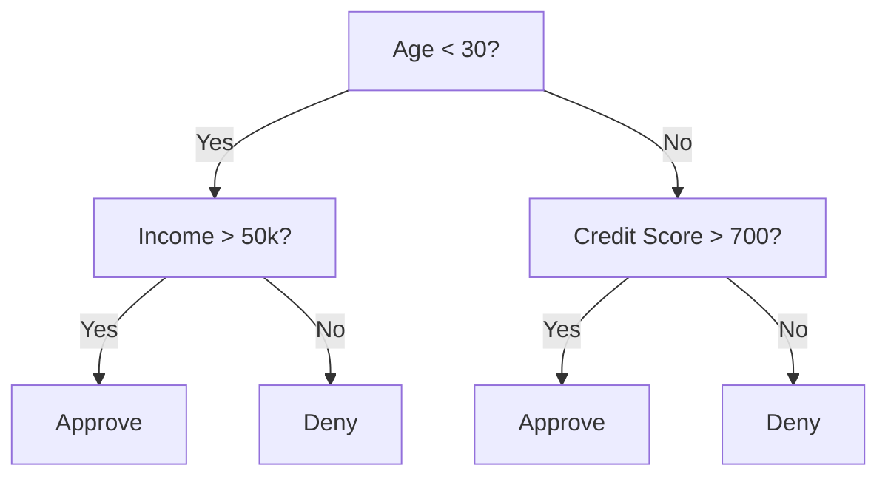
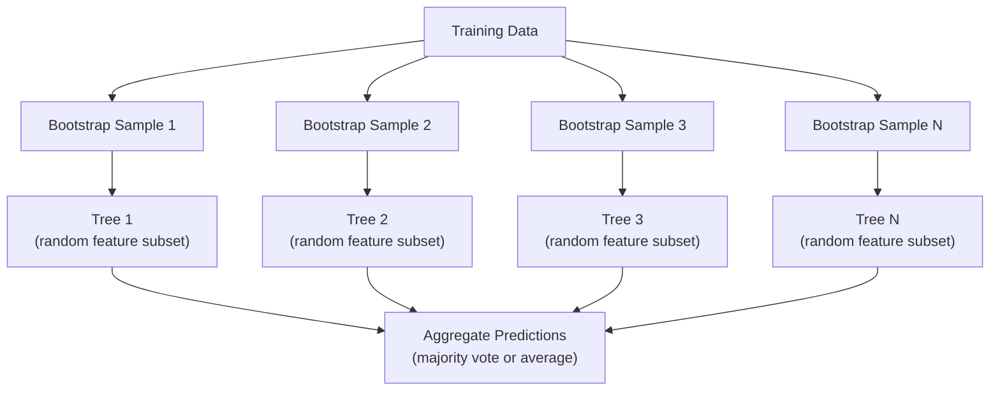

# 决策树与随机森林

> 决策树就是一张流程图。但一片森林就是机器学习中最强大的工具之一。

**类型：** 动手实现
**语言：** Python
**前置知识：** 第 1 阶段（第 09 课 信息论、第 06 课 概率论）
**时长：** 约 90 分钟

## 学习目标

- 实现基尼不纯度（Gini Impurity）、熵（Entropy）和信息增益（Information Gain）的计算，用于寻找最优决策树分裂点
- 从零构建一个带有预剪枝控制（最大深度、最小样本数）的决策树分类器
- 使用自助采样（Bootstrap Sampling）和特征随机化构建随机森林（Random Forest），并解释其为何能降低方差
- 比较平均不纯度下降（MDI）特征重要性与置换重要性（Permutation Importance），并识别 MDI 何时存在偏差

## 问题引入

你有一份表格数据。行是样本，列是特征，还有一个你想预测的目标列。你可以用神经网络来处理它。但对于表格数据，基于树的模型（决策树、随机森林、梯度提升树）始终优于深度学习。Kaggle 上的结构化数据竞赛由 XGBoost 和 LightGBM 主导，而非 Transformer。

为什么？树模型原生支持混合特征类型（数值型和类别型），无需预处理。它们无需特征工程即可处理非线性关系。它们是可解释的：你可以查看这棵树，准确了解预测的原因。而随机森林通过对多棵树求平均，在中等规模的数据集上具有很强的抗过拟合能力。

本课将从零开始使用递归分裂构建决策树，然后在此基础上构建随机森林。你将实现分裂准则背后的数学原理（基尼不纯度、熵、信息增益），并理解为什么一组弱学习器的集成能够成为强学习器。

## 核心概念

### 决策树做了什么

决策树通过提出一系列是/否问题，将特征空间划分为矩形区域。



每个内部节点对一个特征按阈值进行测试。每个叶节点给出一个预测。要对一个新数据点进行分类，从根节点开始，沿着分支走到叶节点。

树是自顶向下构建的，在每个节点选择最能区分数据的特征和阈值。"最佳"由分裂准则定义。

### 分裂准则：衡量不纯度

在每个节点，我们有一组样本。我们希望对其进行分裂，使得子节点尽可能"纯净"，即每个子节点主要包含一个类别。

**基尼不纯度（Gini Impurity）** 衡量的是：如果按照该节点的类别分布随机标注，一个随机选择的样本被错误分类的概率。

```
Gini(S) = 1 - sum(p_k^2)

where p_k is the proportion of class k in set S.
```

对于纯节点（全部为一个类别），Gini = 0。对于 50/50 的二分类分裂，Gini = 0.5。越低越好。

```
Example: 6 cats, 4 dogs

Gini = 1 - (0.6^2 + 0.4^2) = 1 - (0.36 + 0.16) = 0.48
```

**熵（Entropy）** 衡量节点中的信息含量（无序程度）。在第 1 阶段第 09 课中有详细介绍。

```
Entropy(S) = -sum(p_k * log2(p_k))
```

对于纯节点，熵 = 0。对于 50/50 的二分类分裂，熵 = 1.0。越低越好。

```
Example: 6 cats, 4 dogs

Entropy = -(0.6 * log2(0.6) + 0.4 * log2(0.4))
        = -(0.6 * -0.737 + 0.4 * -1.322)
        = 0.442 + 0.529
        = 0.971 bits
```

**信息增益（Information Gain）** 是分裂后不纯度（熵或基尼不纯度）的减少量。

```
IG(S, feature, threshold) = Impurity(S) - weighted_avg(Impurity(S_left), Impurity(S_right))

where the weights are the proportions of samples in each child.
```

每个节点的贪心算法：尝试每个特征和每个可能的阈值。选择使信息增益最大化的（特征, 阈值）组合。

### 分裂的工作原理

对于在当前节点有 n 个特征和 m 个样本的数据集：

1. 对于每个特征 j（j = 1 到 n）：
   - 按特征 j 对样本排序
   - 尝试连续不同值之间的每个中间点作为阈值
   - 计算每个阈值的信息增益
2. 选择信息增益最高的特征和阈值
3. 将数据分为左子集（特征 <= 阈值）和右子集（特征 > 阈值）
4. 对每个子节点递归执行

这种贪心方法不保证能得到全局最优树。寻找最优树是 NP 困难问题。但贪心分裂在实践中效果很好。

### 停止条件

如果没有停止条件，树会一直生长，直到每个叶节点都是纯的（每个叶节点一个样本）。这完美地记忆了训练数据，但泛化能力极差。

**预剪枝（Pre-pruning）** 在树完全生长之前就停止：
- 最大深度：当树达到设定深度时停止分裂
- 最小叶节点样本数：如果节点的样本数少于 k，则停止
- 最小信息增益：如果最佳分裂的不纯度改善小于某个阈值，则停止
- 最大叶节点数：限制叶节点的总数

**后剪枝（Post-pruning）** 先让树完全生长，然后再修剪：
- 代价复杂度剪枝（scikit-learn 所用方法）：添加与叶节点数量成正比的惩罚项。增加惩罚以获得更小的树
- 减少误差剪枝：如果验证误差没有增加，则移除子树

预剪枝更简单、更快速。后剪枝通常能产生更好的树，因为它不会过早停止那些可能带来有用后续分裂的分裂。

### 回归决策树

对于回归任务，叶节点的预测值是该叶中目标值的均值。分裂准则也相应改变：

**方差减少（Variance Reduction）** 替代信息增益：

```
VR(S, feature, threshold) = Var(S) - weighted_avg(Var(S_left), Var(S_right))
```

选择方差减少最多的分裂。树将输入空间划分为若干区域，并在每个区域中预测一个常数（均值）。

### 随机森林：集成的力量

单棵决策树具有高方差。数据的微小变化可能产生完全不同的树。随机森林通过对多棵树取平均来解决这个问题。



两种随机性来源使得树具有多样性：

**自助聚合（Bagging，Bootstrap Aggregating）：** 每棵树都在一个自助采样（Bootstrap Sample）上训练，即从训练数据中进行有放回的随机抽样。大约 63% 的原始样本会出现在每个自助采样中（其余是袋外样本，可用于验证）。

**特征随机化：** 在每次分裂时，只考虑特征的一个随机子集。对于分类任务，默认为 sqrt(n_features)。对于回归任务，为 n_features/3。这防止了所有树都在同一个主导特征上分裂。

核心洞察：对多棵去相关的树取平均可以在不增加偏差的情况下降低方差。每棵单独的树可能表现平平，但集成在一起则很强大。

### 特征重要性

随机森林天然提供特征重要性分数。最常见的方法：

**平均不纯度下降（Mean Decrease in Impurity，MDI）：** 对于每个特征，汇总所有树和所有使用该特征的节点中不纯度减少的总量。在较早的分裂中产生较大不纯度减少的特征更为重要。

```
importance(feature_j) = sum over all nodes where feature_j is used:
    (n_samples_at_node / n_total_samples) * impurity_decrease
```

这种方法很快（在训练过程中计算），但偏向于高基数特征和具有多个可能分裂点的特征。

**置换重要性（Permutation Importance）** 是替代方法：打乱某个特征的值，衡量模型准确率下降了多少。更可靠，但速度更慢。

### 树模型何时优于神经网络

在表格数据上，树模型和森林优于神经网络。原因有以下几点：

| 因素 | 树模型 | 神经网络 |
|------|--------|---------|
| 混合类型（数值 + 类别） | 原生支持 | 需要编码 |
| 小数据集（< 10k 行） | 效果好 | 容易过拟合 |
| 特征交互 | 通过分裂发现 | 需要架构设计 |
| 可解释性 | 完全透明 | 黑盒 |
| 训练时间 | 分钟级 | 小时级 |
| 超参数敏感性 | 低 | 高 |

神经网络在数据具有空间或序列结构时胜出（图像、文本、音频）。对于扁平的特征表格，树模型是默认选择。

## 动手实现

### 第 1 步：基尼不纯度和熵

从零构建两种分裂准则，并验证它们在判断哪些分裂更好时是否一致。

```python
import math

def gini_impurity(labels):
    n = len(labels)
    if n == 0:
        return 0.0
    counts = {}
    for label in labels:
        counts[label] = counts.get(label, 0) + 1
    return 1.0 - sum((c / n) ** 2 for c in counts.values())

def entropy(labels):
    n = len(labels)
    if n == 0:
        return 0.0
    counts = {}
    for label in labels:
        counts[label] = counts.get(label, 0) + 1
    return -sum(
        (c / n) * math.log2(c / n) for c in counts.values() if c > 0
    )
```

### 第 2 步：寻找最佳分裂

尝试每个特征和每个阈值。返回信息增益最高的那个。

```python
def information_gain(parent_labels, left_labels, right_labels, criterion="gini"):
    measure = gini_impurity if criterion == "gini" else entropy
    n = len(parent_labels)
    n_left = len(left_labels)
    n_right = len(right_labels)
    if n_left == 0 or n_right == 0:
        return 0.0
    parent_impurity = measure(parent_labels)
    child_impurity = (
        (n_left / n) * measure(left_labels) +
        (n_right / n) * measure(right_labels)
    )
    return parent_impurity - child_impurity
```

### 第 3 步：构建 DecisionTree 类

递归分裂、预测和特征重要性跟踪。

```python
class DecisionTree:
    def __init__(self, max_depth=None, min_samples_split=2,
                 min_samples_leaf=1, criterion="gini",
                 max_features=None):
        self.max_depth = max_depth
        self.min_samples_split = min_samples_split
        self.min_samples_leaf = min_samples_leaf
        self.criterion = criterion
        self.max_features = max_features
        self.tree = None
        self.feature_importances_ = None

    def fit(self, X, y):
        self.n_features = len(X[0])
        self.feature_importances_ = [0.0] * self.n_features
        self.n_samples = len(X)
        self.tree = self._build(X, y, depth=0)
        total = sum(self.feature_importances_)
        if total > 0:
            self.feature_importances_ = [
                fi / total for fi in self.feature_importances_
            ]

    def predict(self, X):
        return [self._predict_one(x, self.tree) for x in X]
```

### 第 4 步：构建 RandomForest 类

自助采样、特征随机化和多数投票。

```python
class RandomForest:
    def __init__(self, n_trees=100, max_depth=None,
                 min_samples_split=2, max_features="sqrt",
                 criterion="gini"):
        self.n_trees = n_trees
        self.max_depth = max_depth
        self.min_samples_split = min_samples_split
        self.max_features = max_features
        self.criterion = criterion
        self.trees = []

    def fit(self, X, y):
        n = len(X)
        for _ in range(self.n_trees):
            indices = [random.randint(0, n - 1) for _ in range(n)]
            X_boot = [X[i] for i in indices]
            y_boot = [y[i] for i in indices]
            tree = DecisionTree(
                max_depth=self.max_depth,
                min_samples_split=self.min_samples_split,
                max_features=self.max_features,
                criterion=self.criterion,
            )
            tree.fit(X_boot, y_boot)
            self.trees.append(tree)

    def predict(self, X):
        all_preds = [tree.predict(X) for tree in self.trees]
        predictions = []
        for i in range(len(X)):
            votes = {}
            for preds in all_preds:
                v = preds[i]
                votes[v] = votes.get(v, 0) + 1
            predictions.append(max(votes, key=votes.get))
        return predictions
```

完整实现及所有辅助方法请参见 `code/trees.py`。

## 实际使用

使用 scikit-learn，训练一个随机森林只需三行代码：

```python
from sklearn.ensemble import RandomForestClassifier
from sklearn.datasets import load_iris
from sklearn.model_selection import train_test_split

X, y = load_iris(return_X_y=True)
X_train, X_test, y_train, y_test = train_test_split(X, y, random_state=42)

rf = RandomForestClassifier(n_estimators=100, random_state=42)
rf.fit(X_train, y_train)
print(f"Accuracy: {rf.score(X_test, y_test):.4f}")
print(f"Feature importances: {rf.feature_importances_}")
```

在实践中，梯度提升树（XGBoost、LightGBM、CatBoost）通常比随机森林更强，因为它们顺序构建树，每棵树纠正前一棵树的错误。但随机森林更难配置错误，几乎不需要超参数调优。

## 交付物

本课产出 `outputs/prompt-tree-interpreter.md` —— 一个为业务利益相关者解读决策树分裂的提示词。将训练好的树结构（深度、特征、分裂阈值、准确率）输入其中，它会将模型翻译为通俗易懂的规则，排列特征重要性，标记过拟合或数据泄露的风险，并推荐后续步骤。当你需要向不看代码的人解释基于树的模型时，可以随时使用它。

## 练习

1. 在一个包含 3 个类别的二维数据集上训练一棵决策树。手动追踪分裂过程并绘制矩形决策边界。比较 max_depth=2 和 max_depth=10 时的边界差异。

2. 实现回归树的方差减少分裂。生成 200 个点的 y = sin(x) + 噪声数据，拟合你的回归树。绘制树的分段常数预测与真实曲线的对比图。

3. 分别用 1、5、10、50 和 200 棵树构建随机森林。绘制训练准确率和测试准确率随树数量变化的曲线。观察测试准确率趋于平稳但不会下降的现象（森林抵抗过拟合）。

4. 在 5 个不同的数据集上比较基尼不纯度与熵作为分裂准则的效果。衡量准确率和树深度。在大多数情况下，它们产生几乎相同的结果。解释原因。

5. 实现置换重要性。在一个包含随机噪声但高基数特征的数据集上，将其与 MDI 重要性进行比较。MDI 会将噪声特征排得很高，而置换重要性不会。

## 核心术语

| 术语 | 通俗说法 | 实际含义 |
|------|---------|---------|
| 决策树（Decision Tree） | "预测用的流程图" | 通过学习一系列 if/else 分裂，将特征空间划分为矩形区域的模型 |
| 基尼不纯度（Gini Impurity） | "节点混合程度" | 在某节点随机分类一个样本被错误分类的概率。0 = 纯净，0.5 = 二分类最大不纯度 |
| 熵（Entropy） | "节点的无序程度" | 节点的信息含量。0 = 纯净，1.0 = 二分类最大不确定性。源自信息论 |
| 信息增益（Information Gain） | "分裂有多好" | 分裂后不纯度的减少量。贪心选择分裂的准则 |
| 预剪枝（Pre-pruning） | "提前停止树的生长" | 通过设置最大深度、最小样本数或最小增益阈值来提前停止树的生长 |
| 后剪枝（Post-pruning） | "事后修剪树" | 先让树完全生长，然后移除不能改善验证性能的子树 |
| 自助聚合（Bagging） | "在随机子集上训练" | Bootstrap Aggregating。每个模型在不同的有放回随机样本上训练 |
| 随机森林（Random Forest） | "一堆树" | 决策树的集成，每棵树在自助采样上训练，并在每次分裂时使用随机特征子集 |
| 特征重要性（MDI） | "哪些特征重要" | 每个特征在所有树和所有节点中贡献的不纯度下降总量 |
| 置换重要性（Permutation Importance） | "打乱后检查" | 随机打乱某个特征的值后准确率的下降幅度。对噪声特征比 MDI 更可靠 |
| 方差减少（Variance Reduction） | "信息增益的回归版本" | 回归树中信息增益的类比。选择使目标方差减少最多的分裂 |
| 自助采样（Bootstrap Sample） | "有重复的随机抽样" | 从原始数据集中有放回地抽取的随机样本。大小相同，但含有重复 |

## 延伸阅读

- [Breiman: Random Forests (2001)](https://link.springer.com/article/10.1023/A:1010933404324) - 随机森林的原始论文
- [Grinsztajn et al.: Why do tree-based models still outperform deep learning on tabular data? (2022)](https://arxiv.org/abs/2207.08815) - 树模型与神经网络在表格数据任务上的严格比较
- [scikit-learn Decision Trees documentation](https://scikit-learn.org/stable/modules/tree.html) - 包含可视化工具的实用指南
- [XGBoost: A Scalable Tree Boosting System (Chen & Guestrin, 2016)](https://arxiv.org/abs/1603.02754) - 主导 Kaggle 竞赛的梯度提升论文
