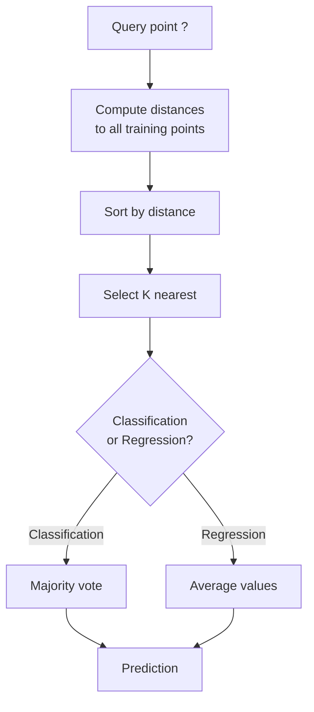
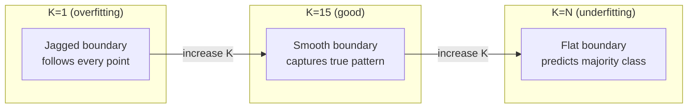
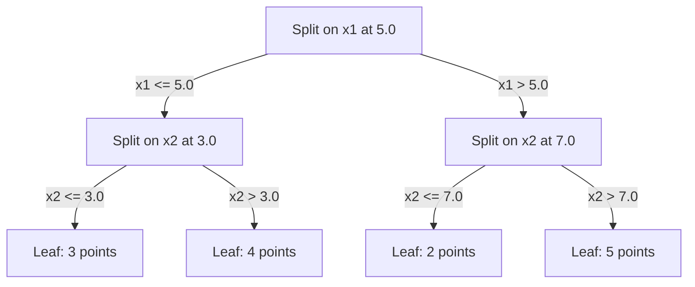

# K 近邻与距离度量

> 存储所有数据。通过看邻居来预测。这是最简单但真正有效的算法。

**类型：** 动手实现
**语言：** Python
**前置知识：** 第 1 阶段（第 14 课 范数与距离）
**时长：** 约 90 分钟

## 学习目标

- 从零实现 KNN 分类和回归，支持可配置的 K 值和距离加权投票
- 比较 L1（曼哈顿距离）、L2（欧氏距离）、余弦距离和闵可夫斯基距离（Minkowski），并为给定数据类型选择合适的度量
- 解释维度灾难（Curse of Dimensionality），并演示为什么 KNN 在高维空间中性能退化
- 构建 KD 树用于高效最近邻搜索，并分析它何时优于暴力搜索

## 问题引入

你有一个数据集。一个新的数据点到来。你需要对它进行分类或预测其值。与其从数据中学习参数（如线性回归或 SVM），你只需找到离新点最近的 K 个训练点，让它们投票。

这就是 K 近邻（K-Nearest Neighbors）。没有训练阶段。没有需要学习的参数。没有需要最小化的损失函数。你存储整个训练集，在预测时计算距离。

这听起来过于简单，不可能有用。但 KNN 在许多问题上出人意料地有竞争力，尤其是在中小规模数据集上。深入理解它可以揭示一些基本概念：距离度量的选择（关联第 1 阶段第 14 课）、维度灾难，以及惰性学习（Lazy Learning）与急切学习（Eager Learning）的区别。

KNN 在现代 AI 中无处不在，只是名字不同。向量数据库在嵌入向量上做 KNN 搜索。检索增强生成（RAG）找到 K 个最近的文档片段。推荐系统寻找相似的用户或物品。算法是相同的。规模和数据结构不同。

## 核心概念

### KNN 的工作原理

给定一个带标签的数据集和一个新的查询点：

1. 计算查询点到数据集中每个点的距离
2. 按距离排序
3. 取最近的 K 个点
4. 对于分类：K 个邻居的多数投票（Majority Vote）
5. 对于回归：K 个邻居值的平均值（或加权平均值）



这就是整个算法。没有拟合。没有梯度下降。没有训练轮次。

### 选择 K

K 是唯一的超参数。它控制偏差-方差权衡：

| K | 行为 |
|---|------|
| K = 1 | 决策边界跟随每个点。训练误差为零。高方差。过拟合 |
| 小 K（3-5） | 对局部结构敏感。能捕获复杂边界 |
| 大 K | 更平滑的边界。对噪声更鲁棒。可能欠拟合 |
| K = N | 对每个点都预测多数类。最大偏差 |

常用起点是 K = sqrt(N)，其中 N 是数据集的点数。对于二分类使用奇数 K 以避免平局。



### 距离度量

距离函数定义了"近"的含义。不同的度量产生不同的邻居、不同的预测。

**L2（欧氏距离）** 是默认选择。直线距离。

```
d(a, b) = sqrt(sum((a_i - b_i)^2))
```

对特征缩放敏感。在使用 L2 与 KNN 时，一定要先标准化特征。

**L1（曼哈顿距离）** 求绝对差之和。比 L2 对异常值更鲁棒，因为它不对差值取平方。

```
d(a, b) = sum(|a_i - b_i|)
```

**余弦距离（Cosine Distance）** 衡量向量之间的夹角，忽略大小。对文本和嵌入数据至关重要。

```
d(a, b) = 1 - (a . b) / (||a|| * ||b||)
```

**闵可夫斯基距离（Minkowski）** 通过参数 p 推广了 L1 和 L2。

```
d(a, b) = (sum(|a_i - b_i|^p))^(1/p)

p=1: Manhattan
p=2: Euclidean
p->inf: Chebyshev (max absolute difference)
```

使用哪种度量取决于数据：

| 数据类型 | 最佳度量 | 原因 |
|---------|---------|------|
| 数值特征，相似量级 | L2（欧氏距离） | 默认选择，适用于空间数据 |
| 数值特征，有异常值 | L1（曼哈顿距离） | 鲁棒性好，不会放大大差异 |
| 文本嵌入 | 余弦距离 | 大小是噪声，方向才是含义 |
| 高维稀疏 | 余弦距离或 L1 | L2 受维度灾难影响 |
| 混合类型 | 自定义距离 | 按特征类型组合不同度量 |

### 加权 KNN

标准 KNN 给所有 K 个邻居相同的权重。但距离 0.1 的邻居应该比距离 5.0 的邻居更重要。

**距离加权 KNN（Weighted KNN）** 按距离的倒数对每个邻居加权：

```
weight_i = 1 / (distance_i + epsilon)

For classification: weighted vote
For regression:     weighted average = sum(w_i * y_i) / sum(w_i)
```

epsilon 防止当查询点与训练点完全匹配时的除零错误。

加权 KNN 对 K 的选择不太敏感，因为无论如何远处的邻居贡献都很小。

### 维度灾难

KNN 在高维空间中性能退化。这不是模糊的担忧。这是数学事实。

**问题 1：距离趋同。** 随着维度增加，最大距离与最小距离的比值趋近于 1。所有点到查询点的距离变得几乎相同。

```
In d dimensions, for random uniform points:

d=2:    max_dist / min_dist = varies widely
d=100:  max_dist / min_dist ~ 1.01
d=1000: max_dist / min_dist ~ 1.001

When all distances are nearly equal, "nearest" is meaningless.
```

**问题 2：体积爆炸。** 要在固定比例的数据中捕获 K 个邻居，你需要将搜索半径扩展到覆盖特征空间的更大比例。高维中的"邻域"涵盖了大部分空间。

**问题 3：角落主导。** 在 d 维单位超立方体中，大部分体积集中在角落附近，而不是中心。随着 d 增长，内切球包含的体积比例趋向于零。

实际影响：KNN 在大约 20-50 个特征时效果良好。超过这个范围，你需要在应用 KNN 之前进行降维（PCA、UMAP、t-SNE），或者使用能利用数据内在低维性的树形搜索结构。

### KD 树：快速最近邻搜索

暴力 KNN 计算查询点到每个训练点的距离。每次查询复杂度为 O(n * d)。对于大数据集，这太慢了。

KD 树（KD-tree）沿特征轴递归地划分空间。在每一层，它沿一个维度在中位数处分割。



查找最近邻时，遍历树到包含查询点的叶节点，然后回溯，只检查可能包含更近点的相邻分区。

平均查询时间：低维时 O(log n)。但 KD 树在高维（d > 20）时退化为 O(n)，因为回溯剪枝的分支越来越少。

### 球树：适用于中等维度

球树（Ball Tree）将数据划分为嵌套的超球体，而不是沿坐标轴对齐的方框。每个节点定义一个球体（中心 + 半径），包含该子树中的所有点。

相对于 KD 树的优势：
- 在中等维度（最多约 50 维）表现更好
- 处理非坐标轴对齐的结构
- 更紧凑的包围体意味着搜索时能剪枝更多分支

KD 树和球树都是精确算法。对于真正大规模的搜索（数百万点、数百维），使用近似最近邻（Approximate Nearest Neighbor）方法（HNSW、IVF、乘积量化）代替。这些在第 1 阶段第 14 课中有介绍。

### 惰性学习 vs 急切学习

KNN 是惰性学习器（Lazy Learner）：训练时不做任何工作，所有工作都在预测时完成。大多数其他算法（线性回归、SVM、神经网络）是急切学习器（Eager Learner）：在训练时进行大量计算以构建紧凑模型，然后预测很快。

| 方面 | 惰性学习（KNN） | 急切学习（SVM、神经网络） |
|------|----------------|------------------------|
| 训练时间 | O(1) 只存储数据 | O(n * epochs) |
| 预测时间 | 每次查询 O(n * d) | O(d) 或 O(参数数量) |
| 预测时内存 | 存储整个训练集 | 仅存储模型参数 |
| 适应新数据 | 立即添加点 | 重新训练模型 |
| 决策边界 | 隐式的，即时计算 | 显式的，训练后固定 |

惰性学习在以下情况下是理想的：
- 数据集频繁变化（添加/删除点无需重新训练）
- 只需要为很少的查询做预测
- 需要零训练时间
- 数据集足够小，暴力搜索速度够快

### KNN 回归

与多数投票不同，KNN 回归对 K 个邻居的目标值取平均。

```
prediction = (1/K) * sum(y_i for i in K nearest neighbors)

Or with distance weighting:
prediction = sum(w_i * y_i) / sum(w_i)
where w_i = 1 / distance_i
```

KNN 回归产生分段常数（或加权情况下的分段平滑）预测。它无法外推超出训练数据的范围。如果训练目标值都在 0 到 100 之间，KNN 永远不会预测 200。

## 动手实现

### 第 1 步：距离函数

实现 L1、L2、余弦距离和闵可夫斯基距离。这些直接关联到第 1 阶段第 14 课。

```python
import math

def l2_distance(a, b):
    return math.sqrt(sum((ai - bi) ** 2 for ai, bi in zip(a, b)))

def l1_distance(a, b):
    return sum(abs(ai - bi) for ai, bi in zip(a, b))

def cosine_distance(a, b):
    dot_val = sum(ai * bi for ai, bi in zip(a, b))
    norm_a = math.sqrt(sum(ai ** 2 for ai in a))
    norm_b = math.sqrt(sum(bi ** 2 for bi in b))
    if norm_a == 0 or norm_b == 0:
        return 1.0
    return 1.0 - dot_val / (norm_a * norm_b)

def minkowski_distance(a, b, p=2):
    if p == float('inf'):
        return max(abs(ai - bi) for ai, bi in zip(a, b))
    return sum(abs(ai - bi) ** p for ai, bi in zip(a, b)) ** (1 / p)
```

### 第 2 步：KNN 分类器和回归器

构建完整的 KNN，支持可配置的 K 值、距离度量和可选的距离加权。

```python
class KNN:
    def __init__(self, k=5, distance_fn=l2_distance, weighted=False,
                 task="classification"):
        self.k = k
        self.distance_fn = distance_fn
        self.weighted = weighted
        self.task = task
        self.X_train = None
        self.y_train = None

    def fit(self, X, y):
        self.X_train = X
        self.y_train = y

    def predict(self, X):
        return [self._predict_one(x) for x in X]
```

### 第 3 步：KD 树用于高效搜索

从零构建一个 KD 树，递归地在每个维度的中位数处分裂。

```python
class KDTree:
    def __init__(self, X, indices=None, depth=0):
        # Recursively partition the data
        self.axis = depth % len(X[0])
        # Split on median of the current axis
        ...

    def query(self, point, k=1):
        # Traverse to leaf, then backtrack
        ...
```

完整实现及所有辅助方法和演示请参见 `code/knn.py`。

### 第 4 步：特征缩放

KNN 需要特征缩放（Feature Scaling），因为距离对特征量级敏感。范围从 0 到 1000 的特征会主导范围从 0 到 1 的特征。

```python
def standardize(X):
    n = len(X)
    d = len(X[0])
    means = [sum(X[i][j] for i in range(n)) / n for j in range(d)]
    stds = [
        max(1e-10, (sum((X[i][j] - means[j]) ** 2 for i in range(n)) / n) ** 0.5)
        for j in range(d)
    ]
    return [[((X[i][j] - means[j]) / stds[j]) for j in range(d)] for i in range(n)], means, stds
```

## 实际使用

使用 scikit-learn：

```python
from sklearn.neighbors import KNeighborsClassifier
from sklearn.preprocessing import StandardScaler
from sklearn.pipeline import Pipeline

clf = Pipeline([
    ("scaler", StandardScaler()),
    ("knn", KNeighborsClassifier(n_neighbors=5, metric="euclidean")),
])
clf.fit(X_train, y_train)
print(f"Accuracy: {clf.score(X_test, y_test):.4f}")
```

当数据集足够大且维度足够低时，scikit-learn 会自动使用 KD 树或球树。对于高维数据，它回退到暴力搜索。你可以通过 `algorithm` 参数控制。

对于大规模最近邻搜索（数百万向量），使用 FAISS、Annoy 或向量数据库：

```python
import faiss

index = faiss.IndexFlatL2(dimension)
index.add(embeddings)
distances, indices = index.search(query_vectors, k=5)
```

## 练习

1. 在一个包含 3 个类别的二维数据集上实现 KNN 分类。绘制 K=1、K=5、K=15 和 K=N 的决策边界。观察从过拟合到欠拟合的转变。

2. 在 2、5、10、50、100 和 500 维中生成 1000 个随机点。对于每个维度，计算最大成对距离与最小成对距离的比值。绘制比值与维度的关系图，以可视化维度灾难。

3. 在文本分类问题上比较 L1、L2 和余弦距离用于 KNN（使用 TF-IDF 向量）。哪种度量给出最佳准确率？为什么余弦距离在文本上往往胜出？

4. 实现一个 KD 树，并测量在 2D、10D 和 50D 中分别对 1k、10k 和 100k 个点的查询时间与暴力搜索的对比。在什么维度下 KD 树不再比暴力搜索更快？

5. 构建一个加权 KNN 回归器用于 y = sin(x) + 噪声。与 K=3、10、30 的非加权 KNN 进行比较。展示加权方法产生更平滑的预测，尤其是在大 K 时。

## 核心术语

| 术语 | 实际含义 |
|------|---------|
| K 近邻（K-Nearest Neighbors） | 非参数算法，通过找到离查询点最近的 K 个训练点来进行预测 |
| 惰性学习（Lazy Learning） | 训练时不做计算。所有工作在预测时完成。KNN 是典型例子 |
| 急切学习（Eager Learning） | 训练时进行大量计算以构建紧凑模型。大多数 ML 算法是急切学习 |
| 维度灾难（Curse of Dimensionality） | 在高维空间中，距离趋同，邻域扩展到覆盖大部分空间，使 KNN 失效 |
| KD 树（KD-tree） | 沿特征轴递归划分空间的二叉树。低维时查询 O(log n) |
| 球树（Ball Tree） | 嵌套超球体组成的树。在中等维度（最多约 50 维）比 KD 树表现更好 |
| 加权 KNN（Weighted KNN） | 邻居按距离的倒数加权。更近的邻居对预测的影响更大 |
| 特征缩放（Feature Scaling） | 将特征归一化到可比较的范围。基于距离的方法（如 KNN）必须做特征缩放 |
| 多数投票（Majority Vote） | 通过计数 K 个邻居中哪个类别最常见来进行分类 |
| 暴力搜索（Brute Force Search） | 计算到每个训练点的距离。每次查询 O(n*d)。精确但对大 n 很慢 |
| 近似最近邻（Approximate Nearest Neighbor） | 算法（HNSW、LSH、IVF）比精确搜索更快地找到近似最近的点 |
| Voronoi 图 | 空间的划分，每个区域包含比任何其他训练点更接近某一训练点的所有点。K=1 KNN 产生 Voronoi 边界 |

## 延伸阅读

- [Cover & Hart: Nearest Neighbor Pattern Classification (1967)](https://ieeexplore.ieee.org/document/1053964) - KNN 的奠基性论文，证明其错误率至多是贝叶斯最优的两倍
- [Friedman, Bentley, Finkel: An Algorithm for Finding Best Matches in Logarithmic Expected Time (1977)](https://dl.acm.org/doi/10.1145/355744.355745) - KD 树的原始论文
- [Beyer et al.: When Is "Nearest Neighbor" Meaningful? (1999)](https://link.springer.com/chapter/10.1007/3-540-49257-7_15) - 对最近邻维度灾难的形式化分析
- [scikit-learn Nearest Neighbors documentation](https://scikit-learn.org/stable/modules/neighbors.html) - 包含算法选择的实用指南
- [FAISS: A Library for Efficient Similarity Search](https://github.com/facebookresearch/faiss) - Meta 的十亿级近似最近邻搜索库
