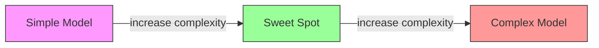
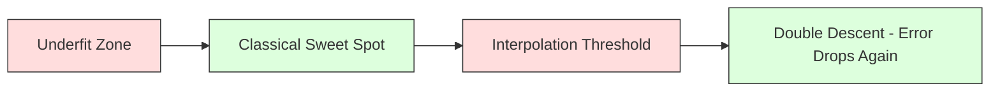
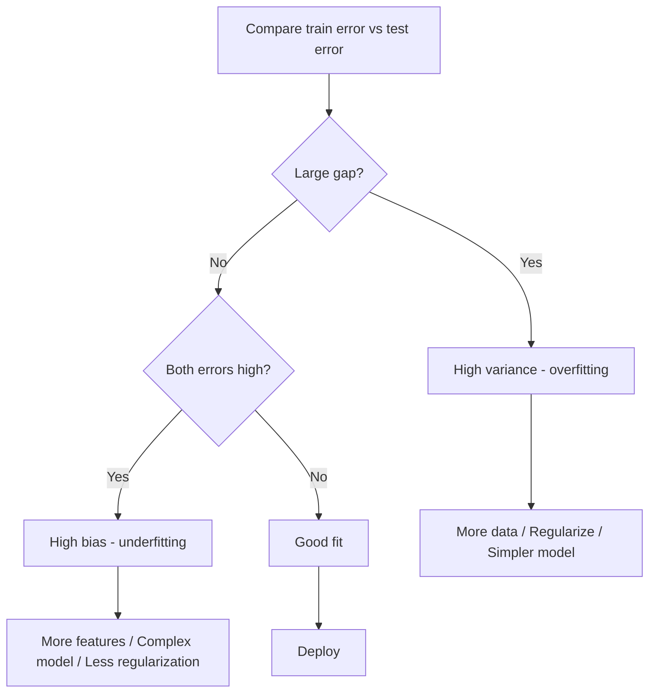
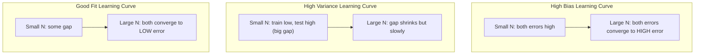
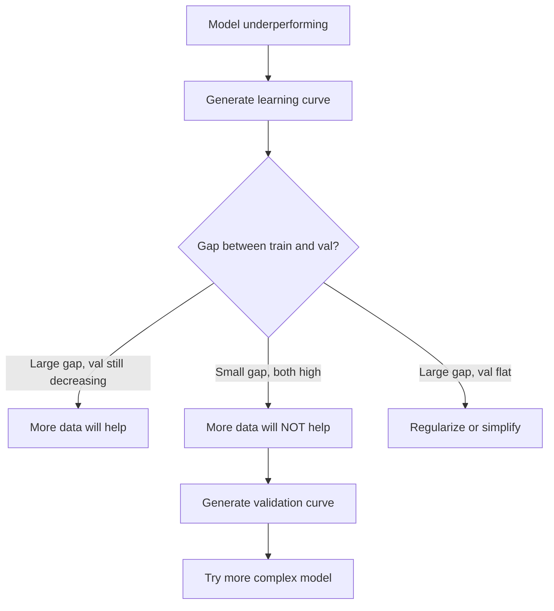

# 偏差-方差权衡

> 每个模型的误差都来自三个来源之一：偏差、方差或噪声。你只能控制前两个。

**类型：** 学习
**语言：** Python
**前置知识：** 第 2 阶段，第 01-09 课（机器学习基础、回归、分类、评估）
**时长：** 约 75 分钟

## 学习目标

- 推导预测期望误差的偏差-方差分解（Bias-Variance Decomposition），并解释不可约噪声（Irreducible Noise）的作用
- 通过训练误差和测试误差的模式，判断模型是高偏差（High Bias）还是高方差（High Variance）
- 解释正则化技术（L1、L2、Dropout、早停）如何用偏差换取方差的降低
- 实现实验，可视化不同复杂度模型的偏差-方差权衡

## 问题引入

你训练了一个模型。它在测试数据上有一些误差。这些误差从何而来？

如果你的模型太简单（比如对曲线数据集使用线性回归），它会持续性地偏离真实模式。这就是偏差（Bias）。如果你的模型太复杂（比如用 20 次多项式拟合 15 个数据点），它会完美拟合训练数据，但在新数据上的预测却天差地别。这就是方差（Variance）。

在固定的模型容量下，你无法同时将两者最小化。降低偏差，方差就会上升；降低方差，偏差就会上升。理解这种权衡是机器学习中最有用的诊断技能。它告诉你应该让模型更复杂还是更简单，是该获取更多数据还是做更好的特征工程，是该加强正则化还是减弱正则化。

## 核心概念

### 偏差：系统性误差

偏差衡量的是模型预测的平均值与真实值之间的偏离程度。如果你在从同一分布中抽取的许多不同训练集上训练同一个模型，然后对预测取平均，偏差就是这个平均值与真实值之间的差距。

高偏差意味着模型过于僵化，无法捕捉真实模式。用直线拟合抛物线，无论给多少数据，始终会偏离曲线。这就是欠拟合（Underfitting）。

```
High bias (underfitting):
  Model always predicts roughly the same wrong thing.
  Training error: HIGH
  Test error: HIGH
  Gap between them: SMALL
```

### 方差：对训练数据的敏感度

方差衡量的是当你在不同的数据子集上训练时，预测会变化多少。如果训练集的微小变化导致模型发生巨大变化，那么方差就很高。

高方差意味着模型拟合了训练数据中的噪声，而非底层信号。20 次多项式会穿过每一个训练点，但在训练点之间剧烈震荡。这就是过拟合（Overfitting）。

```
High variance (overfitting):
  Model fits training data perfectly but fails on new data.
  Training error: LOW
  Test error: HIGH
  Gap between them: LARGE
```

### 分解公式

对于任意一点 x，在平方损失下的预测期望误差可以精确分解为：

```
Expected Error = Bias^2 + Variance + Irreducible Noise

where:
  Bias^2   = (E[f_hat(x)] - f(x))^2
  Variance = E[(f_hat(x) - E[f_hat(x)])^2]
  Noise    = E[(y - f(x))^2]             (sigma^2)
```

- `f(x)` 是真实函数
- `f_hat(x)` 是你的模型预测值
- `E[...]` 是对不同训练集取期望
- `y` 是观测标签（真实函数加噪声）

噪声项是不可约的。在有噪声的数据上，没有任何模型能做得比 sigma^2 更好。你的任务是找到 bias^2 和 variance 之间的最佳平衡。

### 模型复杂度 vs 误差



经典的 U 形曲线：

| 复杂度 | 偏差 | 方差 | 总误差 |
|--------|------|------|--------|
| 过低 | 高 | 低 | 高（欠拟合） |
| 恰好 | 中等 | 中等 | 最低 |
| 过高 | 低 | 高 | 高（过拟合） |

### 正则化：偏差-方差的控制手段

正则化（Regularization）通过有意增加偏差来降低方差。它约束模型，使其无法追逐噪声。

- **L2（Ridge）：** 将所有权重向零收缩。保留所有特征但降低其影响力。
- **L1（Lasso）：** 将部分权重精确地推至零。起到特征选择的作用。
- **Dropout：** 在训练过程中随机禁用神经元。强制模型学习冗余表征。
- **早停（Early Stopping）：** 在模型完全拟合训练数据之前停止训练。

正则化强度（lambda、Dropout 率、训练轮数）直接控制你在偏差-方差曲线上的位置。正则化越强意味着偏差越大、方差越小。

### 双下降：现代视角

经典理论说：在最优点之后，更高的复杂度总是有害的。但 2019 年以来的研究揭示了一个意想不到的现象。如果你持续增加模型容量，远远超过插值阈值（Interpolation Threshold，即模型参数数量刚好足以完美拟合训练数据的点），测试误差可能会再次下降。



这种"双下降"（Double Descent）现象解释了为什么大规模过参数化的神经网络（参数数量远超训练样本数）仍然能够良好泛化。经典的偏差-方差权衡并没有错，但在现代场景下它是不完整的。

关于双下降的关键观察：
- 它在线性模型、决策树和神经网络中都会发生
- 在插值区域，更多数据有时反而会使性能变差（样本维度的双下降）
- 更多的训练轮数也可能引发它（轮次维度的双下降）
- 正则化能平滑峰值但不能消除它

为什么会出现这种现象？在插值阈值处，模型的容量刚好足以拟合所有训练点。它被迫找到一个非常特定的解来穿过每一个点，数据的微小扰动就会导致拟合的巨大变化。这就是方差达到峰值的原因。超过阈值后，模型有很多可能的解都能完美拟合数据。学习算法（如梯度下降的隐式正则化效应）倾向于在其中选择最简单的一个。这种对简单解的隐式偏好就是过参数化模型能够泛化的原因。

| 区间 | 参数量 vs 样本量 | 行为 |
|------|-----------------|------|
| 欠参数化 | p << n | 经典权衡适用 |
| 插值阈值 | p ~ n | 方差达到峰值，测试误差激增 |
| 过参数化 | p >> n | 隐式正则化生效，测试误差下降 |

实践建议：如果你使用的是神经网络或大型树集成，不要停在插值阈值处。要么用显式正则化使模型远低于该阈值，要么远超它。最糟糕的位置恰好在阈值上。

### 诊断你的模型



| 症状 | 诊断 | 解决方案 |
|------|------|----------|
| 训练误差高，测试误差高 | 偏差 | 增加特征、使用更复杂的模型、减弱正则化 |
| 训练误差低，测试误差高 | 方差 | 增加数据、正则化、使用更简单的模型、Dropout |
| 训练误差低，测试误差低 | 拟合良好 | 上线 |
| 训练误差下降，测试误差上升 | 正在过拟合 | 早停 |

### 实用策略

**当偏差是主要问题时：**
- 添加多项式特征或交互特征
- 使用更灵活的模型（用树集成替代线性模型）
- 降低正则化强度
- 延长训练时间（如果尚未收敛）

**当方差是主要问题时：**
- 获取更多训练数据
- 使用自助聚合（Bagging，如随机森林）
- 增强正则化（更高的 lambda、更多的 Dropout）
- 特征选择（去除噪声特征）
- 使用交叉验证尽早发现问题

### 集成方法与方差降低

集成方法（Ensemble Methods）是对抗方差最实用的工具。

**自助聚合（Bagging，Bootstrap Aggregating）** 在训练数据的不同自助样本上训练多个模型，然后对它们的预测取平均。每个单独模型都具有高方差，但平均之后方差大幅降低。随机森林（Random Forest）就是将自助聚合应用于决策树。

为什么数学上有效：如果你对 N 个独立预测取平均，每个预测的方差为 sigma^2，则平均值的方差为 sigma^2 / N。模型之间并非真正独立（它们看到的数据相似），所以实际降幅不到 1/N，但仍然非常显著。

**提升法（Boosting）** 通过顺序构建模型来降低偏差，其中每个新模型聚焦于当前集成的错误。梯度提升（Gradient Boosting）和 AdaBoost 是主要代表。如果添加太多模型，提升法可能会过拟合，因此需要早停或正则化。

| 方法 | 主要效果 | 偏差变化 | 方差变化 |
|------|----------|----------|----------|
| 自助聚合（Bagging） | 降低方差 | 不变 | 降低 |
| 提升法（Boosting） | 降低偏差 | 降低 | 可能增加 |
| 堆叠（Stacking） | 两者都降低 | 取决于元学习器 | 取决于基学习器 |
| Dropout | 隐式自助聚合 | 略有增加 | 降低 |

**实用法则：** 如果你的基模型方差很高（深度树、高次多项式），使用自助聚合。如果你的基模型偏差很高（浅决策树桩、简单线性模型），使用提升法。

### 学习曲线

学习曲线（Learning Curve）绘制的是训练误差和验证误差随训练集大小变化的关系。它是你手头最实用的诊断工具。与单次的训练/测试对比不同，学习曲线展示了模型的走势，告诉你更多数据是否有帮助。



如何解读：

| 场景 | 训练误差 | 验证误差 | 差距 | 含义 | 应对措施 |
|------|----------|----------|------|------|----------|
| 高偏差 | 高 | 高 | 小 | 模型无法捕捉模式 | 增加特征、使用复杂模型、减弱正则化 |
| 高方差 | 低 | 高 | 大 | 模型在记忆训练数据 | 增加数据、正则化、简化模型 |
| 拟合良好 | 中等 | 中等 | 小 | 模型泛化良好 | 上线 |
| 高方差但在改善 | 低 | 随数据增加而下降 | 正在缩小 | 数据能解决的方差问题 | 收集更多数据 |
| 高偏差且趋于平坦 | 高 | 高且平坦 | 小且平坦 | 更多数据不会有帮助 | 改变模型架构 |

关键洞察：如果两条曲线都已趋于平坦，差距很小但两者的误差都很高，那么更多数据毫无用处——你需要一个更好的模型。如果差距很大且仍在缩小，更多数据会有帮助。

### 如何生成学习曲线

有两种方法：

**方法一：固定模型，改变训练集大小。** 保持模型和超参数不变。在越来越大的训练数据子集上训练。在每个大小处测量训练误差和验证误差。这是标准的学习曲线。

**方法二：固定数据，改变模型复杂度。** 保持数据不变。扫描一个复杂度参数（多项式阶数、树深度、层数）。在每个复杂度处测量训练误差和验证误差。这是验证曲线（Validation Curve），直接展示偏差-方差权衡。

两种方法相辅相成。第一种告诉你更多数据是否有帮助。第二种告诉你更换模型是否有帮助。在决定下一步之前，两种都应该运行。



## 动手实现

`code/bias_variance.py` 中的代码运行了完整的偏差-方差分解实验。以下是逐步实现方法。

### 第 1 步：从已知函数生成合成数据

我们使用 `f(x) = sin(1.5x) + 0.5x` 并添加高斯噪声。已知真实函数使我们能精确计算偏差和方差。

```python
def true_function(x):
    return np.sin(1.5 * x) + 0.5 * x

def generate_data(n_samples=30, noise_std=0.5, x_range=(-3, 3), seed=None):
    rng = np.random.RandomState(seed)
    x = rng.uniform(x_range[0], x_range[1], n_samples)
    y = true_function(x) + rng.normal(0, noise_std, n_samples)
    return x, y
```

### 第 2 步：自助采样与多项式拟合

对于每个多项式阶数，我们抽取多个自助训练集，拟合多项式，并在固定的测试网格上记录预测值。这为我们提供了每个测试点上的预测分布。

```python
def fit_polynomial(x_train, y_train, degree, lam=0.0):
    X = np.column_stack([x_train ** d for d in range(degree + 1)])
    if lam > 0:
        penalty = lam * np.eye(X.shape[1])
        penalty[0, 0] = 0
        w = np.linalg.solve(X.T @ X + penalty, X.T @ y_train)
    else:
        w = np.linalg.lstsq(X, y_train, rcond=None)[0]
    return w
```

我们在 200 个不同的自助样本上拟合。每个自助样本都从相同的底层分布中抽取，但包含不同的数据点。

### 第 3 步：计算偏差平方和方差的分解

有了每个测试点上 200 组预测值，我们可以直接根据定义计算分解：

```python
mean_pred = predictions.mean(axis=0)
bias_sq = np.mean((mean_pred - y_true) ** 2)
variance = np.mean(predictions.var(axis=0))
total_error = np.mean(np.mean((predictions - y_true) ** 2, axis=1))
```

- `mean_pred` 是从自助样本中估计的 E[f_hat(x)]
- `bias_sq` 是平均预测值与真实值之间差距的平方
- `variance` 是各自助样本预测值的平均分散程度
- `total_error` 应近似等于 bias^2 + variance + noise

### 第 4 步：学习曲线

学习曲线在固定模型复杂度的情况下，扫描训练集大小。它展示了你的模型是数据受限还是容量受限。

```python
def demo_learning_curves():
    sizes = [10, 15, 20, 30, 50, 75, 100, 150, 200, 300]
    degree = 5

    for n in sizes:
        train_errors = []
        test_errors = []
        for seed in range(50):
            x_train, y_train = generate_data(n_samples=n, seed=seed * 100)
            w = fit_polynomial(x_train, y_train, degree)
            train_pred = predict_polynomial(x_train, w)
            train_mse = np.mean((train_pred - y_train) ** 2)
            test_pred = predict_polynomial(x_test, w)
            test_mse = np.mean((test_pred - y_test) ** 2)
            train_errors.append(train_mse)
            test_errors.append(test_mse)
        # Average over runs gives the learning curve point
```

对于高方差模型（小数据集上的 5 次多项式），你会看到：
- 训练误差从低开始，随着更多数据使记忆变得更难而逐渐升高
- 测试误差从高开始，随着模型获得更多信号而逐渐降低
- 两者的差距随数据增加而缩小

对于高偏差模型（1 次多项式），两条误差曲线快速收敛到同一个高值，更多数据无济于事。

### 第 5 步：正则化扫描

代码还包含 `demo_regularization_sweep()`，它固定一个高阶多项式（15 次）并扫描 Ridge 正则化强度从 0.001 到 100。这从另一个角度展示了偏差-方差权衡：不是改变模型复杂度，而是改变约束强度。

```python
def demo_regularization_sweep():
    alphas = [0.001, 0.005, 0.01, 0.05, 0.1, 0.5, 1.0, 5.0, 10.0, 50.0, 100.0]
    for alpha in alphas:
        results = bias_variance_decomposition([15], lam=alpha)
        r = results[15]
        print(f"alpha={alpha:.3f}  bias={r['bias_sq']:.4f}  var={r['variance']:.4f}")
```

当 alpha 较低时，15 次多项式几乎不受约束。方差占主导，因为模型在每个自助样本中都在追逐噪声。当 alpha 较高时，惩罚力度太强，模型实际上变成了近似常数函数。偏差占主导。最优的 alpha 位于两个极端之间。

这与改变多项式阶数时的 U 形曲线相同，只是控制手段从离散的选择变成了连续旋钮。在实践中，正则化是控制偏差-方差权衡的首选方式，因为它允许细粒度的控制而无需改变特征集。

## 实际使用

sklearn 提供了 `learning_curve` 和 `validation_curve` 来自动化这些诊断，无需编写自助采样循环。

### 验证曲线：扫描模型复杂度

```python
from sklearn.model_selection import validation_curve
from sklearn.pipeline import make_pipeline
from sklearn.preprocessing import PolynomialFeatures
from sklearn.linear_model import Ridge

degrees = list(range(1, 16))
train_scores_all = []
val_scores_all = []

for d in degrees:
    pipe = make_pipeline(PolynomialFeatures(d), Ridge(alpha=0.01))
    train_scores, val_scores = validation_curve(
        pipe, X, y, param_name="polynomialfeatures__degree",
        param_range=[d], cv=5, scoring="neg_mean_squared_error"
    )
    train_scores_all.append(-train_scores.mean())
    val_scores_all.append(-val_scores.mean())
```

这直接给出偏差-方差权衡曲线。验证分数相对于训练分数最差的地方，方差占主导；两者都很差的地方，偏差占主导。

### 学习曲线：扫描训练集大小

```python
from sklearn.model_selection import learning_curve

pipe = make_pipeline(PolynomialFeatures(5), Ridge(alpha=0.01))
train_sizes, train_scores, val_scores = learning_curve(
    pipe, X, y, train_sizes=np.linspace(0.1, 1.0, 10),
    cv=5, scoring="neg_mean_squared_error"
)
train_mse = -train_scores.mean(axis=1)
val_mse = -val_scores.mean(axis=1)
```

将 `train_mse` 和 `val_mse` 对 `train_sizes` 作图。曲线的形状就能告诉你关于模型的一切。

### 交叉验证与正则化强度扫描

```python
from sklearn.model_selection import cross_val_score

alphas = [0.001, 0.01, 0.1, 1.0, 10.0, 100.0]
for alpha in alphas:
    pipe = make_pipeline(PolynomialFeatures(10), Ridge(alpha=alpha))
    scores = cross_val_score(pipe, X, y, cv=5, scoring="neg_mean_squared_error")
    print(f"alpha={alpha:>7.3f}  MSE={-scores.mean():.4f} +/- {scores.std():.4f}")
```

这在固定模型复杂度的情况下扫描正则化强度。你会看到同样的偏差-方差权衡：低 alpha 意味着高方差，高 alpha 意味着高偏差。

### 完整诊断流程

在实践中，你应该按以下顺序运行这些诊断：

1. 训练你的模型。计算训练误差和测试误差。
2. 如果两者都很高：你有偏差问题。跳到第 4 步。
3. 如果训练误差低但测试误差高：你有方差问题。生成学习曲线来判断更多数据是否有帮助。如果没有帮助，使用正则化。
4. 生成验证曲线，扫描你的主要复杂度参数。找到最优点。
5. 在最优点处，生成学习曲线。如果差距仍然很大，你需要更多数据或正则化。
6. 使用 `cross_val_score` 尝试不同 alpha 值的 Ridge/Lasso。选择交叉验证误差最低的 alpha。

对于大多数表格数据集，这需要 10-15 分钟的计算时间，却能节省数小时的猜测。

## 交付物

本课产出物：`outputs/prompt-model-diagnostics.md`

## 练习

1. 使用 `noise_std=0`（无噪声）运行分解实验。不可约误差项会发生什么变化？最优复杂度是否改变？

2. 将训练集大小从 30 增加到 300。这对方差分量有什么影响？最优多项式阶数是否发生偏移？

3. 向实验中添加 L2 正则化（Ridge 回归）。对于一个固定的高阶多项式（15 次），将 lambda 从 0 扫描到 100。绘制 bias^2 和 variance 作为 lambda 函数的图。

4. 将真实函数从多项式改为 `sin(x)`。偏差-方差分解如何变化？是否仍然存在明显的最优阶数？

5. 实现一个简单的自助聚合（Bagging）包装器：在自助样本上训练 10 个模型并对预测取平均。证明这可以在不显著增加偏差的情况下降低方差。

## 核心术语

| 术语 | 通俗说法 | 准确含义 |
|------|----------|----------|
| 偏差（Bias） | "模型太简单了" | 由错误假设导致的系统性误差。模型平均预测值与真实值之间的差距。 |
| 方差（Variance） | "模型过拟合了" | 由对训练数据的敏感性导致的误差。预测值在不同训练集上的变化程度。 |
| 不可约误差（Irreducible Error） | "数据中的噪声" | 由真实数据生成过程中的随机性导致的误差。没有模型可以消除它。 |
| 欠拟合（Underfitting） | "学得不够" | 模型偏差很高。即使在训练数据上也会错过真实模式。 |
| 过拟合（Overfitting） | "在记忆数据" | 模型方差很高。拟合了训练数据中无法泛化的噪声。 |
| 正则化（Regularization） | "约束模型" | 添加惩罚项来降低模型复杂度，用偏差换取更低的方差。 |
| 双下降（Double Descent） | "更多参数可能有帮助" | 当模型容量远超插值阈值时，测试误差再次下降。 |
| 模型复杂度（Model Complexity） | "模型有多灵活" | 模型拟合任意模式的能力。由架构、特征或正则化控制。 |

## 延伸阅读

- [Hastie, Tibshirani, Friedman: Elements of Statistical Learning, Ch. 7](https://hastie.su.domains/ElemStatLearn/) -- 偏差-方差分解的权威论述
- [Belkin et al., Reconciling modern machine learning practice and the bias-variance trade-off (2019)](https://arxiv.org/abs/1812.11118) -- 双下降论文
- [Nakkiran et al., Deep Double Descent (2019)](https://arxiv.org/abs/1912.02292) -- 轮次维度和样本维度的双下降
- [Scott Fortmann-Roe: Understanding the Bias-Variance Tradeoff](http://scott.fortmann-roe.com/docs/BiasVariance.html) -- 清晰的可视化解释
