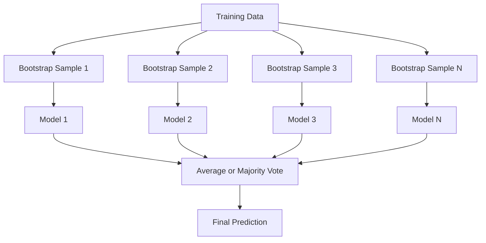
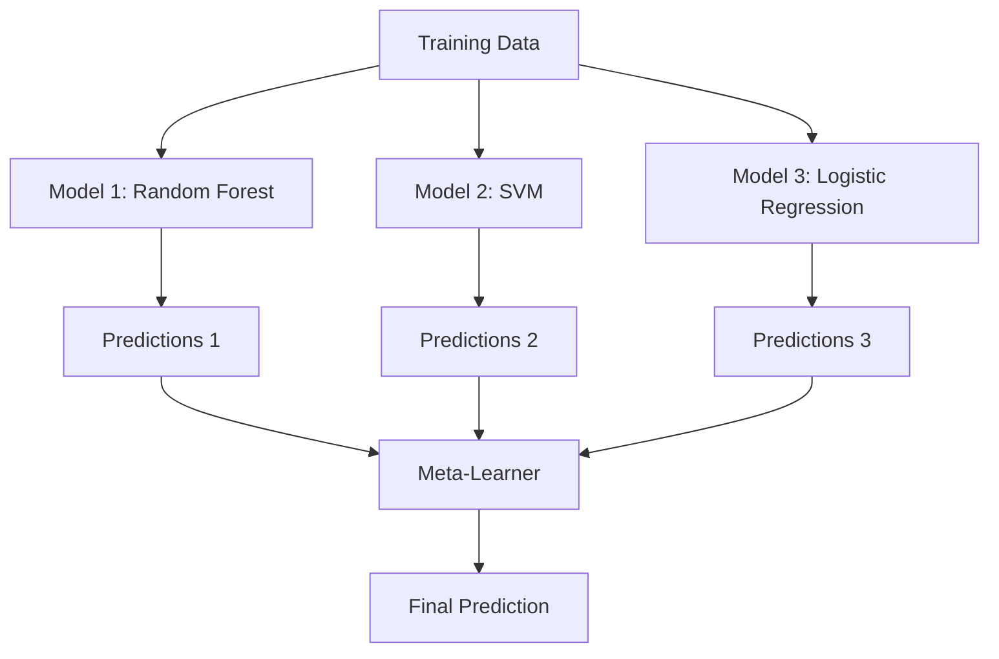

# 集成方法

> 一群弱学习器，正确组合之后，就变成了强学习器。这不是比喻，而是一个定理。

**类型：** 动手实现
**语言：** Python
**前置知识：** 第 2 阶段，第 10 课（偏差-方差权衡）
**时长：** 约 120 分钟

## 学习目标

- 从零实现 AdaBoost 和梯度提升（Gradient Boosting），并解释提升法如何顺序地降低偏差
- 构建一个自助聚合（Bagging）集成，演示对去相关模型取平均如何在不增加偏差的情况下降低方差
- 从各方法针对哪种误差分量的角度，比较自助聚合、提升法和堆叠
- 评估集成的多样性（Diversity），并解释为什么随着独立弱学习器数量的增加，多数投票的准确率会提升

## 问题引入

单棵决策树训练速度快、可解释性好，但容易过拟合。单个线性模型在复杂决策边界上会欠拟合。你可以花好几天去设计完美的模型架构。或者你可以把一堆不完美的模型组合起来，得到比其中任何一个都更好的结果。

集成方法（Ensemble Methods）正是做这件事的。它们是表格数据 Kaggle 竞赛中最可靠的获胜技术，驱动了大多数生产级机器学习系统，并且用实际行动诠释了偏差-方差权衡。自助聚合降低方差，提升法降低偏差，堆叠学习在不同输入上该信任哪个模型。

## 核心概念

### 为什么集成有效

假设你有 N 个独立的分类器，每个的准确率都是 p > 0.5。多数投票（Majority Vote）的准确率为：

```
P(majority correct) = sum over k > N/2 of C(N,k) * p^k * (1-p)^(N-k)
```

对于 21 个各自准确率为 60% 的分类器，多数投票的准确率约为 74%。101 个分类器时，准确率上升到约 84%。当模型犯的错误各不相同时，误差会相互抵消。

关键要求是**多样性（Diversity）**。如果所有模型犯同样的错误，组合它们毫无帮助。集成之所以有效，是因为它们通过以下方式产生多样化的模型：

- 不同的训练子集（自助聚合）
- 不同的特征子集（随机森林）
- 顺序的误差修正（提升法）
- 不同的模型族（堆叠）

### 自助聚合（Bagging，Bootstrap Aggregating）

自助聚合通过在不同的自助样本上训练每个模型来创造多样性。



自助样本是从原始数据中有放回抽样得到的，大小与原始数据相同。每个自助样本中大约包含 63.2% 的不重复样本。剩余约 36.8% 的样本（袋外样本，Out-of-bag Samples）提供了一个免费的验证集。

自助聚合在不显著增加偏差的情况下降低方差。每棵树都对其自助样本过拟合，但由于每棵树的过拟合方向不同，取平均就消除了噪声。

**随机森林（Random Forest）** 是带有额外技巧的自助聚合：在每次分裂时，只考虑随机选取的一个特征子集。这迫使树之间产生更多多样性。候选特征数量的典型值：分类问题取 `sqrt(n_features)`，回归问题取 `n_features / 3`。

### 提升法（Boosting，顺序误差修正）

提升法以顺序方式训练模型。每个新模型专注于之前的模型做错的样本。


提升法降低偏差。每个新模型修正的是当前集成的系统性误差。最终预测是所有模型的加权求和，表现更好的模型获得更高的权重。

权衡之处在于：如果轮次太多，提升法可能会过拟合，因为它不断去拟合越来越难的样本，而其中一些可能只是噪声。

### AdaBoost（自适应提升）

AdaBoost（Adaptive Boosting）是第一个实用的提升算法。它可以与任何基学习器配合使用，通常使用决策树桩（Decision Stump，深度为 1 的树）。

算法流程：

```
1. Initialize sample weights: w_i = 1/N for all i

2. For t = 1 to T:
   a. Train weak learner h_t on weighted data
   b. Compute weighted error:
      err_t = sum(w_i * I(h_t(x_i) != y_i)) / sum(w_i)
   c. Compute model weight:
      alpha_t = 0.5 * ln((1 - err_t) / err_t)
   d. Update sample weights:
      w_i = w_i * exp(-alpha_t * y_i * h_t(x_i))
   e. Normalize weights to sum to 1

3. Final prediction: H(x) = sign(sum(alpha_t * h_t(x)))
```

误差越低的模型获得更高的 alpha。被错分的样本获得更高的权重，以使下一个模型重点关注它们。

### 梯度提升（Gradient Boosting）

梯度提升将提升法推广到了任意损失函数。它不是重新赋权样本，而是让每个新模型拟合当前集成的残差（Residuals，即损失函数的负梯度）。

```
1. Initialize: F_0(x) = argmin_c sum(L(y_i, c))

2. For t = 1 to T:
   a. Compute pseudo-residuals:
      r_i = -dL(y_i, F_{t-1}(x_i)) / dF_{t-1}(x_i)
   b. Fit a tree h_t to the residuals r_i
   c. Find optimal step size:
      gamma_t = argmin_gamma sum(L(y_i, F_{t-1}(x_i) + gamma * h_t(x_i)))
   d. Update:
      F_t(x) = F_{t-1}(x) + learning_rate * gamma_t * h_t(x)

3. Final prediction: F_T(x)
```

对于平方误差损失，伪残差就是实际残差：`r_i = y_i - F_{t-1}(x_i)`。每棵树就是在字面意义上拟合前一个集成的误差。

学习率（收缩系数）控制每棵树的贡献大小。更小的学习率需要更多的树，但泛化效果更好。典型值：0.01 到 0.3。

### XGBoost：为什么它在表格数据上称霸

XGBoost（eXtreme Gradient Boosting，极端梯度提升）是带有工程优化的梯度提升，使其速度快、准确且抗过拟合：

- **正则化目标函数：** 对叶节点权重施加 L1 和 L2 惩罚，防止单棵树过于自信
- **二阶近似：** 同时使用损失函数的一阶和二阶导数，做出更好的分裂决策
- **稀疏感知分裂：** 原生处理缺失值，在每次分裂时学习缺失数据的最优方向
- **列采样：** 类似随机森林，在每次分裂时对特征进行采样以增加多样性
- **加权分位数草图：** 在分布式数据上高效找到连续特征的分裂点
- **缓存感知的块结构：** 内存布局针对 CPU 缓存行进行了优化

对于表格数据，XGBoost（及其后继者 LightGBM）始终优于神经网络。这种情况短期内不会改变。如果你的数据适合行列表格形式，就从梯度提升开始。

### 堆叠（Stacking，元学习）

堆叠使用多个基模型的预测结果作为元学习器（Meta-Learner）的特征。



元学习器学习在不同输入上应该信任哪个基模型。如果随机森林在某些区域更强而 SVM 在另一些区域更强，元学习器就会学会相应地路由。

为了避免数据泄漏（Data Leakage），基模型的预测必须通过在训练集上的交叉验证来生成。永远不能在相同的数据上既训练基模型又生成元特征。

### 投票（Voting）

最简单的集成方法。直接组合预测结果。

- **硬投票（Hard Voting）：** 对类别标签取多数投票。
- **软投票（Soft Voting）：** 对预测概率取平均，选择平均概率最高的类别。通常更好，因为它利用了置信度信息。

## 动手实现

### 第 1 步：决策树桩（基学习器）

`code/ensembles.py` 中的代码从零实现了所有内容。我们从决策树桩（Decision Stump）开始：一棵只有一次分裂的树。

```python
class DecisionStump:
    def __init__(self):
        self.feature_idx = None
        self.threshold = None
        self.polarity = 1
        self.alpha = None

    def fit(self, X, y, weights):
        n_samples, n_features = X.shape
        best_error = float("inf")

        for f in range(n_features):
            thresholds = np.unique(X[:, f])
            for thresh in thresholds:
                for polarity in [1, -1]:
                    pred = np.ones(n_samples)
                    pred[polarity * X[:, f] < polarity * thresh] = -1
                    error = np.sum(weights[pred != y])
                    if error < best_error:
                        best_error = error
                        self.feature_idx = f
                        self.threshold = thresh
                        self.polarity = polarity

    def predict(self, X):
        n = X.shape[0]
        pred = np.ones(n)
        idx = self.polarity * X[:, self.feature_idx] < self.polarity * self.threshold
        pred[idx] = -1
        return pred
```

### 第 2 步：从零实现 AdaBoost

```python
class AdaBoostScratch:
    def __init__(self, n_estimators=50):
        self.n_estimators = n_estimators
        self.stumps = []
        self.alphas = []

    def fit(self, X, y):
        n = X.shape[0]
        weights = np.full(n, 1 / n)

        for _ in range(self.n_estimators):
            stump = DecisionStump()
            stump.fit(X, y, weights)
            pred = stump.predict(X)

            err = np.sum(weights[pred != y])
            err = np.clip(err, 1e-10, 1 - 1e-10)

            alpha = 0.5 * np.log((1 - err) / err)
            weights *= np.exp(-alpha * y * pred)
            weights /= weights.sum()

            stump.alpha = alpha
            self.stumps.append(stump)
            self.alphas.append(alpha)

    def predict(self, X):
        total = sum(a * s.predict(X) for a, s in zip(self.alphas, self.stumps))
        return np.sign(total)
```

### 第 3 步：从零实现梯度提升

```python
class GradientBoostingScratch:
    def __init__(self, n_estimators=100, learning_rate=0.1, max_depth=3):
        self.n_estimators = n_estimators
        self.lr = learning_rate
        self.max_depth = max_depth
        self.trees = []
        self.initial_pred = None

    def fit(self, X, y):
        self.initial_pred = np.mean(y)
        current_pred = np.full(len(y), self.initial_pred)

        for _ in range(self.n_estimators):
            residuals = y - current_pred
            tree = SimpleRegressionTree(max_depth=self.max_depth)
            tree.fit(X, residuals)
            update = tree.predict(X)
            current_pred += self.lr * update
            self.trees.append(tree)

    def predict(self, X):
        pred = np.full(X.shape[0], self.initial_pred)
        for tree in self.trees:
            pred += self.lr * tree.predict(X)
        return pred
```

### 第 4 步：与 sklearn 对比

代码验证了我们从零实现的版本与 sklearn 的 `AdaBoostClassifier` 和 `GradientBoostingClassifier` 产生的准确率相近，并将所有方法进行了并排对比。

## 实际使用

### 各方法使用场景

| 方法 | 降低的误差分量 | 最适合 | 注意事项 |
|------|---------------|--------|----------|
| 自助聚合 / 随机森林 | 方差 | 噪声大的数据、特征多 | 对偏差无帮助 |
| AdaBoost | 偏差 | 干净的数据、简单的基学习器 | 对异常值和噪声敏感 |
| 梯度提升 | 偏差 | 表格数据、竞赛 | 训练慢，不调参容易过拟合 |
| XGBoost / LightGBM | 两者 | 生产环境表格 ML | 超参数多 |
| 堆叠 | 两者 | 挤出最后 1-2% 的准确率 | 复杂，元学习器有过拟合风险 |
| 投票 | 方差 | 快速组合多样化模型 | 只有模型足够多样时才有帮助 |

### 表格数据的生产级技术栈

对于大多数表格预测问题，推荐按以下顺序尝试：

1. 使用**默认参数**的 **LightGBM 或 XGBoost**
2. 调优 n_estimators、learning_rate、max_depth、min_child_weight
3. 如果需要最后 0.5% 的提升，构建包含 3-5 个多样化模型的堆叠集成
4. 全程使用交叉验证

神经网络在表格数据上几乎总是不如梯度提升，尽管研究者不断尝试。TabNet、NODE 以及类似架构偶尔能追平，但很少能超越调优良好的 XGBoost。

## 交付物

本课产出物 `outputs/prompt-ensemble-selector.md` -- 一个帮助你为给定数据集选择正确集成方法的提示词。描述你的数据（大小、特征类型、噪声水平、类别平衡）和要解决的问题。该提示词会引导你完成一个决策清单，推荐方法，建议起始超参数，并警告该方法的常见误区。同时产出 `outputs/skill-ensemble-builder.md`，包含完整的选择指南。

## 练习

1. 修改 AdaBoost 实现，在每一轮之后跟踪训练准确率。绘制准确率 vs 基学习器数量的曲线。它何时收敛？

2. 从零实现随机森林：向回归树中添加随机特征子采样。使用 `max_features=sqrt(n_features)` 训练 100 棵树并对预测取平均。将方差降低效果与单棵树进行对比。

3. 在梯度提升实现中添加早停（Early Stopping）：每轮跟踪验证损失，当连续 10 轮没有改善时停止。实际需要多少棵树？

4. 构建一个堆叠集成，包含三个基模型（逻辑回归、决策树、K 近邻），元学习器使用逻辑回归。使用 5 折交叉验证生成元特征。与每个单独的基模型进行对比。

5. 在相同数据集上使用默认参数运行 XGBoost。将其准确率与你从零实现的梯度提升进行对比。计时两者。速度差异有多大？

## 核心术语

| 术语 | 通俗说法 | 准确含义 |
|------|----------|----------|
| 自助聚合（Bagging） | "在随机子集上训练" | 自助聚合：在自助样本上训练模型，对预测取平均以降低方差 |
| 提升法（Boosting） | "专注于难样本" | 顺序训练模型，每个模型修正集成目前的错误，以降低偏差 |
| AdaBoost（自适应提升） | "重新给数据赋权" | 通过更新样本权重来实现提升；被错分的样本获得更高权重以供下一个学习器关注 |
| 梯度提升（Gradient Boosting） | "拟合残差" | 通过让每个新模型拟合损失函数的负梯度来实现提升 |
| XGBoost | "Kaggle 利器" | 带有正则化、二阶优化和系统级加速技巧的梯度提升 |
| 堆叠（Stacking） | "模型上面套模型" | 将基模型的预测作为元学习器的输入特征 |
| 随机森林（Random Forest） | "很多棵随机化的树" | 对决策树进行自助聚合，在每次分裂时增加随机特征子采样以提高多样性 |
| 集成多样性（Ensemble Diversity） | "犯不同的错误" | 模型的误差必须互不相关，集成才能优于个体 |
| 袋外误差（Out-of-bag Error） | "免费的验证" | 未被纳入自助抽样的样本（约 36.8%）可作为验证集使用，无需额外留出数据 |

## 延伸阅读

- [Schapire & Freund: Boosting: Foundations and Algorithms](https://mitpress.mit.edu/9780262526036/) -- AdaBoost 创始人的专著
- [Friedman: Greedy Function Approximation: A Gradient Boosting Machine (2001)](https://statweb.stanford.edu/~jhf/ftp/trebst.pdf) -- 梯度提升的原始论文
- [Chen & Guestrin: XGBoost (2016)](https://arxiv.org/abs/1603.02754) -- XGBoost 论文
- [Wolpert: Stacked Generalization (1992)](https://www.sciencedirect.com/science/article/abs/pii/S0893608005800231) -- 堆叠的原始论文
- [scikit-learn Ensemble Methods](https://scikit-learn.org/stable/modules/ensemble.html) -- 实用参考
