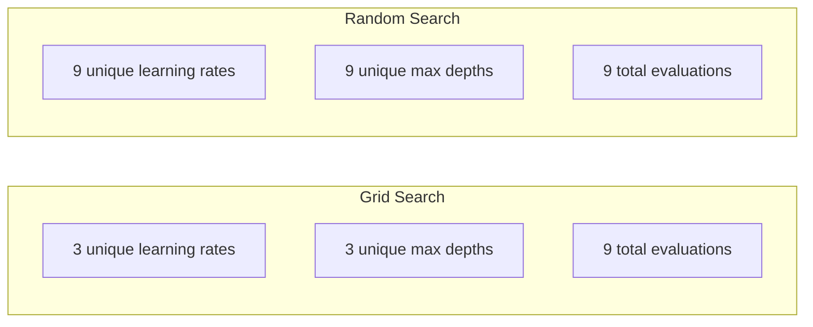
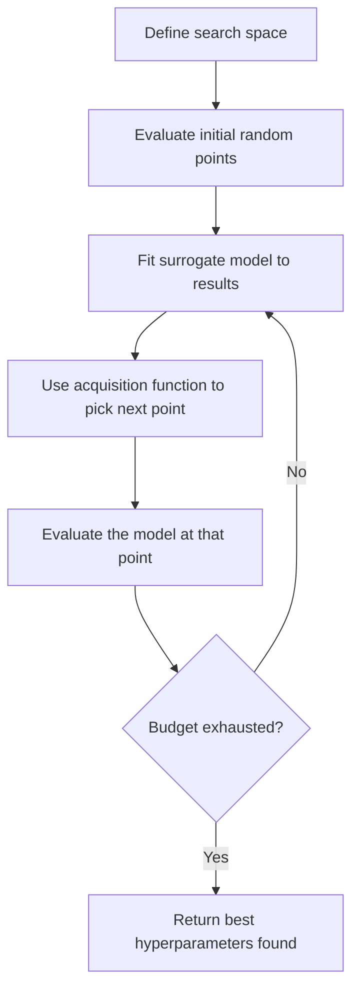
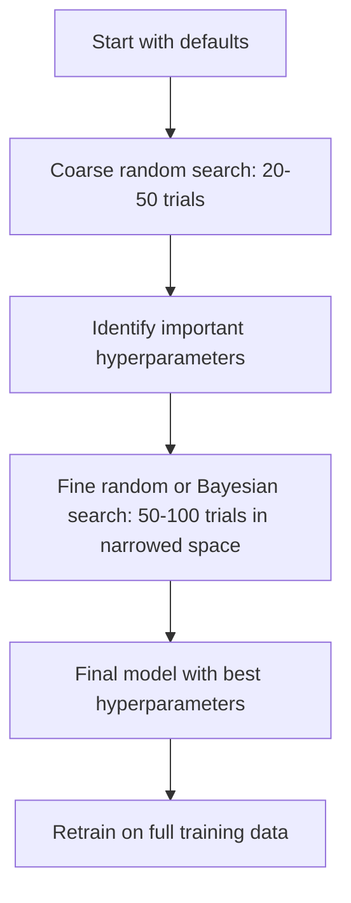
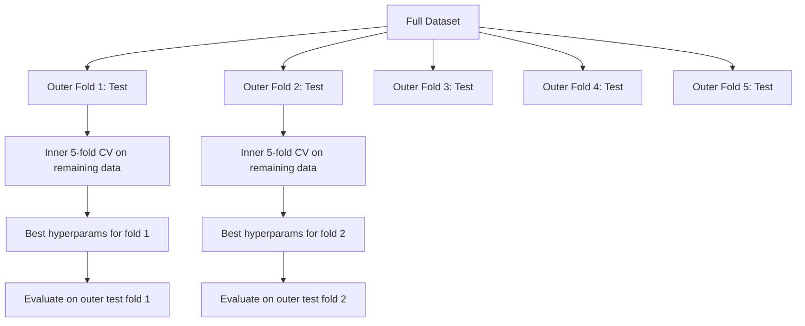

# 超参数调优

> 超参数是训练开始前你需要调的旋钮。调得好不好，决定了模型是平庸还是优秀。

**类型：** 动手实现
**语言：** Python
**前置知识：** 第 2 阶段，第 11 课（集成方法）
**时长：** 约 90 分钟

## 学习目标

- 从零实现网格搜索（Grid Search）、随机搜索（Random Search）和贝叶斯优化（Bayesian Optimization），并比较它们的采样效率
- 解释为什么在大多数超参数有效维度较低时，随机搜索优于网格搜索
- 使用代理模型（Surrogate Model）和采集函数（Acquisition Function）构建贝叶斯优化循环来引导搜索
- 设计一个超参数调优策略，通过合理的交叉验证避免在验证集上过拟合

## 问题引入

你的梯度提升模型有学习率、树的数量、最大深度、每个叶节点的最小样本数、子采样比例和列采样比例。这就是 6 个超参数（Hyperparameter）。如果每个有 5 个合理取值，网格就有 5^6 = 15,625 种组合。每次训练需要 10 秒。全部试完需要 43 小时。

网格搜索是最直观的方法，但在规模化时也是最差的。随机搜索用更少的计算做得更好。贝叶斯优化通过从过去的评估中学习做得更好。知道何时使用哪种策略，以及哪些超参数真正重要，能节省数天的 GPU 时间浪费。

## 核心概念

### 参数 vs 超参数

参数（Parameter）在训练过程中学习得到（权重、偏置、分裂阈值）。超参数在训练开始前设定，控制学习的进行方式。

| 超参数 | 控制什么 | 典型范围 |
|--------|----------|----------|
| 学习率 | 每次更新的步长 | 0.001 到 1.0 |
| 树/轮次的数量 | 训练多久 | 10 到 10,000 |
| 最大深度 | 模型复杂度 | 1 到 30 |
| 正则化（lambda） | 防止过拟合 | 0.0001 到 100 |
| 批量大小 | 梯度估计的噪声 | 16 到 512 |
| Dropout 率 | 被丢弃的神经元比例 | 0.0 到 0.5 |

### 网格搜索

网格搜索评估指定值的每一种组合。它是穷举式的、容易理解的，但随超参数数量呈指数级增长。

```
Grid for 2 hyperparameters:

  learning_rate: [0.01, 0.1, 1.0]
  max_depth:     [3, 5, 7]

  Evaluations: 3 x 3 = 9 combinations

  (0.01, 3)  (0.01, 5)  (0.01, 7)
  (0.1,  3)  (0.1,  5)  (0.1,  7)
  (1.0,  3)  (1.0,  5)  (1.0,  7)
```

网格搜索有一个根本性缺陷：如果一个超参数重要而另一个不重要，大部分评估都被浪费了。你用 9 次评估只得到了重要参数的 3 个不同取值。

### 随机搜索

随机搜索从分布中采样超参数，而不是在网格上。同样预算 9 次评估，你能得到每个超参数的 9 个不同取值。



为什么随机搜索优于网格搜索（Bergstra & Bengio, 2012）：

- 大多数超参数有效维度较低。通常 6 个超参数中只有 1-2 个对给定问题真正重要。
- 网格搜索在不重要的维度上浪费评估。
- 在相同预算下，随机搜索在重要维度上的覆盖更密集。
- 进行 60 次随机试验时，有 95% 的概率找到一个距最优值 5% 以内的点（如果最优点存在于搜索空间中）。

### 贝叶斯优化

随机搜索忽略了已有结果。它不会从"高学习率导致发散"或"深度 3 始终优于深度 10"中学到任何东西。贝叶斯优化利用过去的评估来决定下一步搜索哪里。



两个关键组成部分：

**代理模型（Surrogate Model）：** 一个计算代价低的模型（通常是高斯过程），用来近似代价高昂的目标函数。它在搜索空间中的任意一点同时给出预测值和不确定性估计。

**采集函数（Acquisition Function）：** 通过平衡利用（Exploitation，在已知好的点附近搜索）和探索（Exploration，在不确定性高的地方搜索）来决定下一步评估哪里。常见选择：

- **期望改进（Expected Improvement, EI）：** 在这个点上，我们期望比当前最佳值改进多少？
- **置信上界（Upper Confidence Bound, UCB）：** 预测值加上不确定性的倍数。UCB 越高意味着要么有前景，要么未被探索。
- **改进概率（Probability of Improvement, PI）：** 这个点超过当前最佳值的概率是多少？

贝叶斯优化通常用比随机搜索少 2-5 倍的评估次数找到更好的超参数。拟合代理模型的开销与训练实际模型相比微不足道。

### 早停

不是每次训练都需要跑完。如果一个配置在 10 个 epoch 后明显很差，就停掉它继续下一个。这是超参数搜索场景下的早停（Early Stopping）。

策略：
- **基于耐心的（Patience-based）：** 如果验证损失连续 N 个 epoch 没有改善就停止
- **中位数剪枝（Median Pruning）：** 如果该试验的中间结果比同一步的已完成试验的中位数更差就停止
- **Hyperband：** 给很多配置分配小预算，然后逐步为最好的配置增加预算

Hyperband 特别高效。它从 81 个配置各跑 1 个 epoch 开始，保留前三分之一，给它们 3 个 epoch，再保留前三分之一，依次类推。这比让所有配置跑完全部预算快 10-50 倍。

### 学习率调度器

学习率几乎总是最重要的超参数。与其保持固定，调度器（Learning Rate Scheduler）在训练过程中动态调整它。

| 调度器 | 公式 | 使用场景 |
|--------|------|----------|
| 阶梯衰减 | 每 N 个 epoch 乘以 0.1 | 经典 CNN 训练 |
| 余弦退火 | lr * 0.5 * (1 + cos(pi * t / T)) | 现代默认选择 |
| 预热 + 衰减 | 先线性增加再余弦衰减 | Transformer |
| 单周期 | 在一个周期内先增后减 | 快速收敛 |
| 平台衰减 | 当指标停滞时按比例缩小 | 稳妥的默认选择 |

### 超参数重要性

并非所有超参数同等重要。对随机森林（Probst et al., 2019）和梯度提升的研究显示了一致的模式：

**高重要性：**
- 学习率（总是最先调优）
- 基学习器/epoch 数量（使用早停代替调优）
- 正则化强度

**中等重要性：**
- 最大深度 / 层数
- 叶节点最小样本数 / 权重衰减
- 子采样比例

**低重要性：**
- 最大特征数（随机森林）
- 具体的激活函数选择
- 批量大小（在合理范围内）

先调重要的，其余保持默认。

### 实用策略



具体工作流程：

1. **从库的默认值开始。** 它们由有经验的开发者选定，通常已经完成了 80% 的工作。
2. **粗略随机搜索。** 宽范围，20-50 次试验。使用早停快速终止差的配置。
3. **分析结果。** 哪些超参数与性能相关？缩小搜索空间。
4. **精细搜索。** 在缩小的空间中使用贝叶斯优化或集中的随机搜索。50-100 次试验。
5. **用找到的最佳超参数在所有训练数据上重新训练。**

### 交叉验证整合

在单个验证集上调超参数是有风险的。找到的最佳超参数可能只是对特定验证折过拟合了。嵌套交叉验证（Nested Cross-Validation）通过使用两层循环解决了这个问题：

- **外层循环**（评估）：将数据分为训练+验证和测试。报告无偏的性能。
- **内层循环**（调优）：将训练+验证分为训练和验证。找到最佳超参数。



每个外层折独立地找到自己的最佳超参数。外层得分是泛化性能的无偏估计。

使用 sklearn：

```python
from sklearn.model_selection import cross_val_score, GridSearchCV
from sklearn.ensemble import GradientBoostingRegressor

inner_cv = GridSearchCV(
    GradientBoostingRegressor(),
    param_grid={
        "learning_rate": [0.01, 0.05, 0.1],
        "max_depth": [2, 3, 5],
        "n_estimators": [50, 100, 200],
    },
    cv=5,
    scoring="neg_mean_squared_error",
)

outer_scores = cross_val_score(
    inner_cv, X, y, cv=5, scoring="neg_mean_squared_error"
)

print(f"Nested CV MSE: {-outer_scores.mean():.4f} +/- {outer_scores.std():.4f}")
```

这很昂贵（5 个外层折 x 5 个内层折 x 27 个网格点 = 675 次模型拟合），但它给出可信赖的性能估计。在论文中报告最终结果或在高风险决策场景中使用它。

### 实用技巧

**从学习率开始。** 对于基于梯度的方法，学习率始终是最重要的超参数。学习率不对，其他一切都白搭。先固定其他超参数为默认值，单独扫描学习率。

**对学习率和正则化使用对数均匀分布。** 0.001 和 0.01 之间的差异与 0.1 和 1.0 之间的差异同等重要。线性搜索会将预算浪费在大值端。

**用早停代替调优 n_estimators。** 对于提升法和神经网络，将 n_estimators 或 epochs 设为高值，让早停来决定何时停止。这从搜索空间中去掉了一个超参数。

**预算分配。** 将 60% 的调优预算花在最重要的 2 个超参数上。剩余 40% 花在其他所有超参数上。前 2 个参数贡献了大部分的性能变异。

**尺度很重要。** 永远不要在对数尺度上搜索批量大小（16、32、64 就行）。始终在对数尺度上搜索学习率。搜索分布要与超参数影响模型的方式相匹配。

| 模型类型 | 最重要的超参数 | 推荐搜索方式 | 预算 |
|----------|---------------|-------------|------|
| 随机森林 | n_estimators, max_depth, min_samples_leaf | 随机搜索，50 次试验 | 低（训练快） |
| 梯度提升 | learning_rate, n_estimators, max_depth | 贝叶斯优化，100 次试验 + 早停 | 中等 |
| 神经网络 | learning_rate, weight_decay, batch_size | 贝叶斯或随机搜索，100+ 次试验 | 高（训练慢） |
| SVM | C, gamma（RBF 核） | 对数尺度网格搜索，25-50 次试验 | 低（2 个参数） |
| Lasso/Ridge | alpha | 对数尺度一维搜索，20 次试验 | 极低 |
| XGBoost | learning_rate, max_depth, subsample, colsample | 贝叶斯优化，100-200 次试验 + 早停 | 中等 |

**拿不准时：** 随机搜索，试验次数至少为超参数数量的 2 倍（例如 6 个超参数 = 至少 12 次试验）。你会惊讶于 50 次随机搜索击败精心设计的网格搜索的频率。

## 动手实现

### 第 1 步：从零实现网格搜索

`code/tuning.py` 中的代码从零实现了网格搜索、随机搜索和一个简单的贝叶斯优化器。

```python
def grid_search(model_fn, param_grid, X_train, y_train, X_val, y_val):
    keys = list(param_grid.keys())
    values = list(param_grid.values())
    best_score = -float("inf")
    best_params = None
    n_evals = 0

    for combo in itertools.product(*values):
        params = dict(zip(keys, combo))
        model = model_fn(**params)
        model.fit(X_train, y_train)
        score = evaluate(model, X_val, y_val)
        n_evals += 1

        if score > best_score:
            best_score = score
            best_params = params

    return best_params, best_score, n_evals
```

### 第 2 步：从零实现随机搜索

```python
def random_search(model_fn, param_distributions, X_train, y_train,
                  X_val, y_val, n_iter=50, seed=42):
    rng = np.random.RandomState(seed)
    best_score = -float("inf")
    best_params = None

    for _ in range(n_iter):
        params = {k: sample(v, rng) for k, v in param_distributions.items()}
        model = model_fn(**params)
        model.fit(X_train, y_train)
        score = evaluate(model, X_val, y_val)

        if score > best_score:
            best_score = score
            best_params = params

    return best_params, best_score, n_iter
```

### 第 3 步：贝叶斯优化（简化版）

核心思想：对已观测的（超参数，分数）对拟合一个高斯过程（Gaussian Process），然后用采集函数决定下一步去哪里搜索。

```python
class SimpleBayesianOptimizer:
    def __init__(self, search_space, n_initial=5):
        self.search_space = search_space
        self.n_initial = n_initial
        self.X_observed = []
        self.y_observed = []

    def _kernel(self, x1, x2, length_scale=1.0):
        dists = np.sum((x1[:, None, :] - x2[None, :, :]) ** 2, axis=2)
        return np.exp(-0.5 * dists / length_scale ** 2)

    def _fit_gp(self, X_new):
        X_obs = np.array(self.X_observed)
        y_obs = np.array(self.y_observed)
        y_mean = y_obs.mean()
        y_centered = y_obs - y_mean

        K = self._kernel(X_obs, X_obs) + 1e-4 * np.eye(len(X_obs))
        K_star = self._kernel(X_new, X_obs)

        L = np.linalg.cholesky(K)
        alpha = np.linalg.solve(L.T, np.linalg.solve(L, y_centered))
        mu = K_star @ alpha + y_mean

        v = np.linalg.solve(L, K_star.T)
        var = 1.0 - np.sum(v ** 2, axis=0)
        var = np.maximum(var, 1e-6)

        return mu, var

    def _expected_improvement(self, mu, var, best_y):
        sigma = np.sqrt(var)
        z = (mu - best_y) / (sigma + 1e-10)
        ei = sigma * (z * norm_cdf(z) + norm_pdf(z))
        return ei

    def suggest(self):
        if len(self.X_observed) < self.n_initial:
            return sample_random(self.search_space)

        candidates = [sample_random(self.search_space) for _ in range(500)]
        X_cand = np.array([to_vector(c) for c in candidates])
        mu, var = self._fit_gp(X_cand)
        ei = self._expected_improvement(mu, var, max(self.y_observed))
        return candidates[np.argmax(ei)]

    def observe(self, params, score):
        self.X_observed.append(to_vector(params))
        self.y_observed.append(score)
```

GP 代理模型在每个候选点给出两个东西：预测分数（mu）和不确定性（var）。期望改进在两者之间取平衡：它偏好模型预测分数高的点，或者不确定性高的点。在早期，大多数点的不确定性都很高，因此优化器偏向探索。后期则聚焦于最有前景的区域。

### 第 4 步：比较所有方法

在相同的合成目标函数上运行三种方法并对比。这个对比使用了一个简化的包装器，直接调用目标函数（不涉及模型训练），因此 API 与上面基于模型的实现有所不同：

```python
def synthetic_objective(params):
    lr = params["learning_rate"]
    depth = params["max_depth"]
    return -(np.log10(lr) + 2) ** 2 - (depth - 4) ** 2 + 10

param_grid = {
    "learning_rate": [0.001, 0.01, 0.1, 1.0],
    "max_depth": [2, 3, 4, 5, 6, 7, 8],
}

grid_best = None
grid_score = -float("inf")
grid_history = []
for combo in itertools.product(*param_grid.values()):
    params = dict(zip(param_grid.keys(), combo))
    score = synthetic_objective(params)
    grid_history.append((params, score))
    if score > grid_score:
        grid_score = score
        grid_best = params

param_dist = {
    "learning_rate": ("log_float", 0.001, 1.0),
    "max_depth": ("int", 2, 8),
}

rand_best = None
rand_score = -float("inf")
rand_history = []
rng = np.random.RandomState(42)
for _ in range(28):
    params = {k: sample(v, rng) for k, v in param_dist.items()}
    score = synthetic_objective(params)
    rand_history.append((params, score))
    if score > rand_score:
        rand_score = score
        rand_best = params

optimizer = SimpleBayesianOptimizer(param_dist, n_initial=5)
bayes_history = []
for _ in range(28):
    params = optimizer.suggest()
    score = synthetic_objective(params)
    optimizer.observe(params, score)
    bayes_history.append((params, score))
bayes_score = max(s for _, s in bayes_history)

print(f"{'Method':<20} {'Best Score':>12} {'Evaluations':>12}")
print("-" * 50)
print(f"{'Grid Search':<20} {grid_score:>12.4f} {len(grid_history):>12}")
print(f"{'Random Search':<20} {rand_score:>12.4f} {len(rand_history):>12}")
print(f"{'Bayesian Opt':<20} {bayes_score:>12.4f} {len(bayes_history):>12}")
```

在相同预算下，贝叶斯优化通常最快找到最佳分数，因为它不会在明显差的区域浪费评估。随机搜索比网格搜索覆盖面更广。网格搜索只有在超参数很少且能承担穷举代价时才有优势。

## 实际使用

### Optuna 实战

Optuna 是认真做超参数调优时推荐的库。它开箱即用地支持剪枝、分布式搜索和可视化。

```python
import optuna

def objective(trial):
    lr = trial.suggest_float("learning_rate", 1e-4, 1e-1, log=True)
    n_est = trial.suggest_int("n_estimators", 50, 500)
    max_depth = trial.suggest_int("max_depth", 2, 10)

    model = GradientBoostingRegressor(
        learning_rate=lr,
        n_estimators=n_est,
        max_depth=max_depth,
    )
    model.fit(X_train, y_train)
    return mean_squared_error(y_val, model.predict(X_val))

study = optuna.create_study(direction="minimize")
study.optimize(objective, n_trials=100)

print(f"Best params: {study.best_params}")
print(f"Best MSE: {study.best_value:.4f}")
```

Optuna 的关键特性：
- `suggest_float(..., log=True)` 用于在对数尺度上搜索的参数（学习率、正则化）
- `suggest_int` 用于整数参数
- `suggest_categorical` 用于离散选项
- 内置 MedianPruner 用于提前终止差的试验
- `study.trials_dataframe()` 用于分析

### Optuna 与剪枝

剪枝能提前终止没有前途的试验，节省大量计算。以下是使用模式：

```python
import optuna
from sklearn.model_selection import cross_val_score

def objective(trial):
    params = {
        "learning_rate": trial.suggest_float("lr", 1e-4, 0.5, log=True),
        "max_depth": trial.suggest_int("max_depth", 2, 10),
        "n_estimators": trial.suggest_int("n_estimators", 50, 500),
        "subsample": trial.suggest_float("subsample", 0.5, 1.0),
    }

    model = GradientBoostingRegressor(**params)
    scores = cross_val_score(model, X_train, y_train, cv=3,
                             scoring="neg_mean_squared_error")
    mean_score = -scores.mean()

    trial.report(mean_score, step=0)
    if trial.should_prune():
        raise optuna.TrialPruned()

    return mean_score

pruner = optuna.pruners.MedianPruner(n_startup_trials=10, n_warmup_steps=5)
study = optuna.create_study(direction="minimize", pruner=pruner)
study.optimize(objective, n_trials=200)
```

`MedianPruner` 在某个试验的中间值比同一步骤所有已完成试验的中位数更差时终止该试验。剪枝需要调用 `trial.report()` 报告中间指标，并调用 `trial.should_prune()` 检查是否应该停止。`n_startup_trials=10` 确保至少有 10 个试验完整运行后才启动剪枝。这通常能节省 40-60% 的总计算量。

### sklearn 内置调优器

对于快速实验，sklearn 提供了 `GridSearchCV`、`RandomizedSearchCV` 和 `HalvingRandomSearchCV`：

```python
from sklearn.model_selection import RandomizedSearchCV
from scipy.stats import loguniform, randint

param_dist = {
    "learning_rate": loguniform(1e-4, 0.5),
    "max_depth": randint(2, 10),
    "n_estimators": randint(50, 500),
}

search = RandomizedSearchCV(
    GradientBoostingRegressor(),
    param_dist,
    n_iter=100,
    cv=5,
    scoring="neg_mean_squared_error",
    random_state=42,
    n_jobs=-1,
)
search.fit(X_train, y_train)
print(f"Best params: {search.best_params_}")
print(f"Best CV MSE: {-search.best_score_:.4f}")
```

对学习率和正则化使用 scipy 的 `loguniform`。对整数超参数使用 `randint`。`n_jobs=-1` 标志在所有 CPU 核心上并行化。

### 超参数调优中的常见错误

**预处理导致的数据泄漏。** 如果你在交叉验证之前对整个数据集拟合了标准化器，验证折的信息就泄漏到了训练中。始终将预处理放在 `Pipeline` 内部，确保只在训练折上拟合。

**在验证集上过拟合。** 运行成千上万次试验实际上等于在验证集上训练。使用嵌套交叉验证来获得最终性能估计，或者留出一个在调优过程中从不触碰的独立测试集。

**搜索范围太窄。** 如果你的最佳值在搜索空间的边界上，说明你的搜索范围不够宽。最优值可能在你的范围之外。始终检查最佳参数是否在边缘。

**忽略交互效应。** 学习率和基学习器数量在提升法中有强烈的交互作用。低学习率需要更多基学习器。独立调优它们的效果不如一起调优。

**迭代模型不使用早停。** 对于梯度提升和神经网络，将 n_estimators 或 epochs 设为高值并使用早停。这严格优于将迭代次数作为超参数来调优。

## 练习

1. 使用相同的总预算（例如 50 次评估）运行网格搜索和随机搜索。比较找到的最佳分数。用不同的随机种子运行 10 次实验。随机搜索赢了多少次？

2. 从零实现 Hyperband。从 81 个配置开始，每个训练 1 个 epoch。每轮保留前 1/3 并将预算翻三倍。比较总计算量（所有配置的 epoch 总和）与让 81 个配置跑完全部预算。

3. 将学习率调度器（余弦退火）添加到第 11 课的梯度提升实现中。与固定学习率相比是否有帮助？

4. 使用 Optuna 在真实数据集（例如 sklearn 的乳腺癌数据集）上调优 RandomForestClassifier。使用 `optuna.visualization.plot_param_importances(study)` 查看哪些超参数最重要。与本课中的重要性排名是否一致？

5. 实现一个简单的采集函数（期望改进）并演示探索与利用的权衡。绘制代理模型的均值和不确定性，展示 EI 选择在哪里进行下一次评估。

## 核心术语

| 术语 | 通俗说法 | 准确含义 |
|------|----------|----------|
| 超参数（Hyperparameter） | "你选择的一个设置" | 训练前设定的值，控制学习过程，不从数据中学习 |
| 网格搜索（Grid Search） | "试遍每种组合" | 在指定的参数网格上穷举搜索。代价呈指数增长。 |
| 随机搜索（Random Search） | "随便采样就行" | 从分布中采样超参数。在相同预算下，在重要维度上的覆盖优于网格搜索。 |
| 贝叶斯优化（Bayesian Optimization） | "智能搜索" | 使用目标函数的代理模型来决定下一步评估哪里，平衡探索和利用 |
| 代理模型（Surrogate Model） | "一个便宜的近似" | 一个模型（通常是高斯过程），根据已有观测值来近似代价高昂的目标函数 |
| 采集函数（Acquisition Function） | "下一步看哪里" | 通过平衡期望改进和不确定性来为候选点评分。EI 和 UCB 是常见选择。 |
| 早停（Early Stopping） | "别浪费时间了" | 当验证性能停止改善时提前终止训练 |
| Hyperband | "配置的锦标赛淘汰制" | 自适应资源分配：用小预算启动很多配置，保留最好的并增加它们的预算 |
| 学习率调度器（Learning Rate Scheduler） | "训练中改变学习率" | 在训练过程中调整学习率的函数，以获得更好的收敛效果 |

## 延伸阅读

- [Bergstra & Bengio: Random Search for Hyper-Parameter Optimization (2012)](https://jmlr.org/papers/v13/bergstra12a.html) -- 证明随机搜索优于网格搜索的论文
- [Snoek et al., Practical Bayesian Optimization of Machine Learning Algorithms (2012)](https://arxiv.org/abs/1206.2944) -- 机器学习中的贝叶斯优化
- [Li et al., Hyperband: A Novel Bandit-Based Approach (2018)](https://jmlr.org/papers/v18/16-558.html) -- Hyperband 论文
- [Optuna: A Next-generation Hyperparameter Optimization Framework](https://arxiv.org/abs/1907.10902) -- Optuna 论文
- [Probst et al., Tunability: Importance of Hyperparameters (2019)](https://jmlr.org/papers/v20/18-444.html) -- 哪些超参数重要
