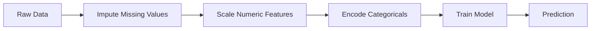
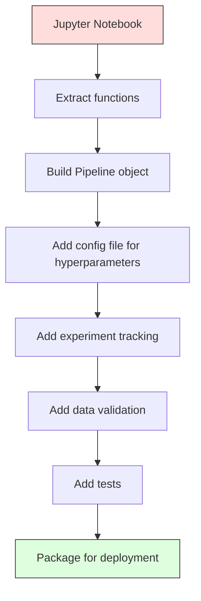

# 机器学习流水线

> 模型不是产品，流水线才是。流水线是从原始数据到部署预测的全部过程，每一步都必须可复现。

**类型：** 动手实现
**语言：** Python
**前置课程：** 第二阶段，第12课（超参数调优）
**时长：** 约120分钟

## 学习目标

- 从零构建一个机器学习流水线（ML Pipeline），将缺失值填充、特征缩放、编码和模型训练串联成一个可复现的对象
- 识别数据泄露（Data Leakage）场景，解释流水线如何通过仅在训练数据上拟合转换器来防止泄露
- 构建一个列转换器（ColumnTransformer），对数值特征和类别特征分别应用不同的预处理
- 实现流水线序列化，并验证同一个拟合后的流水线在训练和生产环境中产生完全相同的结果

## 问题引入

你有一个笔记本，它加载数据、用中位数填充缺失值、缩放特征、训练模型、打印准确率。一切正常，你把它上线了。

一个月后，有人重新训练模型，得到了不同的结果。中位数是在包含测试数据的完整数据集上计算的（数据泄露）。缩放参数没有保存，推理时使用了不同的统计量。特征工程代码在训练和服务之间被复制粘贴，两份代码逐渐不一致。某个类别列在生产环境中出现了编码器从未见过的新值。

这些都不是假设的情况，而是机器学习系统在生产中失败的最常见原因。流水线通过将每个转换步骤打包成一个有序、可复现的对象来解决所有这些问题。

## 核心概念

### 什么是流水线

流水线（Pipeline）是一系列有序的数据转换步骤，最后跟着一个模型。每一步将前一步的输出作为输入。整个流水线在训练数据上拟合一次。在推理时，同一个拟合后的流水线对新数据进行转换并产生预测。



流水线保证了：
- 转换器仅在训练数据上拟合（无泄露）
- 推理时应用相同的转换
- 整个对象可以序列化并作为一个工件部署
- 交叉验证对每折应用流水线，防止微妙的泄露

### 数据泄露：隐形杀手

数据泄露（Data Leakage）发生在测试集或未来数据的信息污染了训练过程时。流水线能防止最常见的泄露形式。

**泄露写法（错误）：**
```python
X = df.drop("target", axis=1)
y = df["target"]

scaler = StandardScaler()
X_scaled = scaler.fit_transform(X)

X_train, X_test = X_scaled[:800], X_scaled[800:]
y_train, y_test = y[:800], y[800:]
```

缩放器看到了测试数据。均值和标准差包含了测试样本。这会夸大准确率估计。

**正确写法：**
```python
X_train, X_test = X[:800], X[800:]

scaler = StandardScaler()
X_train_scaled = scaler.fit_transform(X_train)
X_test_scaled = scaler.transform(X_test)
```

使用流水线，你无需考虑这些，流水线会自动处理。

### sklearn 流水线

sklearn 的 `Pipeline` 将转换器和估计器串联起来。它暴露 `.fit()`、`.predict()` 和 `.score()` 方法，按顺序应用所有步骤。

```python
from sklearn.pipeline import Pipeline
from sklearn.preprocessing import StandardScaler
from sklearn.linear_model import LogisticRegression

pipe = Pipeline([
    ("scaler", StandardScaler()),
    ("model", LogisticRegression()),
])

pipe.fit(X_train, y_train)
predictions = pipe.predict(X_test)
```

当你调用 `pipe.fit(X_train, y_train)` 时：
1. 缩放器对 X_train 调用 `fit_transform`
2. 模型对缩放后的 X_train 调用 `fit`

当你调用 `pipe.predict(X_test)` 时：
1. 缩放器对 X_test 调用 `transform`（不是 fit_transform）
2. 模型对缩放后的 X_test 调用 `predict`

缩放器在拟合时永远不会看到测试数据。这就是流水线的核心要义。

### ColumnTransformer：为不同列使用不同流水线

真实数据集有数值列和类别列，需要不同的预处理。`ColumnTransformer`（列转换器）可以处理这种情况。

```python
from sklearn.compose import ColumnTransformer
from sklearn.preprocessing import StandardScaler, OneHotEncoder
from sklearn.impute import SimpleImputer

numeric_pipe = Pipeline([
    ("impute", SimpleImputer(strategy="median")),
    ("scale", StandardScaler()),
])

categorical_pipe = Pipeline([
    ("impute", SimpleImputer(strategy="most_frequent")),
    ("encode", OneHotEncoder(handle_unknown="ignore")),
])

preprocessor = ColumnTransformer([
    ("num", numeric_pipe, ["age", "income", "score"]),
    ("cat", categorical_pipe, ["city", "gender", "plan"]),
])

full_pipeline = Pipeline([
    ("preprocess", preprocessor),
    ("model", GradientBoostingClassifier()),
])
```

OneHotEncoder 中的 `handle_unknown="ignore"` 对生产环境至关重要。当出现新类别（模型从未见过的城市）时，它会产生一个零向量而不是崩溃。

### 实验追踪

流水线使训练可复现，但你还需要跟踪多次实验中发生了什么：使用了哪些超参数、哪个版本的数据集、指标是什么、运行了哪些代码。

**MLflow** 是最常用的开源解决方案：

```python
import mlflow

with mlflow.start_run():
    mlflow.log_param("max_depth", 5)
    mlflow.log_param("n_estimators", 100)
    mlflow.log_param("learning_rate", 0.1)

    pipe.fit(X_train, y_train)
    accuracy = pipe.score(X_test, y_test)

    mlflow.log_metric("accuracy", accuracy)
    mlflow.sklearn.log_model(pipe, "model")
```

每次运行都会记录参数、指标、工件和完整模型。你可以比较不同运行、复现任何实验、部署任何版本的模型。

**Weights & Biases (wandb)** 提供相同的功能，并附带托管的仪表板：

```python
import wandb

wandb.init(project="my-pipeline")
wandb.config.update({"max_depth": 5, "n_estimators": 100})

pipe.fit(X_train, y_train)
accuracy = pipe.score(X_test, y_test)

wandb.log({"accuracy": accuracy})
```

### 模型版本管理

在实验追踪之后，你需要管理模型版本。哪个模型在生产环境中？哪个在预发布？哪个是上周的？

MLflow 的模型注册中心（Model Registry）提供：
- **版本追踪：** 每个保存的模型都有一个版本号
- **阶段流转：** "预发布（Staging）"、"生产（Production）"、"归档（Archived）"
- **审批流程：** 模型必须被明确推入生产环境
- **回滚：** 可以即时切换到之前的版本

### 使用 DVC 进行数据版本管理

代码用 git 进行版本管理。数据也应该被版本化，但 git 无法处理大文件。DVC（Data Version Control，数据版本控制）解决了这个问题。

```
dvc init
dvc add data/training.csv
git add data/training.csv.dvc data/.gitignore
git commit -m "Track training data"
dvc push
```

DVC 将实际数据存储在远程存储（S3、GCS、Azure）中，并在 git 中保留一个小的 `.dvc` 文件来记录哈希值。当你 checkout 一个 git 提交时，`dvc checkout` 会恢复当时使用的确切数据。

这意味着每个 git 提交都绑定了代码和数据。实现完全的可复现性。

### 可复现实验

一个可复现的实验需要四样东西：

1. **固定随机种子：** 为 numpy、random 和框架（torch、sklearn）设置种子
2. **锁定依赖版本：** requirements.txt 或 poetry.lock 中写明精确版本号
3. **数据版本化：** DVC 或类似工具
4. **配置文件：** 所有超参数放在配置文件中，不要硬编码

```python
import numpy as np
import random

def set_seed(seed=42):
    random.seed(seed)
    np.random.seed(seed)
    try:
        import torch
        torch.manual_seed(seed)
        torch.cuda.manual_seed_all(seed)
        torch.backends.cudnn.deterministic = True
    except ImportError:
        pass
```

### 从笔记本到生产流水线



典型的演进路径：

1. **笔记本探索：** 快速实验、可视化、特征想法
2. **提取函数：** 将预处理、特征工程、评估移入模块
3. **构建流水线：** 将转换串联成 sklearn Pipeline 或自定义类
4. **配置管理：** 将所有超参数移入 YAML/JSON 配置文件
5. **实验追踪：** 添加 MLflow 或 wandb 日志记录
6. **数据验证：** 在训练前检查 schema、分布和缺失值模式
7. **测试：** 为转换器编写单元测试，为完整流水线编写集成测试
8. **部署：** 序列化流水线，包装成 API（FastAPI、Flask），容器化

### 常见的流水线错误

| 错误 | 为什么有问题 | 修复方法 |
|---------|-------------|-----|
| 在拆分前对全部数据拟合 | 数据泄露 | 使用 Pipeline 配合 cross_val_score |
| 特征工程在流水线外部 | 训练和服务时转换不一致 | 将所有转换放入 Pipeline |
| 不处理未知类别 | 生产环境遇到新值时崩溃 | OneHotEncoder(handle_unknown="ignore") |
| 硬编码列名 | schema 变更时出错 | 使用配置文件中的列名列表 |
| 无数据验证 | 在坏数据上静默输出错误预测 | 在预测前添加 schema 检查 |
| 训练/服务偏差 | 模型在生产中看到不同的特征 | 训练和服务使用同一个 Pipeline 对象 |

## 动手实现

`code/pipeline.py` 中的代码从零构建了一个完整的机器学习流水线：

### 第一步：自定义转换器

```python
class CustomTransformer:
    def __init__(self):
        self.means = None
        self.stds = None

    def fit(self, X):
        self.means = np.mean(X, axis=0)
        self.stds = np.std(X, axis=0)
        self.stds[self.stds == 0] = 1.0
        return self

    def transform(self, X):
        return (X - self.means) / self.stds

    def fit_transform(self, X):
        return self.fit(X).transform(X)
```

### 第二步：从零实现流水线

```python
class PipelineFromScratch:
    def __init__(self, steps):
        self.steps = steps

    def fit(self, X, y=None):
        X_current = X.copy()
        for name, step in self.steps[:-1]:
            X_current = step.fit_transform(X_current)
        name, model = self.steps[-1]
        model.fit(X_current, y)
        return self

    def predict(self, X):
        X_current = X.copy()
        for name, step in self.steps[:-1]:
            X_current = step.transform(X_current)
        name, model = self.steps[-1]
        return model.predict(X_current)
```

### 第三步：流水线中的交叉验证

代码演示了如何在流水线中进行交叉验证以防止数据泄露：缩放器在每折的训练数据上分别拟合。

### 第四步：使用 sklearn 的完整生产流水线

一个包含 `ColumnTransformer`、多条预处理路径和模型的完整流水线，通过适当的交叉验证和实验日志记录进行训练。

## 交付物

本课产出：
- `outputs/prompt-ml-pipeline.md` -- 用于构建和调试机器学习流水线的技能提示词
- `code/pipeline.py` -- 从零实现到 sklearn 的完整流水线

## 练习

1. 构建一个流水线，处理包含3个数值列和2个类别列的数据集。使用 `ColumnTransformer` 对数值列应用中位数填充 + 缩放，对类别列应用众数填充 + 独热编码。使用5折交叉验证进行训练。

2. 故意引入数据泄露：在拆分前对全部数据集拟合缩放器。将泄露的交叉验证分数与流水线交叉验证分数（干净的）进行比较。差异有多大？

3. 使用 `joblib.dump` 序列化你的流水线。在另一个脚本中加载并运行预测。验证预测结果完全相同。

4. 向流水线添加一个自定义转换器，为两个最重要的数值列创建多项式特征（2阶）。它应该放在流水线的什么位置？

5. 为流水线设置 MLflow 追踪。使用不同的超参数运行5次实验。使用 MLflow UI（`mlflow ui`）比较运行结果并选出最佳模型。

## 核心术语

| 术语 | 常见说法 | 实际含义 |
|------|----------------|----------------------|
| 流水线（Pipeline） | "转换链 + 模型" | 一系列有序的拟合转换器和模型，作为一个整体应用以防止泄露 |
| 数据泄露（Data Leakage） | "测试信息泄漏到训练中" | 使用训练集之外的信息来构建模型，导致性能估计虚高 |
| 列转换器（ColumnTransformer） | "不同列用不同预处理" | 对不同的列子集应用不同的流水线，并合并结果 |
| 实验追踪（Experiment Tracking） | "记录你的运行" | 记录每次训练运行的参数、指标、工件和代码版本 |
| MLflow | "追踪和部署模型" | 用于实验追踪、模型注册和部署的开源平台 |
| DVC | "数据的 Git" | 大型数据文件的版本控制系统，在 git 中存储哈希值，在远程存储中存储数据 |
| 模型注册中心（Model Registry） | "模型版本目录" | 跟踪模型版本并带有阶段标签（预发布、生产、归档）的系统 |
| 训练/服务偏差（Training/Serving Skew） | "在笔记本里能跑" | 训练和推理时数据处理方式的差异，导致无声的错误 |
| 可复现性（Reproducibility） | "相同代码，相同结果" | 使用相同的代码、数据和配置能得到相同结果的能力 |

## 延伸阅读

- [scikit-learn Pipeline 文档](https://scikit-learn.org/stable/modules/compose.html) -- 官方流水线参考
- [MLflow 文档](https://mlflow.org/docs/latest/index.html) -- 实验追踪和模型注册
- [DVC 文档](https://dvc.org/doc) -- 数据版本管理
- [Sculley et al., Hidden Technical Debt in Machine Learning Systems (2015)](https://papers.nips.cc/paper/2015/hash/86df7dcfd896fcaf2674f757a2463eba-Abstract.html) -- 关于机器学习系统复杂性的经典论文
- [Google ML Best Practices: Rules of ML](https://developers.google.com/machine-learning/guides/rules-of-ml) -- 实用的生产机器学习建议
