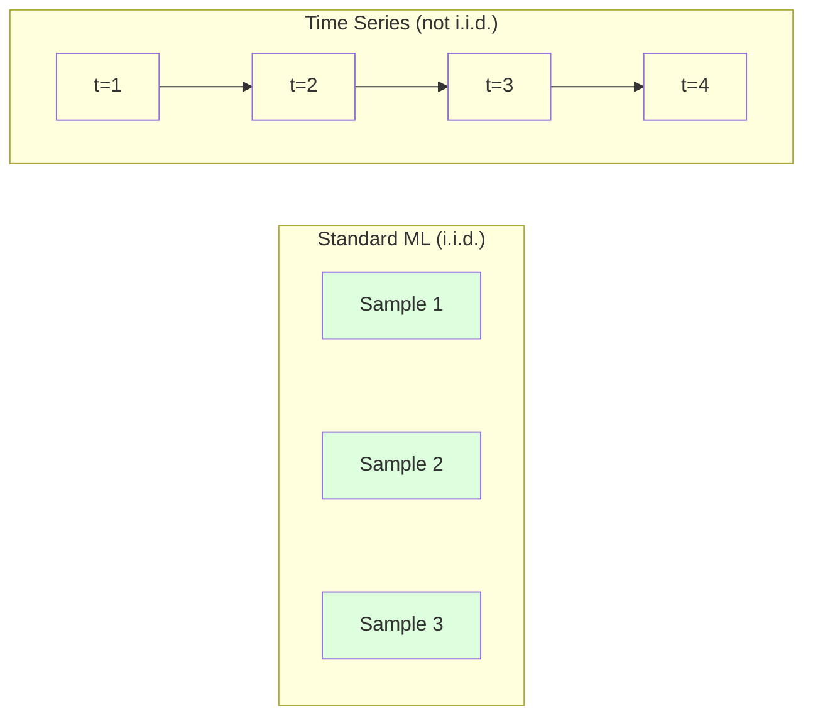
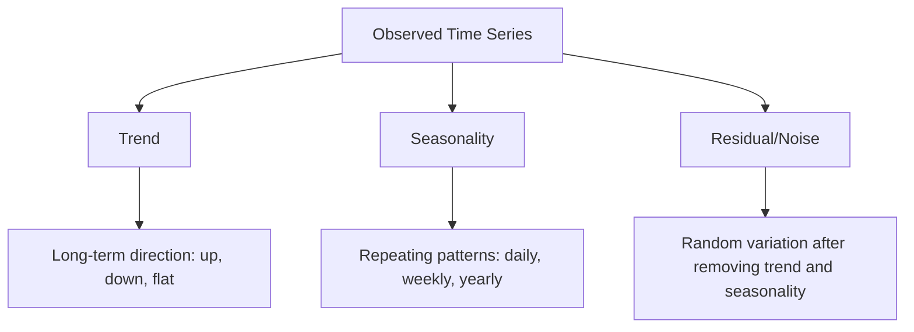
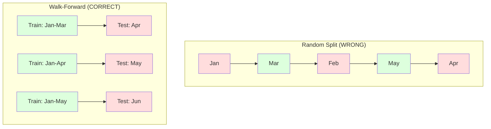

# 时间序列基础

> 过去的表现确实能预测未来的结果——前提是你先检查了平稳性。

**类型：** 动手实现
**语言：** Python
**前置课程：** 第二阶段，第01-09课
**时长：** 约90分钟

## 学习目标

- 将时间序列分解为趋势（Trend）、季节性（Seasonality）和残差（Residual）成分，并检验平稳性（Stationarity）
- 实现滞后特征（Lag Features）和滚动统计量，将时间序列转化为监督学习问题
- 构建一个前进验证（Walk-Forward Validation）框架，防止未来数据泄漏到训练中
- 解释为什么随机训练/测试拆分对时间序列无效，并演示与正确的时间拆分之间的性能差距

## 问题引入

你有按时间排序的数据。每日销售额、每小时温度、每分钟 CPU 使用率、每周股票价格。你想预测下一个值、下一周、下一个季度。

你拿出标准的机器学习工具箱：随机训练/测试拆分、交叉验证、特征矩阵输入、预测输出。每一步都是错的。

时间序列打破了标准机器学习所依赖的假设。样本不是独立的——今天的温度取决于昨天。随机拆分将未来信息泄漏到过去。在回测中看起来很好的特征在生产中失败了，因为它们依赖于随时间变化的模式。

一个使用随机交叉验证获得95%准确率的模型，使用正确的基于时间的评估可能只有55%。这不是技术细节的差异，而是一个在纸上有效的模型和一个在生产中有效的模型之间的差异。

本课涵盖基础内容：是什么让时间数据与众不同，如何诚实地评估模型，以及如何将时间序列转化为标准机器学习模型可以使用的特征。

## 核心概念

### 时间序列有何不同

标准机器学习假设 i.i.d.——独立同分布（Independent and Identically Distributed）。每个样本独立地从相同的分布中抽取。时间序列违反了这两个假设：

- **不独立。** 今天的股票价格取决于昨天。本周的销售额与上周相关。
- **不同分布。** 分布随时间变化。12月的销售额与3月的看起来不同。

这些违反不是小事。它们改变了你构建特征的方式、评估模型的方式以及哪些算法有效。



在标准机器学习中，样本是可交换的。打乱顺序不会改变什么。在时间序列中，顺序就是一切。打乱会破坏信号。

### 时间序列的组成部分

每个时间序列都是以下成分的组合：



- **趋势（Trend）**：长期方向。收入每年增长10%。全球气温上升。
- **季节性（Seasonality）**：固定间隔的重复模式。零售销售在12月达到峰值。空调使用在7月达到高峰。
- **残差（Residual）**：去除趋势和季节性后剩下的部分。如果残差看起来像白噪声，说明分解捕获了信号。

### 平稳性

如果一个时间序列的统计性质（均值、方差、自相关）不随时间变化，则称它是平稳的（Stationary）。大多数预测方法假设平稳性。

**为什么重要：** 非平稳序列的均值会漂移。在1月数据上训练的模型学到的均值与2月实际的均值不同。它会系统性地犯错。

**如何检查：** 在窗口上计算滚动均值和滚动标准差。如果它们漂移，序列就是非平稳的。

**如何修复：** 差分（Differencing）。不建模原始值，而是建模连续值之间的变化：

```
diff[t] = value[t] - value[t-1]
```

如果一次差分不能使序列平稳，再做一次（二阶差分）。大多数真实世界的序列最多需要两次。

**示例：**

原始序列：[100, 102, 106, 112, 120]
一阶差分：[2, 4, 6, 8]（仍有上升趋势）
二阶差分：[2, 2, 2]（常数——平稳）

原始序列有二次趋势。一阶差分将其变为线性趋势。二阶差分使其变平。在实践中，你很少需要超过两次差分。

**正式检验：** 增广迪基-富勒检验（Augmented Dickey-Fuller Test，ADF）是平稳性的标准统计检验。原假设是"序列是非平稳的"。p 值低于 0.05 意味着你可以拒绝原假设并得出平稳性结论。我们不从零实现 ADF（它需要渐近分布表），但代码中的滚动统计方法提供了一个实用的可视化检查。

### 自相关

自相关（Autocorrelation）衡量时间 t 的值与时间 t-k（过去 k 步）的值之间的相关程度。自相关函数（ACF）绘制每个滞后（Lag）k 的这种相关性。

**ACF 告诉你：**
- 序列的记忆有多长。如果 ACF 在滞后5之后降到零，5步之前的值就不相关了。
- 是否存在季节性。如果 ACF 在滞后12处出现尖峰（月度数据），则存在年度季节性。
- 要创建多少个滞后特征。使用到 ACF 变得可忽略的滞后数。

**PACF（偏自相关函数，Partial Autocorrelation Function）** 去除间接相关。如果今天与3天前的相关仅仅是因为两者都与昨天相关，那么滞后3的 PACF 将为零，而滞后3的 ACF 不为零。

### 滞后特征：将时间序列转化为监督学习

标准机器学习模型需要特征矩阵 X 和目标 y。时间序列只给你一列值。桥梁就是滞后特征（Lag Features）。

取序列 [10, 12, 14, 13, 15] 并创建滞后1和滞后2特征：

| lag_2 | lag_1 | target |
|-------|-------|--------|
| 10    | 12    | 14     |
| 12    | 14    | 13     |
| 14    | 13    | 15     |

现在你有了一个标准的回归问题。任何机器学习模型（线性回归、随机森林、梯度提升）都可以根据滞后值预测目标。

你可以构造的额外特征：
- **滚动统计量：** 最近 k 个值的均值、标准差、最小值、最大值
- **日历特征：** 星期几、月份、是否假日、是否周末
- **差分值：** 与前一步的变化
- **扩展统计量：** 累计均值、累计求和
- **比率特征：** 当前值/滚动均值（偏离近期平均有多远）
- **交互特征：** lag_1 * day_of_week（工作日对动量的影响）

**用多少个滞后？** 使用自相关函数。如果 ACF 到滞后10都显著，至少使用10个滞后。如果有周季节性，包含滞后7（可能还有14）。更多滞后给模型更多历史信息，但也带来更多需要拟合的特征，增加过拟合的风险。

**目标对齐陷阱。** 创建滞后特征时，目标必须是时间 t 的值，所有特征必须使用时间 t-1 或更早的值。如果你不小心将时间 t 的值包含为特征，你就有了一个完美的预测器——和一个完全无用的模型。这是时间序列特征工程中最常见的 bug。

### 前进验证

这是本课最重要的概念。标准的 k 折交叉验证随机将样本分配到训练集和测试集。对于时间序列，这会泄漏未来信息。



前进验证（Walk-Forward Validation）：
1. 在时间 t 之前的数据上训练
2. 在时间 t+1 进行预测（或 t+1 到 t+k 用于多步预测）
3. 将窗口向前滑动
4. 重复

每个测试折只包含在所有训练数据之后的数据。没有未来泄漏。这给你一个诚实的估计，模型在部署后的表现如何。

**扩展窗口（Expanding Window）** 使用所有历史数据进行训练（窗口增长）。**滑动窗口（Sliding Window）** 使用固定大小的训练窗口（窗口滑动）。当你相信旧数据仍然相关时使用扩展窗口。当世界在变化、旧数据有害时使用滑动窗口。

### ARIMA 直觉

ARIMA 是经典的时间序列模型。它有三个组成部分：

- **AR（自回归，Autoregressive）：** 根据过去的值预测。AR(p) 使用最近 p 个值。
- **I（积分/差分，Integrated）：** 差分以实现平稳性。I(d) 应用 d 次差分。
- **MA（移动平均，Moving Average）：** 根据过去的预测误差预测。MA(q) 使用最近 q 个误差。

ARIMA(p, d, q) 结合了这三者。你根据 ACF/PACF 分析或自动搜索（auto-ARIMA）来选择 p、d、q。

我们不会从零实现 ARIMA——它需要超出本课范围的数值优化。关键洞察是理解每个组件的作用，这样你就能解释 ARIMA 的结果并知道何时使用它。

### 何时使用什么

| 方法 | 最适合 | 处理季节性 | 处理外部特征 |
|----------|---------|-------------------|------------------------|
| 滞后特征 + ML | 有大量外部特征的表格数据 | 通过日历特征 | 是 |
| ARIMA | 单一单变量序列，短期预测 | SARIMA 变体 | 否（ARIMAX 有限支持） |
| 指数平滑（Exponential Smoothing） | 简单趋势 + 季节性 | 是（Holt-Winters） | 否 |
| Prophet | 商业预测，节假日 | 是（傅里叶项） | 有限 |
| 神经网络（LSTM、Transformer） | 长序列，大量序列 | 学习得到 | 是 |

对于大多数实际问题，滞后特征 + 梯度提升是最强的起点。它能自然地处理外部特征，不需要平稳性，且易于调试。

### 预测范围与策略

单步预测预测前方一个时间步。多步预测预测多个步骤。有三种策略：

**递归（迭代）：** 预测一步，将预测作为下一步的输入。简单但误差会累积——每次预测使用前一次的预测，因此错误会复合。

**直接（Direct）：** 为每个预测范围训练单独的模型。模型1预测 t+1，模型5预测 t+5。无误差累积，但每个模型的训练样本更少，且它们之间不共享信息。

**多输出（Multi-output）：** 训练一个模型同时输出所有预测范围。跨范围共享信息，但需要支持多输出的模型（或自定义损失函数）。

对于大多数实际问题，短范围（1-5步）用递归策略，长范围用直接策略。

### 时间序列中的常见错误

| 错误 | 为什么会发生 | 如何修复 |
|---------|---------------|-----------|
| 随机训练/测试拆分 | 标准 ML 的习惯 | 使用前进验证或时间拆分 |
| 使用未来特征 | 时间 t 的特征被误包含 | 审查每个特征的时间对齐 |
| 对季节性过拟合 | 模型记住了日历模式 | 在测试集中保留一个完整的季节性周期 |
| 忽略尺度变化 | 收入翻倍但模式不变 | 建模百分比变化而非绝对值 |
| 太多滞后特征 | "更多历史信息更好" | 使用 ACF 确定相关的滞后数 |
| 不做差分 | "模型会自己搞定" | 树模型能处理趋势；线性模型需要平稳性 |

## 动手实现

`code/time_series.py` 中的代码从零实现了核心构建模块。

### 滞后特征创建器

```python
def make_lag_features(series, n_lags):
    n = len(series)
    X = np.full((n, n_lags), np.nan)
    for lag in range(1, n_lags + 1):
        X[lag:, lag - 1] = series[:-lag]
    valid = ~np.isnan(X).any(axis=1)
    return X[valid], series[valid]
```

这将一维序列转换为特征矩阵，其中每一行以最近 `n_lags` 个值作为特征，当前值作为目标。

### 前进交叉验证

```python
def walk_forward_split(n_samples, n_splits=5, min_train=50):
    assert min_train < n_samples, "min_train must be less than n_samples"
    step = max(1, (n_samples - min_train) // n_splits)
    for i in range(n_splits):
        train_end = min_train + i * step
        test_end = min(train_end + step, n_samples)
        if train_end >= n_samples:
            break
        yield slice(0, train_end), slice(train_end, test_end)
```

每次拆分确保训练数据严格在测试数据之前。训练窗口随着每折扩展。

### 简单自回归模型

纯 AR 模型就是在滞后特征上做线性回归：

```python
class SimpleAR:
    def __init__(self, n_lags=5):
        self.n_lags = n_lags
        self.weights = None
        self.bias = None

    def fit(self, series):
        X, y = make_lag_features(series, self.n_lags)
        # Solve via normal equations
        X_b = np.column_stack([np.ones(len(X)), X])
        theta = np.linalg.lstsq(X_b, y, rcond=None)[0]
        self.bias = theta[0]
        self.weights = theta[1:]
        return self
```

这在概念上与第02课中的线性回归完全相同，只是应用于同一变量的时间滞后版本。

### 平稳性检查

代码计算滚动统计量来直观和数值地评估平稳性：

```python
def check_stationarity(series, window=50):
    rolling_mean = np.array([
        series[max(0, i - window):i].mean()
        for i in range(1, len(series) + 1)
    ])
    rolling_std = np.array([
        series[max(0, i - window):i].std()
        for i in range(1, len(series) + 1)
    ])
    return rolling_mean, rolling_std
```

如果滚动均值漂移或滚动标准差变化，序列就是非平稳的。做差分然后再检查。

代码还通过比较序列的前半段和后半段来检查平稳性。如果均值相差超过半个标准差，或方差比超过2倍，序列就会被标记为非平稳。

### 自相关

```python
def autocorrelation(series, max_lag=20):
    n = len(series)
    mean = series.mean()
    var = series.var()
    acf = np.zeros(max_lag + 1)
    for k in range(max_lag + 1):
        cov = np.mean((series[:n-k] - mean) * (series[k:] - mean))
        acf[k] = cov / var if var > 0 else 0
    return acf
```

## 实际使用

使用 sklearn，你可以直接将滞后特征与任何回归器一起使用：

```python
from sklearn.linear_model import Ridge
from sklearn.ensemble import GradientBoostingRegressor

X, y = make_lag_features(series, n_lags=10)

for train_idx, test_idx in walk_forward_split(len(X)):
    model = Ridge(alpha=1.0)
    model.fit(X[train_idx], y[train_idx])
    predictions = model.predict(X[test_idx])
```

对于 ARIMA，使用 statsmodels：

```python
from statsmodels.tsa.arima.model import ARIMA

model = ARIMA(train_series, order=(5, 1, 2))
fitted = model.fit()
forecast = fitted.forecast(steps=30)
```

`time_series.py` 中的代码演示了这两种方法，并使用前进验证对它们进行比较。

### sklearn TimeSeriesSplit

sklearn 提供了 `TimeSeriesSplit`，实现了前进验证：

```python
from sklearn.model_selection import TimeSeriesSplit

tscv = TimeSeriesSplit(n_splits=5)
for train_index, test_index in tscv.split(X):
    X_train, X_test = X[train_index], X[test_index]
    y_train, y_test = y[train_index], y[test_index]
    model.fit(X_train, y_train)
    score = model.score(X_test, y_test)
```

这等价于我们从零实现的 `walk_forward_split`，但集成到了 sklearn 的交叉验证框架中。你可以与 `cross_val_score` 一起使用：

```python
from sklearn.model_selection import cross_val_score

scores = cross_val_score(model, X, y, cv=TimeSeriesSplit(n_splits=5))
print(f"Mean score: {scores.mean():.4f} +/- {scores.std():.4f}")
```

### 评估指标

时间序列预测使用回归指标，但需要考虑时间上下文：

- **MAE（平均绝对误差，Mean Absolute Error）：** |y_true - y_pred| 的平均值。以原始单位直观解释。"平均而言，预测偏差3.2度。"
- **RMSE（均方根误差，Root Mean Squared Error）：** 均方误差的平方根。比 MAE 更重视大误差。当大误差比许多小误差更严重时使用。
- **MAPE（平均绝对百分比误差，Mean Absolute Percentage Error）：** |error / true_value| * 100 的平均值。与尺度无关，适合跨不同序列比较。但真实值为零时无定义。
- **朴素基线比较：** 始终与简单基线比较。季节性朴素基线预测一个周期前的值（昨天、上周）。如果你的模型不能击败朴素基线，说明有问题。

### 滚动特征

代码演示了向滞后特征添加滚动统计量（7天和14天窗口的均值、标准差、最小值、最大值）。这些为模型提供了关于近期趋势和波动性的信息，这是单独的滞后特征无法捕获的。

例如，如果滚动均值在上升，说明有上升趋势。如果滚动标准差在增加，说明波动性在增大。这些是基于树的模型可以学习但线性模型无法学习的模式。

## 交付物

本课产出：
- `outputs/prompt-time-series-advisor.md` -- 用于构建时间序列问题框架的提示词
- `code/time_series.py` -- 滞后特征、前进验证、AR 模型、平稳性检查

### 你必须超越的基线

在构建任何模型之前，先建立基线：

1. **最近值（持续性预测）。** 预测明天和今天一样。对于许多序列，这出奇地难以超越。
2. **季节性朴素预测。** 预测今天和上周同一天（或去年同一天）一样。如果你的模型不能超越它，说明模型没有学到超越季节性的有用模式。
3. **移动平均（Moving Average）。** 预测最近 k 个值的平均值。平滑了噪声但无法捕捉突变。

如果你的复杂机器学习模型输给了季节性朴素基线，说明有 bug。最常见的原因：特征中的未来泄漏、错误的评估方法、或者序列确实是随机且不可预测的。

### 实用建议

1. **从画图开始。** 在做任何建模之前，绘制原始序列。寻找趋势、季节性、异常值、结构性断裂（行为的突然变化）。30秒的目视检查通常比一小时的自动分析告诉你更多。

2. **先差分，后建模。** 如果序列有明显的趋势，在创建滞后特征之前先做差分。树模型可以处理趋势，但线性模型不能，而差分不会有害。

3. **至少留出一个完整的季节性周期。** 如果有周季节性，测试集需要至少一整周。如果是月季节性，至少一整个月。否则你无法评估模型是否捕获了季节性模式。

4. **在生产中监控。** 时间序列模型会随着世界变化而退化。滚动跟踪预测误差。当误差开始增加时，用最新数据重新训练模型。

5. **警惕体制变化。** 在疫情前数据上训练的模型无法预测疫情后的行为。将已知的体制变化指标作为特征纳入，或使用遗忘旧数据的滑动窗口。

6. **对偏态序列取对数。** 收入、价格和计数通常是右偏的。取对数可以稳定方差，并使乘法模式变为加法模式，线性模型可以处理。在对数空间中预测，然后取指数回到原始单位。

## 练习

1. **平稳性实验。** 生成一个具有线性趋势的序列。使用滚动统计检查平稳性。应用一阶差分。再次检查。对于二次趋势需要几次差分？

2. **滞后选择。** 在一个季节性序列（周期=7）上计算 ACF。哪些滞后具有最高的自相关？仅使用那些滞后（而非连续滞后）创建滞后特征。与使用滞后1到7相比，准确率是否有提升？

3. **前进验证 vs 随机拆分。** 在滞后特征上训练 Ridge 回归。使用随机 80/20 拆分和前进验证分别评估。随机拆分高估了多少性能？

4. **特征工程。** 向滞后特征添加滚动均值（window=7）、滚动标准差（window=7）和星期几特征。使用前进验证比较添加这些额外特征前后的准确率。

5. **多步预测。** 修改 AR 模型以预测未来5步而非1步。比较两种策略：(a) 预测一步，将预测作为下一步的输入（递归），(b) 为每个预测范围训练单独的模型（直接）。哪种更准确？

## 核心术语

| 术语 | 常见说法 | 实际含义 |
|------|----------------|----------------------|
| 平稳性（Stationarity） | "统计量不随时间变化" | 均值、方差和自相关结构随时间保持不变的序列 |
| 差分（Differencing） | "减去相邻的值" | 计算 y[t] - y[t-1] 以去除趋势并实现平稳性 |
| 自相关（ACF） | "序列与自身的相关性" | 时间序列与其自身滞后副本之间的相关性，作为滞后的函数 |
| 偏自相关（PACF） | "仅直接相关" | 去除所有更短滞后影响后，滞后 k 处的自相关 |
| 滞后特征（Lag Features） | "过去的值作为输入" | 使用 y[t-1]、y[t-2]、...、y[t-k] 作为特征来预测 y[t] |
| 前进验证（Walk-Forward Validation） | "尊重时间顺序的交叉验证" | 训练数据始终在测试数据之前的评估方法 |
| ARIMA | "经典的时间序列模型" | 自回归积分移动平均（AutoRegressive Integrated Moving Average）：结合过去的值（AR）、差分（I）和过去的误差（MA） |
| 季节性（Seasonality） | "重复的日历模式" | 时间序列中与日历周期（日、周、年）相关的规律、可预测的循环 |
| 趋势（Trend） | "长期方向" | 序列水平随时间持续增加或减少 |
| 扩展窗口（Expanding Window） | "使用所有历史" | 训练集随每折增长的前进验证 |
| 滑动窗口（Sliding Window） | "固定大小的历史" | 训练集为固定长度窗口向前滑动的前进验证 |

## 延伸阅读

- [Hyndman and Athanasopoulos, Forecasting: Principles and Practice (3rd ed.)](https://otexts.com/fpp3/) -- 最好的免费时间序列预测教材
- [scikit-learn Time Series Split](https://scikit-learn.org/stable/modules/generated/sklearn.model_selection.TimeSeriesSplit.html) -- sklearn 的前进拆分器
- [statsmodels ARIMA 文档](https://www.statsmodels.org/stable/generated/statsmodels.tsa.arima.model.ARIMA.html) -- 带诊断的 ARIMA 实现
- [Makridakis et al., The M5 Competition (2022)](https://www.sciencedirect.com/science/article/pii/S0169207021001874) -- 展示 ML 方法与统计方法对比的大规模预测竞赛
