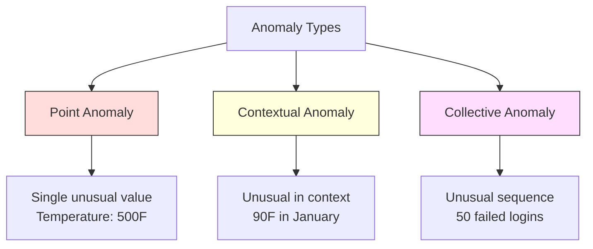
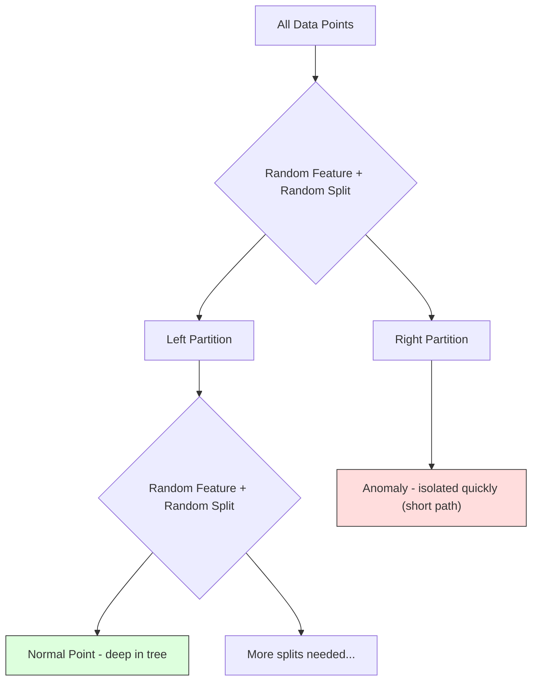
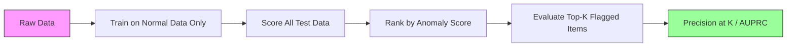

# 异常检测

> 正常很容易定义。异常就是不符合正常模式的一切。

**类型：** 动手实现
**语言：** Python
**前置知识：** 第 2 阶段，第 01-09 课
**时间：** 约 75 分钟

## 学习目标

- 从零实现 Z 分数（Z-Score）、IQR 和隔离森林（Isolation Forest）异常检测方法
- 区分点异常（Point Anomaly）、上下文异常（Contextual Anomaly）和集体异常（Collective Anomaly），并针对每种类型选择合适的检测方法
- 解释为什么异常检测（Anomaly Detection）被框架为对正常数据建模，而非直接对异常进行分类
- 比较无监督异常检测与有监督分类，评估新型异常覆盖率与精确率之间的权衡

## 问题引入

一张信用卡下午 2 点在纽约使用，2 点 05 分又在东京使用。一个工厂传感器读数显示 150 度，而正常范围是 80-120 度。一台服务器每秒发送 50,000 个请求，而日均水平只有 200 个。

这些都是异常。发现它们至关重要。欺诈每年造成数十亿美元损失，设备故障导致停机，网络入侵泄露数据。

挑战在于：你几乎没有标注好的异常样本。欺诈仅占交易的 0.1%。设备故障一年只出现几次。你无法训练标准分类器，因为"异常"类别中几乎没有可供学习的数据。即使有一些标签，你见过的异常也不是唯一会遇到的类型。明天的欺诈手段和今天的不同。

异常检测反转了这个问题。与其学习什么是异常，不如学习什么是正常。任何偏离正常的都是可疑的。这种方法不需要标签，能适应新型异常，并且可以扩展到大规模数据集。

## 核心概念

### 异常的类型

并非所有异常都是一样的：

- **点异常（Point Anomaly）。** 无论上下文如何，单个数据点本身就是异常的。例如温度读数 500 度，或者一个通常消费 50 美元的账户产生了 50,000 美元的交易。
- **上下文异常（Contextual Anomaly）。** 一个数据点在特定上下文中是异常的。90 度的温度在夏天是正常的，在冬天就是异常的。相同的值，不同的上下文。
- **集体异常（Collective Anomaly）。** 一组数据点作为整体是异常的，尽管每个单独的点可能是正常的。5 次登录失败是正常的，连续 50 次就是暴力破解攻击。

大多数方法检测点异常。上下文异常需要时间或位置特征。集体异常需要序列感知的方法。



### 无监督框架

在标准分类中，两个类别都有标签。在异常检测中，通常会遇到以下三种情况之一：

1. **完全无监督。** 完全没有标签。在所有数据上拟合检测器，寄希望于异常足够稀少，不会破坏"正常"模型。
2. **半监督。** 只有干净的正常数据集。在这个干净的集合上拟合，对其他所有数据评分。如果条件允许，这是最强的设置方式。
3. **弱监督。** 有少量标注的异常。用它们做评估而非训练。以无监督方式训练，然后在标注子集上衡量精确率/召回率。

核心洞察：异常检测与分类有本质区别。你是在对正常数据的分布建模，而不是在两个类别之间寻找决策边界。

### 有监督 vs 无监督：权衡

如果你确实有标注的异常数据，应该用它们来训练（有监督分类）还是仅用于评估（无监督检测）？

**有监督（作为分类问题处理）：**
- 能捕获你之前见过的确切异常类型
- 对已知异常类型有更高的精确率
- 完全遗漏新型异常
- 当新异常类型出现时需要重新训练
- 需要足够的异常样本（通常太少）

**无监督（建模正常，标记偏差）：**
- 能捕获任何偏离正常的情况，包括新型异常
- 不需要标注的异常
- 更高的假阳性率（不是所有不寻常的都是坏的）
- 对分布漂移更鲁棒

在实践中，最好的系统会结合两者：用无监督检测实现广覆盖，用有监督模型处理已知的高优先级异常类型，对模糊案例进行人工审查。

### Z 分数方法（Z-Score）

最简单的方法。计算每个特征的均值和标准差。标记任何偏离均值超过 k 个标准差的点。

```text
z_score = (x - mean) / std
anomaly if |z_score| > threshold
```

默认阈值为 3.0（对于高斯分布，99.7% 的正常数据落在 3 个标准差以内）。

**优势：** 简单。快速。可解释（"这个值偏离正常 4.5 个标准差"）。

**劣势：** 假设数据服从正态分布。对训练数据中的离群值敏感（离群值会偏移均值并放大标准差，使它们更难被检测到）。在多峰分布上失效。

**适用场景：** 数据大致呈钟形曲线的单特征监控。服务器响应时间、制造公差、基线稳定的传感器读数。

**失效场景：** 多聚类数据（两个办公地点有不同的基线温度）、偏态数据（1000 美元交易金额虽然稀少但不异常）、训练集中存在离群值的数据。

### IQR 方法

比 Z 分数更稳健。使用四分位距（IQR）而非均值和标准差。

```
Q1 = 25th percentile
Q3 = 75th percentile
IQR = Q3 - Q1
lower_bound = Q1 - factor * IQR
upper_bound = Q3 + factor * IQR
anomaly if x < lower_bound or x > upper_bound
```

默认因子为 1.5。

**优势：** 对离群值稳健（百分位数不受极端值影响）。适用于偏态分布。无正态性假设。

**劣势：** 仅适用于单变量（对每个特征独立应用）。无法检测仅在特征组合考虑时才异常的点（一个点可能在每个特征上单独看都正常，但在联合空间中是异常的）。

**实践提示：** IQR 中的 1.5 因子对应箱线图中的须（whisker）。须外的点是潜在离群值。使用 3.0 而非 1.5 会使检测器更保守（更少的标记，更少的假阳性）。合适的因子取决于你对误报的容忍度。

### 隔离森林（Isolation Forest）

核心洞察：异常数据少而且不同。在数据的随机划分中，异常更容易被隔离——它们需要更少的随机分割就能从其余数据中分离出来。



**工作原理：**
1. 构建多棵随机树（一个隔离森林）
2. 在每个节点，随机选择一个特征和一个在该特征最小值和最大值之间的随机分割点
3. 持续分割直到每个点都被隔离（在自己的叶节点中）
4. 异常点在所有树中具有更短的平均路径长度

**为什么有效：** 正常点位于密集区域。需要多次随机分割才能将一个正常点从其邻居中隔离出来。异常点位于稀疏区域。一两次随机分割就足以将它们隔离。

异常分数基于所有树中的平均路径长度，由随机二叉搜索树的期望路径长度进行归一化：

```
score(x) = 2^(-average_path_length(x) / c(n))
```

其中 `c(n)` 是 n 个样本的期望路径长度。分数接近 1 表示异常。分数接近 0.5 表示正常。分数接近 0 表示非常正常（深处于密集聚类中）。

**优势：** 无分布假设。在高维空间中有效。扩展性好（时间复杂度与样本量呈亚线性关系，因为每棵树使用子样本）。处理混合特征类型。

**劣势：** 在密集区域中的异常表现较差（掩蔽效应）。当存在大量无关特征时，随机分割效果较差。

**关键超参数：**
- `n_estimators`：树的数量。100 通常足够。更多的树给出更稳定的分数，但计算更慢。
- `max_samples`：每棵树的样本数。原始论文中默认为 256。更小的值使单棵树精度较低但增加多样性。子采样是隔离森林快速的原因——每棵树只看到数据的一小部分。
- `contamination`：污染率（Contamination），即期望的异常比例。仅用于设置阈值，不影响分数本身。

### 局部离群因子（Local Outlier Factor, LOF）

LOF 将一个点周围的局部密度与其邻居周围的密度进行比较。一个位于稀疏区域但被密集区域包围的点是异常的。

**工作原理：**
1. 对每个点，找到其 k 个最近邻
2. 计算局部可达密度（邻域有多密集）
3. 将每个点的密度与其邻居的密度进行比较
4. 如果一个点的密度远低于其邻居，它就是离群值

**LOF 分数：**
- LOF 接近 1.0 表示与邻居密度相似（正常）
- LOF 大于 1.0 表示密度低于邻居（可能异常）
- LOF 远大于 1.0（例如 2.0 以上）表示密度显著低于邻居（很可能异常）

"局部"这个词至关重要。考虑一个包含两个聚类的数据集：一个有 1000 个点的密集聚类和一个有 50 个点的稀疏聚类。稀疏聚类边缘的一个点从全局来看并不异常——它有 50 个邻居。但如果它的直接邻居比它更密集，从局部来看它就是异常的。LOF 能捕捉到全局方法遗漏的这种细微差别。

**优势：** 检测局部异常（在其邻域中不寻常的点，即使它们在全局上不异常）。适用于不同密度的聚类。

**劣势：** 在大数据集上速度慢（朴素实现的时间复杂度为 O(n^2)）。对 k 的选择敏感。在非常高的维度中效果不佳（维度灾难影响距离计算）。

### 方法比较

| 方法 | 假设条件 | 速度 | 处理高维 | 检测局部异常 |
|--------|------------|-------|-------------------|------------------------|
| Z 分数 | 正态分布 | 非常快 | 是（逐特征） | 否 |
| IQR | 无（逐特征） | 非常快 | 是（逐特征） | 否 |
| 隔离森林 | 无 | 快 | 是 | 部分 |
| LOF | 距离有意义 | 慢 | 差 | 是 |

### 评估挑战

评估异常检测器比评估分类器更难：

- **极端类别不平衡。** 在异常占 0.1% 的情况下，将所有数据预测为"正常"就能获得 99.9% 的准确率。准确率毫无用处。
- **AUROC 具有误导性。** 在严重不平衡的情况下，即使模型在实际阈值下遗漏了大多数异常，AUROC 看起来仍然不错。
- **更好的指标：** Precision@k（在标记的前 k 个最可疑项中，有多少是真正的异常）、AUPRC（精确率-召回率曲线下面积）以及在固定假阳性率下的召回率。



### 异常检测流程

在实践中，异常检测遵循以下工作流程：

1. **收集基线数据。** 理想情况下是一段你确定没有（或极少）异常的时期。
2. **特征工程。** 原始特征加上派生特征（滚动统计量、时间特征、比率）。
3. **训练检测器。** 在基线数据上拟合。模型学习"正常"是什么样子。
4. **对新数据评分。** 每个新观测值获得一个异常分数。
5. **阈值选择。** 选择分数的截断点。这是一个业务决策：更高的阈值意味着更少的误报但更多的漏报。
6. **告警和调查。** 标记的点进入人工审查或自动化响应。
7. **反馈收集。** 记录标记的项目是真正的异常还是误报。使用这些数据来评估检测器并随时间调整阈值。

这个流程永远不会"完成"。数据分布会漂移，新的异常类型会出现，阈值需要调整。将异常检测视为一个活的系统，而不是一次性模型。

## 动手实现

`code/anomaly_detection.py` 中的代码从零实现了 Z 分数、IQR 和隔离森林。

### Z 分数检测器

```python
def zscore_detect(X, threshold=3.0):
    mean = X.mean(axis=0)
    std = X.std(axis=0)
    std[std == 0] = 1.0
    z = np.abs((X - mean) / std)
    return z.max(axis=1) > threshold
```

简单且向量化。如果任何特征超过阈值，就标记该点。

### IQR 检测器

```python
def iqr_detect(X, factor=1.5):
    q1 = np.percentile(X, 25, axis=0)
    q3 = np.percentile(X, 75, axis=0)
    iqr = q3 - q1
    iqr[iqr == 0] = 1.0
    lower = q1 - factor * iqr
    upper = q3 + factor * iqr
    outside = (X < lower) | (X > upper)
    return outside.any(axis=1)
```

### 从零实现隔离森林

从零实现的隔离森林通过随机划分特征空间来构建隔离树：

```python
class IsolationTree:
    def __init__(self, max_depth):
        self.max_depth = max_depth

    def fit(self, X, depth=0):
        n, p = X.shape
        if depth >= self.max_depth or n <= 1:
            self.is_leaf = True
            self.size = n
            return self
        self.is_leaf = False
        self.feature = np.random.randint(p)
        x_min = X[:, self.feature].min()
        x_max = X[:, self.feature].max()
        if x_min == x_max:
            self.is_leaf = True
            self.size = n
            return self
        self.threshold = np.random.uniform(x_min, x_max)
        left_mask = X[:, self.feature] < self.threshold
        self.left = IsolationTree(self.max_depth).fit(X[left_mask], depth + 1)
        self.right = IsolationTree(self.max_depth).fit(X[~left_mask], depth + 1)
        return self
```

隔离一个点的路径长度决定了它的异常分数。路径越短意味着越异常。

`IsolationForest` 类封装了多棵树：

```python
class IsolationForest:
    def __init__(self, n_estimators=100, max_samples=256, seed=42):
        self.n_estimators = n_estimators
        self.max_samples = max_samples

    def fit(self, X):
        sample_size = min(self.max_samples, X.shape[0])
        max_depth = int(np.ceil(np.log2(sample_size)))
        for _ in range(self.n_estimators):
            idx = rng.choice(X.shape[0], size=sample_size, replace=False)
            tree = IsolationTree(max_depth=max_depth)
            tree.fit(X[idx])
            self.trees.append(tree)

    def anomaly_score(self, X):
        avg_path = average path length across all trees
        scores = 2.0 ** (-avg_path / c(max_samples))
        return scores
```

归一化因子 `c(n)` 是 n 个元素的二叉搜索树中不成功搜索的期望路径长度。它等于 `2 * H(n-1) - 2*(n-1)/n`，其中 `H` 是调和数。这种归一化确保不同大小数据集的分数具有可比性。

### 演示场景

代码生成多个测试场景：

1. **单聚类带离群值。** 一个二维高斯聚类，注入远离中心的异常点。所有方法在这里都应该有效。
2. **多峰数据。** 三个不同大小和密度的聚类。聚类之间的点是异常的。Z 分数在此表现不佳，因为各特征的范围较宽。
3. **高维数据。** 50 个特征，但异常仅在其中 5 个特征上有差异。测试各方法能否在特征子集中找到异常。

每个演示使用精确率、召回率、F1 和 Precision@k 比较所有方法。

## 实际使用

使用 sklearn（库实现，非从零实现）：

```python
from sklearn.ensemble import IsolationForest
from sklearn.neighbors import LocalOutlierFactor

iso = IsolationForest(n_estimators=100, contamination=0.05, random_state=42)
iso.fit(X_train)
predictions = iso.predict(X_test)

lof = LocalOutlierFactor(n_neighbors=20, contamination=0.05, novelty=True)
lof.fit(X_train)
predictions = lof.predict(X_test)
```

注意 `contamination` 设置期望的异常比例。正确设置很重要——太低会遗漏异常，太高会产生误报。

`anomaly_detection.py` 中的代码在相同数据上比较了从零实现和 sklearn 实现。

### sklearn 的 contamination 参数

sklearn 中的 `contamination` 参数决定了将连续异常分数转换为二元预测的阈值，它不会改变底层分数。

```python
iso_5 = IsolationForest(contamination=0.05)
iso_10 = IsolationForest(contamination=0.10)
```

两者产生相同的异常分数。但 `iso_5` 标记前 5%，而 `iso_10` 标记前 10%。如果你不知道真实的异常率（通常不知道），将 contamination 设为 "auto" 并直接使用原始分数。根据假阳性和假阴性之间的成本权衡设置自己的阈值。

### 单类 SVM（One-Class SVM）

另一个值得了解的无监督异常检测器。单类 SVM 在高维特征空间中（使用核技巧）围绕正常数据拟合一个边界。

```python
from sklearn.svm import OneClassSVM

oc_svm = OneClassSVM(kernel="rbf", gamma="auto", nu=0.05)
oc_svm.fit(X_train)
predictions = oc_svm.predict(X_test)
```

`nu` 参数近似异常的比例。单类 SVM 在中小型数据集上效果好，但无法扩展到非常大的数据（核矩阵呈二次增长）。

### 自编码器方法（预览）

自编码器（Autoencoder）是学习压缩和重建数据的神经网络。在正常数据上训练。在测试时，异常具有高重建误差，因为网络只学会了重建正常模式。

这将在第 3 阶段（深度学习）中详细介绍，但原理相同：建模什么是正常的，标记偏离的。

### 集成异常检测

正如集成方法能改善分类（第 11 课），组合多个异常检测器也能改善检测效果。最简单的方法：

1. 运行多个检测器（Z 分数、IQR、隔离森林、LOF）
2. 将每个检测器的分数归一化到 [0, 1]
3. 对归一化分数取平均
4. 标记平均分数超过阈值的点

这能减少假阳性，因为不同方法有不同的失败模式。被所有四种方法标记的点几乎肯定是异常的。只被一种方法标记的点可能是该方法的特殊性。

更复杂的集成方法会根据每个检测器的估计可靠性进行加权（在有已知异常的验证集上测量，如果可用的话）。

### 生产环境注意事项

1. **阈值漂移。** 随着数据分布变化，固定阈值会过时。监控异常分数的分布并定期调整。
2. **告警疲劳。** 太多误报会导致运维人员不再关注。从高阈值开始（更少但更可靠的告警），随着信任的建立逐步降低。
3. **集成方法。** 在生产中，组合多个检测器。只有当多种方法都认为某个点异常时才标记。这能显著减少假阳性。
4. **特征工程。** 原始特征很少足够。添加滚动统计量、比率、距上次事件的时间以及特定领域的特征。好的特征集比检测器的选择更重要。
5. **反馈循环。** 当运维人员调查标记的项目并确认或排除时，将这些信息反馈到系统中。随时间积累标注数据，用于评估和改进检测器。

## 交付物

本课产出：
- `outputs/skill-anomaly-detector.md` —— 选择正确检测器的决策技能
- `code/anomaly_detection.py` —— Z 分数、IQR 和隔离森林的从零实现，包含 sklearn 对比

### 选择阈值

异常分数是连续的。你需要一个阈值来做二元决策。这是一个业务决策，不是技术决策。

考虑两种场景：
- **欺诈检测。** 漏报欺诈代价高昂（退款、客户信任）。误报仅花费人工分析师 5 分钟调查时间。设低阈值以捕获更多欺诈，接受更多误报。
- **设备维护。** 误报意味着不必要的停机，损失 50,000 美元。漏报意味着 500,000 美元的维修费用。设置阈值以平衡这些成本。

在两种情况下，最优阈值取决于假阳性和假阴性之间的成本比率。绘制不同阈值下的精确率和召回率，叠加成本函数，选择最小成本点。

### 扩展到生产环境

用于生产中的实时异常检测：

1. **批量训练，在线评分。** 定期（每日、每周）在最近的正常数据上训练模型。对每个新到来的观测值进行评分。
2. **特征计算必须匹配。** 如果你使用 30 天的滚动统计量进行训练，你需要 30 天的历史数据来计算新观测值的特征。缓冲所需的历史数据。
3. **分数分布监控。** 跟踪异常分数随时间的分布。如果中位分数上升，说明数据在变化或模型过时了。
4. **可解释性。** 当你标记一个异常时，要说明原因。Z 分数："特征 X 高于正常值 4.2 个标准差。"隔离森林："这个点平均经过 3.1 次分割就被隔离了（正常点需要 8.5 次）。"

## 练习

1. **阈值调优。** 使用 1.0 到 5.0 的阈值（步长 0.5）运行 Z 分数检测器。绘制每个阈值下的精确率和召回率。对你的数据来说，最佳平衡点在哪里？

2. **多变量异常。** 创建二维数据，其中每个特征单独看起来正常，但组合起来是异常的（例如远离主聚类对角线的点）。展示逐特征的 Z 分数会遗漏这些异常，但隔离森林能捕获它们。

3. **从零实现 LOF。** 使用 k 近邻实现局部离群因子。与 sklearn 的 LocalOutlierFactor 在相同数据上对比。使用 k=10 和 k=50 —— k 的选择如何影响结果？

4. **流式异常检测。** 修改 Z 分数检测器使其在流式场景下工作：随着新数据到来更新运行均值和方差（Welford 在线算法）。与批处理 Z 分数在相同数据上对比。

5. **真实世界评估。** 取一个有已知异常的数据集（例如 Kaggle 上的信用卡欺诈数据集）。使用 precision@100、precision@500 和 AUPRC 评估所有四种方法。哪种方法效果最好？为什么？

## 核心术语

| 术语 | 通俗说法 | 实际含义 |
|------|----------------|----------------------|
| 异常（Anomaly） | "离群值，不寻常的点" | 显著偏离正常数据期望模式的数据点 |
| 点异常（Point Anomaly） | "一个奇怪的单个值" | 无论上下文如何，本身就不寻常的单个观测值 |
| 上下文异常（Contextual Anomaly） | "正常的值，错误的上下文" | 在特定上下文（时间、位置等）下不寻常的观测值，但在其他上下文中可能是正常的 |
| 隔离森林（Isolation Forest） | "用随机分割找离群值" | 一个随机树的集成方法，能用比正常点更少的分割次数隔离异常 |
| 局部离群因子（LOF） | "将密度与邻居比较" | 标记局部密度远低于其邻居密度的点 |
| Z 分数（Z-Score） | "距均值几个标准差" | (x - mean) / std，以标准差为单位衡量一个点距中心有多远 |
| 四分位距（IQR） | "四分位距" | Q3 - Q1，衡量数据中间 50% 的分散程度，用于稳健的离群值检测 |
| 污染率（Contamination） | "期望的异常比例" | 告诉检测器应该标记多大比例的数据为异常的超参数 |
| Precision@k | "前 k 个标记中有多少是真实的" | 仅对 k 个最可疑的点计算精确率，适用于不平衡的异常检测 |
| AUPRC | "精确率-召回率曲线下面积" | 汇总所有阈值下的精确率-召回率表现，对不平衡数据比 AUROC 更好 |

## 延伸阅读

- [Liu et al., Isolation Forest (2008)](https://cs.nju.edu.cn/zhouzh/zhouzh.files/publication/icdm08b.pdf) —— 隔离森林原始论文
- [Breunig et al., LOF: Identifying Density-Based Local Outliers (2000)](https://dl.acm.org/doi/10.1145/342009.335388) —— LOF 原始论文
- [scikit-learn Outlier Detection docs](https://scikit-learn.org/stable/modules/outlier_detection.html) —— 所有 sklearn 异常检测器概览
- [Chandola et al., Anomaly Detection: A Survey (2009)](https://dl.acm.org/doi/10.1145/1541880.1541882) —— 异常检测方法综合综述
- [Goldstein and Uchida, A Comparative Evaluation of Unsupervised Anomaly Detection Algorithms (2016)](https://journals.plos.org/plosone/article?id=10.1371/journal.pone.0152173) —— 在真实数据集上对 10 种方法的实证比较
